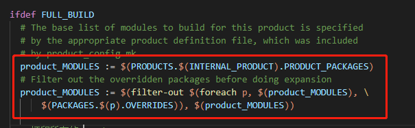
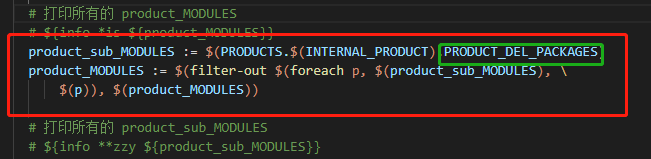
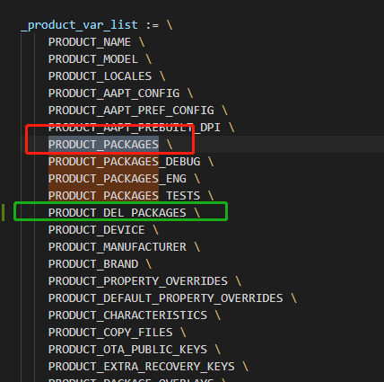

## Android源码裁剪app

工作中遇到需要裁剪Android的app，减少内存占用。

主要操作是在build目录下的mk文件。

1. build/core/main.mk

   找到`product_MODULES`，这个是针对PRODUCT_PACKAGES的编译控制语句

   

   我们可以在这里照猫画瓢，在上面语句后面添加一个针对PRODUCT_DEL_PACKAGES的编译控制语句，对APP进行过滤，这样就可以把想要删除的app过滤掉，并且也不会改变太多源码的编译流程。

   

   > 提示：
   >
   > ​	$(info *is $(product_MODULES))是打印出当前系统要编译到的app名字，\*is只是一个提示符；
   >
   > 可以在前后个加一个，分别打印product_MODULES和product_sub_MODULES，看出是不是删除成功。

2. buid/target/product/core.mk

   该文件定义了一个`PRODUCT_PACKAGES`,很明显就是对应上面所说的第一部分，那么我们依旧可以照猫画瓢，在这定义一个`PRODUCT_DEL_PACKAGES`，将想裁掉的APP加入在这里。

   ~~~mk
   PRODUCT_DEL_PACKAGES += \
       BookmarkProvider \
   	Browser2 \
   	Calendar \
   	Contacts \
       EasterEgg \
       ExactCalculator \
       QuickSearchBox \
       Galaxy4 \
       PhotoTable \
       PacProcessor \
       BasicDreams \
       LiveWallpapersPicker \
       HoloSpiralWallpaper \
       LiveWallpapers \
       MagicSmokeWallpapers \
       WallpaperCropper \
       WallpaperBackup \
       DeskClock \
       Camera2 \
       Gallery2 \
       Music \
   	MusicFX \
       ContactsProvider \
       pppd \
       HTMLViewer \
       webview \
       VpnDialogs \
       ip \
   	ip-up-vpn \
       Email \
       NoiseField \
       PhaseBeam \
       Bluetooth \
       BluetoothMidiService \
       OneTimeInitializer \
       CalendarProvider \
       CaptivePortalLogin \
       DownloadProviderUi \
       UserDictionaryProvider \
       BackupRestoreConfirmation \
       PicoTts \
       TelephonyProvider \
       FusedLocation \
       MmsService \
   	Dialer
   
   PRODUCT_DEL_PACKAGES += \
       DancingScript-Regular.ttf \
   	DancingScript-Bold.ttf \
   	CarroisGothicSC-Regular.ttf \
   	ComingSoon.ttf \
   	CutiveMono.ttf \
   	NotoColorEmoji.ttf \
   	NotoNaskhArabic-Bold.ttf \
   	NotoNaskhArabic-Regular.ttf \
   	NotoNaskhArabicUI-Bold.ttf \
   	NotoNaskhArabicUI-Regular.ttf \
   	NotoSansArmenian-Bold.ttf \
   	NotoSansArmenian-Regular.ttf \
   	NotoSansBalinese-Regular.ttf \
   	NotoSansBamum-Regular.ttf \
   	NotoSansBatak-Regular.ttf \
   	NotoSansBengali-Bold.ttf \
   	NotoSansBengali-Regular.ttf \
   	NotoSansBengaliUI-Bold.ttf \
   	NotoSansBengaliUI-Regular.ttf \
   	NotoSansBuginese-Regular.ttf \
   	NotoSansBuhid-Regular.ttf \
   	NotoSansCanadianAboriginal-Regular.ttf \
   	NotoSansCham-Bold.ttf \
   	NotoSansCham-Regular.ttf \
   	NotoSansCherokee-Regular.ttf \
   	NotoSansCJK-Regular.ttc \
   	NotoSansCoptic-Regular.ttf \
   	NotoSansDevanagari-Bold.ttf \
   	NotoSansDevanagari-Regular.ttf \
   	NotoSansDevanagariUI-Bold.ttf \
   	NotoSansDevanagariUI-Regular.ttf \
   	NotoSansEthiopic-Bold.ttf \
   	NotoSansEthiopic-Regular.ttf \
   	NotoSansGeorgian-Bold.ttf \
   	NotoSansGeorgian-Regular.ttf \
   	NotoSansGlagolitic-Regular.ttf \
   	NotoSansGujarati-Bold.ttf \
   	NotoSansGujarati-Regular.ttf \
   	NotoSansGujaratiUI-Bold.ttf \
   	NotoSansGujaratiUI-Regular.ttf \
   	NotoSansGurmukhi-Bold.ttf \
   	NotoSansGurmukhi-Regular.ttf \
   	NotoSansGurmukhiUI-Bold.ttf \
   	NotoSansGurmukhiUI-Regular.ttf \
   	NotoSansHanunoo-Regular.ttf \
   	NotoSansHebrew-Bold.ttf \
   	NotoSansHebrew-Regular.ttf \
   	NotoSansJavanese-Regular.ttf \
   	NotoSansKannada-Bold.ttf \
   	NotoSansKannada-Regular.ttf \
   	NotoSansKannadaUI-Bold.ttf \
   	NotoSansKannadaUI-Regular.ttf \
   	NotoSansKayahLi-Regular.ttf \
   	NotoSansKhmerUI-Bold.ttf \
   	NotoSansKhmerUI-Regular.ttf \
   	NotoSansLao-Bold.ttf \
   	NotoSansLao-Regular.ttf \
   	NotoSansLaoUI-Bold.ttf \
   	NotoSansLaoUI-Regular.ttf \
   	NotoSansLepcha-Regular.ttf \
   	NotoSansLimbu-Regular.ttf \
   	NotoSansLisu-Regular.ttf \
   	NotoSansMalayalam-Bold.ttf \
   	NotoSansMalayalam-Regular.ttf \
   	NotoSansMalayalamUI-Bold.ttf \
   	NotoSansMalayalamUI-Regular.ttf \
   	NotoSansMandaic-Regular.ttf \
   	NotoSansMeeteiMayek-Regular.ttf \
   	NotoSansMongolian-Regular.ttf \
   	NotoSansMyanmar-Bold.ttf \
   	NotoSansMyanmar-Regular.ttf \
   	NotoSansMyanmarUI-Bold.ttf \
   	NotoSansMyanmarUI-Regular.ttf \
   	NotoSansNewTaiLue-Regular.ttf \
   	NotoSansNKo-Regular.ttf \
   	NotoSansOlChiki-Regular.ttf \
   	NotoSansOriya-Bold.ttf \
   	NotoSansOriya-Regular.ttf \
   	NotoSansOriyaUI-Bold.ttf \
   	NotoSansOriyaUI-Regular.ttf \
   	NotoSansRejang-Regular.ttf \
   	NotoSansSaurashtra-Regular.ttf \
   	NotoSansSinhala-Bold.ttf \
   	NotoSansSinhala-Regular.ttf \
   	NotoSansSundanese-Regular.ttf \
   	NotoSansSylotiNagri-Regular.ttf \
   	NotoSansSymbols-Regular-Subsetted.ttf \
   	NotoSansSymbols-Regular-Subsetted2.ttf \
   	NotoSansSyriacEstrangela-Regular.ttf \
   	NotoSansTagbanwa-Regular.ttf \
   	NotoSansTaiLe-Regular.ttf \
   	NotoSansTaiTham-Regular.ttf \
   	NotoSansTaiViet-Regular.ttf \
   	NotoSansTamil-Bold.ttf \
   	NotoSansTamil-Regular.ttf \
   	NotoSansTamilUI-Bold.ttf \
   	NotoSansTamilUI-Regular.ttf \
   	NotoSansTelugu-Bold.ttf \
   	NotoSansTelugu-Regular.ttf \
   	NotoSansTeluguUI-Bold.ttf \
   	NotoSansTeluguUI-Regular.ttf \
   	NotoSansThaana-Bold.ttf \
   	NotoSansThaana-Regular.ttf \
   	NotoSansThai-Bold.ttf \
   	NotoSansThai-Regular.ttf \
   	NotoSansThaiUI-Bold.ttf \
   	NotoSansThaiUI-Regular.ttf \
   	NotoSansTibetan-Bold.ttf \
   	NotoSansTibetan-Regular.ttf \
   	NotoSansTifinagh-Regular.ttf \
   	NotoSansVai-Regular.ttf \
   	NotoSansYi-Regular.ttf \
   	NotoSerif-Bold.ttf \
   	NotoSerif-BoldItalic.ttf \
   	NotoSerif-Italic.ttf \
   	NotoSerif-Regular.ttf \
   	DroidSansMono.ttf \
       DroidSansFallback.ttf \
       AndroidClock.ttf \
       NotoSansKhmer-Regular.ttf \
       NotoSansKhmer-Bold.ttf 
   ~~~

   > 这里的.tff文件是Android里的一种字体文件。

   

3. build/core/product.mk

   上面添加了PRODUCT_DEL_PACKAGES后，还需要将它添加到produck.mk文件中。

   我们找到PRODUCT_PACKAGES在哪里定义，在后面给加上就好了。

   

参考文章：

[https://www.hotbak.net/key/android%E7%B3%BB%E7%BB%9F%E8%A3%81%E5%89%AA.html](https://www.hotbak.net/key/android系统裁剪.html)

