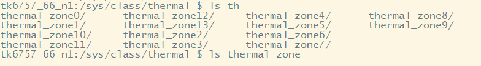
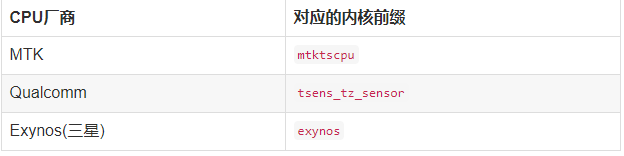
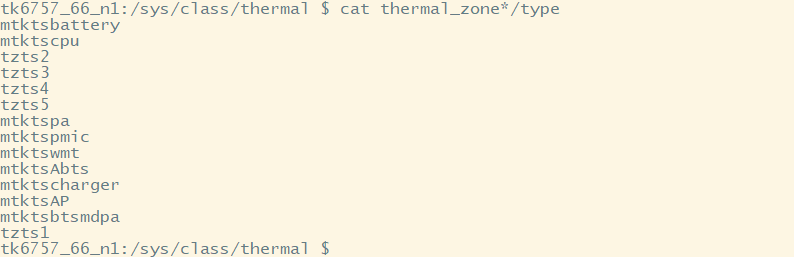

## Android系统获取CPU温度

平台： MT6771（P60）

版本：Android9.0

### 用shell命令获取CPU温度

​	进入目录**/sys/class/thermal/**，有很多目录，主要看**thermal_zon[编号]**文件夹，但是有个问题是，这么多，怎么确定是哪一个文件夹？

​	可以使用这个命令查看type的类型（CPU类型），进而判断哪一个文件是存储CPU内核信息的。

​	芯片产商的CPU内核一般都有固定的名字的。

​	

​	`cat /sys/class/thermal/thermal_zone*/type` 获取到CPU类型再和上表对比，就知道哪个文件夹是存储CPU内核信息的了。

​	由此可知**thermal_zone1**文件夹是存储CPU内核信息的，那么获取CPU温度就可用下面命令：

​	` cat thermal_zone1/temp `

​	

​	这里的32300，猜测是32.3度，因为看源码有这么一句注释：

​	源码路径：<https://github.com/sufadi/MakeDownPicForMyself/blob/master/20180112/mtk_ts_cpu.c>

​	

