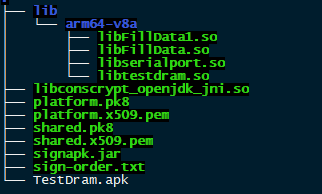

## P60-TestDram升级包制作

#### 1. 说明

本教程适用于MTK平台，制作TestDram OTA使用的apk文件。

所需文件：

- 编译生成的新版本Testdram.apk
- Testdram使用的jni动态库文件（libFillData.so,libserialport.so,libtestdram.so)
- P60平台签名文件

#### 2. 操作步骤

1. 首先编译Testdram apk得到新版本的Testdram.apk

2. 准备一个文件夹(以下称为OTAFile)，将新版本TestDram.apk拷贝到OTAFile中

3. 将签名文件全部拷贝到OTAFile中

4. 在OTAFile中创建目录：`lib/arm64-v8a`

5. 拷贝Testdram使用jni动态库文件到：OTAFile/lib/arm64-v8a目录中

   目录结构如下图：

   

6. 使用aapt工具(android自带,需要先**source build/envsetup.sh** 后才有)打包动态库到新版本Testdram.apk中，操作命令如下：

   `aapt a TestDram.apk lib/arm64-v8a/libtestdram.so lib/arm64-v8a/libFillData.so lib/arm64-v8a/libserialport.so`

7. 对apk文件签名，操作命令如下：

   `java -Djava.library.path=. -jar signapk.jar platform.x509.pem platform.pk8 TestDram.apk TestDram1.apk\n`

8. Testdram1.apk就是最终的升级文件，修改名字：

   `rm TestDram.apk;mv TestDram1.apk TestDram.apk`

