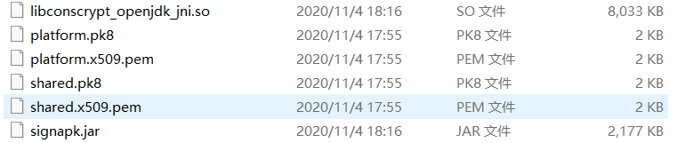
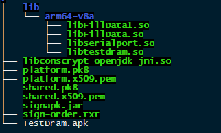
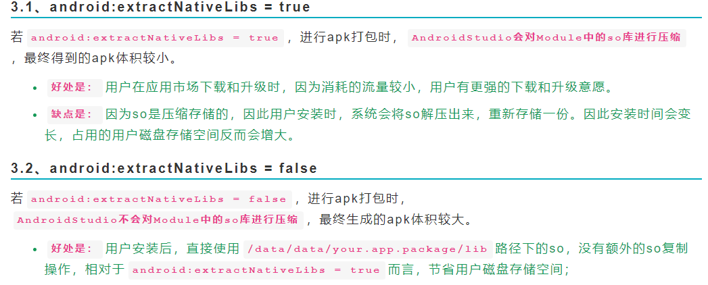

## APK 签名问题总结

#### 一. APK签名操作

1. **解决apk签名问题，首先第一个需要在源码目录找到以下签名文件，存放到`apk_sign`目录，将要签名的apk拷贝到这个目录**

   

2. **根据要安装的apk，如果apk是一个系统应用，同时带有动态库，则在签名前需要先将动态库打包进apk（没有动态库运行起来会闪退）**

   - **在`apk_sign`目录中新建`lib/arm64-v8a`目录（arm64-v8a根据CPU架构对应命名），将动态库拷贝到`lib/arm64-v8a`中**

     比如这里有三个动态库，最终目录结构如下：

     

   - **执行命令，将动态库打包进apk**

     `appt a TestDram.apk lib/arm64-v8a/libtestdram.so  lib/arm64-v8a/libserialport.so lib/arm64-v8a/libFillData.so`

     > 注意：这里的appt命令，需要先有android编译环境，可以先执行`source ./build/envsetup.sh;  lunch xxx `,否则没有appt

3. **执行apk签名**

   `java -Djava.library.path=. -jar signapk.jar platform.x509.pem platform.pk8 TestDram.apk TestDram_sign.apk`

#### 二.遇到的一些问题

1. **使用adb安装和卸载apk**

   - adb安装apk

     `adb install -d -f ./TestDram_sign.apk`

   - adb卸载apk

2. **在打包库到apk并完成签名，使用adb安装apk时出现如下错误：**

   `Failure [INSTALL_FAILED_INVALID_APK: Failed to extract native libraries, res=-2]`

   这个问题是系统打包库时是否压缩导致，因为动态库是手动打包进apk的，解决方案如下：

   `在apk源码文件AndroidManifest.xml中，删除`android:extractNativeLibs="false"` 或者添加 `android:extractNativeLibs="true"`

   解析如下：

   

3. **在上一步操作中，在AndroidManifest.xml中添加android:extractNativeLibs="true"时，出现编译错误：**

   `error: existing attribute extractNativeLibs="true" conflicts with --extract-native-libs="false"`

   这个错误是系统属性`extract-native-libs`与`extractNativeLibs`不一致，导致编译冲突，失败，解决方法是：

   `在系统源码路径 `build/make/core/android_manifest.mk` 下，修改--extract-native-libs的值为true`

   `my_manifest_fixer_flags += --extract-native-libs=true`

### 

