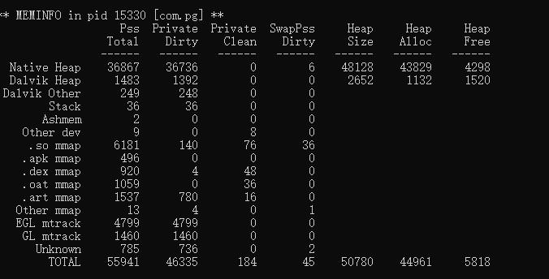

## Android adb常用命令

1. adb安装app

   `adb install -r app包名`

   比如：`adb install -r fishjoy.control.menu`

   > 包名查看：
   >
   > ​	包名可以通过查看app源码下的AndroidManifest.xml，里面有一个package的就是包名

   

2. adb启动一个app

   `adb shell am start -n app包名/app包名.主Activity`

   比如：`adb shell am start -n fishjoy.control.menu/fishjoy.control.menu.MainMenu`

3. adb查看一个app内存使用情况

   `adb shell dumpsys meminfo 包名`

   比如：`adb shell dumpsys meminfo fishjoy.control.menu`

   

