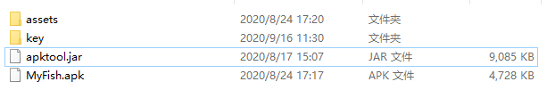
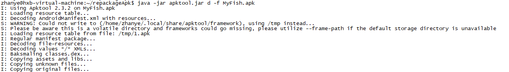
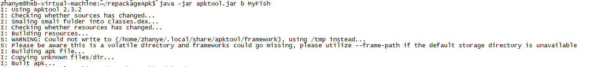
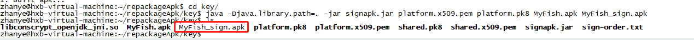

P25的MyFish apk编译后有个问题：assets文件夹不会被打包进去，导致运行时挂掉

解决方案：

**反编译apk，将assets文件夹加进去，再重新打包，签名发布**

操作步骤：

1. 先在P25环境下编译MyFish.apk，得到MyFish.apk

2. 准备好反编译工具：apktool.jar，签名工具文件夹key，将MyFish.apk以及assets文件夹拷贝放入到apktool.jar所在的目录下

   

3. 执行反编译命令：`java -jar apktool.jar d -f MyFish.apk `，生成一个文件夹MyFish

   

4. 将assets文件夹拷贝到反编译出来的MyFish文件夹中

5. 重新打包：`java -jar apktool.jar b MyFish`,在MyFish目录下会生成一个dist目录，里面有新打包的MyFish.apk

   

6. 签名发布：将重新打包的MyFish.apk拷贝到准备好的key文件夹中（key文件夹中的证书是从P25中找到）

7. 在key目录中执行命令：`java -Djava.library.path=. -jar signapk.jar platform.x509.pem platform.pk8 MyFish.apk MyFish_sign.apk`

   

8. 生成的MyFish_sign.apk就是签名后的apk，能在P25中使用。

