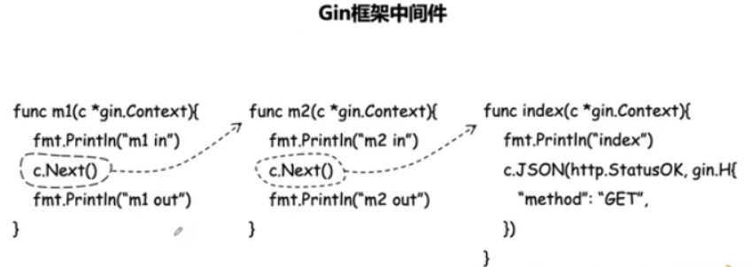

## Gin框架基础

### 1. Gin框架介绍

Gin 是一个 Go (Golang) 编写的轻量级 http web 框架， 运行速度非常快  

Gin 最擅长的就是 Api 接口的高并发

Gin 也是一个流行的 golang Web 框架 

Gin 的官网： https://gin-gonic.com/zh-cn/  

Gin Github 地址： https://github.com/gin-gonic/gin  


### 2. Gin环境搭建

1. 下载并安装 gin:

   ```go
   go get -u github.com/gin-gonic/gin
   ```

2. 将gin引入到代码

   ```go
   import "github.com/gin-gonic/gin"
   ```

3. (可选)若使用如 http.StatusOK 之类常量，则需要引入 net/http包

   ```go
   import "net/http"
   ```

4. 新建Main.go配置路由

   ```go
   package main
   import (
   	"github.com/gin-gonic/gin"
   )
   
   func main(){
       //创建一个默认的路由引擎
       r := gin.Default()
       
       //配置路由
       r.GET("/",func(c *gin.Context){
           c.JSON(200,gin.H{  //c.JSON:返回JSON格式的数据
               "message":"Hello world",
           })
       })
       
       //启动HTTP服务，默认在0.0.0.0:8080启动服务
       r.Run()
   }
   ```

5. 运行项目

   ```go
   go run main.go
   ```

6. 改变默认启动的端口

   ```go
   r.Run(":9000")
   ```


### 3. Gin框架中的路由

#### 3.1 路由概述

路由是由一个URI和一个特定的HTTP方法组成

RESTful架构中，不同的请求方式代表执行不同的操作

| **GET  (SELECT)**    | 从服务器去除资源(一项或多项) |
| -------------------- | ---------------------------- |
| **POST  (CREATE)**   | **在服务器新建一个资源**     |
| **PUT  (UPDATE)**    | **在服务器更新资源**         |
| **DELETE  (DELETE)** | **从服务器删除资源**         |


#### 3.2 简单的路由配置

```go
//GET请求访问一个网址
r.GET("网址",func(c *gin.Context){
    c.String(200,"GET")
})

//POST请求访问一个网址
r.POST("网址",func(c *gin.Context){
    c.String(200,"POST")
})
```

```go
//路由里获取Get传值
//域名/news?aid=20
r.GET("/news",func(c *gin.Context){
    aid := c.Query("aid")
    c.String(200,"aid=%s",aid)
})
```

```go
//动态路由
r.GET("/user/:uid", func(c *gin.Context){
    uid := c.Param("uid")
    c.Stri
})
```


#### 3.3 c.String()  c.JSON()  c.XML()  c.HTML()

```go
//返回一个字符串
r.GET("/news",func(c *gin.Context){
    aid := c.Query("aid")
    c.String(200,"aid=%s",aid)
})
```

```go
//返回一个JSON数据
//gin.H 是map[string]interface{}的缩写
r.GET("/someJSON", func(c *gin.Context){
    //方式一: 自己拼接JSON
    c.JSON(http.StatusOK,gin.H{"message":"Hello world"})
})
    
r.GET("/moreJSON", func(c *gin.Context){
    //方式二: 使用结构体
    var msg struct{
        Name string `json:"user"`
        Message string
        Age int
    }
    msg.Name = "Test"
    msg.Message = "Hello world"
    msg.Age = 18
    c.JSON(http.StatusOK, msg)
})
```

```go
//返回XML数据
r.GET("/someXML", func(c *gin.Context){
    //方式一: 自己拼接JSON
    c.XML(http.StatusOK, gin.H{"message":"Hello world"}))
})

r.GET("/moreXML", func(c *gin.Context){
    //方法二: 使用结构体
    type MessageRecord struct{
        Name string
        Message string
        Age int
    }
    var msg MessageRecord
    msg.Name = "Test"
    msg.Message = "Hello world"
    msg.Age = 18
    c.XML(http.StatusOK, msg)
})
```

```go
//渲染模板
r.GET("/",func(c *gin.Context){
    c.HTML(http.StatusOK, "default/index.html", map[string]interface{}{
        "title":"前台首页",
    })
})
```


### 4. 渲染模板

#### 4.1 全部模板在一个目录中

1. 在项目根目录新建templates文件夹，文件夹中新建index.html

   ```html
   <!DOCTYPE html>
   <html lang="en">
   <head>
       <meta charset="UTF-8">
       <meta http-equiv="X-UA-Compatible" content="IE=edge">
       <meta name="viewport" content="width=device-width, initial-scale=1.0">
       <title>Document</title>
   </head>
   <body>
       <h1>这是一个 html 模板</h1>
       <h3>{{.title}}</h3>
   </body>
   </html>
   ```

2. 使用c.HTML渲染模板前，需要使用LoadHTMLGlob()或者LoadHTMLFiles()方法加载模板

   ```go
   func main(){
       router := gin.Default()
       router.LoadHTMLGlob("templates/*")
       //router.LoadHTMLFiles("templates/template1.html","templates/template2.html")
       router.GET("/","index.html",gin.H{
           "title":"Main website",
       })
       router.Run(":8080")
   }
   ```

#### 4.2 模板放在不同目录中

定义模板时需要通过define定义名称

```html
<!-- 相当于给模板定义一个名称 define end成对出现 -->
```

```html
{{ define "admin/index.html" }}
    <!DOCTYPE html>
    <html lang="en">
    <head>
        <meta charset="UTF-8">
        <meta http-equiv="X-UA-Compatible" content="IE=edge">
        <meta name="viewport" content="width=device-width, initial-scale=1.0">
        <title>Document</title>
    </head>
    <body>
        <h1>后台模板</h1>
        <h3>{{.title}}</h3>
    </body>
    </html>
{{ end }}
```

```html
{{ define "default/index.html" }}
    <!DOCTYPE html>
    <html lang="en">
    <head>
        <meta charset="UTF-8">
        <meta http-equiv="X-UA-Compatible" content="IE=edge">
        <meta name="viewport" content="width=device-width, initial-scale=1.0">
        <title>Document</title>
    </head>
    <body>
        <h1>前台模板</h1>
        <h3>{{.title}}</h3>
    </body>
    </html>
{{ end }}
```

```go
func main(){
    router := gin.Default()
    router.LoadHTMLGlob("templates/**/*")
    router.GET("/",func(c *gin.Context){
        c.HTML(http.StatusOK, "default/index.html",gin.H{
            "title":"前台首页",
        })
    })
    router.GET("/admin", func(c *gin.Context){
        c.HTML(http.StatusOK, "admin/index.html",gin.H{
            "title":"后台首页",
        })
    })
    router.Run(":8080")
}
```


#### 4.3 gin模板基本语法

1. {{.}}输出数据

   当传入一个结构体对象时，可以根据 . 来访问结构体的对应字段

   ```go
   user := UserInfo{
       Name:"张三"，
       Age:18,
   }
   ...
   c.HTML(http.StatusOK,"default/index.html",gin.H{
       "title":"前台首页",
       "user":user,
   })
   ```

   ```html
   <h4>{{.title}}</h4>
   <h4>{{.user.Name}}</h4>
   <h4>{{.user.Age}}</h4>
   ```

2. 注释

   ```html
   {{/* a comment */}}
   ```

3. 变量

   模板中声明变量，用来保存传入的模板的数据或其他语句生成的结果

   ```html
   <h4>{{$obj := .title}}</h4>
   <h4>{{$obj}}</h4>
   ```

4. 移除空格

   ```html
   {{- .Name -}}
   ```

   ` - `要紧挨{{ 和 }}，同时与模板值之间需要使用空格分隔

5. 比较函数

   eq   ne  lt  le  gt  ge

6. 条件判断

   ```html
   {{if gt .score 60}}
   及格
   {{else}}
   不及格
   {{end}}
   
   {{if gt .score 90}}
   优秀
   {{else if gt .score 60}}
   及格
   {{else}}
   不及格
   {{end}}
   ```

7. range

   ```go
   c.HTML(http.StatusOK, "default/index.html",gin.H{
       "hobby":[]string{"吃饭","睡觉","写代码"},
   })
   ```

   ```html
   {{range $key,$value := .hobby}}
   	<p>{{$value}}</p>
   {{end}}
   ```

8. with

   ```html
   {{with .user}}
   	<h4>{{.Name}}</h4>
   	<h4>{{.Age}}</h4>
   {{end}}
   ```

9. 自定义模板函数

   ```go
   func formatAsDate(t time.Time) string{
       year,month,day := t.Date()
       return fmt.Sprintf("%d/%02d/%02d",year,month,day)
   }
   
   //注册全局模板函数，注册模板函数需要在加载模板上面
   router.SetFuncMap(template.FuncMap{
       "formatDate":formatAsDate,
   })
   
   //加载模板
   router.LoadHTMLGlob("templates/**/*")
   
   c.HTML(http.StatusOK,"default/index.html",gin.H{
       "title":"前台首页",
       "now":time.Now(),
   })
   ```

   ```html
   {{.now | formatDate}}
   {{formatDate .now}}
   ```


### 5. 静态文件服务

当渲染的HTML文件中引用了静态文件时，需要配置静态web服务

```go
r.Static("/static","./static")
r.LoadHTMLGlob("templates/**/*")
```

```html
<link rel="stylesheet" href="/static/css/base.css" />
```


### 6. 路由详解

#### 6.1 GET POST以及获取GET POST传值

1. Get请求传值

   ```go
   //GET  /user?uid=20&page=1
   router.GET("/user",func(c *gin.Context){
       uid := c.Query("uid")
       page := c.DefaultQuery("page",0)
       c.String(200,"uid=%v page=%v",uid,page)
   })
   ```

2. 动态路由传值

   ```go
   //域名/user/20
   r.GET("/user/:uid",func(c *gin.Context){
       uid := c.Param("uid")
       c.String(200,"userID=%s",uid)
   })
   ```

3. Post请求传值，获取form表单数据

   ```html
   <!--定义一个add_user.html页面-->
   <body>
       <form action="/doAddUser" method="post">
           用户名： <input type="text" name="username" />
           密码: <input type="password" name="password" />
       <input type="submit" value="提交">
       </form>
   </body>
   ```

   ```go
   //通过c.PostForm接收表单传过来的数据
   router.GET("/addUser",func(c *gin.Context){
       c.HTML(200,"default/add_user.html",gin.H{})
   })
   
   router.POST("/doAddUser",func(c *gin.Context){
       username := c.PostForm("username")
       password := c.PostForm("password")
       age := c.DefaultPostForm("age",20)
       c.JSON(200,gin.H{
           "username":username,
           "password":password,
           "age":age,
       })
   })
   ```

4. 获取GET POST传递的数据绑定到结构体

   基于请求的Content-Type识别请求数据类型，利用反射机制提取到请求中form表单，JSON，xml等参数的结构体中。

   **.ShouldBind()**能够基于请求自动提取form表单，JSON，xml等数据，并把值绑定到指定结构体对象中

   ```go
   type UserInfo struct{
       Username string `form:"username" json:"user"`
   }
   ```

   * Get传值绑定到结构体

     /?username=zhangsan&password=123456

     ```go
     router.GET("/",func(c *gin.Context){
         var userinfo UserInfo
         if err := c.ShouldBind(&userinfo);err == nil{
             c.JSON(http.StatusOK,userinfo)
         }else{
             c.JSON(http.StatusBadRequest,gin.H{"error":err.Error()})
         }
     })
     ```

   * Post传值绑定到结构体

     ```go
     router.POST("/doLogin",func(c *gin.Context){
         var userinfo UserInfo
         if err := c.ShouldBind(&userinfo);err == nil{
             c.JSON(http.StatusOK, userinfo)
         }else{
             c.JSON(http.StatusBadRequest,gin.H{"error":err.Error()})
         }
     })
     ```

5. 获取Post Xml数据

   ```xml
   <?xml version="1.0" encoding="UTF-8"?>
   <article>
       <content type="string">我是张三</content>
       <title type="string">张三</title>
   </article>
   ```

   ```go
   type Article struct{
       Title string `xml:"title"`
       Content string `xml:"content"`
   }
   
   router.POST("/xml", func(c *gin.Context){
       b,_ :- c.GetRawData() //从c.Request.Body读取请求数据
       article := &Article{}
       if err := xml.Unmarshal(b, &article);err==nil{
           c.JSON(http.StatusOK,article)
       }else{
           c.JSON(http.StatusBadRequest,err.Error())
       }
   })
   ```


#### 6.2 简单路由组

```go
v1 := router.Group("/v1")
{
    v1.POST("/login",loginEndpoint)
    v1.POST("/submit",submitEndpoint)
}

v2 := router.Group("/v2")
{
    v2.POST(...)
}
```


#### 6.3 Gin路由文件  分组

新建routers文件夹，routers文件夹下面新建adminRouters.go、defaultRouters.go

1. 新建adminRouters.go

   ```go
   package routers
   import (
   	"net/http"
       "github.com/gin-gonic/gin"
   )
   func AdminRoutersInit(router *gin.Engine){
       adminRouter := router.Group("/admin")
       {
           adminRouter.GET("/user",func(c *gin.Context{
               c.String(http.StatusOK,"用户")
           }))
           adminRouter.GET("/news",func(c *gin.Context){
               c.String(http.StatusOK,"news")
           })
       }
   }
   ```

2. 新建defaultRouters.go

   ```go
   package routers
   import(
   	"net/http"
       "github.com/gin-gonic/gin"
   )
   func DefaultRoutersInit(router *gin.Engine){
       defaultRouter := router.Group("/")
       {
           defaultRouter.GET("/",func(c *gin.Contex){
               c.String(200,"首页")
           })
       }
   }
   ```

3. 配置main.go

   ```go
   package main
   import(
   	"gin_demo/routers"
       "github.com/gin-gonic/gin"
   )
   type UserInfo struct{
       Username string `form:"username" json:"user"`
       Password string `form:"password" json:"password"`
   }
   func main(){
       r := gin.Default()
       routers.AdminRoutersInit(r)
       routers.DefaultRoutersInit(r)
       r.Run(":8080")
   }
   ```


### 7. Gin中自定义控制器

#### 7.1 控制器分组

1. 新建controller/admin/NewsController.go

   ```go
   package admin
   import(
   	...
   )
   type NewsController struct{
   }
   
   func (c NewsController) Index(ctx *gin.Context){
       ctx.String(http.StatusOK,"新闻首页")
   }
   ```

2. 新建controller/admin/UserController.go

   ```go
   package admin
   import(
   	...
   )
   type UserController struct{
   }
   func (c UserController) Index(ctx *gin.Context){
       ctx.String(http.StatusOK,"用户首页")
   }
   func (c UserController) Add(ctx *gin.Context){
       ctx.String(http.StatusOK,"增加用户")
   }
   ```

3. 配置对应的路由

   ```go
   package routers
   import(
   	"gin_demo/controller/admin"
       ...
   )
   
   func AdminRoutersInit(router *gin.Engine){
       adminRouter := router.Group("/admin")
       {
           adminRouter.GET("/user".admin.UserController{}.Index)
           adminRouter.GET("/user/add",admin.UserController{}.Add)
           adminRouter.GET("/news",admin.NewsController{}.Index)
       }
   }
   ```

   ```go
   func main(){
       r := gin.Default()
       routers.AdminRoutersInit(r)
       r.Run(":8080")
   }
   ```


#### 7.2 控制器的继承

1. 新建controller/admin/BaseController.go

   ```go
   package admin
   import(
   	...
   )
   
   type BaseController struct{
   }
   
   func (c BaseController) Success(ctx *gin.Context{
       ctx.String(200,"成功")
   })
   
   func (c BaseController) Error(ctx *gin.Context){
       ctx.String(200,"失败")
   }
   ```

2. NewsController继承BaseController

   ```go
   package admin
   import ...
   type NewsController struct{
       BaseController
   }
   //继承后可以调用控制器中的公共方法
   func(c NewsController) Index(ctx *gin.Context){
       c.Success(ctx)
   }
   ```


### 8. 中间件

中间件是匹配路由前和匹配路由完成后执行的一系列操作

#### 8.1 路由中间件

1. 中间件

   Gin中间件需是一个gin.HandlerFunc()方法

   配置路由可以传递多个func回调函数

    ```go
    func initMiddleware(ctx *gin.Context){
        fmt.Println("我是一个中间件")
    }

    func main(){
        ...
        r.GET("/",initMiddleware,func(ctx *gin.Context){
            c.String(200,"中间件演示")
        })
    }
    ```
   
2. ctx.Next()调用该请求的剩余处理程序

3. ctx.Abort()终止调用该请求的剩余处理程序

   

   

   

4. 一个路由配置多个中间件

   ```go
   func initMiddlewareOne(ctx *gin.Context){
       fmt.Println("initMiddleOne-1")
       ctx.Next()
       fmt.Println("initMiddleOne-2")
   }
   
   func initMiddlewareTwo(ctx *gin.Context){
       fmt.Println("initMiddleTwo-1")
       ctx.Next()
       fmt.Println("initMiddleTwo-2")
   }
   
   func main(){
       ...
       r.GET("/",initMiddlewareOne,initMiddlewareTwo,func(ctx *gin.Context){
           fmt.Println("执行程序")
           ctx.String(200,"首页")
       })
   }
   ```

   ```shell
   initMiddlewareOne-1
   initMiddlewareTwo-1
   执行程序
   initMiddlewareTwo-2
   initMiddlewareOne-2
   ```


#### 8.2 全局中间件

```go
func initMiddleware(ctx *gin.Context){
    fmt.Println("全局中间件")
    ctx.Next()
}

func main(){
    ...
    //全局中间件，通过r.Use配置
    r.Use(initMiddleware)
    r.GET("/",func(ctx *gin.Context){
        ctx.String(200,"全局中间件演示")
    })
}
```


#### 8.3 在路由分组中配置中间件

```go
//方法一
shopGroup := r.Group("/shop",Middleware)
{
    shopGroup.GET("/index",func(c *gin.Context){...})
}

//方法二
shopGroup := r.Group("/shop")
shopGroup.Use(StatCost)
{
    shopGroup.GET("/index",func(c *gin.Context){...})
}
```


#### 8.4 中间件和对应控制器之间共享数据

```go
//中间件
func InitMiddleware(ctx *gin.Context){
    ctx.Set("username","张三")
    ctx.Next()
}

//控制器
func (c UserController) Index(ctx *gin.Context){
    username,_ := ctx.Get("username")
    c.String(200,username)
}
```


#### 8.5 中间件注意事项

gin.Default()默认使用Logger和Recovery中间件

gin.New()新建没有默认中间件的路由

当中间件或handler启动新goroutine，**不能使用**原始的上下文(c *gin.Context)，必须使用只读副本(c.Copy())

```go
r.GET("/",func(c *gin.Context){
    cCp := c.Copy()
    go func(){
        time.Sleep(5*time.Second)  
    }()
    c.String(200,"首页")
})
```


### 9. Gin中自定义Model

#### 9.1 Model

一般在Model里封装一些公共的方法让不同的Controller使用，也可以在Model中实现和数据打交道

#### 9.2 Model里封装公共的方法

新建models/tools.go

```go
package models
import(
	"crypto/md5"
    "fmt"
    "time"
)
//时间戳转换成日期
func UnixToDate(timestamp int)string{
    t := time.Unix(int64(timestamp),0)
    return t.Format("2006-01-02 15:04:05")
}

//日期转换成时间戳
func DateToUnix(str string) int64{
    template := "2006-01-02 15:04:05"
    t,err := time.ParseInLocation(template,str,time.Local)
    if err != nil{
        return 0
    }
    return t.Unix()
}

func GetUnix() int64{
    return time.Now().Unix()
}

func GetDate() string{
    template := "2006-01-02 15:04:05"
    return time.Now().Format(template)
}

func GetDay() string{
    template := "20060102"
    return time.Now().Format(template)
}
```


#### 9.3 控制器中调用Model

```go
package controller
import "gin_demo/models"
day := models.GetDay()
```


#### 9.4 调用Model注册全局模板函数

models/tools.go

```go
func UnixToDate(timestamp int64)string{
    t := time.Unix(timestamp,0)
    return t.Format("2006-01-02 15:04:05")
}
```

main.go

```go
r := gin.Default()
r.SetFuncMap(template.FuncMap{
    "unixToDate":models.UnixToDate,
})
```

控制器

```go
func (c UserController) Add(ctx *gin.Context){
    ctx.HTML(200,"admin/user/add.html",gin.H{
        "now":models.GetUnix(),
    })
}
```

模板

```html
<h2>
    {{.now | unixToDate}}
</h2>
```


#### 9.5 Golang Md5加密

方法一：

```go
data := []byte("123456")
hash := md5.Sum(data)
md5str := fmt.Sprintf("%x",hash)
fmt.Println(md5str)
```

方法二：

```go
h := md5.New()
io.WriteString(h,"123456")
fmt.Printf("%x\n",h.Sum(nil))
```


### 10.文件上传

#### 10.1 单文件上传，多文件上传（不同名字）

1. 定义模板

   需要在上传文件的form表单中加入enctype="multipart/form-data"

   ```html
   <body>
       <form action="/admin/user/doAdd" method="post" enctype="multipart/form-data">
           用户名:<input type="text" name="username" placeholder="用户名"><br><br>
           头像:<input type="file" name="face"><br><br>
       </form>
   </body>
   ```

2. 定义业务逻辑

   ```go
   func (c UserController) DoAdd(ctx *gin.Context){
       username := ctx.PostForm("username")
       file,err := ctx.FormFile("face")
       if err != nil{
           ctx.JSON(http.StatusInternalServerError,gin.H{
               "message":err.Error(),
           })
           return
       }
       
       //上传文件到指定目录
       dst := path.Join("./static/upload",file.Filename)
       fmt.Println(dst)
       ctx.SaveUploadFile(file,dst)
       ctx.JSON(http.StatusOK,gin.H{
           "message":fmt.Sprintf("%s uploaded!",file.Filename),
           "username":username,
       })
   }
   ```


#### 10.2 多文件上传（相同名字）

1. 定义模板

   ```html
   <body>
       <form action="/admin/user/doAdd" method="post" enctype="multipart/form-data">
           用户名:<input type="text" name="username" placeholder="用户名"><br><br>
           头像1:<input type="file" name="face[]"><br><br>
           头像2:<input type="file" name="face[]"><br><br>
       </form>
   </body>
   ```

2. 定义业务逻辑

   ```go
   func (c UserController) DoAdd(ctx *gin.Context){
       username := ctx.PostForm("username")
       
       //Multipart form
       form,_ := ctx.MultipartForm()
       files := form.File["face[]"]
       
       //var dst
       for _,file := range files{
           //上传文件至指定目录
           dst := path.Join("./static/upload",file.Filename)
           ctx.SaveUploadFile(file,dst)
       }
       ctx.JSON(200,gin.H{
           "message":"文件上传成功",
           "username":username,
       })
   }
   ```


#### 10.3 文件上传 按照日期存储

```go
func (c UserController) DoAdd(ctx *gin.Context){
    username := ctx.PostForm("username")
    //1.获取上传的文件
    file,err1 := ctx.FormFile("face")
    if err1 == nil{
        //2.获取后缀名，判断类型
        extName := path.Ext(file.Filename)
        allowExtMap := map[string]bool{
            ".jpg":true,
            ".png":true,
            ".gif":true,
            ".jpeg":true,
        }
        
        if _,ok := allowExtMap[extName];!ok{
            ctx.String(200,"文件类型不合法")
            return
        }
        
        //3.创建图片保存目录  static/upload/20200102
        day := models.GetDay()
        dir := "./static/upload/" + day
        
        if err := os.MkdirAll(dir, 0666);err!= nil{
            log.Error(err)
        }
        
        //4.生成文件名称
        fileUnixName := strconv.FormatInt(models.GetUnix(),10)
        //static/ipload/20200623/144325235235.png
        saveDir := path.Join(dir,fileUnixName + extName)
        ctx.SaveUploadFile(file,saveDir)
    }
    ctx.JSON(200,gin.H{
        "message":"文件上传成功"，
        "username":username,
    })
}
```


### 11. Gin中的Cookie

#### 11.1 Cookie

cookie是存储于访问者计算机的浏览器，可以在用一个浏览器访问同一个域名的时候共享数据

#### 11.2 Cookie能实现的功能

保存用户登录状态、保存用户浏览历史记录

#### 11.3 设置和获取Cookie

设置Cookie

```go
c.SetCookie(name,value string, maxAge int, path.domain string, secure,httpOnly bool)
```

第一个参数 key
第二个参数 value
第三个参数 过期时间.如果只想设置 Cookie 的保存路径而不想设置存活时间， 可以在第三个参数中传递 nil
第四个参数 cookie 的路径
第五个参数 cookie 的路径 Domain 作用域 本地调试配置成 localhost , 正式上线配置成域名
第六个参数是 secure ， 当 secure 值为 true 时， cookie 在 HTTP 中是无效， 在 HTTPS 中才有效
第七个参数 httpOnly， 是微软对 COOKIE 做的扩展。 如果在 COOKIE 中设置了“httpOnly”属性，
则通过程序（JS 脚本、 applet 等） 将无法读取到 COOKIE 信息， 防止 XSS 攻击产生  

```go
r.GET("/",func(c *gin.Context){
    //设置Cookie
    c.SetCookie("username","张三",3600,"/","localhost",false,true)
    c.String(200,"首页")
})

r.GET("/user",func(c *gin.Context){
    //获取Cookie
    username,_ := c.Cookie("username")
    c.String(200,"用户-"+username)
})
```


#### 11.4 多个二级域名共享cookie

```go
c.SetCookie("username","张三",3600,"/",".itying.com",false,true)
```


### 12 Gin中的Session

#### 12.1 Session

Session是一种记录客户状态的机制，Cookie保存在客户端浏览器中，Session保存在服务器上

#### 12.2 Session工作流程

客户端浏览器第一次访问服务器并发送请求时，服务器端创建一个session对象，生成类似于key，value键值对，然后将value保存到服务器，将key(cookie)返回到浏览器。浏览器下次访问会携带key(cookie)，找到对应的session(value)

#### 12.3 Gin中使用Session

<https://github.com/gin-contrib/sessions>

gin-contrib/sessions中间件支持的存储引擎：

* cookie
* memstore
* redis
* memcached
* mongodb


#### 12.4 基于Cookie存储Session

1. 安装session包

   ```go
   go get github.com/gin-contrib/sessions
   ```

2. 基本的session用法

   ```go
   package main
   import (
   	"github.com/gin-contrib/sessions"
       "github.com/gin-contrib/sessions/cookie"
       "github.com/gin-gonic/gin"
   )
   
   func main(){
       r := gin.Default()
       //创建基于cookie的存储引擎，secret111参数用于加密的密钥
       store := cookie.NewStore([]byte("secret111"))
       //设置session中间件，参数mysession，指的是session的名字，也是cookie的名字
       r.Use(sessions.Session("mysession",store))
       r.GET("/",func(c *gin.Context){
           //初始化session对象
           session := sessions.Default(c)
           //设置过期时间
           session.Options(sessions.Options{
               MaxAge:3600*6,//6h
           })
           //设置Session
           session.Set("username","张三")
           session.Save()
           c.JSON(200,gin.H{"msg":session.Get("username")})
       })
   }
   ```


#### 12.5 基于Redis存储Session

```go
package main
import (
	"github.com/gin-contrib/sessions"
    "github.com/gin-contrib/sessions/redis"
    "github.com/gin-gonic/gin"
)

func main(){
    r := gin.Default()
    //初始化基于redis的存储引擎
    // 第 1 个参数 - redis 最大的空闲连接数
	// 第 2 个参数 - 数通信协议 tcp 或者 udp
	// 第 3 个参数 - redis 地址, 格式， host:port
	// 第 4 个参数 - redis 密码
	// 第 5 个参数 - session 加密密钥
    store,_ := redis.NewStore(10,"tcp","localhost:6379","",[]byte("secret"))
    r.Use(sessions.Sessions("mysession",store))
    r.GET("/",func(c *gin.Context){
        session := sessions.Default(c)
        session.Set("username","李四")
        session.Save()
        c.JSON(200,gin.H{"username":session.Get("username")})
    })
    r.GET("/user",func(c *gin.Context){
        //初始化session对象
        session := sessions.Default(c)
        //通过session.Get读取session值
        username := session.Get("username")
        c.JSON(200,gin.H{"username":username})
    })
    r.Run(":8000")
}
```


### 13. Gin中使用GORM操作mysql数据库

#### 13.1 Gin中使用GORM

1. 安装

   ```go
   go get -u gorm.io/gorm
   go get -u gorm.io/driver/mysql
   ```

2. Gin中使用GORM连接数据库

   在models下新建 core.go，建立数据库链接

   ```go
   package models
   import(
   	"fmt"
       "form.io/driver/mysql"
       "gorm.io/gorm"
   )
   
   var DB *gorm.DB
   var err error
   
   func init(){
       dsn := "root:123456@tcp(192.168.0.6:3306)/gin?charset=utf8mb4&parseTime=True&loc=Local"
       DB,err := gorm.Open(mysql.Open(dsn),&gorm.Config{})
       if err != nil{
           fmt.Println(err)
       }
   }
   ```

3. 定义操作数据库的模型

   <https://gorm.io/zh_CN/docs/models.html>

* 结构体名称必须首字母大写，并与数据库表名称对应

* 结构体中的字段名称首字母必须大写

* 默认表名是结构体名称的复数形式

* 使用结构体中自定义方法TableName改变结构体默认表名称

  ```go
  func (User) TableName() string{
      return "user"
  }
  ```

  ```go
  //定义user模型
  package models
  
  type User struct{ //默认表名 users
      Id int
      Username string
      Age int
      Email string
      AddTime int
  }
  
  func (User) TabelName() string{
      return "user"
  }
  ```

  **gorm.Model**

  ```go
  //gorm.Model的定义
  type Model struct{
      ID uint `gorm:"primaryKey"`
      CreateAt time.Time
      UpdateAt time.Time
      DeleteAt gorm.DeletedAt `gorm:"index"`
  }
  ```

  

#### 13.2 Gin GORM CURD

找到要操作数据库表的控制器，引入models模块

1. 增加

   增加成功后会返回刚才增加的记录

   ```go
   func (con UserController) Add(c *gin.Context){
       user := models.User{
           Username:"Kownzird",
           Age:18,
           Email:"kownzird@gamil.com",
           AddTime:int(time.Now().Unix()),
       }
       
       //通过数据的指针来创建
       result := models.DB.Create(&user) 
       //RowsAffected用于返回sql执行后影响的行数
       if result.RowsAffected > 1{
           fmt.Print(user.Id)
       }
       fmt.Println(result.RowsAffected)
       fmt.Println(user.Id)
       c.String(http.StatusOK, "add成功")
   }
   ```

2. 查找

   **查找全部**

   ```go
   func (con UserController) Index(c *gin.Context){
       user := []models.User{}
       models.DB.Find(&user)
       c.JSON(http.StatusOK, gin.H{
           "success":true,
           "result":user,
       })
   }
   ```

   **指定条件查找**

   ```go
   func (con UserController) Index(c *gin.Context){
       user := []models.User{}
       models.DB.Where("username=?","王五").Find(&user)
       c.JSON(http.StatusOK,gin.H{
           "success":true,
           "result":user,
       })
   }
   ```

3. 修改

   ```go
   func (con UserController) Edit(c *gin.Context){
       user := models.User{Id:7}
       models.DB.Find(&user)
       user.Username = "gin gorm"
       user.Age = 1
       models.DB.Save(&user)
       c.String(http.StatusOK,"Edit")
   }
   ```

4. 删除

   ```go
   func (con UserController) Delete(c *gin.Context){
       user := models.User{Id:8}
       models.DB.Delete(&user)
       c.String(http.StatusOK, "Delete")
   }
   ```

5. 批量删除

   ```go
   func (con UserController) DeleteAll(c *gin.Context){
       user := models.User{}
       models.DB.Where("id>9").Delete(&user)
       c.String(http.StatusOK,"DeleteAll")
   }
   ```


#### 13.3 Gin GORM查询语句详解

1. Where

   =  <  >  <=  >=  !=  

   IS NOT NULL

   IS NULL

   BETWEEN AND

   NOT BETWEEN AND

   IN  OR  AND  NOT  LIKE

   ```go
   nav := []models.Nav{}
   models.DB.Where("id<3").Find(&nav)
   ```

   ```go
   var n = 5
   nav := []models.Nav{}
   models.DB.Where("id>?", n).Find(&nav)
   ```

   ```go
   var n1 = 3
   var n2 = 9
   nav := []models.Nav{}
   models.DB.Where("id > ? AND id < ?",n1,n2).Find(&nav)
   ```

   ```go
   nav := []models.Nav{}
   models.DB.Where("id in (?)", []int{3,5,6}).Find(&nav)
   models.DB.Where("title like ?", "%会%").Find(&nav)
   models.DB.Where("id between ? and ?", 3,6).Find(&nav)
   ```

2. Or条件

   ```go
   nav := []models.Nav{}
   models.DB.Where("id=? OR id=?",2,3).Find(&nav)
   models.DB.Where("id=?",2).Or("id=?",3).Find(&nav)
   ```

3. 选择字段查询

   ```go
   nav := []models.Nav{}
   models.DB.Select("id, title, url").Find(&nav)
   ```

4. 排序 Limit Offset

   ```go
   nav := []models.Nav{}
   models.DB.Where("id>2").Order("id Asc").Find(&nav)
   models.DB.Where("id>2").Order("sort Desc").Order("id Asc").Find(&nav)
   //跳过两条查询2条
   models.DB.Where("id>1").Offset(2).Limit(2).Find(&nav)
   ```

5. 获取总数

   ```go
   nav := []models.Nav{}
   var num int
   models.DB.Where("id>?", 2).Find(&nav).Count(&num)
   ```

6. Distinct

   从模型中选择不相同的值

   ```go
   nav := []models.Nav{}
   models.DB.Distinct("title").Order("id desc").Find(&nav)
   ```

   ```sql
   SELECT DISTINCT `title` FROM `nav` ORDER BY id desc
   ```

7. Scan

   ```go
   type Result struct{
       Name string
       Age int
   }
   
   var result Result
   db.Table("users").Select("name","age").Where("name=?","Antonio").Scan(&result)
   
   //原生SQL
   db.Raw("SELECT name,age FROM users WHERE name=?","Antonio").Scan(&result)
   ```

   ```go
   var result []models.User
   models.DB.Raw("SELECT * FROM user").Scan(&result)
   ```


#### 13.4 Gin GORM查看执行的sql

```go
DB,err := gorm.Open(mysql.Open(dsn), &gorm.Config{
    QueryFields:true, //打印sql
})
```


### 14. Gin中使用go-ini加载 .ini配置文件

#### 14.1 go-ini

github地址：<https://github.com/go-ini/ini>

#### 14.2 go-ini使用

1. 新建conf/app.ini

   ```ini
   app_name = gin
   log_level = DEBUG
   [mysql]
   ip		= 192.168.0.6
   port	= 3306
   user	= root
   password=123456
   database=gin
   [redis]
   ip		= 127.0.0.1
   port	= 6379
   ```

2. main.go

```go
import(
	"fmt"
    "os"
    "gopkg.in/ini.v1"
)

func main(){
    cfg,err := ini.Load("./conf/app.ini")
    if err != nil{
        fmt.Println("Fail to read file:%v",err)
        os.Eit(1)
    }
    
    //典型读取操作，默认分区可以使用空字符串表示
    fmt.Println("App Mode:", cfg.Section("").Key("app_name").String())
    fmt.Println("Data path:",cfg.Section("mysql").Key("ip").String())
    //修改值后进行保存
    cfg.Section("").Key("app_name").SetValue("gin")
    cfg.SaveTo("./conf/app.ini")
}
```

#### 14.3 从.ini中读取mysql配置

```go
package models
import (
	"fmt"
    "os"
    "gopkg.ini/ini.v1"
    "gorm.io/driver/mysql"
    "gorm.io/gorm"
)

var DB *gorm.DB
var err error

func init(){
    cfg,err := ini.Load("./conf/app.ini")
    if err != nil{
        fmt.Println("Fail to read file %v",err)
        os.Exit(1)
    }
    ip := cfg.Section("mysql").Key("ip").String()
    port := cfg.Section("mysql").Key("port").String()
    user := cfg.Section("mysql").Key("user").String()
    password := cfg.Section("mysql").Key("password").String()
    database := cfg.Section("mysql").Key("database").String()
    dsn := fmt.Sprintf("%v:%v%tcp(%v:%v)/%v?charset=utf8mb4&parseTime=True&loc=Local",user,password,ip,port,database)
    fmt.Println(dsn)
    
    DB,err := gorm.Open(mysql.Open(dsn), &gorm.Config{
        QueryFields:true, //打印sql
        //SkipDefaultTransaction:true, //禁用事务
    })
    
    if err != nil{
        fmt.Println(err)
    }
}
```

