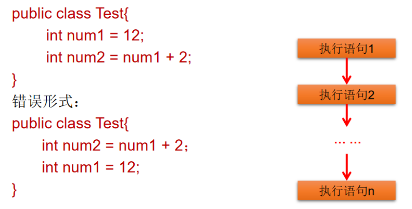
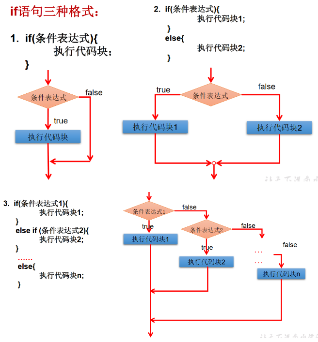
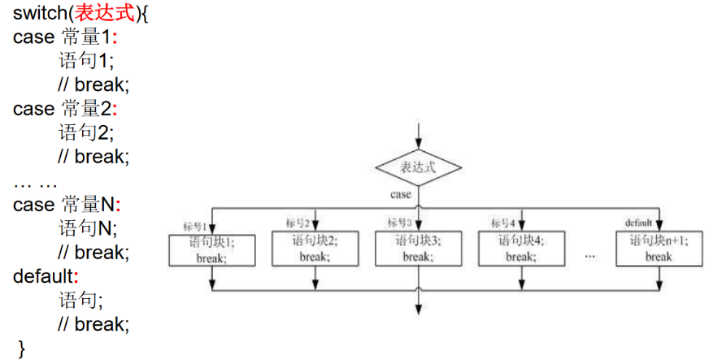

## 三、程序流程控制

### 1.  程序流程控制概述

三种基本流程控制结构

* 顺序结构

  程序从上往下逐行执行，中间没有任何判断和跳转

* 分支结构

  根据条件，选择性执行某段代码

  `if ... else` 和 `switch-case`两种分支语句

* 循环结构

  根据循环条件，重复性执行某段代码

  `while` 、`do ...while` 和 `for`三种循环语句

  JDK1.5提供了 `foreach`循环，方便遍历集合、数组元素


### 2.  顺序结构

java中定义成员变量时采用合法的前向引用




### 3.  分支语句

#### 3.1 if-else结构



1. if-else使用说明

   * 条件表达式必须是布尔表达式、布尔变量
   * 语句块只有一条执行语句时，一对{ }可以省略，建议保留
   * if-else语句结构，根据需要可以嵌套使用
   * 当if-else结构是多选一时，最后的else是可选的，根据需要可以省略
   * **当多个条件是 “互斥”关系时，条件判断语句及执行语句间顺序无所谓**
   * **当多个条件是“包含”关系时，“小上大下、子上父下”**

2. 输入语句

   ```java
   /*
   如何从键盘获取不同类型的变量，需要使用Scanner类
   
   具体步骤：
   1.导包：import java.util.Scanner;
   2.Scanner的实例化;
   3.调用Scanner类的相关方法，来获取指定的变量。
   */
   import java.util.Scanner;
   
   class IFTest{
   	public static void main(String[] args){
   		//声明一个Scanner
   		Scanner scan = new Scanner(System.in);
   
   		int num = scan.nextInt();
   
   		System.out.println(num);
   	}
   }
   ```

   ```java
   /*
   如何从键盘获取不同类型的变量，需要使用Scanner类
   
   具体步骤：
   1.导包：import java.util.Scanner;
   2.Scanner的实例化;
   3.调用Scanner类的相关方法，来获取指定的变量。
   */
   import java.util.Scanner;
   
   class IFTest{
   	public static void main(String[] args){
   		//Scanner实例化
   		Scanner scan = new Scanner(System.in);
   
   		System.out.println("请输入你的姓名：");
   		String name = scan.next();
   		System.out.println(name);
   
   		System.out.println("请输入你的年龄：");
   		int age = scan.nextInt();
   		System.out.println(age);
   
   		System.out.println("请输入你的体重：");
   		double weight = scan.nextDouble();
   		System.out.println(weight);
   
   		System.out.println("你是否单身？(true/false)");
   		boolean isLive = scan.nextBoolean();
   		System.out.println(isLive);
   
   		//char型的获取，Scanner没有提供相关方法，只能获取一个字符串
   		System.out.println("请输入你的性别：(男/女)");
   		String TF = scan.next();
   		char TFChar = TF.charAt(0);
   		System.out.println(TFChar);
   	}
   }
   ```

   

#### 3.2 switch-case结构

> **switch结构中的表达式，只能是如下六种数据类型之一：**
>
> `byte` 、`short` 、 `char` 、 `int` 、 `枚举类型（JDK5.0）` 、String类型（JDK7.0）
>
> **不能是**：`long` 、`float` 、`double` 、`boolean`



```java
/*
分支结构之二：switch-case

1.格式
switch(表达式){
case 常量1:
	执行语句1;
	//break;
case 常量2:
	执行语句2;
	//break;

...

default:
	执行语句n:
	//break;
}

2.说明:
① 根据switch表达式中的值，依次匹配各个case中的常量。一旦匹配成功，进入相应case结构中，执行相关语句。
  当调用完执行语句后，则仍然继续向下执行其他case语句，直到遇到break关键字或末尾结束为止。

② break, 可以使用switch-case结构中，表示一旦执行到此关键字，就跳出switch-case结构。

③ switch结构中的表达式，只能是如下的六种数据类型之一：byte、short、char、int、枚举类型(JDK5.0)、String类型(JDK7.0)
④ case 之后之能声明常量。不能声明范围。

⑤ break关键字是可选的。
⑥ default：相当于if-else结构中的else。
			default 结构是可选的，而且位置是灵活的。
*/

class SwitchTest{
	public static void main(String[] args){

		int number = 2;
		switch(number){
		case 0:
			System.out.println("zero");
			break;
		case 1:
			System.out.println("one");
			break;
		case 2:
			System.out.println("twe");
			break;
		case 3:
			System.out.println("three");
			break;
		default:
			System.out.println("other");
			break;
		}

		//*********************************
		//运行报错，不能运行boolean类型
/*		boolean isHandSome = true;
		switch(isHandSome){
		case true:
			System.out.println("可乐吗？？");
			break;
		case false:
			System.out.println("薯条吗？？");
			break;
		default:
			System.out.println("输入有误！！！");
		}
*/
		//*********************************
		String season= "summer";
		switch(season) {
		case"spring":
			System.out.println("春暖花开");
			break;
		case"summer":
			System.out.println("夏日炎炎");
			break;
		case"autumn":
			System.out.println("秋高气爽");
			break;
		case"winter":
			System.out.println("冬雪皑皑");
			break;
		default:
			System.out.println("季节输入有误");
			break;
		}

		//**************************************
		//运行报错
/*		int age = 10;
		switch(age){			
		case age > 18:
			System.out.println("成年了");
			break;
		default:
			System.out.println("未成年");
		}	*/
	}
}
```


### 4. 循环结构

#### 4.1 for循环

```java
语法格式
for(A初始化部分;B循环条件部分;D迭代部分)｛
            C循环体部分;
｝


执行过程：A-B-C-D-B-C-D-B-C-D-.....-B


说明：
②循环条件部分为boolean类型表达式，当值为false时，退出循环
①初始化部分可以声明多个变量，但必须是同一个类型，用逗号分隔
④可以有多个变量更新，用逗号分隔
```

```java
/*
For循环结构的使用
一、循环结构的四个要素
① 初始化条件
② 循环条件
③ 循环体
④ 迭代条件

二、for循环的结构
for(①;②;④){
	③
}
*/
class ForTest{
	public static void main(String[] args){
		for(int i=1;i <= 5 ;i++){
			System.out.println("Hello World!");
		}

		//练习：
		int num = 1;
		for(System.out.print('a');num <= 3;System.out.print('c'),num++){
			System.out.print('b');
		}

		//遍历100以内的偶数,获取所有偶数的和,输出偶数的个数
		int sum = 0;	//记录所有偶数的和
		int count = 0;
		for(int i = 1;i <= 100;i++){
			if(i %2 == 0){
				System.out.println(i);
				sum += i;
				count++;
			}
		}
		System.out.println("100以内的偶数的和：" + sum);
		System.out.println("个数为：" + count);
	}
}
```


#### 4.2 while循环

```java
语法格式

A 初始化部分
while(B循环条件部分)｛
    C循环体部分;
    D迭代部分;
}

执行过程：A-B-C-D-B-C-D-B-C-D-…-B
```

* 注意不要忘记声明D迭代部分，否则循环不能结束，变成死循环

* for循环和while循环可以相互转换

  ```java
  public class WhileLoop{
      public static void main(String args[]){
          int result = 0;
          int i = 1;
          while(i<=100){
              result += i;
              i++;
          }
          System.out.println("result=" + result);
      }
  }
  ```


### 4.3 do-while

```shell
do-while循环结构的使用
一、循环结构的四个要素
① 初始化条件
② 循环条件 --->是boolean类型
③ 循环体
④ 迭代条件

二、do-while循环的结构
A
do{
	C;
	D;
}while(B);

执行过程：A - C - D - B - C - D  ... - B
 
说明：do-while循环至少执行一次循环体。
```

```java
class DoWhileTest{
	public static void main(String[] args){
		//遍历100以内的所有偶数,并计算所有偶数的和和偶数的个数
		int number = 1;
		int sum = 0;	//记录总和
		int count = 0;	//记录个数
		do{
			if(number % 2 == 0){
				System.out.println(number);
				sum += number;
				count++;
			}
			number++;
		}while(number <= 100);

		System.out.println("总和为：" + sum);
		System.out.println("个数为：" + count);

		//*********************************
		int numb = 10;
		while(numb > 10){
			System.out.println("hello:while");
			numb--;
		}

		int numb2 = 10;
		do{
			System.out.println("hello：do-while");
			numb2--;
		}while(numb2 > 10);
	}
}
```


#### 4.4 嵌套循环结构

```java
/*
100以内的所有质数
质数：素数，只能被1和它本身整除的自然数。

最小的质数是：2
*/
class PrimeNuberTest{
	public static void main(String[] args){
		boolean isFlag = true;	//标识是否被除尽，一旦除尽，修改其值。

		for(int i = 2;i <= 100;i++){	//遍历100以内的自然数
			for(int j =2;j < i;j++){	//j:被i去除
				if(i % j == 0){	//i被j除尽
					isFlag = false;
				}
			}
			if(isFlag == true){
				System.out.println(i);
			}

			//重置isFlag
			isFlag = true;
		}
	}
}
```

```java
/*
100000以内的所有质数
质数：素数，只能被1和它本身整除的自然数。

最小的质数是：2
*/

class PrimeNuberTest{
	public static void main(String[] args){
		boolean isFlag = true;	//标识是否被除尽，一旦除尽，修改其值。
		int count = 0;	//记录质数的个数

		//获取当前时间举例1970-01-01 00:00:00 的毫秒数
		long start = System.currentTimeMillis();

		for(int i = 2;i <= 100000;i++){	//遍历100以内的自然数
			//优化2：对本身是质数的自然数有效 5447---> 11
		//	for(int j =2;j < i;j++){	//j:被i去除
			for(int j =2;j <= Math.sqrt(i);j++){	//j:被i去除
				if(i % j == 0){	//i被j除尽
					isFlag = false;
					break;	//优化一：只对本身非质数的自然数是有效的。
				}
			}
			if(isFlag == true){
			//	System.out.println(i);
				count++;
			}

			//重置isFlag
			isFlag = true;
		}

		//获取当前时间举例1970-01-01 00:00:00 的毫秒数
		long end = System.currentTimeMillis();


		System.out.println("质数的个数:" + count);
		System.out.println("所花费的时间为:" + (end - start));	//16843 --> 5447	优化一
	}
}
```


#### 4.5 break、continue的使用

1. break的使用

   * break语句用于终止某个语句块的执行

     ```java
     {
         ...
         break
         ...
     }
     ```

   * break语句出现在多层嵌套语句块中，可以用过标签指明要终止的是哪一层语句块

     ```java
     label1:	{	......
     label2:		{	......
     label3:			{	......
     					break label2;
     					......
     				}
     			}
     		}
     ```

2. continue的使用

   * continue只能用在循环结构中
   * continue语句用于跳过所在循环语句块的一次执行，继续下一次循环
   * continue语句出现在多层嵌套循环语句中时，可以通过标签指明要跳过的是哪一层循环

3. return的使用

   * 并非专门用于结束循环，功能是结束一个方法
   * 直接结束整个方法，不管这个return处于多少层循环之内

4. 特殊流程控制语句说明

   * break只能用于switch语句和循环语句，终止本层循环
   * continue只能用于循环语句，终止本次循环
   * break、continue之后不能有其他的语句，程序不会执行
   * 标号语句必须紧接在循环的头部，不能用在非循环语句前面

   ```java
   /*
   break和countinue关键字的使用
   				使用范围			循环中使用的作用(不同点)	相同点
   break:			switch-case			结束当前循环				关键字后面不能声明执行语句
   				循环结构中
   
   
   countinue:		循环结构中			结束当次循环				关键字后面不能声明执行语句
   
   */
   class BreakContinueTest{
   	public static void main(String[] args){
   		
   		for(int i = 1;i <= 10;i++){
   			if(i % 4 == 0){
   			//	break;	//1、2、3
   				continue;	//1、2、3、5、6、7、9、10
   			//	System.out.println("该吃饭了！！！");
   			}
   		//	System.out.println(i);
   		}
   		//********************************
   		for(int i = 1;i <= 4;i++){
   			
   				for(int j = 1;j <= 10; j++){
   					if(i % 4 == 0){
   				//		break;	//默认跳出包裹此关键字最近的一层的循环
   						continue;
   					}
   					System.out.print(j);
   				}
   				System.out.println();
   		}
   	}
   }
   ```

   