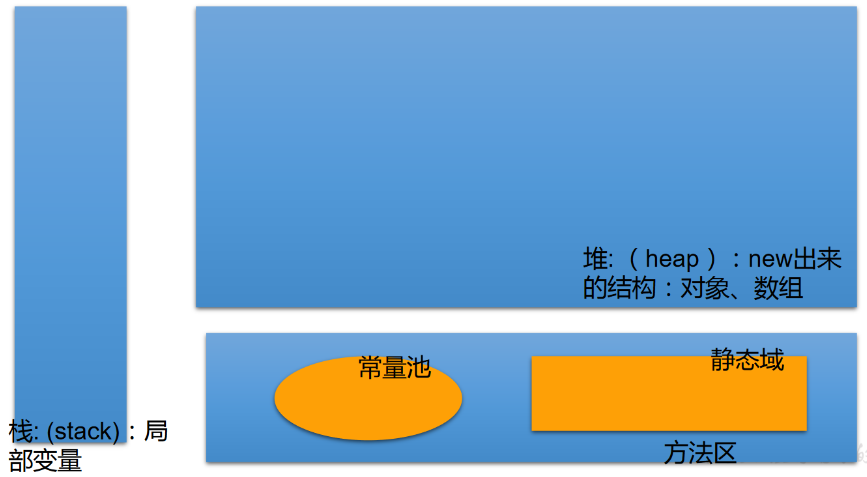
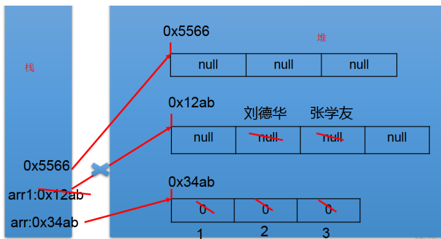
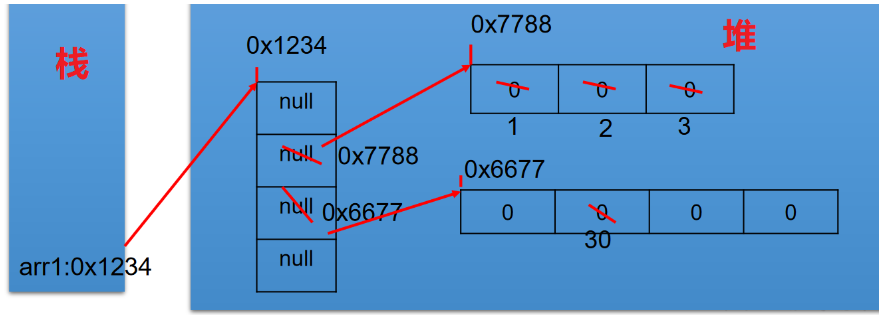
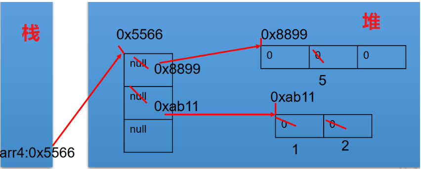
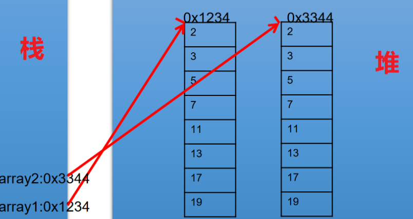
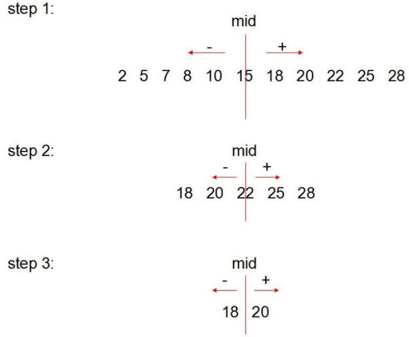
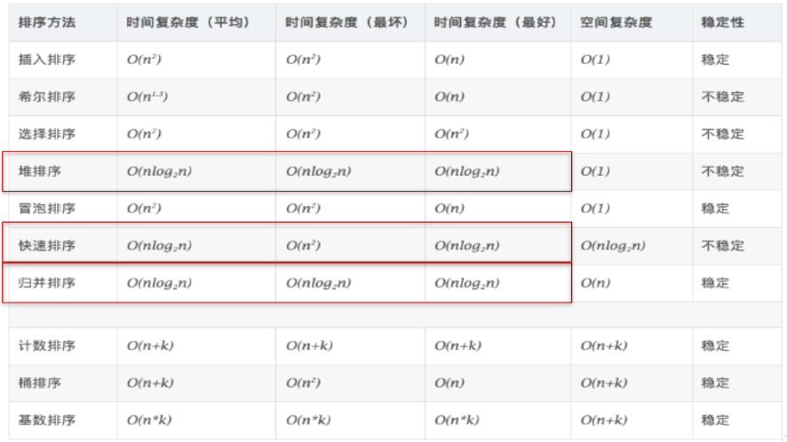

## 四、数组

### 1 数组的概述

1. 数组的理解：数组(Array)，是多个相同类型数据按一定顺序排列的集合，并使用一个名字命名，并通过编号的方式对这些数据进行统一管理。

2. 数组的相关概念：

   \* 数组名

   \* 元素

   \* 角标、下标、索引

   \* 数组的长度：元素的个数

3. 数组的特点

   1. 数组属于引用类型的变量。数组的元素，既可以是基本数据类型，也可以是引用数据类型
   2. 创建的数组对象会在内存中开辟一整块连续的空间
   3. 数组长度一旦确定，就不能修改
   4. 数组是有序排列的

4. 数组的分类

   1. 按照维数：一维数组、二维数组......
   2. 按照数组元素类型：基本数据类型的数组、引用类型元素的数组


### 2. 一维数组的使用

```shell
/*
 * 	1 一维数组的声明和初始化
 *  2 如何调用数组的指定位置的元素
 *  3 如何获取数组的长度
 *  4 如何遍历数组
 *  5 数组元素的默认初始化值：见ArrayTest1.java
 *  6 数组的内存解析：见ArrayTest1.java
 */
```

```java
//代码案例1  ArrayTest.java
public class ArrayTest {
	public static void main(String[] args) {
		
		//1. 一维数组的声明和初始化
		int num;	//声明
		num = 10;	//初始化
		int id = 1001;	//声明 + 初始化
		
		int[] ids;	//声明
		//1.1静态初始化:数组的初始化和数组元素的赋值操作同时进行
		ids = new int[]{1001,1002,1003,1004};	
		//1.2动态初始化:数组的初始化和数组元素的赋值操作分开进行
		String[] names = new String[5]; 
		
		//错误的写法：
//		int[] arr1 = new int[];	//未赋值、未指明长度
//		int[5] arr2 = new int[5];
//		int[] arr3 = new int[3]{1,2,3};
		
		//也是正确的写法：
		int[] arr7 = {1,2,3,5,4};//类型推断
		
		/*总结：数组一旦初始化完成，其长度就确定了。
		*/
		
		//2.如何调用数组的指定位置的元素：通过角标的方式调用。
		//数组的角标(或索引)从0开始的，到数组的长度-1结束
		names[0] = "张郃";
		names[1] = "王陵";
		names[2] = "张学良";
		names[3] = "王传志";	//charAt(0)
		names[4] = "李峰";
//		names[5] = "周礼";	//如果数组超过角标会通过编译，运行失败。
		
		//3.如何获取数组的长度
		//属性：length
		System.out.println(names.length);	//5
		System.out.println(ids.length);	//4
		
		//4.如何遍历数组
//		System.out.println(names[0]);
//		System.out.println(names[1]);
//		System.out.println(names[2]);
//		System.out.println(names[3]);
//		System.out.println(names[4]);
		
		for(int i = 0;i < names.length;i++){
			System.out.println(names[i]);
		}
		
	}
}
```

```java
//代码案例2  ArrayTest1.java
/*
 * ⑤ 数组元素的默认初始化值
 * 		> 数组元素是整形：0
 * 		> 数组元素是浮点型：0.0
 * 		> 数组元素是char型：0或'\u0000'，而非'0'
 * 		> 数组元素是boolean型:false
 * 
 * 		> 数组元素是引用数据类型：null 
 */
public class ArrayTest1 {
	public static void main(String[] args) {
		//5.数组元素的默认初始化值
		int[] arr = new int[4];
		for(int i = 0;i < arr.length;i++){
			System.out.println(arr[i]);
		}
		System.out.println("*****************");
		
		short[] arr1 = new short[4];
		for(int i = 0;i < arr1.length;i++){
			System.out.println(arr1[i]);
		}
		System.out.println("*****************");
		
		float[] arr2 = new float[5]; 
		for(int i = 0;i < arr2.length;i++){
			System.out.println(arr2[i]);
		}
		System.out.println("*****************");
		
		char[] arr3 = new char[5]; 
		for(int i = 0;i < arr3.length;i++){
			System.out.println("----" + arr3[i] + "****");
		}
		
		if(arr3[0] == 0){
			System.out.println("你好！");
		}
		System.out.println("*****************");
		
		boolean[] arr4 = new boolean[5];
		System.out.println(arr4[0]);
		
		System.out.println("*****************");
		String[] arr5 = new String[5];
		System.out.println(arr5[0]);
		//验证
		if(arr5[0] == null){
			System.out.println("北京天气好差！");
		}
	}
}
```


#### 2.1 内存的简化结构




#### 2.2 一维数组的内存解析

```java
int[] arr = new int[]{1,2,3};
String[] arr1 = new String[4];
arr1[1] = “刘德华”;
arr1[2] = “张学友”;
arr1 = new String[3];
System.out.println(arr1[1]);//null
```




#### 2.3 练习

```java
//练习1
public class ArrayDemo {
	public static void main(String[] args) {
		int[] arr = new int[] { 8, 2, 1, 0, 3 };
		int[] index = new int[] { 2, 0, 3, 2, 4, 0, 1, 3, 2, 3, 3 };
		String tel = "";
		for (int i = 0; i < index.length; i++) {
			tel += arr[index[i]];
		}
		System.out.println("联系方式：" + tel);
	}
}
```

```java
/*
 * 2. 从键盘读入学生成绩，找出最高分，并输出学生成绩等级。
 * 成绩>=最高分-10    等级为’A’   
 * 成绩>=最高分-20    等级为’B’
 * 成绩>=最高分-30    等级为’C’   
 * 其余等级为’D’
 * 提示：先读入学生人数，根据人数创建int数组，存放学生成绩。
 */
import java.util.Scanner;
public class ArrayDemo2 {
	public static void main(String[] args) {
		//1.使用Scanner，读取学生的个数
		Scanner scan = new Scanner(System.in);
		System.out.print("请输入学生人数：");
		int num = scan.nextInt();
		
		//2.创建数组，存储学生成绩，动态初始化
		int[] str = new int[num];
		System.out.println("请输入" + num + "个学生成绩");
				
		//3.给数组中的元素赋值
		int maxnum = 0;
		for(int i = 0;i < str.length;i++){
			str[i] = scan.nextInt();
			//4.获取数组元素中的最大值：最高分
			if(maxnum < str[i]){
				maxnum = str[i];
			}
		}
		
		//5.根据每个学生成绩与最高分的差值，得到每个学生的等级，并输出等级和成绩	
		char Grade;	//成绩等级
		for(int i = 0;i < str.length;i++){
			if(maxnum - str[i] <= 10){
				Grade = 'A';
			}else if(maxnum - str[i] <= 20){
				Grade = 'B';
			}else if(maxnum - str[i] <= 30){
				Grade = 'C';
			}else{
				Grade = 'D';
			}
			
			System.out.println("student " + i + "score is" + str[i] + 
					" grade is " + Grade);
		}
	}
}
```


### 3. 多维数组的使用

#### 3.1 二维数组

```java
//代码案例1  ArrayTest2.java
/*
 * 二维数组的使用
 * 
 * 1.理解
 * 对于二维数组的理解，我们可以看成是一维数组array1又作为另一个一维数组array2的元素而存在。
 * 其实，从数组底层的运行机制来看，其实没有多维数组。
 * 
 * 2.二维数组的使用：
 * 	1 二维数组的初始化
 *  2 如何调用数组的指定位置的元素
 *  3 如何获取数组的长度
 *  4 如何遍历数组
 *  5 数组元素的默认初始化值:见ArrayTest3.java
 *  6 数组的内存解析:见ArrayTest3.java
 * 
 */
public class ArrayTest2 {
	public static void main(String[] args) {
		//1.二维数组的声明和初始化
		int[] arr = new int[]{1,2,3};
		//静态初始化
		int[][] arr1 = new int[][]{{1,2,3},{4,5,6},{7,8,9}};
		//动态初始化1
		String[][] arr2 = new String[3][2];
		//动态初始化2
		String[][] arr3 = new String[3][];
		
		//错误的情况
//		String[][] arr4 = new String[][];
//		String[][] arr5 = new String[][4];
//		String[][] arr6 = new String[4][3]{{1,2,3},{4,5,6},{7,8,9}};
		
		//正确的情况：
		int arr4[][] = new int[][]{{1,2,3},{4,5,12,6},{7,8,9}};
		int[] arr5[] = new int[][]{{1,2,3},{4,5,6},{7,8,9}};
		int[][] arr6 = {{1,2,3},{4,5,6},{7,8,9}};		
		
		//2.如何调用数组的指定位置的元素
		System.out.println(arr1[0][1]);	//2
		System.out.println(arr2[1][1]);	//null
		
		arr3[1] = new String[4];	//定义arr3的[1]为长度为4的字符数组
		System.out.println(arr3[1][0]);	//没有上句，会报错
		
		//3.获取数组的长度
		System.out.println(arr4.length);	//3
		System.out.println(arr4[0].length);	//3
		System.out.println(arr4[1].length);	//4
		
		//4.如何遍历二维数组
		for(int i = 0;i < arr4.length;i++){
			for(int j = 0;j < arr4[i].length;j++){
				System.out.print(arr4[i][j] + " ");
			}
			System.out.println();
		}
	}
}
```

```java
//代码案例2  ArrayTest3.java
/*
 * 二维数组的使用：
 * 	规定：二维数组分为外层数组的元素，内层数组的元素
 * 	int[][] arr = new int[4][3]; 
 *  外层元素:arr[0],arr[1]等
 *  内层元素:arr[0][0],arr[1][2]等
 *  
 * 	⑤ 数组元素的默认初始化值
 * 	针对于初始化方式一：比如：int[][] arr = new int[4][3];
 * 		外层元素的初始化值为：地址值
 * 		内层元素的初始化值为：与一维数组初始化情况相同
 * 	
 * 针对于初始化方式而：比如：int[][] arr = new int[4][];
 * 		外层元素的初始化值为：null
 * 		内层元素的初始化值为：不能调用，否则报错。
 * 
 * 	⑥ 数组的内存解析
 */
public class ArrayTest3 {
	public static void main(String[] args) {
		
		int[][] arr = new int[4][3];
		System.out.println(arr[0]);	//[I@15db9742
		System.out.println(arr[0][0]);	//0
		
//		System.out.println(arr);	//ArrayTest3.java
		
		System.out.println("***********************");
		float[][] arr1 = new float[4][3];
		System.out.println(arr1[0]);	//地址值
		System.out.println(arr1[0][0]);	//0.0
		
		System.out.println("***********************");
		
		String[][] arr2 = new String[4][2];
		System.out.println(arr2[1]);	//地址值
		System.out.println(arr2[1][1]);	//null
		
		System.out.println("*********************");
		double[][] arr3 = new double[4][];
		System.out.println(arr3[1]);	//null
//		System.out.println(arr3[1][0]);	//报错
	}
}
```


#### 3.2 二维数组的内存解析

```java
int[][] arr1 = new int[4][];
arr1[1] = new int[]{1,2,3};
arr1[2] = new int[4];
arr1[2][1] = 30;
```




```java
int[][] arr4= new int[3][];
System.out.println(arr4[0]);//null
System.out.println(arr4[0][0]);//报错
arr4[0] = new int[3];
arr4[0][1] = 5;
arr4[1] = new int[]{1,2};
```




#### 3.3 练习


```java
public class ArrayEver1{
    public static void main(String[] args){
        int[][] arr = new int[][]{{3,5,8},{12,9},{7,0,6,4}};
        int sum = 0;
        for(int i=0; i<arr.length; i++){
            for(int j=0; j<arr[i].length; j++){
                sum += arr[i][j];
            }
        }
        System.out.println(sum);
    }
}
```


```java
//杨辉三角
/*
 * 【提示】
 * 1. 第一行有 1 个元素, 第 n 行有 n 个元素
 * 2. 每一行的第一个元素和最后一个元素都是 1
 * 3. 从第三行开始, 对于非第一个元素和最后一个元素的元素。
 * 即：yanghui[i][j] = yanghui[i-1][j-1] + yanghui[i-1][j];
 */
public class ArrayEver2 {
	public static void main(String[] args) {
		//1.声明并初始化二维数组
		int[][] arr = new int[10][];
		
		//2.给数组的元素赋值，遍历二维数组
		for(int i = 0;i < arr.length;i++){
			arr[i] = new int[i+1];
			
			//2.1 给首末元素赋值
			arr[i][0]=arr[i][i]=1;
			//2.2 给每行的非首末元素赋值
		//	if(i > 1){
			for(int j = 1;j < arr[i].length-1;j++){
					arr[i][j] = arr[i-1][j-1] + arr[i-1][j];
				}
		//	}
	
		}
		
	//	3.遍历数组
		for(int i = 0;i < arr.length;i++){
			for(int j = 0;j <arr[i].length;j++){
				System.out.print(arr[i][j] + " ");
			}
			System.out.println();
		}
		
	}
}
```


### 4. 数组中涉及到的常见算法

#### 4.1 数组元素的赋值

```java
import java.util.Scanner;
/*
 * 此题了解！！！
 * 
 * 回形数格式方阵的实现
 * 从键盘输入一个整数（1~20） 
 * 则以该数字为矩阵的大小，把 1,2,3…n*n 的数字按照顺时针螺旋的形式填入其中。例如： 输入数字2，则程序输出： 1 2 
 * 4 3 
 * 输入数字 3，则程序输出：1 2 3 
 * 8 9 4 
 * 7 6 5 
 * 输入数字 4， 则程序输出： 
 * 1   2   3   4
 * 12  13  14  5 
 * 11  16  15  6 
 * 10  9   8   7
 */
public class ArrayTest {
	public static void main(String[] args) {
		Scanner scanner = new Scanner(System.in);
		System.out.println("输入一个数字:");
		int len = scanner.nextInt();
		int[][] arr = new int[len][len];
		int s = len * len;
		/*
		 * k = 1:向右 k = 2:向下 k = 3:向左 k = 4:向上
		 */
		int k = 1;
		int i = 0, j = 0;
		for (int m = 1; m <= s; m++) {
			if (k == 1) {
				if (j < len && arr[i][j] == 0) {
					arr[i][j++] = m;
				} else {
					k = 2;
					i++;
					j--;
					m--;
				}
			} else if (k == 2) {
				if (i < len && arr[i][j] == 0) {
					arr[i++][j] = m;
				} else {
					k = 3;
					i--;
					j--;
					m--;
				}
			} else if (k == 3) {
				if (j >= 0 && arr[i][j] == 0) {
					arr[i][j--] = m;
				} else {
					k = 4;
					i--;
					j++;
					m--;
				}
			} else if (k == 4) {
				if (i >= 0 && arr[i][j] == 0) {
					arr[i--][j] = m;
				} else {
					k = 1;
					i++;
					j++;
					m--;
				}
			}
		}
		// 遍历
		for (int m = 0; m < arr.length; m++) {
			for (int n = 0; n < arr[m].length; n++) {
				System.out.print(arr[m][n] + "\t");
			}
			System.out.println();
		}
	}
}
```


#### 4.2 数组元素的基本操作

```java
/*
 * 算法的考察：求数值型数组中元素的最大值、最小值、平均数、总和等
 * 
 * 定义一个 int 型的一维数组，包含 10 个元素，分别赋一些随机整数，
 * 然后求出所有元素的最大值，最小值，和值，平均值，并输出出来。
 * 要求：所有随机数都是两位数。
 * 
 * [10,99]
 * 公式：(int)(Math.random() * (99 - 10 + 1) + 10)
 */
public class ArrayTest1 {
	public static void main(String[] args) {
		int[] arr = new int[10];
		//数组赋值
		for(int i = 0;i <arr.length;i++){
			arr[i] = (int)(Math.random() * (99 - 10 + 1) + 10);
		}
		
		//遍历
		for(int i =0;i < arr.length;i++){
			System.out.print(arr[i] + " ");
		}
		System.out.println();
		
		//求数组元素的最大值
		int maxValue = arr[0];
		for(int i = 1;i <arr.length;i++){
			if(maxValue < arr[i]){
				maxValue = arr[i];
			}
		}
		System.out.println("最大值：" + maxValue);
		
		//求数组元素的最小值
		int minValue = arr[0];
		for(int i = 1;i <arr.length;i++){
			if(minValue > arr[i]){
				minValue = arr[i];
			}
		}
		System.out.println("最小值：" + minValue);
		
		//求数组元素的总和
		int sum = 0;
		for(int i = 1;i <arr.length;i++){
			sum += arr[i];
		}
		System.out.println("总和：" + sum);
		
		//求数组元素的平均数
		double avgVales = sum / arr.length;
		System.out.println("平均数：" + avgVales);		
	}
}
```


#### 4.3 数组元素的基本操作2

```java
/*
 * 使用简单数组
 * (1)创建一个名为 ArrayTest 的类，在 main()方法中声明 array1 和 array2 两个变量，他们是 int[]类型的数组。
 * (2)使用大括号{}，把 array1 初始化为 8 个素数：2,3,5,7,11,13,17,19。
 * (3)显示 array1 的内容。
 * (4)赋值 array2 变量等于 array1，修改 array2 中的偶索引元素，使其等于索引值(如 array[0]=0,array[2]=2)。打印出 array1。
 */
public class ArrayTest2 {
	public static void main(String[] args) {
		//声明 array1 和 array2 两个 int[]变量
		int[] array1,array2;
		//array1 初始化
		array1 = new int[]{2,3,5,7,11,13,17,19};
		
		//显示 array1 的内容==遍历。
		for(int i = 0;i < array1.length;i++){
			System.out.print(array1[i] + "\t");
		}
		
		//赋值 array2 变量等于 array1
        //不能称作数组的复制。
		array2 = array1;
		
		//修改 array2 中的偶索引元素，使其等于索引值(如 array[0]=0,array[2]=2)。
		for(int i = 0;i < array2.length;i++){
			if(i % 2 == 0){
				array2[i] = i;
			}
		}
		System.out.println();
		
		//打印出 array1。
		for(int i = 0;i < array1.length;i++){
			System.out.print(array1[i] + "\t");
		}
	}
}
```

```java
//array1 和 array2 地址值相同，都指向了堆空间的唯一的一个数组实体。
int[] array1,array2;
array1 = new int[]{2,3,5,7,11,13,17,19};
array2 = array1;
for(int i = 0;i < array2.length;i++){
	if(i % 2 == 0){
		array2[i] = i;
	}
}
```


实现array2对array1数组的复制

```java
int[] array1,array2;
array1 = new int[]{2,3,5,7,11,13,17,19};
//数组的复制
array2 = new int[array1.length];
for(int i = 0;i < array2.length;i++){
	array2[i] = array1[i];
}
```




#### 4.4 数组的复制、反转、查找

1. 复制

   ```java
   /*
    * 算法的考察：数组的复制、反转、查找(线性查找、二分法查找)
    */
   public class ArrayTest3 {
   	public static void main(String[] args) {
   	
   		String[] arr = new String[]{"SS","QQ","YY","XX","TT","KK","EE","GG"};
   		
   		//数组的复制
   		String[] arr1 = new String[arr.length];
   		for(int i = 0;i < arr1.length;i++){
   			arr1[i] = arr[i];
   		}
   		
   		//数组的反转
   		//方法一：
   //		for(int i = 0;i < arr.length / 2;i++){
   //			String temp = arr[i];
   //			arr[i] = arr[arr.length - i - 1];
   //			arr[arr.length - i - 1] = temp;
   //		}
   		
   		//方法二：
   		for(int i = 0,j = arr.length - 1;i < j;i++,j--){
   			String temp = arr[i];
   			arr[i] = arr[j];
   			arr[j] = temp;
   		}
   		
   		//遍历
   		for(int i = 0;i < arr.length;i++){
   			System.out.print(arr[i] + "\t");
   		}
   		System.out.println();
   		
   		//查找（或搜索）
   		//线性查找
   		String dest = "BB";	//要查找的元素
   		dest = "CC";
   		
   		boolean isFlag = true;
   		
   		for(int i = 0;i < arr.length;i++){
   			if(dest.equals(arr[i])){
   				System.out.println("找到了指定元素，位置为：" + i);
   				isFlag = false;
   				break;
   			}
   		}
   		if(isFlag){
   			System.out.println("很遗憾，没找到！");
   		}	
   	}
   }
   ```

2. 二分查找算法

   

   ```java
   public class ArrayTest3 {
   	public static void main(String[] args) {
   		//二分法查找：
   		//前提：所要查找的数组必须有序
   		int[] arr2 = new int[]{-98,-34,2,34,54,66,79,105,210,333};
   		
   		int dest1 = -34;
   		int head = 0;	//初始的首索引
   		int end = arr2.length - 1;	//初始的末索引
   		boolean isFlag1 = true;
   		while(head <= end){
   			int middle = (head + end)/2;
   			
   			if(dest1 == arr2[middle]){
   				System.out.println("找到了指定元素，位置为：" + middle);
   				isFlag1 = false;
   				break;
   			}else if(arr2[middle] > dest1){
   				end = middle - 1;
   			}else{	//arr2[middle] < dest1
   				head = middle + 1;
   			}	
   		}
   		
   		if(isFlag1){
   			System.out.println("很遗憾，没找到！");
   		}		
   	}
   }
   ```


#### 4.5 数组元素的排序算法

* 衡量排序算法的优劣：
  1. **时间复杂度**：分析关键字的比较次数和济洛路的移动次数
  2. 空间复杂度：分析排序算法中需要多少辅助内存
  3. **稳定性**：若记录A和B的关键字值相等，但排序后A、B的先后次序保持不变，则该排序算法是稳定的
* 排序算法的分类：**内部排序**和**外部排序**
  1. 内部排序：整个排序过程不需要借助于外部存储器（如磁盘），所有排序在内存中完成
  2. 外部排序：参与排序的数据非常多，数据量大，计算机无法把整个排序过程放在内存中完成，必须借助外部存储器（如磁盘）


#### 4.6 十大内部排序算法

* 选择排序
  * 直接选择排序、堆排序
* 交换排序
  * **冒泡排序**、**快速排序**
* 插入排序
  * 直接插入排序、折半插入排序、shell排序
* 归并排序
* 桶式排序
* 基数排序


#### 4.6 算法的5大特征

输入、输出、有穷性、确定性、可行性


#### 4.8 **冒泡排序**

冒泡排序基本思想：

通过对待排序序列从前往后，依次比较相邻袁须的排序码，若发现逆序则交换，使排序码较大的元素逐渐从前部移动到后部


```java
/*
 * 数组的冒泡排序的实现
 * 
 */
public class BubbleSortTest {
	public static void main(String[] args) {
		
		int[] arr = new int[]{43,32,76,92,-65,85,71,-42};
		
		//冒泡排序
        //排序 （arr.length-1）次
		for(int i = 0;i < arr.length - 1;i++){
			//需要保证首轮排序，第j个元素的下一个元素最多能取到末尾元素
			for(int j = 0;j < arr.length - 1 - i;j++){
				
				if(arr[j] > arr[j+1]){
					int temp = arr[j];
					arr[j] = arr[j+1];
					arr[j+1] = temp;
				}
			}
		}
		
		for(int i = 0;i < arr.length;i++){
			System.out.print(arr[i] + "\t");
		}
	}
}
```


#### 4.9 快速排序

排序思想：

1. 从数列中挑出一个元素，称为 "基准"（pivot）
2. 重新排序数列，所有元素比基准值小的摆放在基准前面，比基准值大的摆放在基准后面（相同的数可以到任一边）。分区结束后，该基准就处于数列的中间位置，称为分区操作
3. 递归地把小于基准值元素的子数列和大于基准值的子数列排序
4. 递归的最底部情形，是数列的大小是0/1。


```java
/**
  * 快速排序
  * 通过一趟排序将待排序记录分割成独立的两部分，其中一部分记录的关键字均比另一部分关键字小，
  * 则分别对这两部分继续进行排序，直到整个序列有序。
  *
 */
public class QuickSort {
	private static void swap(int[] data, int i, int j) {
		int temp = data[i];
		data[i] = data[j];
		data[j] = temp;
	}
	private static void subSort(int[] data, int start, int end) {
		if (start < end) {
			int base = data[start];
			int low = start;
			int high = end + 1;
			while (true) {
				while (low < end && data[++low] - base <= 0)
					;
				while (high > start && data[--high] - base >= 0)
					;
                //找到出现小于和大于基准数的两个值，发生交换
				if (low < high) {
					swap(data, low, high);
				} else {
					break;
				}
			}
			swap(data, start, high);
			
			subSort(data, start, high - 1);//递归调用
			subSort(data, high + 1, end);
		}
	}
	public static void quickSort(int[] data){
		subSort(data,0,data.length-1);
	}
	
	public static void main(String[] args) {
		int[] data = { 9, -16, 30, 23, -30, -49, 25, 21, 30 };
		System.out.println("排序之前：\n" + java.util.Arrays.toString(data));
		quickSort(data);
		System.out.println("排序之后：\n" + java.util.Arrays.toString(data));
	}
}
```


#### 4.10 排序算法性能对比




### 5. Arrays工具类的使用

> java.util.Arrays类为操作数组的工具类

| **方法**                          | **说明**                             |
| --------------------------------- | ------------------------------------ |
| boolean equals(int[] a,int[] b)   | 判断两个数组是否相等                 |
| String toString(int[] a           | 输出数组信息                         |
| void fill(int[] a,int val)        | 将指定值填充到数组之中               |
| void sort(int[] a)                | 对数组进行排序                       |
| int binarySearch(int[] a,int key) | 对排序后的数组进行二分法检索指定的值 |

```java
import java.util.Arrays;
/*
 * java.util.Arrays:作数组的工具类，包含了用来操作数组（比如排序和搜索）的各种方法。
 */
public class ArrayTest4 {
	public static void main(String[] args) {
		
		//1.boolean equals(int[] a,int[] b)判断两个数组是否相等。
		int[] arr1 = new int[]{1,2,3,4};
		int[] arr2 = new int[]{1,2,9,3};
		boolean isEquals = Arrays.equals(arr1, arr2);
		System.out.println(isEquals);
		
		//2.String toString(int[] a)输出数组信息。
		System.out.println(Arrays.toString(arr1));		
		
		//3.void fill(int[] a,int val)将指定值填充到数组之中。
		Arrays.fill(arr1, 10);
		System.out.println(Arrays.toString(arr1));		
		
		//4.void sort(int[] a)对数组进行排序。
		Arrays.sort(arr2);
		System.out.println(Arrays.toString(arr2));
		
		//5.int binarySearch(int[] a,int key)对排序后的数组进行二分法检索指定的值。
		int[] arr3 = new int[]{43,32,76,92,-65,85,71,-42}; 
		int index = Arrays.binarySearch(arr3, 210);
		if(index >= 0){
			System.out.println(index);
		}else{
			System.err.println("未找到。");
		}		
	}
}
```


### 6. 数组使用中的常见异常

```java
/*
 * 数组中的常见异常：
 * 1.数组角标越界的异常:ArrayIndexOutOfBoundsException
 * 
 * 2.空指针异常:NullPointerException
 * 
 */
public class ArrayExceptionTest {
	public static void main(String[] args) {
		
		//1.数组角标越界的异常:ArrayIndexOutOfBoundsException
		int[] arr = new int[]{1,2,3,4,5,6};
		
		//错误1：
//		for(int i = 0;i <= arr.length;i++){
//			System.out.println(arr[i]);
//		}
		
		//错误2：
//		System.out.println(arr[-2]);
		
		//错误3
//		System.out.println("hello");
		
		//2.空指针异常:NullPointerException
		//情况一:
//		int[] arr2= new int[]{1,2,3};
//		arr2 = null;
//		System.out.println(arr2[0]);
		//情况二:
//		int[][] arr2 = new int[4][];
//		System.out.println(arr2[0][0]);
		
		//情况三:
//		String[] arr3 = new String[]{"AA","QQ","YY","XX","TT","KK"};
//		arr3[0] = null;
//		System.out.println(arr3[0].toString());		
	}
}
```

