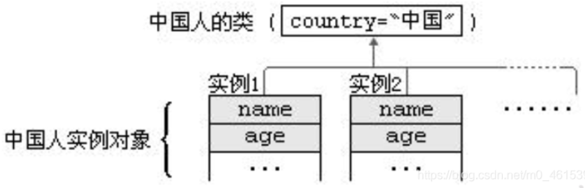
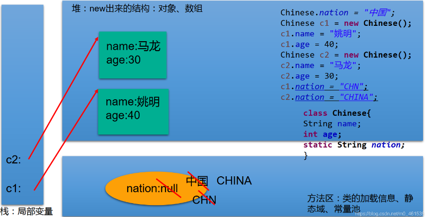
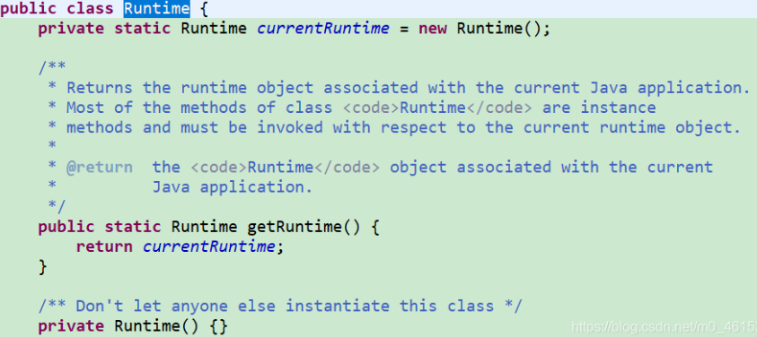
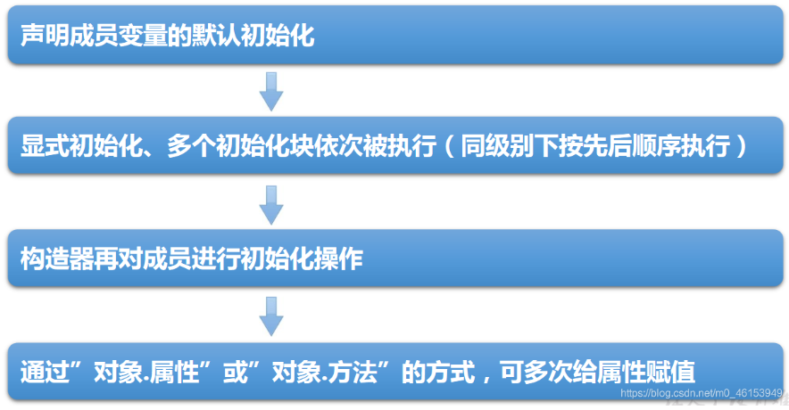
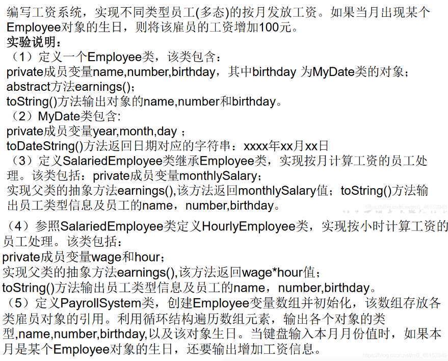
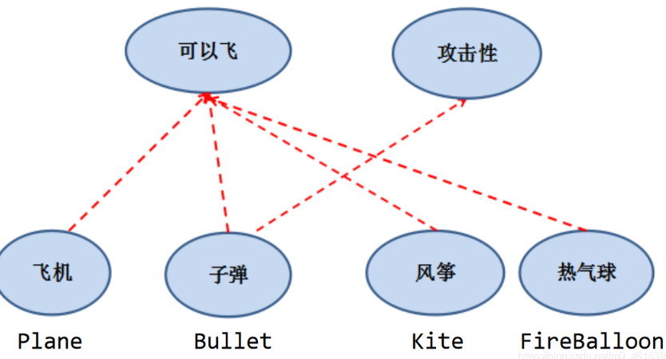
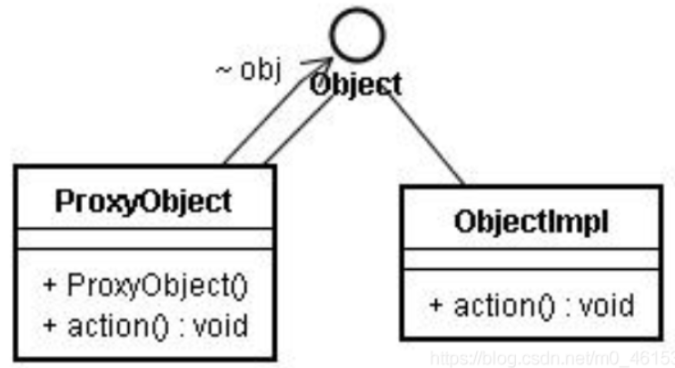
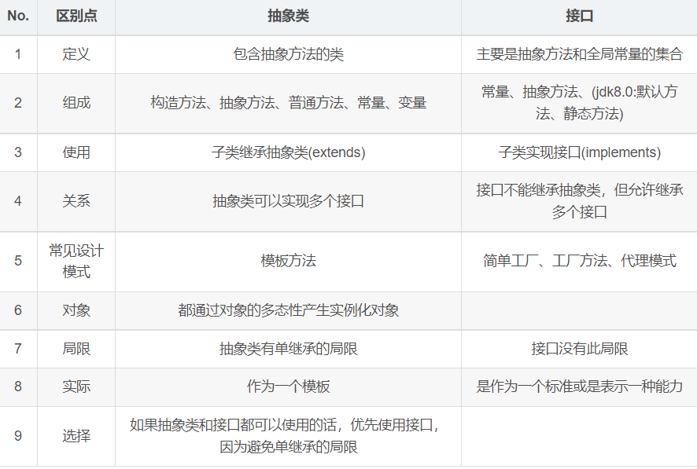
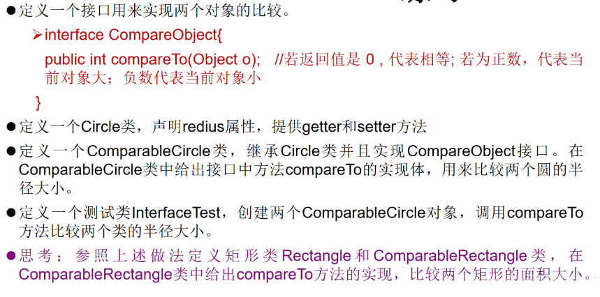

## 七、 面向对象（下）

### 1. 关键字：static

#### 1.1 static的使用

当编写一个类时，其实就是在描述其对象的属性和行为，而并没有产生实质上的对象，只有通过new关键字才会产生出对象，这时系统才会分配内存空间给对象，起方法才可以供外部调用

有时希望无论是否产生了对象或无论产生了多少对象的情况下，**某些特定的数据在内存空间里只有一份**

1. static：静态的

2. static可以用来修饰：属性、方法、代码块、内部类

3. 使用static修饰属性：静态变量（或类变量）

   1. 属性：是否使用static修饰，分为：静态属性VS非静态属性（实例变量）

      实例变量：创建了类的多个对象，每个对象都独立拥有一套类中的非静态属性，当修改其中一个非静态属性时，不会导致其他对象中同样的属性值的修饰

      静态变量：创建了类的多个对象，多个对象共享同一个静态变量。当通过静态变量去修改某一个变量时，会导致其他对象调用此静态变量时是修改过的

   2. static 修饰属性的其他说明：

      1. 静态变量随着类的加载而加载，可以通过 “类.静态变量”的方式进行调用
      2. 静态变量的加载要早于对象的创建
      3. 由于类只会加载一次，则静态变量在内存中也只会存在一次，存在方法区的静态域中。

      ```java
      		类变量		实例变量
      类		yes			no
      对象		yes			yes
      ```

   3. 静态属性举例：System.out.Math.PI;



```java
public class StaticTest {
	public static void main(String[] args) {
		
		Chinese.nation = "中国";
		
		Chinese c1 = new Chinese();
		c1.name = "姚明";
		c1.age = 40;
		c1.nation = "CHN";
		
		Chinese c2 = new Chinese();
		c2.name = "马龙";
		c2.age = 30;
		c2.nation = "CHINA";
		
		System.out.println(c1.nation); 
		
		//编译不通过
//		Chinese.name = "张继科";
		
	}
}
//中国人
class Chinese{
	
	String name;
	int age;
	static String nation;
}
```


#### 1.2 类变量 vs 实例变量内存解析




#### 1.3 static修饰方法

4. 使用static修饰方法：静态方法

   1. 随着类的加载而加载，可以通过 “类.静态方法” 的方式调用

   2. ```java
      	静态方法	非静态方法
      类	yes			no
      对象  yes			yes
      ```

   3. 静态方法中，只能调用静态的方法或属性

      非静态的方法中，可以调用所有的方法或属性

5. static注意点：

   1. 在静态的方法中，不能使用this关键字、super关键字
   2. 关于静态属性和静态方法的使用，从声明周期的角度去理解

6. 开发中，如何确定一个属性是否需要声明static的？

   ​	属性是可以被多个对象所共享的，不会随着对象的不同而不同

   ​	类中的常量也长处声明为static

   开发中，如何确定一个方法是否要声明为static的？

   ​	操作静态属性的方法，通常设置为static的

   ​	工具类中的方法，习惯上声明为static的，比如Math、Arrays、Collections

```java
public class StaticTest {
	public static void main(String[] args) {
		
		Chinese.nation = "中国";
		
		Chinese c1 = new Chinese();
		
		//编译不通过
//		Chinese.name = "张继科";
		
		c1.eat();
		
		Chinese.show();
		//编译不通过
//		chinese.eat();
//		Chinese.info();
	}
}
//中国人
class Chinese{
	
	String name;
	int age;
	static String nation;
	
	public void eat(){
		System.out.println("中国人吃中餐");
		//调用非静态结构
		this.info();
		System.out.println("name : " + name);
		//调用静态结构
		walk();
		System.out.println("nation : " + Chinese.nation);
	}
	
	public static void show(){
		System.out.println("我是一个中国人！");
//		eat();
//		name = "Tom";
		//可以调用静态的结构
		System.out.println(Chinese.nation);
		walk();
	}
	
	public void info(){
		System.out.println("name : " + name + ",age : " + age);
	}
	
	public static void walk(){
		
	}
}
```


#### 1.4  自定义ArrayUtil的优化

```java
/*
 * 自定义数组工具类
 */
public class ArrayUtil {

	// 求数组的最大值
	public static int getMax(int[] arr) {
		int maxValue = arr[0];
		for (int i = 1; i < arr.length; i++) {
			if (maxValue < arr[i]) {
				maxValue = arr[i];
			}
		}
		return maxValue;
	}

	// 求数组的最小值
	public static int getMin(int[] arr) {
		int minValue = arr[0];
		for (int i = 1; i < arr.length; i++) {
			if (minValue > arr[i]) {
				minValue = arr[i];
			}
		}
		return minValue;
	}

	// 求数组总和
	public static int getSum(int[] arr) {
		int sum = 0;
		for (int i = 0; i < arr.length; i++) {
			sum += arr[i];
		}
		return sum;
	}

	// 求数组平均值
	public static int getAvg(int[] arr) {
		int avgValue = getSum(arr) / arr.length;
		return avgValue;
	}

	//如下两个同名方法构成重载
	// 反转数组
	public static void reverse(int[] arr) {
		for (int i = 0; i < arr.length / 2; i++) {
			int temp = arr[i];
			arr[i] = arr[arr.length - i - 1];
			arr[arr.length - i - 1] = temp;
		}
	}
	
	public void reverse(String[] arr){
		
	}

	// 复制数组
	public static int[] copy(int[] arr) {
		int[] arr1 = new int[arr.length];
		for (int i = 0; i < arr1.length; i++) {
			arr1[i] = arr[i];
		}
		return null;
	}

	// 数组排序
	public static void sort(int[] arr) {
		for (int i = 0; i < arr.length - 1; i++) {
			for (int j = 0; j < arr.length - 1 - i; j++) {
				if (arr[j] > arr[j + 1]) {
//					int temp = arr[j];
//					arr[j] = arr[j + 1];
//					arr[j + 1] = temp;
					//错误的：
//					swap(arr[j],arr[j+1]);
					
					swap(arr,j ,j+1);
				}
			}
		}
	}
	
	//错误的:交换数组中两个指定位置元素的值
//	public void swap(int i,int j){
//		int temp = i;
//		i = j;
//		j = temp;
//	}
	
	//正确的：
	private static void swap(int[] arr,int i,int j){
		int temp = arr[i];
		arr[i] = arr[j];
		arr[j] = temp;
	}

	// 遍历数组
	public static void print(int[] arr) {
		System.out.print("[");
		for (int i = 0; i < arr.length; i++) {
			System.out.print(arr[i] + ",");
		}
		System.out.println("]");
	}

	// 查找指定元素
	public static int getIndex(int[] arr, int dest) {
		//线性查找
		for (int i = 0; i < arr.length; i++) {

			if (dest==arr[i]) {
				return i;
			}
		}
		return -1;
	}
}
```

```java
//测试类
public class ArrayUtilTest {

	public static void main(String[] args) {
//		ArrayUtil util = new ArrayUtil();
		int[] arr = new int[]{32,5,26,74,0,96,14,-98,25};
		int max = ArrayUtil.getMax(arr);
		System.out.println("最大值为:" + max);
		
		System.out.print("排序前:");
		ArrayUtil.print(arr);
		
		ArrayUtil.sort(arr);
		System.out.print("排序后:");
		ArrayUtil.print(arr);
		
//		System.out.println("查找:");
//		int index = util.getIndex(arr, 5);
//		if(index > 0){
//			System.out.println("找到了，索引地址:" + index);
//		}else{
//			System.out.println("没找到");
//		}
	}
}
```


#### 1.5 static的应用举例

```java
//static 关键字的应用
public class CircleTest {
	public static void main(String[] args) {
		
		Circle c1 = new Circle();
		Circle c2 = new Circle();
		Circle c3 = new Circle();
		
		System.out.println("c1 的 ID:" + c1.getId());
		System.out.println("c2 的 ID:" + c2.getId());
		System.out.println("c3 的 ID:" + c3.getId());
		
		System.out.println("创建圆的个数: " + Circle.getTotal());
	}
	
}

class Circle{
	
	private double radius;
	private int id;	//需要自动赋值
	
	public Circle(){
		id = init++;
		total++;
	}
	
	public Circle(double radius){
		this();
		//或
//		id = init++;
//		total++;
		this.radius = radius;
	}
	
	private static int total;//记录创建圆的个数
	private static int init = 1001;//static 声明的属性被所有对象所共享
	
	public double findArea(){
		return 3.14 * radius * radius;
	}

	public double getRadius() {
		return radius;
	}

	public void setRadius(double radius) {
		this.radius = radius;
	}

	public int getId() {
		return id;
	}

	public static int getTotal() {
		return total;
	}
}
```


#### 1.6 static的练习

```java
/*
 * 编写一个类实现银行账户的概念，包含的属性有“帐号”、“密码”、“存款余额”、
 * “利率”、“最小余额”，定义封装这些属性的方法。
 * 账号要自动生成。编写主类，使用银行账户类，输入、输出 3 个储户的上述信息。
 * 考虑：哪些属性可以设计成 static 属性。
 * 
 */
public class Account {
	
	private int id;	//账号
	private String pwd = "000000";	//密码
	private double balance; //存款余额
	
	private static double interestRate; //利率
	private static double minMoney = 1.0;  //最小余额
	private static int init = 1001;	//用于自动生成 id
	
	public Account(){	//账号自动生成
		id = init++;
	}
	
	public Account(String pwd,double balance){
		id = init++;
		this.pwd = pwd;
		this.balance = balance;
	}
	
	public String getPwd() {
		return pwd;
	}
	
	public void setPwd(String pwd) {
		this.pwd = pwd;
	}
	
	public static double getInterestRate() {
		return interestRate;
	}
	
	public static void setInterestRate(double interestRate) {
		Account.interestRate = interestRate;
	}
	
	public static double getMinMoney() {
		return minMoney;
	}
	
	public static void setMinMoney(double minMoney) {
		Account.minMoney = minMoney;
	}
	
	public int getId() {
		return id;
	}
	
	public double getBalance() {
		return balance;
	}

	@Override
	public String toString() {
		return "Account [id=" + id + ", pwd=" + pwd + ", balance=" + balance + "]";
	}	
}
```

```java
public class AccountTest {
	public static void main(String[] args) {
		
		Account acct1 = new Account();
		Account acct2 = new Account("qwerty",2000);
		
		Account.setInterestRate(0.012); 
		Account.setMinMoney(100);
		
		System.out.println(acct1);
		System.out.println(acct2);
		
		System.out.println(acct1.getInterestRate()); 
		System.out.println(acct1.getMinMoney());
	}
}
```


#### 1.7 单例（Singleton）设计模式

**设计模式**是在大量的实践中总结和理论化之后优选的代码结构、编码风格、以及解决问题的思考方式

所谓类的单例设计模式，就是采取一定的方法保证在整个的软件系统中，对**某个类只能存在一个对象实例**。并且该类只提供一个取得对象实例的方法。如果我们要让类在一个虚拟机中只能产生一个对象，首先必须将类的**构造器的访问权限设置为private**，这样不能用new操作符在类的外部产生类的对象了，但在类的内部仍可以产生改类的对象。因为类的外部开始还无法得到类的对象，**只能调用该类的某个静态方法以返回类的内部创建的对象，静态方法只能访问类中的静态成员变量，所以指向类内部产生的该类对象的变量也必须定义成静态的**。

1. 所谓类的单例设计模式，就是采取一定的方法保证在整个的软件系统中，对某个类只能存在一个对象实例

2. 如何实现？

   饿汉式 vs 懒汉式

3. 区分饿汉式和懒汉式

   饿汉式：

   ​	坏处：对象加载时间过长

   ​	好处：饿汉式是线程安全的

   懒汉式：

   ​	好处：延迟对象的创建

   ​	坏处：目前的写法，会线程不安全

   

1. **单例模式的饿汉式**

   ```java
   public class SingletonTest {
   	public static void main(String[] args) {
   //		Bank bank1 = new Bank(); 
   //		Bank bank2 = new Bank(); 
   		
   		Bank bank1 = Bank.getInstance();
   		Bank bank2 = Bank.getInstance();
   		
   		System.out.println(bank1 == bank2);
   	}
   }
   
   //单例的饿汉式
   class Bank{
   	
   	//1.私有化类的构造器
   	private Bank(){
   		
   	}
   	
   	//2.内部创见类的对象
   	//4.要求此对象也必须声明为静态的
   	private static Bank instance = new Bank();
   	
   	//3.提供公共的静态的方法，返回类的对象。
   	public static Bank getInstance(){
   		return instance;
   	}
   }
   ```

   

2. **单例模式的懒汉式**

   ```java
   /*
    * 单例的懒汉式实现
    * 
    */
   public class SingletonTest2 {
   	public static void main(String[] args) {
   		
   		Order order1 = Order.getInstance();
   		Order order2 = Order.getInstance();
   		
   		System.out.println(order1 == order2);
   	}
   }
   class Order{
   	//1.私有化类的构造器
   	private Order(){
   		
   	}
   	
   	//2.声明当前类对象，没有初始化。
   	//此对象也必须声明为 static 的
   	private static Order instance = null;
   	
   	//3.声明 public、static 的返回当前类对象的方法
   	public static Order getInstance(){
   		if(instance == null){
   			instance = new Order();			
   		}
   		return instance;
   	}
   }
   ```


3. 单例模式的优点

   由于单例模式只生成一个示例，**减小了系统性能开销**，当一个对象的产生需要比较多的资源时，如读取配置、产生其他依赖对象时，则可以通过在应用启动时直接产生一个单例对象，然后永久驻留内存的方式来解决

   


4. 单例（Singleton）设计模式-应用场景
   * 网站的计数器，一般也是单例模式实现，否则难以同步。
   * 应用程序的日志应用，一般都使用单例模式实现，这一般是由于共享的日志文件一直处于打开状态，因为只能有一个实例去操作，否则内容不好追加。
   * 数据库连接池的设计一般也是采用单例模式，因为数据库连接是一种数据库资源。
     项目中，读取配置文件的类，一般也只有一个对象。没有必要每次使用配置文件数据，都生成一个对象去读取。
   * Application也是单例的典型应用
   * Windows 的 **Task Manager (任务管理器)**就是很典型的单例模式
   * Windows 的 **Recycle Bin(回收站)**也是典型的单例应用。在整个系统运行过程中，回收站一直维护着仅有的一个实例。
     

### 2. 理解 main 方法的语法

由于java虚拟机需要调用类的main()方法，所以该方法的访问权限必须是public，又因为java虚拟机在执行main()方法时不必创建对象，所以该方法必须是static的，该方法接收一个String类型的数组参数，该数组中保存执行java命令时传递给所运行的类的参数

又因为main()方法是静态的，不能直接访问该类中的费静态成员，必须创建该类的一个实例对象后，才能通过这个对象去访问类中的非静态成员

```java
/*
 * main()方法的使用说明
 * 1.main()方法作为程序的入口;
 * 2.main()方法也是一个普通的静态方法
 * 3.main()方法也可以作为我们与控制台交互的方式。(之前，使用 Scanner)
 * 
 * 
 */
public class MainTest {
	public static void main(String[] args) {	//入口
		
		Main.main(new String[100]);
		
		MainTest test = new MainTest();
		test.show();
	}
	
	public void show(){
		
	}
}

class Main{
	public static void main(String[] args) {
		args = new String[100];
		for(int i = 0;i < args.length;i++){
			args[i] = "args_" + i;
			System.out.println(args[i]);
		}
	}
}
```


**命令行参数法举例**

```java
public class MainDemo {
	public static void main(String[] args) {
		
		for(int i = 0;i < args.length;i++){
			System.out.println("/*/*/*/"+ args[i]);
		}	
	}
}
```

```shell
#运行程序MainDemo.java
javac MainDemo.java
java MainDemo "Tom" "Jerry" "Shkstart"
```


### 3. 类的成员之四：代码块

1. 代码块的作用：用来初始化类、对象

2. 代码块如果有修饰的话，只能使用static

3. 分类：静态代码块 vs 非静态代码块

4. 静态代码块

   * 内部可以有输出语句
   * 随着类的加载而执行，而且只执行一次
   * 作用：初始化类的信息
   * 如果一个类中，定义了多个静态代码块，则按照声明的先后顺序执行
   * 静态代码块的执行，优先与非静态代码块的执行
   * 静态代码块内只能调用静态的属性、静态的方法，不能调用非静态的结构

5. 非静态代码块

   * 内部可以有输出语句
   * 随着对象的创建而执行
   * 每创建一个对象，就执行一次非静态代码块
   * 作用：可以在创建对象时，对对象的属性进行初始化
   * 如果一个类中，定义了多个非静态代码块，则按照声明的先后顺序执行
   * 非静态代码块内可以调用静态的属性、静态的方法，或非静态的属性、非静态的方法

6. 对属性可以赋值的位置：

   1. 默认初始化
   2. 显式初始化
   3. 构造器中初始化
   4. 有对象以后，可以通过 “对象.属性” 或 “对象.方法” 的方式，进行赋值
   5. 在代码块中赋值

   执行顺序：1 -- 2/5 -- 3 -- 4

```java
public class BlockTest {
	public static void main(String[] args) {
		
		String desc = Person.desc;
		System.out.println(desc);
		
		Person p1 = new Person();
		Person p2 = new Person();
		System.out.println(p1.age);
		
		Person.info();
	}
}

class Person{
	//属性
	String name;
	int age;
	static String desc = "我是一个青年";
	
	//构造器
	public Person(){
		
	}
	
	//static 的代码块
	static{
		System.out.println("hello,static block-1");
		//调用静态结构
		desc = "我是一个爱小说的人";
		info();
		//不能调用非静态结构
//		eat();
//		name = "Tom";
	}
	
	static{
		System.out.println("hello,static block-2");
	}
	
	//非 static 的代码块
	{
		System.out.println("hello,block-2");
	}
	{
		System.out.println("hello,block-1");
		//调用非静态结构
		age = 1;
		eat();
		//调用静态结构
		desc = "我是一个爱小说的人 1";
		info();
	}	
	
	//方法
	public Person(String name,int age){
		this.name = name;
		this.age = age;
	}
	
	public void eat(){
		System.out.println("吃饭");
	}

	@Override
	public String toString() {
		return "Person [name=" + name + ", age=" + age + "]";
	}
	public static void info(){
		System.out.println("我是一个快乐的人。");
	}
}
```


**静态初始化块举例1**

```java
//总结:由父类到子类，静态先行
class Root{
	static{
		System.out.println("Root 的静态初始化块");
	}
	{
		System.out.println("Root 的普通初始化块");
	}
	public Root(){
		System.out.println("Root 的无参数的构造器");
	}
}
class Mid extends Root{
	static{
		System.out.println("Mid 的静态初始化块");
	}
	{
		System.out.println("Mid 的普通初始化块");
	}
	public Mid(){
		System.out.println("Mid 的无参数的构造器");
	}
	public Mid(String msg){
		//通过 this 调用同一类中重载的构造器
		this();
		System.out.println("Mid 的带参数构造器，其参数值："
			+ msg);
	}
}
class Leaf extends Mid{
	static{
		System.out.println("Leaf 的静态初始化块");
	}
	{
		System.out.println("Leaf 的普通初始化块");
	}	
	public Leaf(){
		//通过 super 调用父类中有一个字符串参数的构造器
		super("尚硅谷");
		System.out.println("Leaf 的构造器");
	}
}
public class LeafTest{
	public static void main(String[] args){
		new Leaf(); 
		//new Leaf();
	}
}
```

```shell
Root 的静态初始化块
Mid 的静态初始化块
Leaf 的静态初始化块
Root 的普通初始化块
Root 的无参数的构造器
Mid 的普通初始化块
Mid 的无参数的构造器
Mid 的带参数构造器，其参数值：尚硅谷
Leaf 的普通初始化块
Leaf 的构造器
```


**静态初始化块举例2**

```java
class Father {
	static {
		System.out.println("11111111111");
	}
	{
		System.out.println("22222222222");
	}

	public Father() {
		System.out.println("33333333333");

	}

}

public class Son extends Father {
	static {
		System.out.println("44444444444");
	}
	{
		System.out.println("55555555555");
	}
	public Son() {
		System.out.println("66666666666");
	}

	public static void main(String[] args) { // 由父及子 静态先行
		System.out.println("77777777777");
		System.out.println("************************");
		new Son();
		System.out.println("************************");

		new Son();
		System.out.println("************************");
		new Father();
	}
}
```

```shell
11111111111
44444444444
77777777777
************************
22222222222
33333333333
55555555555
66666666666
************************
22222222222
33333333333
55555555555
66666666666
************************
22222222222
33333333333
```

**总结：程序中成员变量赋值的执行顺序**



```java
public class OrderTest {
	public static void main(String[] args) {
		Order order = new Order();
		System.out.println(order.orderId);
	}
}
class Order{
	
	int orderId = 3;
	{
		orderId = 4;
	}	
}
```


### 4. 关键字：final

1. final可以用来修饰的结构：类、方法、变量

2. final用来修饰一个类：此类不能被其他类所继承

   比如：String类、System类、StringBuffer类

3. final修饰一个方法：final标记的方法不能被子类重写

   比如：Object类中的getClass()

4. final用来修饰变量：此时的 “变量”(成员变量或局部变量)就是一个常量。名称大写，**且只能被赋值一次**。

   1. final修饰属性，可以考虑赋值的位置有：显示初始化、代码中初始化、构造器中初始化
   2. final修饰局部变量：使用final修饰形参时，表明此形参是一个常量。当调用此方法时，给常量形参赋一个实参，一旦赋值以后，就只能在方法体内使用此形参，但不能进行重新赋值

**static final: 用来修饰全局常量**

```java
public class FinalTest {
	
	final int WIDTH = 0;
	final int LEFT;
	final int RIGHT;
//	final int DOWN;
	
	{
		LEFT = 1;
	}
	
	public FinalTest(){
		RIGHT = 2;
	}
	
	public FinalTest(int n){
		RIGHT = n;
	}
	
//	public void setDown(int down){
//		this.DOWN = down;
//	}
	
	public void dowidth(){
//		width = 20;	//width cannot be resolved to a variable
	}
	
	public void show(){
		final int NUM = 10;	//常量
//		num += 20;
	}
	
	public void show(final int num){
		System.out.println(num);
	}
	
	public static void main(String[] args) {
		
		int num = 10;
		
		num = num + 5;
		
		FinalTest test = new FinalTest();
//		test.setDown(5);
		
		test.show(10);
	}
}

final class FianlA{
	
}

//class B extends FinalA{     //错误，不能被继承。
//	
//}

//class C extends String{
//	
//}

class AA{
	public final void show(){
		
	}
}

//class BB extends AA{	// 错误，不能被重写。
//	public void show(){
//		
//	}
//}
```


**练习1**

```java
public class Something {
	public int addOne(final int x) {
		return ++x; //Cannot assign a value to final variable 'x
        // return x + 1;
	}
}
```


**练习2**

```java
public class Something {

	public static void main(String[] args) {
		Other o = new Other();
		new Something().addOne(o);
	}

	public void addOne(final Other o) {
		// o = new Other();
		o.i++;
	}
}

class Other {
	public int i;
}
```


### 5.  抽象类与抽象方法

将父类设计得非常抽象，以至于没有具体的实例，这样的类叫做**抽象类**

**abstract关键字的使用**

1. abstract：抽象的
2. abstract可以用来修饰的结构：类、方法
3. abstract修饰类：抽象类
   1. 此类不能实例化
   2. 抽象类中一定有构造器，便于子类实例化时调用（涉及子类对象实例化全过程）
   3. 开发中都会提供抽象类的子类，让子类对象实例化，实现相关的操作
4. abstract修饰方法：抽象方法
   1. 抽象方法，只有方法的声明，没有方法体
   2. 包含抽象方法的类，一定是一个抽象类，反之抽象类中可以没有抽象方法
   3. 若子类重写了父类中所有的抽象方法，此子类可以实例化对象


abstract使用上注意点：（**需要能继承，能重写**）

1. abstract不能用来修饰变量、代码块、构造器
2. abstratc不能用来修饰私有方法、静态方法、final的方法、final的类

```java
public class AbstractTest {
	public static void main(String[] args) {
		//一旦 Person 类抽象了，就不可实例化
//		Person p1 = new Person();
//		p1.eat();
		
	}
}

abstract class Creature{
	public abstract void breath();
}

abstract class Person extends Creature{
	String name;
	int age;
	
	public Person(){
		
	}
	
	public Person(String name,int age){
		this.name = name;
		this.age = age;
	}
	
	//不是抽象方法
//	public void eat(){
//		System.out.println("人吃饭");
//	}
	
	//抽象方法
	public abstract void eat();
	
	public void walk(){
		System.out.println("人走路");
	}
}

class Student extends Person{
	public Student(String name,int age){
		super(name,age);
	}
	public void eat(){
		System.out.println("学生应该多吃有营养的。");
	}
	@Override
	public void breath() {
		System.out.println("学生应该呼吸新鲜的无雾霾空气");
	}
}
```


#### 5.1 抽象类应用

抽象类是用来模型化那些父类无法确定全部实现，而是由子类提供具体实现的对象的类

java允许类设计者指定：超类声明一个方法但不提供实现，该方法的实现由子类提供，这样的方法称为抽象方法，有一个或更多抽象方法的类称为抽象类

```java
/*
 * Vehicle 是一个抽象类，有两个抽象方法。
 * 注意：抽象类不能实例化 new Vihicle()是非法的
 */
public abstract class Vehicle{
	public abstract double calcFuelEfficiency();//计算燃料效率的抽象方法
	public abstract double calcTripDistance();//计算行驶距离的抽象方法
}
public class Truck extends Vehicle{
	public double calcFuelEfficiency(){ 
		//写出计算卡车的燃料效率的具体方法
	}
	public double calcTripDistance(){ 
		//写出计算卡车行驶距离的具体方法
	}
}
public class RiverBarge extends Vehicle{
	public double calcFuelEfficiency() { 
		//写出计算驳船的燃料效率的具体方法
	}
	public double calcTripDistance( )  {  
		//写出计算驳船行驶距离的具体方法
	}
}
```


#### 5.2 练习

```java
/*
 * 编写一个 Employee 类，声明为抽象类，
 * 包含如下三个属性：name，id，salary。
 * 提供必要的构造器和抽象方法：work()。
 * 对于 Manager 类来说，他既是员工，还具有奖金(bonus)的属性。
 * 请使用继承的思想，设计 CommonEmployee 类和 Manager 类，
 * 要求类中提供必要的方法进行属性访问。
 * 
 */
public abstract class Employee {
	
	private String name;
	private int id;
	private double salary;
	
	public Employee(){
		super();
	}

	public Employee(String name, int id, double salary) {
		super();
		this.name = name;
		this.id = id;
		this.salary = salary;
	}
	
	public abstract void work();	
}
```

```java
//Manager类
/*
 * 对于 Manager 类来说，他既是员工，还具有奖金(bonus)的属性。
 * 
 */
public class Manager extends Employee{

	private double bonus;	//奖金
	
	public Manager(double bonus) {
		super();
		this.bonus = bonus;
	}
	
	public Manager(String name, int id, double salary, double bonus) {
		super(name, id, salary);
		this.bonus = bonus;
	}


	@Override
	public void work() {
		System.out.println("管理员工，提高公司运行效率。");		
	}
}
```

```java
//CommonEmployee类
public class CommonEmployee extends Employee {

	@Override
	public void work() {
		System.out.println("员工在一线车间生产产品。");
	}
}
```

```java
//测试类
/*
 * 请使用继承的思想，设计 CommonEmployee 类和 Manager 类，
 */
public class EmployeeTest {
	public static void main(String[] args) {
		
		Employee manager = new Manager("库克",1001,5000,50000);
		
		manager.work();
		
		CommonEmployee commonEmployee = new CommonEmployee();
		commonEmployee.work();
	}
}
```


#### 5.3 创建抽象类的匿名子类对象

```java
public class Num {

}

abstract class Creature{
	public abstract void breath();
}

abstract class Person extends Creature{
	String name;
	int age;
	
	public Person(){
		
	}
	
	public Person(String name,int age){
		this.name = name;
		this.age = age;
	}
	
	//不是抽象方法
//	public void eat(){
//		System.out.println("人吃饭");
//	}
	
	//抽象方法
	public abstract void eat();
	
	public void walk(){
		System.out.println("人走路");
	}
}

class Student extends Person{
	public Student(String name,int age){
		super(name,age);
	}
	public Student(){

	}
	public void eat(){
		System.out.println("学生应该多吃有营养的。");
	}
	@Override
	public void breath() {
		System.out.println("学生应该呼吸新鲜的无雾霾空气");
	}
}
```

```java
//PersonTest类
/*
 * 抽象类的匿名子类
 * 
 */
public class PersonTest {
	public static void main(String[] args) {
		
		method(new Student());	//匿名对象
		
		Worker worker = new Worker(); 
		method1(worker);	//非匿名的类非匿名的对象
		
		method1(new Worker());	//非匿名的类匿名的对象
		
		System.out.println("*********************");
		
		//创建了一个匿名子类的对象:p
		Person p = new Person(){

			@Override
			public void eat() {
				System.out.println("吃东西");
			}

			@Override
			public void breath() {
				System.out.println("呼吸空气");
			}
			
		};
		method1(p);
		System.out.println("**********************"); 
		//创建匿名子类的匿名对象
		method1(new Person(){

			@Override
			public void eat() {
				System.out.println("吃零食");
			}

			@Override
			public void breath() {
				System.out.println("云南的空气");
			}
			
		});
	}
	
	public static void method1(Person p){
		p.eat();
		p.walk();
	}
	
	public static void method(Student s){
		
	}
}
class Worker extends Person{
	
	@Override
	public void eat() {
	}

	@Override
	public void breath() {
	}
}
```


#### 5.4 多态的应用：模板方法设计模式（TemplateMethod）

抽象类体现的就是一种模板模式的设计，抽象类作为多个子类的通用模板，子类在抽象类的基础上进行扩展、改造，但子类总体上会保留抽象类的行为方式

解决的问题：当功能内部一部分实现是确定的，一部分实现是不确定的，这时可以把不确定的部分暴露出去，让子类去实现

**在软件开发中实现一个算法时，整体步骤很固定、通用，这些步骤已经在父类中写好了。但某些部分易变，易变部分可以抽象出来，供不同子类实现，这就是一种模板模式**

**例1**

```java
/*
 * 抽象类的应用:模板方法的设计模式
 */
public class TemplateTest {
	public static void main(String[] args) {
		
		SubTemlate t = new SubTemlate();
		
		t.sendTime();
	}
}
abstract class Template{
	
	//计算某段代码执行所需花费的时间
	public void sendTime(){
		
		long start = System.currentTimeMillis();
		
		code();	//不确定部分，易变的部分
		
		long end = System.currentTimeMillis();
		
		System.out.println("花费的时间为:" + (end - start));
	}
	
	public abstract void code();
}

class SubTemlate extends Template{
	
	@Override
	public void code() {
		
		for(int i = 2;i <= 1000;i++){
			boolean isFlag = true;
			for(int j = 2;j <= Math.sqrt(i);j++){
				if(i % j == 0){
					isFlag = false;
					break;
				}
			}
			if(isFlag){
				System.out.println(i);
			}
		}
	}
}
```


**例2**

```java
//抽象类的应用：模板方法的设计模式
public class TemplateMethodTest {

	public static void main(String[] args) {
		BankTemplateMethod btm = new DrawMoney();
		btm.process();

		BankTemplateMethod btm2 = new ManageMoney();
		btm2.process();
	}
}
abstract class BankTemplateMethod {
	// 具体方法
	public void takeNumber() {
		System.out.println("取号排队");
	}

	public abstract void transact(); // 办理具体的业务 //钩子方法

	public void evaluate() {
		System.out.println("反馈评分");
	}

	// 模板方法，把基本操作组合到一起，子类一般不能重写
	public final void process() {
		this.takeNumber();

		this.transact();// 像个钩子，具体执行时，挂哪个子类，就执行哪个子类的实现代码

		this.evaluate();
	}
}

class DrawMoney extends BankTemplateMethod {
	public void transact() {
		System.out.println("我要取款！！！");
	}
}

class ManageMoney extends BankTemplateMethod {
	public void transact() {
		System.out.println("我要理财！我这里有 2000 万美元!!");
	}
}
```

模板方法设计模式是编程中经常用到的模式，常见有

- 数据库访问的封装
- Junit 单元测试
- JavaWeb 的 Servlet 中关于 doGet/doPost 方法调用
- Hibernate 中模板程序
- Spring 中 JDBCTemlate、HibernateTemplate 等


#### 5.5 抽象类的练习



```java
//Employee类
/*
 * 定义一个 Employee 类，
 * 该类包含：private 成员变量 name,number,birthday，
 * 其中 birthday 为 MyDate 类的对象；
 * abstract 方法 earnings()；
 * toString()方法输出对象的 name,number 和 birthday。
 * 
 */
public abstract class Employee {
	private String name;
	private int number;
	private MyDate birthday;
	
	public Employee(String name, int number, MyDate birthday) {
		super();
		this.name = name;
		this.number = number;
		this.birthday = birthday;
	}

	public String getName() {
		return name;
	}

	public void setName(String name) {
		this.name = name;
	}

	public int getNumber() {
		return number;
	}

	public void setNumber(int number) {
		this.number = number;
	}

	public MyDate getBirthday() {
		return birthday;
	}

	public void setBirthday(MyDate birthday) {
		this.birthday = birthday;
	}

	public abstract double earnings();

	@Override
	public String toString() {
		return "name=" + name + ", number=" + number + ", birthday=" + birthday.toDateString() + "]";
	}	
}
```

```java
//MyDate类
/*
 * MyDate 类包含:private 成员变量 year,month,day；
 * toDateString()方法返回日期对应的字符串：xxxx 年 xx 月 xx 日
 */
public class MyDate {
	private int year;
	private int month;
	private int day;
	
	public MyDate(int year, int month, int day) {
		super();
		this.year = year;
		this.month = month;
		this.day = day;
	}

	public int getYear() {
		return year;
	}

	public void setYear(int year) {
		this.year = year;
	}

	public int getMonth() {
		return month;
	}

	public void setMonth(int month) {
		this.month = month;
	}

	public int getDay() {
		return day;
	}

	public void setDay(int day) {
		this.day = day;
	}

	public String toDateString(){
		return year + "年" + month + "月" + day + "日";
	}
}
```

```java
//SalariedEmployee类
/*
 * 定义 SalariedEmployee 类继承 Employee 类，实现按月计算工资的员工处理。
 * 该类包括：private 成员变量 monthlySalary；实现父类的抽象方法 earnings(),
 * 该方法返回 monthlySalary 值；
 * toString()方法输出员工类型信息及员工的 name，number,birthday。
 * 
 */
public class SalariedEmployee extends Employee{
	private double monthlySalary;	//月工资

	public SalariedEmployee(String name,int number,MyDate birthday) {
		super(name,number,birthday);
	}
	
	public SalariedEmployee(String name, int number, MyDate birthday, double monthlySalary) {
		super(name, number, birthday);
		this.monthlySalary = monthlySalary;
	}

	@Override
	public double earnings() {
		return monthlySalary;		
	}

	@Override
	public String toString() {
		return "SalariedEmployee [" + super.toString() + "]";
	}	
}
```

```java
//HourlyEmployee类
/*
 * 参照 SalariedEmployee 类定义 HourlyEmployee 类，
 * 实现按小时计算工资的员工处理。该类包括：private 成员变量 wage 和 hour；
 * 实现父类的抽象方法 earnings(),该方法返回 wage*hour 值；
 * toString()方法输出员工类型信息及员工的 name，number,birthday。
 * 
 */
public class HourlyEmployee extends Employee{
	private int wage;	//每小时的工资
	private int hour;	//月工作的小时数
	
	public HourlyEmployee(String name, int number, MyDate birthday) {
		super(name, number, birthday);
	}

	public HourlyEmployee(String name, int number, MyDate birthday, int wage, int hour) {
		super(name, number, birthday);
		this.wage = wage;
		this.hour = hour;
	}

	@Override
	public double earnings() {
		return wage*hour;
	}

	public int getWage() {
		return wage;
	}

	public void setWage(int wage) {
		this.wage = wage;
	}

	public int getHour() {
		return hour;
	}

	public void setHour(int hour) {
		this.hour = hour;
	}
	
	public String toString(){
		return "HourlyEmployee[" + super.toString() + "]"; 
	}
}
```

```java
//PayrollSystem类
import java.util.Calendar;
import java.util.Scanner;
/*
 * 定义 PayrollSystem 类，创建 Employee 变量数组并初始化，
 * 该数组存放各类雇员对象的引用。利用循环结构遍历数组元素，
 * 输出各个对象的类型,name,number,birthday,以及该对象生日。
 * 当键盘输入本月月份值时，
 * 如果本月是某个 Employee 对象的生日，还要输出增加工资信息。
 * 
 */
public class PayrollSystem {
	public static void main(String[] args) {
		//方式一：
//		Scanner scanner = new Scanner(System.in);
//		System.out.println("请输入当月的月份：");
//		int month = scanner.nextInt();
		
		//方式二：
		Calendar calendar = Calendar.getInstance();
		int month = calendar.get(Calendar.MONTH);//获取当前的月份
//		System.out.println(month);//一月份：0
		
		Employee[] emps = new Employee[2];
		
		emps[0] = new SalariedEmployee("马良", 1002,new MyDate(1992, 2, 28),10000);
		emps[1] = new HourlyEmployee("博西", 2001, new MyDate(1991, 1, 6),60,240);
		
		for(int i = 0;i < emps.length;i++){
			System.out.println(emps[i]);
			double salary = emps[i].earnings();
			System.out.println("月工资为：" + salary);
			
			if((month+1) == emps[i].getBirthday().getMonth()){
				System.out.println("生日快乐！奖励 100 元");
			}
			
		}
	}
}
```


### 6. 接口（interface）

#### 6.1 概述

有时必须从几个类中派生出一个子类，继承他们所有的属性和方法，但java不支持多重继承，有了接口就可以得到多重继承的效果

另一方面，有时必须从几个类中抽取一些共同的行为特征，而他们之间又没有is-a的关系，紧紧具有相同的行为特征而已。

接口就是规范，定义的是一组规则。**继承是一个“是不是”的关系，二接口实现则是“能不能”的关系**

**接口的本质是契约，标准，规范**

接口（interface）是抽象方法和常量值定义的集合

接口的特点：

* 用interface来定义
* 接口中的所有成员变量都默认是由 **public static final** 修饰的
* 接口中所有的抽象方法都默认是由 **public abstract** 修饰的
* 接口中没有构造器
* 接口采用多继承机制




接口的使用：

1. 接口使用Interface来定义

2. 在java中：接口和类是并列的两个结构

3. 如何去定义两个接口：定义接口中的成员

   3.1 JDK7及以前：只能定义全局常量和抽象方法

   * 全局常量：public static final，但是书写时可以省略不写
   * 抽象方法：public abstract

   3.2 JDK8：除了全局常量和抽象方法之外，还可以定义静态方法、默认方法

4. 接口中不能定义构造器，意味接口不可以实例化

5. java开发中，接口通过让类去实现（implements）的方式来使用。

   如果实现类覆盖了接口中的所有方法，则此实现类就可以实例化

   如果实现类没有覆盖接口中所有的抽象方法，则此实现类仍然是一个抽象类
   
6. java类可以实现多个接口 --> 弥补了java单继承性的局限性

   格式：`class AA extends BB implemented CC,DD,EE`

7. 接口与接口之间是继承，而且可以多继承

8. 接口的具体使用，体现多态性

   接口的主要用途就是被实现类实现（面向接口编程）

9. 接口实际可以看做是一种规范

```java
public class InterfaceTest {
	public static void main(String[] args) {
		System.out.println(Flayable.MAX_SPEED);
		System.out.println(Flayable.MIN_SPEED);
	}
}
interface Flayable{
	
	//全局变量
	public static final int MAX_SPEED = 7900;	
	int MIN_SPEED = 1;//省略了 public static final 
	
	//抽象方法
	public abstract void fly();
	
	void stop();//省略了 public abstract 
	//Interfaces cannot have constructors
//	public Flayable(){
//		
//	}	
}
interface Attackable{
	void attack();
}

class Plane implements Flayable{

	@Override
	public void fly() {
		System.out.println("飞机通过引擎起飞");
		
	}

	@Override
	public void stop() {
		System.out.println("驾驶员减速停止");
	}
	
}
abstract class Kite implements Flayable{

	@Override
	public void fly() {
		
	}
}

class Bullet extends Object implements Flayable,Attackable,CC{

	@Override
	public void attack() {
		// TODO Auto-generated method stub
		
	}

	@Override
	public void fly() {
		// TODO Auto-generated method stub
		
	}

	@Override
	public void stop() {
		// TODO Auto-generated method stub
		
	}

	@Override
	public void method1() {
		// TODO Auto-generated method stub
		
	}

	@Override
	public void method2() {
		// TODO Auto-generated method stub
		
	}
}

//*********************************
interface AA{
	void method1();
}
interface BB{
	void method2();
}
interface CC extends AA,BB{	
}
```


#### 6.2 举例

接口的使用

1. 接口使用上也满足多态性
2. 接口实际上就是定义了一种规范
3. 开发中体会面向接口编程

```java
public class USBTest {
	public static void main(String[] args) {
		
		Computer com = new Computer();
		//1.创建了接口的非匿名实现类的非匿名对象
		Flash flash = new Flash();
		com.transferData(flash); 
		//2. 创建了接口的非匿名实现类的匿名对象
		com.transferData(new Printer());
		//3. 创建了接口的匿名实现类的非匿名对象
		USB phone = new USB(){

			@Override
			public void start() {
				System.out.println("手机开始工作");
			}

			@Override
			public void stop() {
				System.out.println("手机结束工作");
			}
			
		};
		com.transferData(phone);
		//4. 创建了接口的匿名实现类的匿名对象
		com.transferData(new USB(){
			@Override
			public void start() {
				System.out.println("mp3 开始工作");
			}

			@Override
			public void stop() {
				System.out.println("mp3 结束工作");
			}
		});
	}
}

interface USB{
	//常量:定义了长、宽
	void start();
	
	void stop();
}

class Computer{
	
	public void transferData(USB usb){//USB usb = new Flash();
		usb.start();
		
		System.out.println("具体传输数据的细节");
		
		usb.stop();
	}
	
}

class Flash implements USB{

	@Override
	public void start() {
		System.out.println("U 盘开始工作");
	}

	@Override
	public void stop() {
		System.out.println("U 盘结束工作");
	}
}
class Printer implements USB{
	@Override
	public void start() {
		System.out.println("打印机开启工作");
	}

	@Override
	public void stop() {
		System.out.println("打印机结束工作");
	}
	
}
```


#### 6.3 接口的应用：代理模式（Proxy）

代理模式是java开发中使用较多的一种设计模式。代理设计就是为其他对象提供的一种代理以控制对这个对象的访问



```java
/*
 * 接口的应用:代理模式
 */
public class NetWorkTest {
	public static void main(String[] args) {
		
		Server server = new Server();
//		server.browse();
		ProxyServer proxyServer = new ProxyServer(server);
		
		proxyServer.browse();
	}
}
interface NetWork{
	public void browse();
	
}
//被代理类
class Server implements NetWork{

	@Override
	public void browse() {
		System.out.println("真实的服务器来访问网络");
	}
}
//代理类
class ProxyServer implements NetWork{
	
	private NetWork work;
	
	public ProxyServer(NetWork work){
		this.work = work;
	}
	
	public void check(){
		System.out.println("联网前的检查工作");
	}

	@Override
	public void browse() {
		check();
		
		work.browse();
	}	
}
```

应用场景：

* 安全代理：屏蔽对真实角色的直接访问
* 远程代理：通过代理类处理远程方法调用（RMI）
* 延迟加载：先加载轻量级的代理对象，真正需要再加载真实对象


分类：

* 静态代理（静态定义代理类）

* 动态代理（动态生成代理类）

  JDK自带的动态代理，需要反射等知识

```java
public class StaticProxyTest {

	public static void main(String[] args) {
		Proxy s = new Proxy(new RealStar());
		s.confer();
		s.signContract();
		s.bookTicket();
		s.sing();
		s.collectMoney();
	}
}

interface Star {
	void confer();// 面谈

	void signContract();// 签合同

	void bookTicket();// 订票

	void sing();// 唱歌

	void collectMoney();// 收钱
}
//被代理类
class RealStar implements Star {

	public void confer() {
	}

	public void signContract() {
	}

	public void bookTicket() {
	}

	public void sing() {
		System.out.println("明星：歌唱~~~");
	}

	public void collectMoney() {
	}
}

//代理类
class Proxy implements Star {
	private Star real;

	public Proxy(Star real) {
		this.real = real;
	}

	public void confer() {
		System.out.println("经纪人面谈");
	}

	public void signContract() {
		System.out.println("经纪人签合同");
	}

	public void bookTicket() {
		System.out.println("经纪人订票");
	}

	public void sing() {
		real.sing();
	}

	public void collectMoney() {
		System.out.println("经纪人收钱");
	}
}
```


#### 6.4 接口的应用：工厂模式

[工厂设计模式.pdf](https://link.csdn.net/?target=https%3A%2F%2Fwww.yuque.com%2Fnizhegechouloudetuboshu%2Flibrary%2Fmlenxx)

* 接口和抽象类之间的对比

  ​	

* 排错1

  ```java
  interface A {
  	int x = 0;
  }
  class B {
  	int x = 1;
  }
  class C extends B implements A {
  	public void pX() {
  //		编译不通过，x 不明确
  		System.out.println(x);
  //		System.out.println(super.x); //1
  //		System.out.println(A.x);//0
  	}
  	public static void main(String[] args) {
  		new C().pX();
  	}
  }
  ```

* 排错2

  ```java
  interface Playable {
  	void play();
  }
  interface Bounceable {
  	void play();
  }
  interface Rollable extends Playable, Bounceable {
  	Ball ball= new Ball("PingPang"); //省略了 public static final
  }
  public class Ball implements Rollable {
  	private String name;
  	public String getName() {
  		return name;
  	}
  	public Ball(String name) {
  		this.name= name;
  	}
  	public void play() {
  		ball = new Ball("Football"); //The final field Rollable.ball cannot be assigned	
  		System.out.println(ball.getName());
  	}
  }
  ```

* 练习

  

```java
//CompareObject类
/*
 * 定义一个接口用来实现两个对象的比较。
 * 
 */
public interface CompareObject {
	public int compareTo(Object o);
	//若返回值是 0,代表相等;若为正数，代表当前对象大；负数代表当前对象小
	
}
```

```java
//Circle类
/*
 * 定义一个 Circle 类，声明 redius 属性，提供 getter 和 setter 方法
 */
public class Circle {
	
	private Double radius;

	public Double getRadius() {
		return radius;
	}

	public void setRadius(Double radius) {
		this.radius = radius;
	}

	public Circle() {
		super();
	}

	public Circle(Double radius) {
		super();
		this.radius = radius;
	}		
}
```

```java
//ComparableCircle类
/*
 * 定义一个 ComparableCircle 类，继承 Circle 类并且实现 CompareObject 接口。在 ComparableCircle 类中给出接口中方法 compareTo 的实现体，
 * 用来比较两个圆的半径大小。
 */
public class ComparableCircle extends Circle implements CompareObject{

	public ComparableCircle(double radius) {
		super(radius);
	}
	@Override
	public int compareTo(Object o) {
		if(this == o){
			return 0;
		}
		if(o instanceof ComparableCircle){
			ComparableCircle c = (ComparableCircle)o;
			//错误的写法
//			return (int)(this.getRedius() - c.getRedius());
			//正确的方式一：
//			if(this.getRadius() > c.getRadius()){
//				return 1;
//			}else if(this.getRadius() < c.getRadius()){
//				return -1;
//			}else{
//				return 0;
//			}
			//当属性 radius 声明为 Double 类型时，可以调用包装类的方法
			//正确的方式二：
			return this.getRadius().compareTo(c.getRadius());
		}else{
			return 0;
//			throw new RuntimeException("传入数据类型不匹配");
		}
	}
}
```

```java
//InterfaceTest类
/*
 * 定义一个测试类 InterfaceTest，创建两个 ComparableCircle 对象，
 * 调用 compareTo 方法比较两个类的半径大小。
 * 
 */
public class InterfaceTest {
	public static void main(String[] args) {
		
		ComparableCircle c1 = new ComparableCircle(3.4);
		ComparableCircle c2 = new ComparableCircle(3.6);
		
		int compareValue = c1.compareTo(c2);
		if(compareValue > 0){
			System.out.println("c1 对象大");
		}else if(compareValue < 0){
			System.out.println("c2 对象大");
		}else{
			System.out.println("两个一样的");
		}
		
		int compareValue1 = c1.compareTo(new String("AA"));
		System.out.println(compareValue1);
	}
}
```


### 7.  Java8中关于接口的改进

java8中，可以为接口添加静态方法和默认方法

* 静态方法

  使用static关键字修饰，可以通过接口直接调用静态方法，并执行其方法体。

  可经常在相互一起使用的类中使用静态方法

* 默认方法

  默认方法使用default关键字修饰，可以通过实现类对象来调用。


* 例1

  ```java
  //Interface类
  /*
   * JDK8:除了全局常量和抽象方法之外，还可以定义静态方法、默认方法(略)。
   * 
   */
  public interface CompareA {
  
  	//静态方法
  	public static void method1() {
  		System.out.println("CompareA:西安");
  	}
  	
  	//默认方法
  	public default void method2(){
  		System.out.println("CompareA:深圳");
  	}
  	
  	default void method3(){
  		System.out.println("CompareA:杭州");
  	}
  }
  ```

  ```java
  //CompareB类
  public interface CompareB {
  	default void method3(){
  		System.out.println("CompareB：上海");
  	}
  }
  ```

  ```java
  //SuperClass类
  public class SuperClass {
  	public void method3(){
  		System.out.println("SuperClass:北京");
  	}
  }
  ```

  ```java
  //SubClassTest类
  public class SubClassTest {
  
  	public static void main(String[] args) {
  		SubClass s = new SubClass();
  //		s.method1();
  //		SubClass.method1();
  //		知识点 1：接口中定义的静态方法，只能通过接口来调用。
  		CompareA.method1();
  //		知识点 2：通过实现类的对象，可以调用接口中的默认方法。
  //		如果实现类重写了接口中的默认方法，调用时，仍然调用的是重写以后的方法
  		s.method2();
  //		知识点 3：如果子类(或实现类)继承的父类和实现的接口中声明了同名同参数的默认方法，
  //		那么子类在没有重写此方法的情况下，默认调用的是父类中的同名同参数的方法。-->类优先原则
  //		知识点 4：如果实现类实现了多个接口，而这多个接口中定义了同名同参数的默认方法，
  //		那么在实现类没有重写此方法的情况下，报错。-->接口冲突。
  //		这就需要我们必须在实现类中重写此方法
  		s.method3();
  		
  	}
  }
  class SubClass extends SuperClass implements CompareA,CompareB{
  	
  	public void method2(){
  		System.out.println("SubClass：上海");
  	}
  	
  	public void method3(){
  		System.out.println("SubClass：深圳");
  	}
  	
  //	知识点 5：如何在子类(或实现类)的方法中调用父类、接口中被重写的方法
  	public void myMethod(){
  		method3(); //调用自己定义的重写的方法
  		super.method3(); //调用的是父类中声明的
  //		调用接口中的默认方法
  		CompareA.super.method3();
  		CompareB.super.method3();
  	}
  }
  ```

* 例2

  ```java
  /*
   * 练习：接口冲突的解决方式
   */
  interface Filial {// 孝顺的
  	default void help() {
  		System.out.println("老妈，我来救你了");
  	}
  }
  
  interface Spoony {// 痴情的
  	default void help() {
  		System.out.println("媳妇，别怕，我来了");
  	}
  }
  
  class Father{
  	public void help(){
  		System.out.println("儿子，救我媳妇！");
  	}
  }
  
  class Man extends Father implements Filial, Spoony {
  
  	@Override
  	public void help() {
  		System.out.println("我该就谁呢？");
  		Filial.super.help();
  		Spoony.super.help();
  	}
  }
  ```


### 8. 类的内部成员之五：内部类

当一个事物的内部，还有一个部分需要一个完整的结构进行描述，而这个内部的完整结构又只为外部事物提供服务，那么整个内部的完整结构最好使用内部类

1. java中允许将一个类A声明在另一个类B中，则类A就是内部类，类B就是外部类

2. 内部类的分类：成员内部类 VS 局部内部类（方法内、代码块内、构造器内）

3. 成员内部类

   作为外部类的成员

   * 调用外部类的结构
   * 可以被static修饰
   * 可以被4种不同的权限修饰

   作为一个类

   * 类内可以定义属性、方法、构造器等
   * 可以被final修饰，表示此类不能被继承
   * 可以abstract修饰

4. 问题

   * 如何实例化成员内部类的对象
   * 如何在成员内部类中区分调用外部类的结构
   * 开发中局部的内部类使用

```java
public class InnerClassTest {
	public static void main(String[] args) {
		
		//创建Dog实例(静态的成员内部类)
		Person.Dog dog = new Person.Dog();
		dog.show();
		
		//创建Bird实例(非静态的成员内部类)
//		Person.Bird bird = new Person.Bird();
		Person p = new Person();
		Person.Bird bird = p.new Bird();
		bird.sing();
		
		System.out.println();
		
		bird.display("喜鹊");
	}
}
class Person{
	String name = "李雷";
	int age;
	
	public void eat(){
		System.out.println("人，吃饭");
	}
	
	//静态成员内部类
	static class Dog{
		String name;
		int age;
		
		public void show(){
			System.out.println("卡拉是条狗");
//			eat();
		}
	}
	
	//非静态成员内部类
	class Bird{
		String name = "杜鹃";
		public Bird(){
			
		}
		
		public void sing(){
			System.out.println("我是一只猫头鹰");
			Person.this.eat();//调用外部类的非静态属性
			eat();
			System.out.println(age);
		}
		
		public void display(String name){
			System.out.println(name);	//方法的形参
			System.out.println(this.name);	//内部类的属性
			System.out.println(Person.this.name);	//外部类的属性
		}
	}
	public void method(){
		//局部内部类
		class AA{
			
		}
	}
	
	{
		//局部内部类
		class BB{
			
		}
	}
	
	public Person(){
		//局部内部类
		class CC{
			
		}
	}
}
```

```java
//InnerClassTest1类
public class InnerClassTest1 {
	
//	开发中很少见
	public void method(){
//		局部内部类
		class AA{
			
		}
	}
	
//	返回一个实现了Comparable接口的类的对象
	public Comparable getComparable(){
		
//		创建一个实现了Comparable接口的类:局部内部类
		//方式一：
//		class MyComparable implements Comparable{
//
//			@Override
//			public int compareTo(Object o) {
//				return 0;
//			}
//			
//		}
//		
//		return new MyComparable();
		
		//方式二：
		return new Comparable(){


			@Override
			public int compareTo(Object o) {
				return 0;
			}
			
		};
		
	}
}
```


#### 8.1 匿名内部类

1. 匿名内部类不能定义任何静态成员、方法和类，只能创建匿名内部类的一个实例。

   一个匿名内部类一定是在new的后面，用隐含实现一个接口或实现一个类

2. 格式：

   ```java
   new 父类构造器 (实参列表)\实现接口(){
       //匿名内部类的类体部分
   }
   ```

3. 匿名内部类的特点

   1. 匿名内部类必须继承父类或实现接口
   2. 匿名内部类只能有一个对象
   3. 匿名内部类对象只能使用多态形式引用

```java
interface Product{
	public double getPrice();
	public String getName();
}
public class AnonymousTest{
	public void test(Product p){
		System.out.println("购买了一个" + p.getName() + "，花掉了" + p.getPrice());
	}
	public static void main(String[] args) {
		AnonymousTest ta = new AnonymousTest();
		//调用test方法时，需要传入一个Product参数，
		//此处传入其匿名实现类的实例
		ta.test(new Product(){
			public double getPrice(){
				return 567.8;
			}
			public String getName(){
				return "AGP显卡";
			}
		});
	}
}
```


#### 8.2 局部内部类的使用注意

```java
public class InnerClassTest {
	
//	public void onCreate(){
//	
//	int number = 10;
//	
//	View.OnClickListern listener = new View.OnClickListener(){
//		
//		public void onClick(){
//			System.out.println("hello!");
//			System.out.println(number);
//		}
//		
//	}
//	
//	button.setOnClickListener(listener);
//	
//}

	/*
	 * 在局部内部类的方法中(比如:show)如果调用局部内部类所声明的方法(比如：method)中的局部变量(比如：num)的话,
	 * 要求此局部变量声明为final的。
	 * 
	 * jdk 7及之前版本：要求此局部变量显式的声明为final的
	 * jdk 8及之后的版本：可以省略final的声明
	 * 
	 */
	public void method(){
		//局部变量
		int num = 10;
		
		class AA{
			
			public void show(){
//				num = 20;	//Local variable num defined in an enclosing scope must be final or effectively final
				System.out.println(num);
			}
		}
	}
}
```


