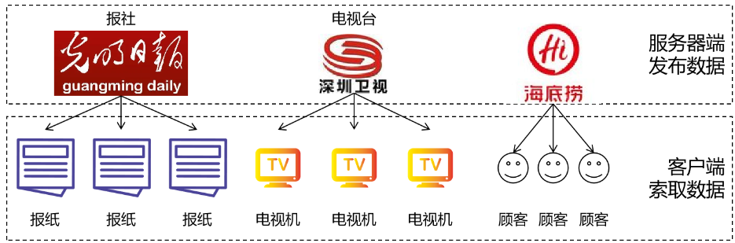
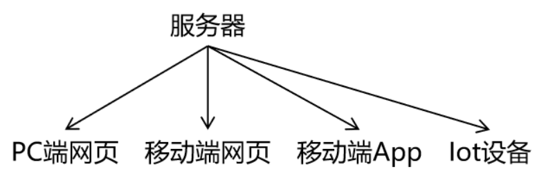
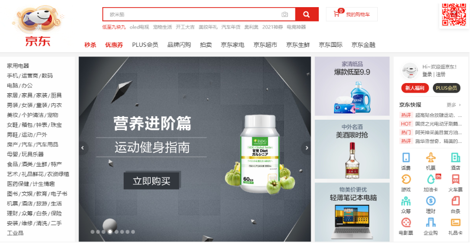
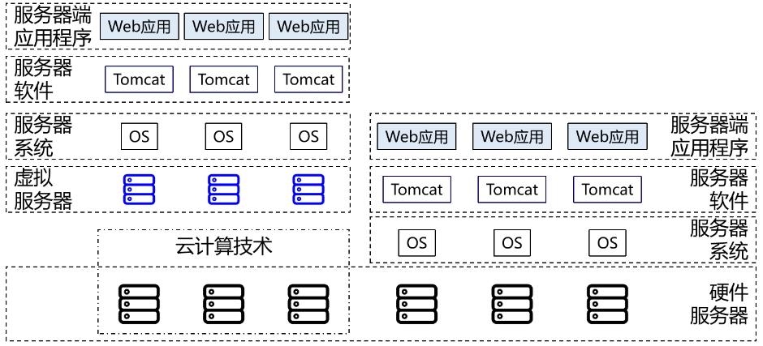
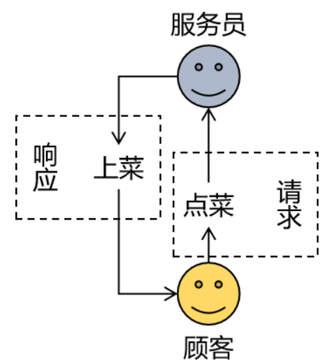
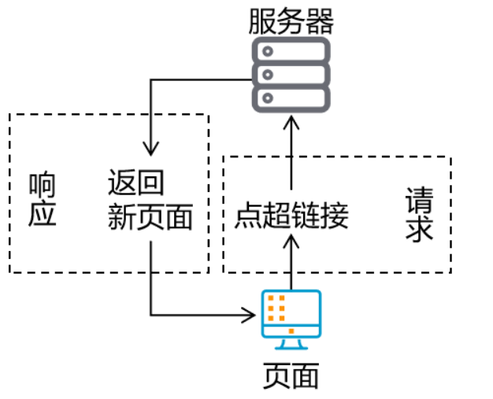
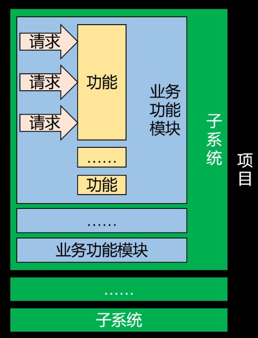
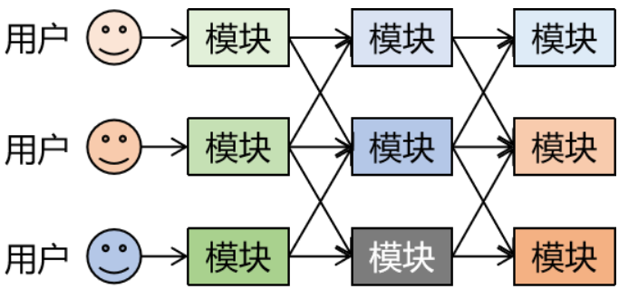
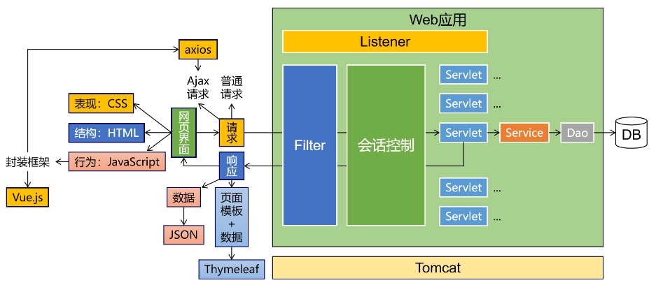
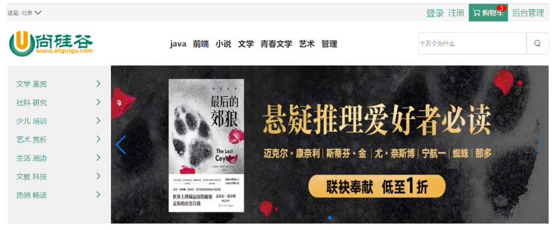

# 第01章_Web开发概述

---

## Web基础概念简介
### 1、服务器与客户端
**①线下的服务器与客户端**

**②线上的服务器与客户端**

**③客户端的各种形式**

1. PC端网页
   

2. 移动端
   

3. Iot设备
   

**④服务器的各种形式**
[点我查看完整内容](https://heavy_code_industry.gitee.io/code_heavy_industry/pro000-dev-story/chapter11/content.html)

### 2、服务器端应用程序
我们要开发的就是服务器端应用程序。

### 3、业务

项目中的功能就是业务。

### 4、请求和响应
**①发生在饭馆的请求和响应**

**②项目中的请求和响应**

### 5、项目的逻辑构成

请求：请求是项目中最基本的逻辑单元，就像万事万物都由原子构成

> 举例：点超链接跳转到注册页面

功能：一个功能包含很多个请求

> 举例：注册用户功能
> 请求1：点超链接跳转到注册页面
> 请求2：发送请求获取短信验证码
> 请求3：检查用户名是否可用
> 请求4：提交表单完成注册

模块：一个模块包含很多功能

> 举例：用户信息管理模块
> 功能1：用户注册功能
> 功能2：用户登录功能
> 功能3：个人中心——账户安全功能
> 功能4：个人中心——账户绑定功能
> 功能5：个人中心——收货地址功能
> 功能6：个人中心——我的银行卡功能

子系统：根据项目规模的不同，子系统这层逻辑概念可能有也可能没有。如果设置了子系统，那么子系统中也必然包含很多模块。其实庞大项目的子系统已经相当于一个项目了，甚至比小型项目整个都大。

> 举例：认证中心子系统
> 模块1：用户信息管理模块
> 模块2：权限管理模块
> 模块3：授权管理模块
> 模块4：权限检查模块

项目：为了解决现实生活中的实际问题开发一个项目，这个项目就是为这个需求提供的一整套解决方案。

> 举例：电商项目
> 子系统1：认证中心子系统
> 子系统2：商品管理子系统
> 子系统3：购物车子系统
> 子系统4：仓储子系统
> 子系统5：物流子系统
> 子系统6：订单子系统

### 6、架构

**①概念**
『架构』其实就是项目的『结构』。只不过『结构』这个词太小了，不适合用来描述项目这么大的东西，所以换了另一个更大的词：架构。所以当我们聊一个项目的架构时，我们聊的是项目是由哪些部分组成的。

**②发展演变历程**

1. 单一架构
   一个项目就是一个工程，这样的结构就是单一架构，也叫all in one。我们现在的JavaWeb阶段、SSM阶段都是学习单一架构开发技术。

2. 分布式架构	
   一个项目中包含很多工程，每个工程作为一个模块。模块之间存在调用关系。分布式架构阶段的技术分为两类：

* Java框架：SpringBoot、SpringCloud、Dubbo等等。
* 中间件：Redis、ElasticSearch、FastDFS、Nginx、Zookeeper、RabbitMQ等等。
  

**③单一架构技术体系**

* 视图：用户的操作界面+数据的动态显示
  * 前端技术：HTML/CSS/JavaScript
  * 服务器端页面模板技术：Thymeleaf
* 控制层：处理请求+跳转页面
  * 服务器：Tomcat
  * 控制器：Servlet
  * 域对象：request、session、servletContext
  * 过滤器：Filter
  * 监听器：Listener
  * 异步交互：Ajax
* 业务逻辑层：业务逻辑计算
* 持久化层：操作数据库
  

### 7、本阶段技术体系

### 8、本阶段案例简介

