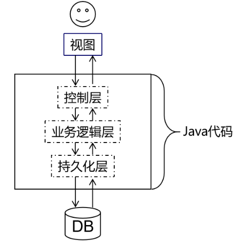
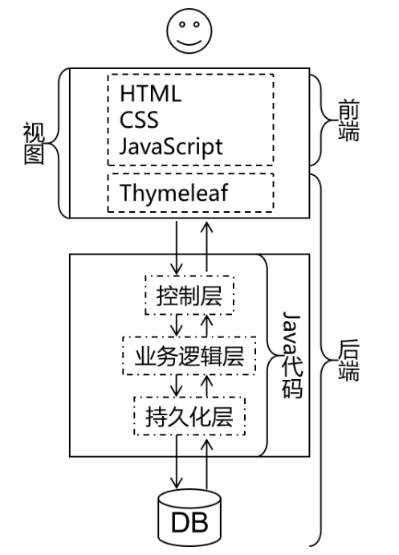

# 第02章_HTML&CSS

---

## 第一节 单一架构回顾

我们从现在的JavaWeb阶段到后面学习SSM框架阶段都是在学习单一架构项目开发的技术。而在JavaWeb阶段由于重点是探讨如何实现Web开发，所以必须学习一部分前端开发的技术。本节就是让大家明确我们现在要学习的内容在整个架构体系中处于什么位置。

### 1、单一架构技术体系



### 2、视图层

严格来说视图分成两层：

- 前端技术：HTML/CSS/JavaScript
- 服务器端页面模板技术：Thymeleaf

其中HTML、CSS、JavaScript都是工作在浏览器上的，所以它们都属于前端技术。而Thymeleaf是在服务器上把动态内容计算出具体数据，所以严格来说Thymeleaf是后端技术。



> 这里大家会有个疑问：为什么在**视图**这个地方已经有HTML、CSS、JavaScript这些前端技术了，能够生成用户可以操作的界面，那为什么还需要Thymeleaf这样一个后端技术呢？
>
> 简单来说原因是Thymeleaf=HTML+动态数据，而HTML不支持动态数据，这部分需要借助Thymeleaf来完成。
>
> 更进一步的细节咱们讲到那再说啦！

### 3、Web2.0

Web2.0是相对于更早的网页开发规范而提出的新规范。Web2.0规范之前的网页开发并没有明确的将HTML、CSS、JavaScript代码分开，而是互相之间纠缠在一起，导致代码维护困难，开发效率很低。

> 在开发中我们把这样彼此纠缠、互相影响的现象称为**耦合**。而把耦合在一起的东西拆解开，让他们彼此独立出来称为**解耦**。各个组成部分独立完成自己负责的功能，和其他模块无关称为『内聚』。
>
> 将来大家经常会听到一句话：软件开发提倡**高内聚，低耦合**。
>
> 一个软件项目只有做到了高内聚、低耦合才能算得上结构严谨，模块化程度高，有利于开发和维护。

所以Web2.0规范主张将网页代码分成下面三个部分：

- 结构：由HTML实现，负责管理网页的内容。将来网页上不管是静态还是动态的数据都是填写到HTML的标签里。
- 表现：由CSS实现，负责管理网页内容的表现形式。比如：颜色、尺寸、位置、层级等等。也就是给数据穿上一身漂亮的衣服。
- 行为：由JavaScript实现，负责实现网页的动态交互效果。比如：轮播图、表单验证、鼠标滑过显示下拉菜单、鼠标滑过改变背景颜色等等。


## 第二节 HTML简介
### 1、名词解释
HTML是**H**yper **T**ext **M**arkup **L**anguage的缩写。意思是**超文本标记语言**。

### 2、超文本
HTML文件本质上是文本文件，而普通的文本文件只能显示字符。但是HTML技术则通过HTML标签把其他网页、图片、音频、视频等各种多媒体资源引入到当前网页中，让网页有了非常丰富的呈现方式，这就是超文本的含义——本身是文本，但是呈现出来的最终效果超越了文本。

### 3、标记语言
说HTML是一种**标记语言**是因为它不是向Java这样的**编程语言**，因为它是由一系列**标签**组成的，没有常量、变量、流程控制、异常处理、IO等等这些功能。HTML很简单，每个标签都有它固定的含义和确定的页面显示效果。

标签是通过一组尖括号+标签名的方式来定义的：

```html
<p>HTML is a very popular fore-end technology.</p>
```


这个例子中使用了一个p标签来定义一个段落，<p>叫**开始标签**，</p>叫**结束标签**。开始标签和结束标签一起构成了一个完整的标签。开始标签和结束标签之间的部分叫**文本标签体**，也简称**标签体**。

有的时候标签里还带有**属性**：

```html
<a href="http://www.xxx.com">show detail</a>
```

href="http://www.xxx.com"就是属性，href是**属性名**，"http://www.xxx.com"是**属性值**。

还有一种标签是**单标签**：

```html
<input type="text" name="username" />
```


### 4、HelloWorld


### 5、HTML文件结构

**①文档类型声明**
HTML文件中第一行的内容，用来告诉浏览器当前HTML文档的基本信息，其中最重要的就是当前HTML文档遵循的语法标准。这里我们只需要知道HTML有4和5这两个大的版本，

HTML4版本的文档类型声明是：

```html
<!DOCTYPE HTML PUBLIC "-//W3C//DTD HTML 4.01 Transitional//EN"
"http://www.w3.org/TR/html4/loose.dtd">
```

HTML5版本的文档类型声明是：

```html
<!DOCTYPE html>
```

现在主流的技术选型都是使用HTML5，之前的版本基本不用了。


历史上HTML的各个版本：

版本名称	年份
HTML	1991
HTML+	1993
HTML2.0	1995
HTML3.2	1997
HTML4.01	1999
XHTML1.0	2000
HTML5	2012
XHTML5	2013

**②根标签**
html标签是整个文档的根标签，所有其他标签都必须放在html标签里面。上面的文档类型不能当做普通标签看待。

> 所谓『根』其实是『树根』的意思。在一个树形结构中，根节点只能有一个。

**③头部**
head标签用于定义文档的头部，其他头部元素都放在head标签里。头部元素包括title标签、script标签、style标签、link标签、meta标签等等。

**④主体**
body标签定义网页的主体内容，在浏览器窗口内显示的内容都定义到body标签内。

**⑤注释**
HTML注释的写法是：

<!-- 注释内容 -->
注释的内容不会显示到浏览器窗口内，是开发人员用来对代码内容进行解释说明。

### 6、HTML语法规则
* 根标签有且只能有一个
* 无论是双标签还是单标签都必须正确关闭
* 标签可以嵌套但不能交叉嵌套
* 注释不能嵌套
* 属性必须有值，值必须加引号，单引号或双引号均可
* 标签名不区分大小写但建议使用小写