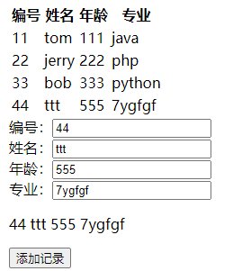

# 第04章_Vue.js

---

## 第一节 Vue.js简介

### 1、框架

任何编程语言在最初的时候都是没有框架的，后来随着在实际开发过程中不断总结**『经验』**，积累**『最佳实践』**，慢慢的人们发现很多**『特定场景』**下的**『特定问题』**总是可以**『套用固定解决方案』**。

于是有人把成熟的**『固定解决方案』**收集起来，整合在一起，就成了**『框架』**。

在使用框架的过程中，我们往往只需要告诉框架**『做什么（声明）』**，而不需要关心框架**『怎么做（编程）』**。

对于Java程序来说，我们使用框架就是导入那些封装了**『固定解决方案』**的jar包，然后通过**『配置文件』**告诉框架做什么，就能够大大简化编码，提高开发效率。我们使用过的junit其实就是一款单元测试框架。

而对于JavaScript程序来说，我们使用框架就是导入那些封装了**『固定解决方案』**的**『js文件』**，然后在框架的基础上编码。

> 用洗衣服来类比框架：
>
> 典型应用场景：洗衣服
>
> 输入数据：衣服、洗衣液、水
>
> 不使用框架：手洗
>
> 使用框架：使用洗衣机，对人来说，只需要按键，具体操作是洗衣机完成的。人只是告诉洗衣机做什么，具体的操作是洗衣机完成的。

实际开发中使用框架时，我们也主要是告诉框架要做什么，具体操作是框架完成的


### 2、Vue.js

Vue (读音 /vjuː/，类似于**view**) 是一套用于构建用户界面的**渐进式框架**。与其它大型框架不同的是，Vue 被设计为可以自底向上逐层应用。Vue 的核心库只关注视图层，不仅易于上手，还便于与第三方库或既有项目整合。另一方面，当与[现代化的工具链 (opens new window)](https://cn.vuejs.org/v2/guide/single-file-components.html)以及各种[支持类库 (opens new window)](https://github.com/vuejs/awesome-vue#libraries--plugins)结合使用时，Vue 也完全能够为复杂的单页应用提供驱动

[Vue.js官网网址](https://cn.vuejs.org/)


## 第二节 准备Vue.js环境

### 1、开发中的最佳实践

『最佳实践』是实际开发中，针对特定问题提炼出来的最好的解决方案。把『最佳实践』抽取出来，封装到各自编程语言的程序包中，就是框架的基础。

- Java语言的程序包：jar包
- JavaScript语言的程序包：外部js文件

对于Java程序来说，框架=jar包+配置文件。对于Vue来说，导入**Vue的外部js文件**就能够使用Vue框架了

### 2、Vue框架的js文件获取

官网提供的下载地址：https://cdn.jsdelivr.net/npm/vue/dist/vue.js

### 3、本地创建vue.js文件

第一步：在HBuilderX中创建工程

第二步：在工程目录下创建script目录用来存放vue.js文件

第三步：创建空vue.js文件


第四步：将官网提供的vue.js文件的内容复制粘贴到本地vue.js文件中

### 4、创建HTML文档并引入vue.js

```html
<!DOCTYPE html>
<html>
	<head>
		<meta charset="utf-8">
		<title></title>
	</head>
	<body>
	</body>
	<script src="/pro03-vue/script/vue.js" type="text/javascript" charset="utf-8"></script>
	<script type="text/javascript">
		
	</script>
</html>
```


## 第三节 Vue.js基本语法：声明式渲染

### 1、概念

#### 1.1 声明式

**『声明式』**是相对于**『编程式』**而言的。

- 声明式：告诉框架做什么，具体操作由框架完成
- 编程式：自己编写代码完成具体操作

#### 1.2 渲染


上图含义解释：

- 蓝色方框：HTML标签
- 红色圆形：动态、尚未确定的数据
- 蓝色圆形：经过程序运算以后，计算得到的具体的，可以直接在页面上显示的数据、
- 渲染：程序计算动态数据得到具体数据的过程

### 2、demo

1. HTML代码

   ```html
   <!-- 使用{{}}格式，指定要被渲染的数据 -->
   <div id="app">{{message}}</div>
   ```

2. vue代码

   ```js
   // 1.创建一个JSON对象，作为new Vue时要使用的参数
   var argumentJson = {
   	
   	// el用于指定Vue对象要关联的HTML元素。el就是element的缩写
   	// 通过id属性值指定HTML元素时，语法格式是：#id
   	"el":"#app",
   	
   	// data属性设置了Vue对象中保存的数据
   	"data":{
   		"message":"Hello Vue!"
   	}
   };
   
   // 2.创建Vue对象，传入上面准备好的参数
   var app = new Vue(argumentJson);
   ```

   


### 3、查看声明式渲染的响应式效果

Vue基本语法：声明式渲染


通过验证Vue对象的『响应式』效果，我们看到Vue对象和页面上的HTML标签确实是始终保持着关联的关系，同时看到Vue在背后确实是做了大量的工作


## 第四节 Vue.js基本语法：绑定元素属性

### 1、基本语法

v-bind:HTML标签的原始属性名

### 2、demo

1. HTML代码

   ```html
   <div id="app">
   	<!-- v-bind:value表示将value属性交给Vue来进行管理，也就是绑定到Vue对象 -->
   	<!-- vueValue是一个用来渲染属性值的表达式，相当于标签体中加{{}}的表达式 -->
   	<input type="text" v-bind:value="vueValue" />
   	
   	<!-- 同样的表达式，在标签体内通过{{}}告诉Vue这里需要渲染； -->
   	<!-- 在HTML标签的属性中，通过v-bind:属性名="表达式"的方式告诉Vue这里要渲染 -->
   	<p>{{vueValue}}</p>
   </div>
   ```

2. Vue代码

   ```js
   // 创建Vue对象，挂载#app这个div标签
   var app = new Vue({
   	"el":"#app",
   	"data":{
   		"vueValue":"太阳当空照"
   	}
   });
   ```

### 3、小结

本质上，v-bind:属性名="表达式"它们都是**用Vue对象来渲染页面**。只不过：

- 文本标签体：使用形式
- 属性：使用v-bind:属性名="表达式"形式


## 第五节 Vue.js基本语法：双向数据绑定

### 1、提出问题


而使用了双向绑定后，就可以实现：页面上数据被修改后，Vue对象中的数据属性也跟着被修改

### 2、demo

1. HTML代码

   ```html
   <div id="app">
   	<!-- v-bind:属性名 效果是从Vue对象渲染到页面 -->
   	<!-- v-model:属性名 效果不仅是从Vue对象渲染到页面，而且能够在页面上数据修改后反向修改Vue对象中的数据属性 -->
   	<input type="text" v-model:value="vueValue" />
   	
   	<p>{{vueValue}}</p>
   </div>
   ```

2. Vue代码

   ```js
   // 创建Vue对象，挂载#app这个div标签
   var app = new Vue({
   	"el":"#app",
   	"data":{
   		"vueValue":"太阳当空照"
   	}
   });
   ```

3. 页面效果

   p标签内的数据能够和文本框中的数据实现同步修改：

   


### 3、去除前后空格

1.   :value可以省略

   ```html
   <input type="text" v-model="vueValue" />
   ```

2.   .trim修饰符

   实际开发中，要考虑到用户在输入数据时，有可能会包含前后空格。而这些前后的空格对我们程序运行来说都是干扰因素，要去掉。在v-model后面加上.trim修饰符即可实现。

   ```html
   <input type="text" v-model.trim="vueValue" />
   ```

   Vue会帮助我们在文本框失去焦点时自动去除前后空格


## 第六节 Vue.js基本语法：条件渲染

根据Vue对象中，数据属性的值来判断是否对HTML页面内容进行渲染

### 1、v-if

1. HTML代码

   ```html
   <div id="app">
   	<h3>if</h3>
   	
   	
   </div>
   ```

2. Vue代码

   ```js
   var app = new Vue({
       "el":"#app",
       "data":{
           "flag":true
       }
   });
   ```

### 2、v-if  和  v-else

1. HTML代码

   ```html
   <div id="app02">
   	<h3>if/else</h3>
   	
   	
   </div>
   ```

2. Vue代码

   ```js
   var app02 = new Vue({
       "el":"#app02",
       "data":{
           "flag":true
       }
   });
   ```

### 3、v-show

1. HTML代码

   ```html
   <div id="app03">
   	<h3>v-show</h3>
   	
   </div>
   ```

2. Vue代码

   ```js
   var app03 = new Vue({
       "el":"#app03",
       "data":{
           "flag":true
       }
   });
   ```

   v-if：当条件为false时，包含v-if指令的元素，根本就不会存在dom中。当改为true时，会重新创建一个。

   v-show：当条件为false时，v-show只是给我们的元素添加了一个行内样式：display：none


## 第七节 Vue.js基本语法：列表渲染

### 1、迭代一个简单的数组

1. HTML代码

   ```html
   <div id="app01">
   	<ul>
   		<!-- 使用v-for语法遍历数组 -->
   		<!-- v-for的值是语法格式是：引用数组元素的变量名 in Vue对象中的数组属性名 -->
   		<!-- 在文本标签体中使用{{引用数组元素的变量名}}渲染每一个数组元素 -->
   		<li v-for="fruit in fruitList">{{fruit}}</li>
   	</ul>
   </div>
   ```

2. Vue代码

   ```js
   var app01 = new Vue({
   	"el":"#app01",
   	"data":{
   		"fruitList": [
   			"apple",
   			"banana",
   			"orange",
   			"grape",
   			"dragonfruit"
   		]
   	}
   });
   ```

### 2、迭代一个对象数组

1. HTML代码

   ```html
   <div id="app">
   	<table>
   		<tr>
   			<th>编号</th>
   			<th>姓名</th>
   			<th>年龄</th>
   			<th>专业</th>
   		</tr>
   		<tr v-for="employee in employeeList">
   			<td>{{employee.empId}}</td>
   			<td>{{employee.empName}}</td>
   			<td>{{employee.empAge}}</td>
   			<td>{{employee.empSubject}}</td>
   		</tr>
   	</table>
   </div>
   ```

2. Vue代码

   ```js
   var app = new Vue({
       "el":"#app",
       "data":{
           "employeeList":[
               {
                   "empId":11,
                   "empName":"tom",
                   "empAge":111,
                   "empSubject":"java"
               },
               {
                   "empId":22,
                   "empName":"jerry",
                   "empAge":222,
                   "empSubject":"php"
               },
               {
                   "empId":33,
                   "empName":"bob",
                   "empAge":333,
                   "empSubject":"python"
               }
           ]
       }
   });
   ```

   

## 第八节 Vue.js基本语法：事件驱动

### 1、demo:字符串顺序反转

1. HTML代码

   ```html
   <div id="app">
   	<p>{{message}}</p>
   	
   	<!-- v-on:事件类型="事件响应函数的函数名" -->
   	<button v-on:click="reverseMessage">Click me,reverse message</button>
   </div>
   ```

2. Vue代码

   ```js
   var app = new Vue({
   	"el":"#app",
   	"data":{
   		"message":"Hello Vue!"				
   	},
   	"methods":{
   		"reverseMessage":function(){
   			this.message = this.message.split(" ").reverse().join(" ");
   		}
   	}
   });
   ```

### 2、demo:获取鼠标移动时的坐标信息

1. HTML代码

   ```html
   <div id="app">
   	<div id="area" v-on:mousemove="recordPosition"></div>
   	<p id="showPosition">{{position}}</p>
   </div>
   ```

2. Vue代码

   ```js
   var app = new Vue({
   	"el":"#app",
   	"data":{
   		"position":"暂时没有获取到鼠标的位置信息"
   	},
   	"methods":{
   		"recordPosition":function(event){
   			this.position = event.clientX + " " + event.clientY;
   		}
   	}
   });
   ```

   

## 第九节 Vue.js基本语法：侦听属性

### 1、提出需求

```html
<div id="app">
	<p>尊姓：{{firstName}}</p>
	<p>大名：{{lastName}}</p>
	尊姓：<input type="text" v-model="firstName" /><br/>
	大名：<input type="text" v-model="lastName" /><br/>
	<p>全名：{{fullName}}</p>
</div>
```

在上面代码的基础上，我们希望firstName或lastName属性发生变化时，修改fullName属性。此时需要对firstName或lastName属性进行**『侦听』**。

具体来说，所谓**『侦听』**就是对message属性进行监控，当firstName或lastName属性的值发生变化时，调用我们准备好的函数。

### 2、Vue代码

在watch属性中声明对firstName和lastName属性进行**『侦听』**的函数

```js
var app = new Vue({
	"el":"#app",
	"data":{
		"firstName":"jim",
		"lastName":"green",
		"fullName":"jim green"
	},
	"watch":{
		"firstName":function(inputValue){
			this.fullName = inputValue + " " + this.lastName;
		},
		"lastName":function(inputValue){
			this.fullName = this.firstName + " " + inputValue;
		}
	}
});
```


## 第十节 Vue.js基本语法：简化写法

### 1、v-bind的简化写法

正常写法：

```html
<input type="text" v-bind:value="message" />
```

简化以后：

```html
<input type="text" :value="message" />
```


### 2、v-on的简化写法

正常写法：

```html
<button v-on:click="sayHello">SayHello</button>
```

简化以后：

```html
<button @click="sayHello">SayHello</button>
```


## 第十一节 练习

### 1、功能效果演示



### 2、任务拆解

- 第一步：显示表格
- 第二步：显示四个文本框
- 第三步：创建一个p标签用来显示用户在文本框中实时输入的内容
- 第四步：点击添加记录按钮实现记录的添加


### 3、第一步：显示表格

1. HTML标签

   ```html
   <table id="appTable">
   	<tr>
   		<th>编号</th>
   		<th>姓名</th>
   		<th>年龄</th>
   		<th>专业</th>
   	</tr>
   	<tr v-for="employee in employeeList">
   		<td>{{employee.empId}}</td>
   		<td>{{employee.empName}}</td>
   		<td>{{employee.empAge}}</td>
   		<td>{{employee.empSubject}}</td>
   	</tr>
   </table>
   ```

2. Vue代码

   ```js
   var appTable = new Vue({
   	"el": "#appTable",
   	"data": {
   		"employeeList": [{
   				"empId": 1,
   				"empName": "tom",
   				"empAge": 11,
   				"empSubject": "java"
   			},
   			{
   				"empId": 2,
   				"empName": "jerry",
   				"empAge": 22,
   				"empSubject": "php"
   			},
   			{
   				"empId": 3,
   				"empName": "peter",
   				"empAge": 33,
   				"empSubject": "python"
   			}
   		]
   	}
   });
   ```


### 4、第二步：显示四个文本框

1. HTML标签

   ```html
   <!-- 四个文本框、显示收集到的文本框数据的p标签、按钮这三个部分需要共享数据，所以要放在同一个app中 -->
   <div id="appDiv">
   	
   	<!-- 第一部分：四个文本框 -->
   	编号：<input type="text" v-model="empId" /><br/>
   	姓名：<input type="text" v-model="empName" /><br/>
   	年龄：<input type="text" v-model="empAge" /><br/>
   	专业：<input type="text" v-model="empSubject" /><br/>
   	
   	<!-- 第二部分：显示收集到的文本框数据的p标签 -->
   	<!-- 第三部分：按钮 -->
   </div>
   ```

2. Vue代码

   ```js
   var appDiv = new Vue({
   	"el":"#appDiv",
   	"data":{
   		// 初始值设置空字符串即可
   		"empId":"",
   		"empName":"",
   		"empAge":"",
   		"empSubject":""
   	}
   });
   ```

   测试是否正确的方式是：在控制台尝试修改Vue对象的数据属性值：

   


### 5、第三步：创建一个p标签

```html
<!-- 四个文本框、显示收集到的文本框数据的p标签、按钮这三个部分需要共享数据，所以要放在同一个app中 -->
<div id="appDiv">
	
	<!-- 第一部分：四个文本框 -->
	编号：<input type="text" v-model="empId" placeholder="请输入编号" /><br/>
	姓名：<input type="text" v-model="empName" placeholder="请输入姓名" /><br/>
	年龄：<input type="text" v-model="empAge" placeholder="请输入年龄" /><br/>
	专业：<input type="text" v-model="empSubject" placeholder="请输入专业" /><br/>
	
	<!-- 第二部分：显示收集到的文本框数据的p标签 -->
	<p>{{empId}} {{empName}} {{empAge}} {{empSubject}}</p>
	
	<!-- 第三部分：按钮 -->
	
</div>
```


### 6、第四步：点击添加记录按钮

1. 第一小步：给按钮设置事件驱动

   * HTML标签

     ```html
     <!-- 四个文本框、显示收集到的文本框数据的p标签、按钮这三个部分需要共享数据，所以要放在同一个app中 -->
     <div id="appDiv">
     	
     	<!-- 第一部分：四个文本框 -->
     	编号：<input type="text" v-model="empId" placeholder="请输入编号" /><br/>
     	姓名：<input type="text" v-model="empName" placeholder="请输入姓名" /><br/>
     	年龄：<input type="text" v-model="empAge" placeholder="请输入年龄" /><br/>
     	专业：<input type="text" v-model="empSubject" placeholder="请输入专业" /><br/>
     	
     	<!-- 第二部分：显示收集到的文本框数据的p标签 -->
     	<p>{{empId}} {{empName}} {{empAge}} {{empSubject}}</p>
     	
     	<!-- 第三部分：按钮 -->
     	<button type="button" v-on:click="addRecord">添加记录</button>
     	
     </div>
     ```

   * Vue代码

     ```js
     var appDiv = new Vue({
     	"el":"#appDiv",
     	"data":{
     		// 初始值设置空字符串即可
     		"empId":"",
     		"empName":"",
     		"empAge":"",
     		"empSubject":""
     	},
     	"methods":{
     		"addRecord":function(){
     			console.log("我点击了那个按钮……");
     		}
     	}
     });
     ```

     

2. 第二小步：打印一下文本框输入的数据

   ```js
   var appDiv = new Vue({
   	"el":"#appDiv",
   	"data":{
   		// 初始值设置空字符串即可
   		"empId":"",
   		"empName":"",
   		"empAge":"",
   		"empSubject":""
   	},
   	"methods":{
   		"addRecord":function(){
   			console.log("我点击了那个按钮……");
   			console.log(this.empId);
   			console.log(this.empName);
   			console.log(this.empAge);
   			console.log(this.empSubject);
   		}
   	}
   });
   ```

   

3. 第三小步：将收集到的数据添加到表格中

   ```js
   "addRecord":function(){
   	
   	// 确认单击事件是否绑定成功
   	console.log("我点击了那个按钮……");
   	
   	// 确认是否能够正确收集到文本框数据
   	console.log(this.empId);
   	console.log(this.empName);
   	console.log(this.empAge);
   	console.log(this.empSubject);
   	
   	// 将收集到的文本框数据封装为一个对象
   	var employee = {
   		"empId":this.empId,
   		"empName":this.empName,
   		"empAge":this.empAge,
   		"empSubject":this.empSubject
   	};
   	
   	// 将上面的对象压入表格数据的employeeList数组
   	appTable.employeeList.push(employee);
   }
   ```

   


## 第十二节 Vue对象生命周期

### 1、概念

在我们各种语言的编程领域中，**『生命周期』**都是一个非常常见的概念。一个对象从创建、初始化、工作再到释放、清理和销毁，会经历很多环节的演变。比如我们在JavaSE阶段学习过线程的生命周期，今天学习Vue对象的生命周期，将来还要学习Servlet、Filter等Web组件的生命周期

### 2、Vue对象的生命周期


### 3、生命周期钩子函数

Vue允许我们在特定的生命周期环节中通过钩子函数来加入我们的代码

```html
<div id="app">
	<p id="content">{{message}}</p>
	<button @click="changeValue">点我</button>
</div>
```

```js
new Vue({
	"el":"#app",
	"data":{
		"message":"hello"
	},
	"methods":{
		"changeValue":function(){
			this.message = "new hello";
		}
	},
	
	// 1.实例创建之前
	"beforeCreate":function(){
		console.log("beforeCreate:"+this.message);
	},
	
	// 2.实例创建完成
	"created":function(){
		console.log("created:"+this.message);
	},
	
	// 3.数据挂载前
	"beforeMount":function(){
		console.log("beforeMount:"+document.getElementById("content").innerText);
	},
	
	// 4.数据已经挂载
	"mounted":function(){
		console.log("mounted:"+document.getElementById("content").innerText);
	},
	
	// 5.数据更新前
	"beforeUpdate":function(){
        console.log("beforeUpdate:"+document.getElementById("content").innerText);
	},
	
	// 6.数据更新之后
	"updated":function(){
		console.log("updated:"+document.getElementById("content").innerText);
	}
});
```

