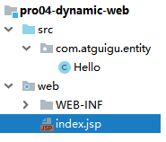
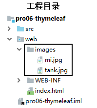

# 第五章_Tomcat

---

## 第一节 配置文件

### 1、配置

1. 设置

   所谓设置其实就是通过修改一个一个的**参数**，告诉**应用软件**它该**怎么工作**

2. 配置

   本质上配置和设置是一样的，只是对象和形式不同：

   |      | 配置                       | 设置               |
   | ---- | -------------------------- | ------------------ |
   | 对象 | 开发中使用的应用程序或框架 | 应用软件           |
   | 形式 | 特定格式的配置文件         | 应用软件的友好界面 |

### 2、配置文件

#### 2.1 XML

```xml
<?xml version="1.0" encoding="UTF-8"?>
<web-app xmlns="http://xmlns.jcp.org/xml/ns/javaee"
         xmlns:xsi="http://www.w3.org/2001/XMLSchema-instance"
         xsi:schemaLocation="http://xmlns.jcp.org/xml/ns/javaee http://xmlns.jcp.org/xml/ns/javaee/web-app_4_0.xsd"
         version="4.0">

    <!-- 配置SpringMVC前端控制器 -->
    <servlet>
        <servlet-name>dispatcherServlet</servlet-name>
        <servlet-class>org.springframework.web.servlet.DispatcherServlet</servlet-class>

        <!-- 在初始化参数中指定SpringMVC配置文件位置 -->
        <init-param>
            <param-name>contextConfigLocation</param-name>
            <param-value>classpath:spring-mvc.xml</param-value>
        </init-param>

        <!-- 设置当前Servlet创建对象的时机是在Web应用启动时 -->
        <load-on-startup>1</load-on-startup>

    </servlet>
    <servlet-mapping>
        <servlet-name>dispatcherServlet</servlet-name>

        <!-- url-pattern配置斜杠表示匹配所有请求 -->
        <!-- 两种可选的配置方式：
                1、斜杠开头：/
                2、包含星号：*.atguigu
             不允许的配置方式：前面有斜杠，中间有星号
                /*.app
         -->
        <url-pattern>/</url-pattern>
    </servlet-mapping>
</web-app>
```

1. 名词解释

   XML是e**X**tensible **M**arkup **L**anguage的缩写，翻译过来就是**可扩展标记语言**。所以很明显，XML和HTML一样都是标记语言，也就是说它们的基本语法都是标签

2. 可扩展

   **可扩展**三个字**表面上**的意思是XML允许**自定义格式**。但是这**不代表**你**可以随便写**


在XML基本语法规范的基础上，你使用的那些第三方应用程序、框架会通过设计**『XML约束』**的方式**『强制规定』**配置文件中可以写什么和怎么写，规定之外的都不可以写。

XML基本语法这个知识点的定位是：我们不需要从零开始，从头到尾的一行一行编写XML文档，而是在第三方应用程序、框架**已提供的配置文件**的基础上**修改**。要改成什么样取决于你的需求，而怎么改取决于**XML基本语法**和**具体的XML约束**

3. XML基本语法

   * XML声明

   ```xml
   <?xml version="1.0" encoding="UTF-8"?>
   ```

   * 根标签

     根标签有且只能有一个

   * 标签关闭

     * 双标签：开始标签和结束标签必须成对出现
     * 单标签：单标签在标签内关闭

   * 标签嵌套

     * 可以嵌套，但是不能交叉标签

   * 注释不能嵌套

   * 标签名、属性名建议使用小写字母

   * 属性

     * 属性必须有值
     * 属性值必须加引号，单双都行

   看到这里大家一定会发现XML的基本语法和HTML的基本语法简直如出一辙。其实这不是偶然的，XML基本语法+HTML约束=HTML语法。在逻辑上HTML确实是XML的子集

4. XML约束

   将来我们主要就是根据XML约束中的规定来编写XML配置文件。而XML约束主要包括DTD和Schema两种。如果XML配置文件使用的是DTD，那么对我们几乎没有影响。如果是Schema约束，需要我们稍微参与一点点。

   * DTD

     将来在IDEA中有代码提示的协助，在DTD文档的约束下进行配置非常简单

     ```xml
     <!ENTITY % fontstyle
      "TT | I | B | U | S | STRIKE | BIG | SMALL">
     
     <!ENTITY % phrase "EM | STRONG | DFN | CODE |
                        SAMP | KBD | VAR | CITE | ABBR | ACRONYM" >
     
     <!ENTITY % special
        "A | IMG | APPLET | OBJECT | FONT | BASEFONT | BR | SCRIPT |
         MAP | Q | SUB | SUP | SPAN | BDO | IFRAME">
     
     <!ENTITY % formctrl "INPUT | SELECT | TEXTAREA | LABEL | BUTTON">
     
     <!-- %inline; covers inline or "text-level" elements -->
     <!ENTITY % inline "#PCDATA | %fontstyle; | %phrase; | %special; | %formctrl;">
     
     <!ELEMENT (%fontstyle;|%phrase;) - - (%inline;)*>
     <!ATTLIST (%fontstyle;|%phrase;)
       %attrs;                              -- %coreattrs, %i18n, %events --
       >
     ```

   * Schema

     我们将来使用SSM框架中的Spring、SpringMVC框架时，会涉及到一点点对Schema约束的设置。不过不必紧张，有IDEA的支持操作会非常简单，我们现在只需要理解基本概念即可

     首先我们要理解一个概念：**『名称空间』**，英文：name space

     

     Schema约束要求我们一个XML文档中，所有标签，所有属性都必须在约束中有明确的定义。

     下面我们以web.xml的约束声明为例来做个说明：

     ```xml
     <web-app xmlns="http://xmlns.jcp.org/xml/ns/javaee"
              xmlns:xsi="http://www.w3.org/2001/XMLSchema-instance"
              xsi:schemaLocation="http://xmlns.jcp.org/xml/ns/javaee http://xmlns.jcp.org/xml/ns/javaee/web-app_4_0.xsd"
              version="4.0">
     ```

     | 属性名             | 作用                                                         |
     | ------------------ | ------------------------------------------------------------ |
     | xmlns              | 指出当前XML文档约束规则的名称空间在哪里 我们就是通过这个属性来引用一个具体的名称空间 |
     | xmlns:xsi          | 指出xmlns这个属性是在哪个约束文档中被定义的                  |
     | xsi:schemaLocation | 语法格式：在xsi名称空间下引用schemaLocation属性 配置含义：指定当前XML文档中所用到的约束文档本身的文件的地址 |

     xmlns和xsi:schemaLocation对应关系如下图：

     

     引入多个名称空间的例子如下：

     ```xml
     <?xml version="1.0" encoding="UTF-8"?>
     <beans xmlns="http://www.springframework.org/schema/beans"
     	xmlns:xsi="http://www.w3.org/2001/XMLSchema-instance"
     	xmlns:context="http://www.springframework.org/schema/context"
     	xmlns:mvc="http://www.springframework.org/schema/mvc"
     	xsi:schemaLocation="http://www.springframework.org/schema/mvc http://www.springframework.org/schema/mvc/spring-mvc-4.0.xsd
     		http://www.springframework.org/schema/beans http://www.springframework.org/schema/beans/spring-beans.xsd
     		http://www.springframework.org/schema/context http://www.springframework.org/schema/context/spring-context-4.0.xsd">
     
     	<context:component-scan base-package="com.atguigu.crud.component"/>
     	
     	<bean id="viewResolver" class="org.springframework.web.servlet.view.InternalResourceViewResolver">
     		<property name="prefix" value="/WEB-INF/pages/"/>
     		<property name="suffix" value=".jsp"/>
     	</bean>
     	
     	<mvc:default-servlet-handler/>
     	<mvc:annotation-driven/>
     </beans>
     ```

     

     看到这么复杂，这么长的名称空间字符串，我们会觉得很担心，根本记不住。但是其实不需要记，在IDEA中编写配置文件时，IDEA会协助我们导入，会有提示。我们**理解各个部分的含义能够调整**即可


#### 2.2 属性文件

以properties作为扩展名的文件

```properties
atguigu.jdbc.url=jdbc:mysql://192.168.198.100:3306/mybatis1026
atguigu.jdbc.driver=com.mysql.jdbc.Driver
atguigu.jdbc.username=root
atguigu.jdbc.password=atguigu
```

* 由键值对组成
* 键和值之间的符号是等号
* 每一行都必须顶格写，前面不能有空格之类的其他符号


#### 2.3 其他形式

YAML语言的配置文件：在SpringBoot中使用

```yaml
spring:
  profiles:
    active: fc
  datasource:
    name: mydb
    type: com.alibaba.druid.pool.DruidDataSource
    url: jdbc:mysql://192.168.41.100:3306/spring_boot?serverTimezone=UTC
    username: root
    password: atguigu
    driver-class-name: com.mysql.cj.jdbc.Driver
mybatis:
  mapper-locations: classpath*:/mybatis-mapper/*Mapper.xml
logging:
  level:
    com.atguigu.function.compute.mapper: debug
```

JSON格式的配置文件：一般是前端使用


## 第二节 Tomcat的部署和启动

### 1、Tomcat扮演的角色


### 2、部署

1. 前提

   Tomcat本身是一个Java程序，所以当前系统中必须正确配置了JAVA_HOME环境变量。我们可以通过下面的命令检测：

   > C:\Users\Administrator>**java -version** java version "1.8.0_141" Java(TM) SE Runtime Environment (build 1.8.0_141-b15) Java HotSpot(TM) 64-Bit Server VM (build 25.141-b15, mixed mode)
   >
   > C:\Users\Administrator>**echo %JAVA_HOME%** D:\software\Java
   >
   > C:\Users\Administrator>**echo %PATH%** D:\software\xftp;C:\WINDOWS\system32;C:\WINDOWS;C:\WINDOWS\System32\Wbem;C:\WINDOWS\System32\WindowsPowerShell\v1.0;D:\software\Java\bin;D:\software\apache-maven-3.5.4\bin;C:\Users\Administrator\AppData\Local\Microsoft\WindowsApps;

   ### 

2. 解压

   将Tomcat压缩包解压到一个**非中文无空格**的目录下

   

3. Tomcat目录结构

   

4. 启动Tomcat并访问首页

   启动Tomcat：运行Tomcat解压后根目录下\bin\startup.bat即可，例如：

   > D:\software\apache-tomcat-7.0.79\bin\startup.bat

   

   如果要停止Tomcat，则运行shutdown.bat程序，例如

   > D:\software\apache-tomcat-7.0.79\bin\shutdown.bat

   小提示：将来我们在IDEA中启动Tomcat，如果IDEA卡死强关，Tomcat不会正常退出。下次再启动Tomcat会因为残留进程仍然占用8080端口，导致新的进程无法启动。此时可以使用shutdown.bat结束残留进程

5. 部署一个war包并启动Tomcat

   

6. 访问刚才部署的Web应用

   

7. 关于Tomcat端口号

   

   配置文件节选：

   ```xml
   ……
   <!-- 第22行 -->
   <Server port="8005" shutdown="SHUTDOWN">
   ……
   <!-- 第71行 -->
   <Connector port="8080" protocol="HTTP/1.1"
   		   connectionTimeout="20000"
   		   redirectPort="8443" />
   ……
   <!-- 第93行 -->
   <Connector port="8009" protocol="AJP/1.3" redirectPort="8443" />
   ```

   三个位置共定义了3个端口号，Tomcat启动后，这个三个端口号都会被占用


## 第三节 在IDEA中关联Tomcat


## 第四节 创建动态Web工程并部署运行

### 1、第一步

创建empty project

### 2、第二步

以下操作基于IDEA2018.3


创建动态Web工程：


创建好的工程如下所示：


**注意**：src目录应该是蓝色的，web目录的图标上有个蓝色的圆点


### 3、动态Web工程目录结构介绍

| 目录或文件名            | 功能                                                         |
| ----------------------- | ------------------------------------------------------------ |
| src目录                 | 存放Java源文件                                               |
| web目录                 | 存放Web开发相关资源                                          |
| web/WEB-INF目录         | 存放web.xml文件、classes目录、lib目录                        |
| web/WEB-INF/web.xml文件 | 别名：部署描述符deployment descriptor 作用：Web工程的核心配置文件 |
| web/WEB-INF/classes目录 | 存放编译得到的*.class字节码文件                              |
| web/WEB-INF/lib目录     | 存放第三方jar包                                              |


### 4、创建用来部署Web工程的Tomcat实例


通常我们会觉得现在这个Application context太长了，改简短一些会更方便。


创建好的效果如下：


### 5、编写简单的测试代码

1. Java代码

   

   ```java
   public class Hello {
       public String getMessage() {
           return "年少不知软饭香";
       }
   }
   ```

2. JSP代码

   

   ```jsp
   <%=new Hello().getMessage() %>
   ```

3. 启动专门为这个工程创建的Tomcat实例

   

4. 错误提示

   

   提示信息的含义：未指定编译结果的保存目录。

   错误原因：

   - 父工程只是一个empty project
   - 当前模块继承父工程的编译输出路径

   为了解决这个问题我们可以在父工程中设置输出路径：

   

   

   

   


### 6、IDEA运行程序时界面布局


## 第五节 在IDEA中重新部署运行

### 1、为什么需要重新部署

对于已经运行过的Web项目，如果我们增加了目录和文件，那么部署目录可能不会自动同步过来，从而造成实际运行的效果和我们期望的不同

如下图中，我们在工程目录已经新增了./images目录和两个图片：



但是在部署目录并没有出现，哪怕我们执行了重新部署也没有起作用


### 2、如何重新部署？

1. 清理部署目录

   

   

2. 构建

   

3. 效果

   


## 第六节 导入别人的web module

如果你想把老师发给你的module导入自己的project中运行起来，可以参考下面的操作：

> 做下面操作前，需要把要导入的module复制到project目录下。


