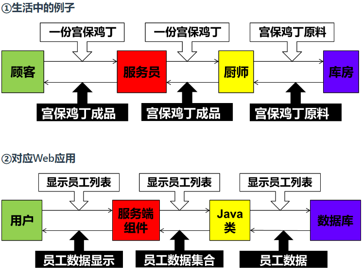
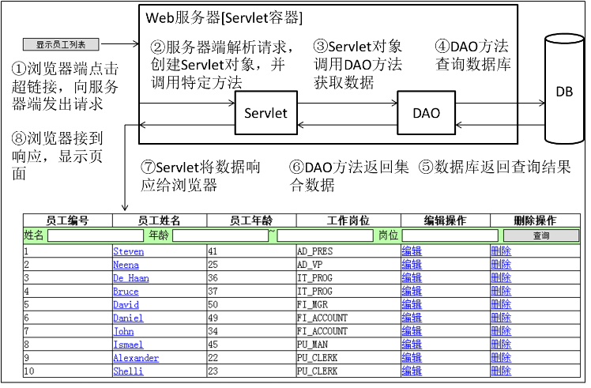
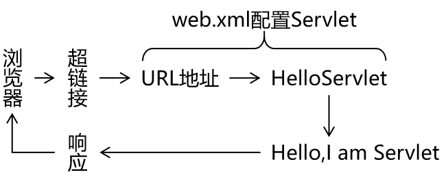
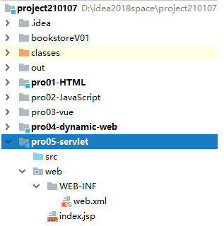
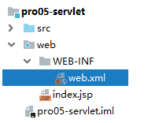
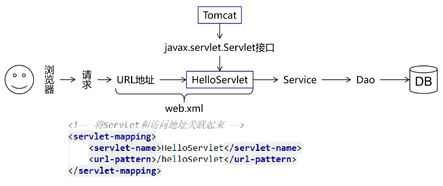

# 第07章_Servlet

---

## 第一节 Servlet概述

### 1、Servlet名字

Servlet=Server+applet

Server：服务器

applet：小程序

Servlet含义是服务器端的小程序

### 2、Servlet在整个Web应用中起到的作用



具体细节：




## 第二节 Servlet HelloWorld

### 1、HelloWorld分析

1. 目标

   在页面上点击超链接，由Servlet处理这个请求，并返回一个响应字符串：Hello,I am Servlet

2. 思路

   

### 2、具体操作

#### 2.1 创建动态Web module



#### 2.2 创建超链接

```html
<!-- /Web应用地址/Servlet地址 -->
<a href="/app/helloServlet">Servlet Hello World</a>
```

#### 2.3 创建HelloServlet的Java类

```java
public class HelloServlet implements Servlet {
    @Override
    public void init(ServletConfig servletConfig) throws ServletException {

    }

    @Override
    public ServletConfig getServletConfig() {
        return null;
    }

    @Override
    public void service(ServletRequest servletRequest, ServletResponse servletResponse) throws ServletException, IOException {

        // 控制台打印，证明这个方法被调用了
        System.out.println("我是HelloServlet，我执行了！");

        // 返回响应字符串
        // 1、获取能够返回响应数据的字符流对象
        PrintWriter writer = servletResponse.getWriter();

        // 2、向字符流对象写入数据
        writer.write("Hello,I am Servlet");
    }

    @Override
    public String getServletInfo() {
        return null;
    }

    @Override
    public void destroy() {

    }
}
```

#### 2.4 配置HelloServlet

配置文件位置：WEB-INF/web.xml



```xml
<!-- 配置Servlet本身 -->
<servlet>
    <!-- 全类名太长，给Servlet设置一个简短名称 -->
    <servlet-name>HelloServlet</servlet-name>

    <!-- 配置Servlet的全类名 -->
    <servlet-class>com.atguigu.servlet.HelloServlet</servlet-class>
</servlet>

<!-- 将Servlet和访问地址关联起来 -->
<servlet-mapping>
    <servlet-name>HelloServlet</servlet-name>
    <url-pattern>/helloServlet</url-pattern>
</servlet-mapping>
```

**『虚拟路径』**：Servlet并**不是**文件系统中**实际存在**的**目录或文件**，所以为了方便浏览器访问，我们创建了**虚拟**出来的路径来访问它

#### 2.5 小结

需求：在浏览器上点击超链接能够访问Java程序

