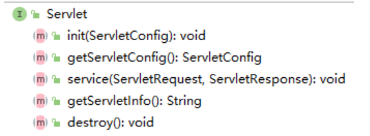
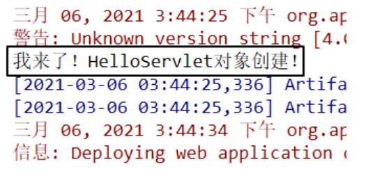
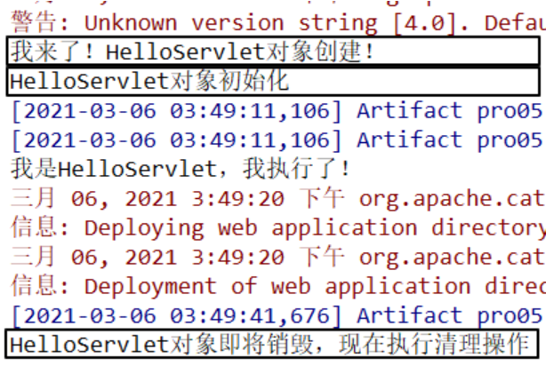
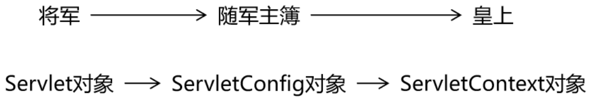
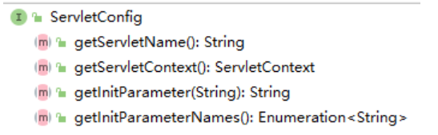

# 第07章_Servlet

---

## 第一节 Servlet概述

### 1、Servlet名字

Servlet=Server+applet

Server：服务器

applet：小程序

Servlet含义是服务器端的小程序

### 2、Servlet在整个Web应用中起到的作用


具体细节：


## 第二节 Servlet HelloWorld

### 1、HelloWorld分析

1. 目标

   在页面上点击超链接，由Servlet处理这个请求，并返回一个响应字符串：Hello,I am Servlet

2. 思路

   

### 2、具体操作

#### 2.1 创建动态Web module


#### 2.2 创建超链接

```html
<!-- /Web应用地址/Servlet地址 -->
<a href="/app/helloServlet">Servlet Hello World</a>
```

#### 2.3 创建HelloServlet的Java类

```java
public class HelloServlet implements Servlet {
    @Override
    public void init(ServletConfig servletConfig) throws ServletException {

    }

    @Override
    public ServletConfig getServletConfig() {
        return null;
    }

    @Override
    public void service(ServletRequest servletRequest, ServletResponse servletResponse) throws ServletException, IOException {

        // 控制台打印，证明这个方法被调用了
        System.out.println("我是HelloServlet，我执行了！");

        // 返回响应字符串
        // 1、获取能够返回响应数据的字符流对象
        PrintWriter writer = servletResponse.getWriter();

        // 2、向字符流对象写入数据
        writer.write("Hello,I am Servlet");
    }

    @Override
    public String getServletInfo() {
        return null;
    }

    @Override
    public void destroy() {

    }
}
```

#### 2.4 配置HelloServlet

配置文件位置：WEB-INF/web.xml


```xml
<!-- 配置Servlet本身 -->
<servlet>
    <!-- 全类名太长，给Servlet设置一个简短名称 -->
    <servlet-name>HelloServlet</servlet-name>

    <!-- 配置Servlet的全类名 -->
    <servlet-class>com.atguigu.servlet.HelloServlet</servlet-class>
</servlet>

<!-- 将Servlet和访问地址关联起来 -->
<servlet-mapping>
    <servlet-name>HelloServlet</servlet-name>
    <url-pattern>/helloServlet</url-pattern>
</servlet-mapping>
```

**『虚拟路径』**：Servlet并**不是**文件系统中**实际存在**的**目录或文件**，所以为了方便浏览器访问，我们创建了**虚拟**出来的路径来访问它

#### 2.5 小结

需求：在浏览器上点击超链接能够访问Java程序


## 第三节 Servlet生命周期

### 1、从Servlet接口说起



### 2、Servlet创建对象的时机

#### 2.1 验证方式

在HelloServlet的构造器中执行控制台打印

```java
public HelloServlet(){
    System.out.println("我来了！HelloServlet对象创建！");
}
```

#### 2.2 打印结果

> 我来了！HelloServlet对象创建！ 
> 我是HelloServlet，我执行了！ 
> 我是HelloServlet，我执行了！ 
> 我是HelloServlet，我执行了！ 
> 我是HelloServlet，我执行了！ 

#### 2.3 结论

- 默认情况下：Servlet在**第一次接收到请求**的时候才创建对象
- 创建对象后，所有的URL地址匹配的请求都由这同一个对象来处理
- Tomcat中，每一个请求会被分配一个线程来处理，所以可以说：Servlet是**单实例，多线程**方式运行的。
- 既然Servlet是多线程方式运行，所以有线程安全方面的可能性，所以不能在处理请求的方法中修改公共属性。

#### 2.4 修改Servlet创建对象的时机

```xml
<!-- 配置Servlet本身 -->
<servlet>
    <!-- 全类名太长，给Servlet设置一个简短名称 -->
    <servlet-name>HelloServlet</servlet-name>

    <!-- 配置Servlet的全类名 -->
    <servlet-class>com.atguigu.servlet.HelloServlet</servlet-class>

    <!-- 配置Servlet启动顺序 -->
    <load-on-startup>1</load-on-startup>
</servlet>
```

效果：Web应用启动的时候创建Servlet对象



友情提示：将来配置SpringMVC的时候会看到这样的配置


### 3、其他环节




### 4、Servlet容器

#### 4.1 容器

在开发使用的各种技术中，经常会有很多对象会放在容器中

#### 4.2 容器提供的功能

容器会管理内部对象的整个生命周期。对象在容器中才能够正常的工作，得到来自容器的全方位的支持。

- 创建对象
- 初始化
- 工作
- 清理

#### 4.3 容器本身也是对象

- 特点1：往往是非常大的对象
- 特点2：通常的单例的

#### 4.4 典型Servlet容器产品举例

- Tomcat
- jetty
- jboss
- Weblogic
- WebSphere
- glassfish

#### 4.5 总结

| 名称       | 时机                                                         | 次数 |
| ---------- | ------------------------------------------------------------ | ---- |
| 创建对象   | 默认情况：接收到第一次请求 修改启动顺序后：Web应用启动过程中 | 一次 |
| 初始化操作 | 创建对象之后                                                 | 一次 |
| 处理请求   | 接收到请求                                                   | 多次 |
| 销毁操作   | Web应用卸载之前                                              | 一次 |

> 小提示：
>
> 我们学习任何一章的知识，通常都包括两类：
>
> - 现在用得上的——优先级高
> - 以后才用的——优先级低
>
> 生命周期部分就属于以后才用的知识。


## 第四节 ServletConfig和ServletContext

### 1、类比



### 2、ServletConfig接口

#### 2.1 接口概览



#### 2.2 接口方法介绍

| 方法名                  | 作用                                                         |
| ----------------------- | ------------------------------------------------------------ |
| getServletName()        | 获取<servlet-name>HelloServlet</servlet-name>定义的Servlet名称 |
| **getServletContext()** | 获取ServletContext对象                                       |
| getInitParameter()      | 获取配置Servlet时设置的『初始化参数』，根据名字获取值        |
| getInitParameterNames() | 获取所有初始化参数名组成的Enumeration对象                    |


#### 2.3 初始化参数举例

```xml
<!-- 配置Servlet本身 -->
<servlet>
    <!-- 全类名太长，给Servlet设置一个简短名称 -->
    <servlet-name>HelloServlet</servlet-name>

    <!-- 配置Servlet的全类名 -->
    <servlet-class>com.atguigu.servlet.HelloServlet</servlet-class>

    <!-- 配置初始化参数 -->
    <init-param>
        <param-name>goodMan</param-name>
        <param-value>me</param-value>
    </init-param>

    <!-- 配置Servlet启动顺序 -->
    <load-on-startup>1</load-on-startup>
</servlet>
```


#### 2.4 体验

在HelloServlet中增加代码

