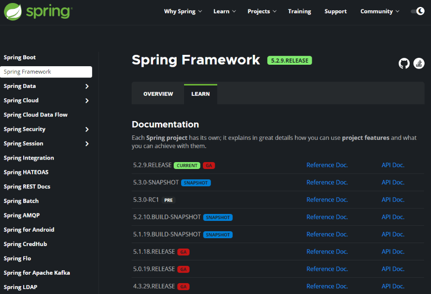
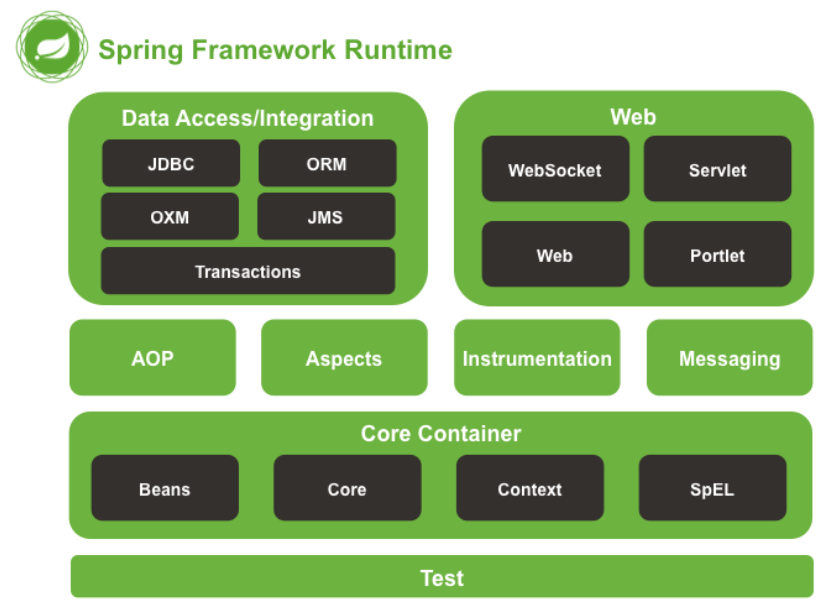
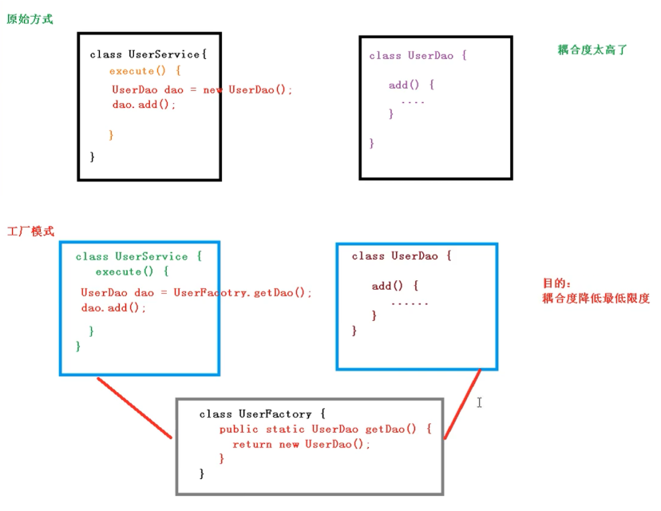
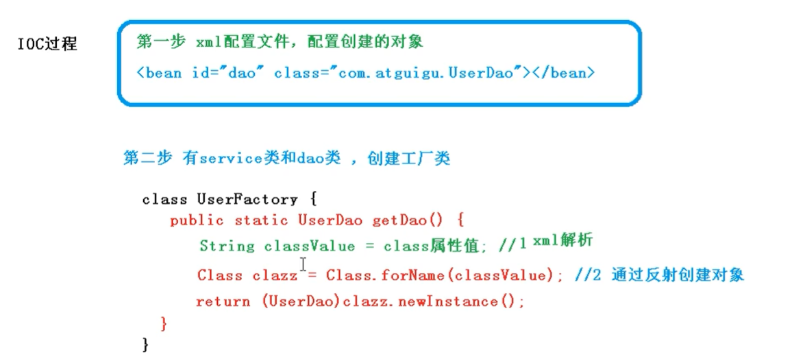

# Spring5框架

---

## 一、Spring框架概述

1、spring框架是一个轻量级的开源的java EE开发框架。

2、spring框架解决企业应用开发的复杂性。

3、spring有两个核心：IOC与AOP

* IOC：控制反转，把创建对象过程交给Spring管理。

* AOP：面向切面编程，不修改源代码情况下，进行功能增强。

### 1、Spring特点

1. 方便解耦，简化开发
2. aop支持
3. 方便程序测试
4. 方便集成各种框架
5. 降低Java api使用难度
6. 方便进行事务处理

### 2、Spring版本选择



### 3、入门案例

1. 下载Spring
2. idea新建普通Java工程
3. 导入Spring的jar包（bean、core、context、expresstion + commons-logging）
4. 写代码



* **创建普通类，类里面创建普通方法**

  ```java
  public class User{
      public void add(){
           system.out.println("add....");
       }
  }
  ```

* **创建Spring配置文件，在配置文件中创建对象，新建bean.xml配置文件**

  ```xml
  <?xml version="1.0" encoding="UTF-8"?>
  <beans xmlns="http://www.springframework.org/schema/beans"
         xmlns:xsi="http://www.w3.org/2001/XMLSchema-instance"
         xsi:schemaLocation="http://www.springframework.org/schema/beans http://www.springframework.org/schema/beans/spring-beans.xsd">
  
      <!--配置User对象创建-->
      <bean id="user" class="com.spring5.User"></bean>
  </beans>
  ```

* **测试**

  ```java
  public class TestSpring5{
      @Test
      public void testAdd(){
          //1、加载spring配置文件
          ApplicationContext context = new ClassPathXmlApplicationContext("bean.xml");
          //2、获取配置的创建对象
          User user = context.getBean("user",User.class);
          //3、测试
          System.out.println(user);
          user.add();
      }
  }
  ```


## 二、IOC容器

### 1、IOC底层原理

控制反转，目的：降低耦合度，高内聚，低耦合。把对象创建和对象之间的调用过程，交给Spring进行管理。

xml解析、工厂模式、反射






### 2、IOC接口（BeanFactory）

* IOC思想基于IOC容器完成，IOC容器底层就是对象工厂
* Spring提供了IOC容器实现的两种方式：两个接口
  * BeanFactory：IOC容器基本实现，是Spring内部使用接口，不提供开发人员使用。加载配置文件时不会创建对象，使用对象时才会创建对象（懒汉式加载对象）
  * ApplicationContext：BeanFactory的子接口，提供更多更强大的功能，一般供开发人员进行使用。加载配置文件时就创建对象（饿汉式加载对象）
* ApplicationContext接口实现类
  * FileSystemXmlApplicationContext("盘符路径（绝对路径）")
  * ClassPathXmlApplicationContext("src目录下类路径")


### 3、IOC操作Bean管理

1. 什么是Bean管理
   * Bean管理指的是两个操作
   * Spring创建对象
   * Spring注入属性
2. Bean管理操作的两种方式
   * 基于xml配置文件方式实现
   * 基于注解方式实现


### 4、IOC操作和Bean管理（基于xml）

#### 4.1 基于xml方式创建对象

1. 在Spring配置文件中，使用Bean标签，标签里面添加对应属性，就可以实现对应对象创建

2. 在Bean标签有很多属性，常压的属性：id、class、name

3. 创建对象的时候，默认也是执行无参数构造方法

   ```xml
   <!--配置User对象创建-->
   <bean id="user" class="com.spring5.User"></bean>
   ```

#### 4.2 基于xml方式注入属性

DI：依赖注入，就是注入属性

#### 4.3 第一种注入方式：使用set方法进行注入

1. 创建类，定义属性和对应的set方法

   ```java
   public class Book {
       private String bname;
       private String bauthor;
   
       public void setBname(String bname) {
           this.bname = bname;
       }
       public void setBauthor(String bauthor) {
           this.bauthor = bauthor;
       }
       public static void main(String[] args) {
           Book book = new Book();
           book.setBname("WeiSanJin");
       }
   }
   ```

2. 在Spring配置文件配置对象创建，配置属性注入

   ```xml
   <!--set方法注入属性-->
   <bean id="book" class="com.spring5.Book">
       <!--使用property完成属性注入
           name：类里面属性名称
           value：向属性注入的值
       -->
       <property name="bname" value="WeiSanJin"></property>
       <property name="bauthor" value="WeiSanJin"></property>
   </bean>
   ```


#### 4.4 第二种注入方式：使用有参数构造进行注入

1. 创建类，定义属性，创建属性对应有参数构造方法

   ```java
   public class Orders {
       private String oname;
       private String address;
   
       public Orders(String oname, String address) {
           this.oname = oname;
           this.address = address;
       }
   }
   ```

2. 在Spring配置文件中进行配置

   ```xml
   <bean id="orders" class="com.spring5.Orders">
       <constructor-arg name="oname" value="WeiSanJin"></constructor-arg>
       <constructor-arg name="address" value="WeiSanJin"></constructor-arg>
   </bean>
   ```

   

