# Spring5框架

---

## 一、Spring框架概述

1、spring框架是一个轻量级的开源的java EE开发框架。

2、spring框架解决企业应用开发的复杂性。

3、spring有两个核心：IOC与AOP

* IOC：控制反转，把创建对象过程交给Spring管理。

* AOP：面向切面编程，不修改源代码情况下，进行功能增强。

### 1、Spring特点

1. 方便解耦，简化开发
2. aop支持
3. 方便程序测试
4. 方便集成各种框架
5. 降低Java api使用难度
6. 方便进行事务处理

### 2、Spring版本选择


### 3、入门案例

1. 下载Spring
2. idea新建普通Java工程
3. 导入Spring的jar包（bean、core、context、expresstion + commons-logging）
4. 写代码


* **创建普通类，类里面创建普通方法**

  ```java
  public class User{
      public void add(){
           system.out.println("add....");
       }
  }
  ```

* **创建Spring配置文件，在配置文件中创建对象，新建bean.xml配置文件**

  ```xml
  <?xml version="1.0" encoding="UTF-8"?>
  <beans xmlns="http://www.springframework.org/schema/beans"
         xmlns:xsi="http://www.w3.org/2001/XMLSchema-instance"
         xsi:schemaLocation="http://www.springframework.org/schema/beans http://www.springframework.org/schema/beans/spring-beans.xsd">
  
      <!--配置User对象创建-->
      <bean id="user" class="com.spring5.User"></bean>
  </beans>
  ```

* **测试**

  ```java
  public class TestSpring5{
      @Test
      public void testAdd(){
          //1、加载spring配置文件
          ApplicationContext context = new ClassPathXmlApplicationContext("bean.xml");
          //2、获取配置的创建对象
          User user = context.getBean("user",User.class);
          //3、测试
          System.out.println(user);
          user.add();
      }
  }
  ```


## 二、IOC容器

### 1、IOC底层原理

控制反转，目的：降低耦合度，高内聚，低耦合。把对象创建和对象之间的调用过程，交给Spring进行管理。

xml解析、工厂模式、反射


### 2、IOC接口（BeanFactory）

* IOC思想基于IOC容器完成，IOC容器底层就是对象工厂
* Spring提供了IOC容器实现的两种方式：两个接口
  * BeanFactory：IOC容器基本实现，是Spring内部使用接口，不提供开发人员使用。加载配置文件时不会创建对象，使用对象时才会创建对象（懒汉式加载对象）
  * ApplicationContext：BeanFactory的子接口，提供更多更强大的功能，一般供开发人员进行使用。加载配置文件时就创建对象（饿汉式加载对象）
* ApplicationContext接口实现类
  * FileSystemXmlApplicationContext("盘符路径（绝对路径）")
  * ClassPathXmlApplicationContext("src目录下类路径")


### 3、IOC操作Bean管理

1. 什么是Bean管理

   Bean管理指的是两个操作

   * Spring创建对象
   * Spring注入属性
2. Bean管理操作的两种方式
   * 基于xml配置文件方式实现
   * 基于注解方式实现


### 4、IOC操作和Bean管理（基于xml）

#### 4.1 基于xml方式创建对象

1. 在Spring配置文件中，使用Bean标签，标签里面添加对应属性，就可以实现对应对象创建

2. 在Bean标签有很多属性，常压的属性：id、class、name

3. 创建对象的时候，默认也是执行无参数构造方法

   ```xml
   <!--配置User对象创建-->
   <bean id="user" class="com.spring5.User"></bean>
   ```

#### 4.2 基于xml方式注入属性

DI：依赖注入，就是注入属性

#### 4.3 第一种注入方式：使用set方法进行注入

1. 创建类，定义属性和对应的set方法

   ```java
   public class Book {
       private String bname;
       private String bauthor;
   
       public void setBname(String bname) {
           this.bname = bname;
       }
       public void setBauthor(String bauthor) {
           this.bauthor = bauthor;
       }
       public static void main(String[] args) {
           Book book = new Book();
           book.setBname("WeiSanJin");
       }
   }
   ```

2. 在Spring配置文件配置对象创建，配置属性注入

   ```xml
   <!--set方法注入属性-->
   <bean id="book" class="com.spring5.Book">
       <!--使用property完成属性注入
           name：类里面属性名称
           value：向属性注入的值
       -->
       <property name="bname" value="WeiSanJin"></property>
       <property name="bauthor" value="WeiSanJin"></property>
   </bean>
   ```


#### 4.4 第二种注入方式：使用有参数构造进行注入

1. 创建类，定义属性，创建属性对应有参数构造方法

   ```java
   public class Orders {
       private String oname;
       private String address;
   
       public Orders(String oname, String address) {
           this.oname = oname;
           this.address = address;
       }
   }
   ```

2. 在Spring配置文件中进行配置

   ```xml
   <bean id="orders" class="com.spring5.Orders">
       <constructor-arg name="oname" value="WeiSanJin"></constructor-arg>
       <constructor-arg name="address" value="WeiSanJin"></constructor-arg>
   </bean>
   ```

3. 测试

   ```java
   @Test
   public void TestOrder(){
       //1.加载Spring配置文件
       ApplicationContext context = new ClassPathXmlApplicationContext("base1.xml");
   
       //2.获取配置创建的对象
       Orders orders = context.getBean("orders",Orders.class);
   
       System.out.println(orders.toString());
   }
   ```


#### 4.5 p名称空间注入（了解）

使用p名称空间注入，可以简化基于xml配置方式

1. 添加p名称空间在配置文件种

   ```xml
   <?xml version="1.0" encoding="UTF-8"?>
   <beans xmlns="http://www.springframework.org/schema/beans"
   xmlns:xsi="http://www.w3.org/2001/XMLSchema-instance"
   xmlns:p="http://www.springframework.org/schema/p"
   xsi:schemaLocation="http://www.springframework.org/schema/beans http://www.springframework.org/schema/beans/spring-beans.xsd">
   ```

2. 进行属性注入，在bean标签里面进行操作

   ```xml
   <bean id="book" class="com.spring5.Book" p:bname="WeiSanJin" p:bauthor="WeiSanJin"</bean>
   ```


### 5、IOC操作Bean管理（xml注入其他类型属性）

#### 5.1 字面量

1. null值

   ```xml
   <bean id="book" class="com.spring5.Book">
       <property name="bname" value="WeiSanJin"></property>
       <property name="bauthor" value="WeiSanJin"></property>
       <property name="address">
           <null></null>
       </property>
   </bean>
   ```

2. 属性值包含特殊符号

   ```xml
   //方法一：转义字符
   <property name="address" value="&lt;北京&gt;"></property>
   //方法二：CDATA
   <property name="address">
       <value>
       <![CDATA[<北京>]]>
       </value>
   </property>
   ```


#### 5.2 注入外部bean（使用引用，注入其他类的对象）

1. 创建两个类service类和dao类

2. 在service调用dao类的方法

3. 在spring配置文件中进行配置

   ```java
   public interface UserDao {
       public void updata();
   }
   
   public class UserDaoImpl implements UserDao{
   
       @Override
       public void updata() {
           System.out.println("dao updata.......");
       }
   }
   
   public class UserService {
       // 创建UserDao类型属性，生成set方法
       private UserDao userDao;
       public void setUserDao(UserDao userDao) {
           this.userDao = userDao;
       }
   
       public void add(){
           System.out.println("service add......");
           //原理注入方式
           //UserDao userDao = new UserDaoImpl();
           //userDao.updata();
       }
   }
   
   // 第二步写配置文件xml文件
   // service和dao对象创建
   <bean id="userService" class="com.spring5.service.UserService">
       <!-- 注入UserDao对象 
       name属性：类里面属性名称
       ref属性：创建userDao对象bean标签id值
       -->
       <property name="userDao" ref="userDaoImpl"></property>
       </bean>
       // 配置dao对象
       <bean id="userDaoImpl" class="com.spring5.dao.UserDaoImpl"></bean>
   ```


#### 5.3 注入属性  -  内部bean和级联赋值

```java
public class Dept {
    private String dname;

    public void setDname(String dname) {
        this.dname = dname;
    }

    @Override
    public String toString() {
        return "Dept{" +
                "dname='" + dname + '\'' +
                '}';
    }
}
```

```java
public class Emp {
    private String ename;
    private String genfer;
    private Dept dept;

    public void setEname(String ename) {
        this.ename = ename;
    }

    public void setGenfer(String genfer) {
        this.genfer = genfer;
    }

    public void setDept(Dept dept) {
        this.dept = dept;
    }

    @Override
    public String toString() {
        return "Emp{" +
                "ename='" + ename + '\'' +
                ", genfer='" + genfer + '\'' +
                ", dept=" + dept +
                '}';
    }
}
```

```xml
<!--级联赋值-->
<bean id="emp" class="com.spring5.bean.Emp">
    <!--设置两个普通属性-->
    <property name="ename" value="WeiSanJin"></property>
    <property name="genfer" value="WeiSanJin"></property>
    <property name="dept">
        <bean id="dept" class="com.spring5.bean.Dept">
            <property name="dname" value="保安部"></property>
        </bean>
    </property>
</bean>
```


#### 5.4 注入属性  -  级联赋值

```xml
<!--级联赋值-->
<bean id="emp" class="com.spring5.bean.Emp">
    <!--设置两个普通属性-->
    <property name="ename" value="WeiSanJin"></property>
    <property name="genfer" value="WeiSanJin"></property>
    <!--级联赋值-->
    <property name="dept" ref="dept"></property>
</bean>
<bean id="dept" class="com.spring5.bean.Dept">
    <property name="dname" value="财务部"></property>
</bean>
```


### 6、IOC操作Bean管理（xml注入集合属性）

* 注入数据类型属性
* 注入List集合类型属性
* 注入Map集合类型属性

1. 创建类，定义数据，list，map，set类型属性，生成对应set方法

   ```java
   public class Stu {
       // 1. 数组类型属性
       private String[] courses;
   
       // 2. list集合类型属性
       private List<String> list;
   
       // 3. map集合类型属性
       private Map<String,String> maps;
   
       // 4. set集合类型属性
       private Set<String> sets;
   
       public void setCourses(String[] courses) {
           this.courses = courses;
       }
   
       public void setList(List<String> list) {
           this.list = list;
       }
   
       public void setMaps(Map<String, String> maps) {
           this.maps = maps;
       }
   
       public void setSets(Set<String> sets) {
           this.sets = sets;
       }
       @Override
       public String toString() {
           return "Stu{" +
                   "courses=" + Arrays.toString(courses) +
                   ", list=" + list +
                   ", maps=" + maps +
                   ", sets=" + sets +
                   '}';
       }
   }
   ```

2. 在Spring配置文件进行配置

   ```xml
   <!--1. 集合类型属性注入-->
   <bean id="stu" class="com.spring5.collectionytpe.Stu">
       <!--数组类型属性注入 -->
       <property name="courses">
           <array>
               <value>Java课程</value>
               <value>数据库课程</value>
           </array>
       </property>
       <!--list类型属性注入 -->
       <property name="list">
           <list>
               <value>张三</value>
               <value>小三</value>
           </list>
       </property>
       <!--map类型属性注入 -->
       <property name="maps">
           <map>
               <entry key="Java" value="java"></entry>
               <entry key="PHP" value="php"></entry>
           </map>
       </property>
       <!--set类型属性注入 -->
       <property name="sets">
           <set>
               <value>Mysql</value>
               <value>Redis</value>
           </set>
       </property>
   </bean>
   ```

3. 测试

   ```java
   @Test
   public void TestStu(){
       //1.加载Spring配置文件
       ApplicationContext context = new ClassPathXmlApplicationContext("base5.xml");
   
       //2.获取配置创建的对象
       Stu stu = context.getBean("stu", Stu.class);
   
       System.out.println(stu.toString());
   }
   ```

4. 在集合里设置对象类型值

   ```java
   // 1.创建课程类
   public class Course {
       private String cname;
   
       public void setCname(String cname) {
           this.cname = cname;
       }
   }
   // 2.创建学生类
   public class Stu {
       // 学生所学多门课程
       private List<Course> courseList;
       public void setCourseList(List<Course> courseList) {
           this.courseList = courseList;
       }
   }
   ```

   ```xml
   <!-- xml配置-->
   <!-- 注入list集合类型，值是对象-->
   <bean>
       <property name="courseList">
           <list>
               <ref bean="course1"></ref>
               <ref bean="course2"></ref>
           </list>
       </property>
   </bean>
   
   <!-- 创建多个course对象-->
   <bean id="course1" class="com.spring5.collectionytpe.Course">
       <property name="cname" value="String"></property>
   </bean>
   <bean id="course2" class="com.spring5.collectionytpe.Course">
       <property name="cname" value="String"></property>
   </bean>
   ```

5. 把集合注入部分提取出来

   1. 在spring配置文件中引入名称空间util

      ```xml
      <?xml version="1.0" encoding="UTF-8"?>
      <beans xmlns="http://www.springframework.org/schema/beans"
             xmlns:xsi="http://www.w3.org/2001/XMLSchema-instance"
             xmlns:util="http://www.springframework.org/schema/util"
             xsi:schemaLocation="http://www.springframework.org/schema/beans http://www.springframework.org/schema/beans/spring-beans.xsd
                                 http://www.springframework.org/schema/util http://www.springframework.org/schema/util/spring-util.xsd">
      ```

   2. 使用util标签完成list集合提取

      ```xml
      <!--1 提取list集合类型属性注入-->
      <util:list id="bookList">
          <value>三国演义</value>
          <value>水浒传</value>
          <value>西游记</value>
          <value>红楼梦</value>
      </util:list>
      
      <!--2 提取list集合类型属性使用-->
      <bean id="book" class="com.spring5.collectionytpe.Book">
          <property name="list" ref="bookList"></property>
      </bean>
      ```

      

### 7、IOC操作Bean管理（FactoryBean）

Spring有两种类型bean，一种普通bean，另一种工厂bean(FactoryBean)

1. 普通bean在配置文件中，定义bean类型就是返回类型
2. 工厂bean在配置文件中定义bean类型可以和返回类型不一样

* 第一步创建类，让这个类作为工厂Bean，实现接口FactoryBean

* 第二步实现接口里的方法，在实现方法中定义返回的bean类型

  ```java
  //实现接口类
  public class MyBean implements FactoryBean<Course>{
      @override
      public Course getObject() throws Exceptions{
              Course  course = new Course();
              course.setCourse("java");
              return course;
      }
      @override
      public Class<?> getObjectType(){
              return NULL;
      }
      @override
      public Boolean isSingleton(){
              return false;
      }
  }
  //配置类
  <bean id = "mybean" class="com.zhh.entity.MyBean"></bean>
  //测试类
  @test
  public void test2(){
      ApplicationContext application  = new 	classPathXpthXmlApplicationContext("bean4.xml");
  	Course course =  context.getBean("MyBean",Course.class);
  }
  ```


### 8、IOC操作Bean管理（bean作用域）

1. 在Spring里，设置创建Bean实例是单实例还是多实例
2. 在Spring里，默认设置创建Bean实例是单实例
3. 如何设置单实例还是多实例

Spring配置文件bean标签里scope属性用于设置单实例还是多实例

scope属性值：

* 默认值：singleton，表示单实例对象
* prototype，表示多实例对象

```xml
//配置
<bean id="book" class="com.zhh.entity.Book" scope="prototype">
    <property name="list" ref = "booklist"></property>
</bean>
```

4. singleton与prototype区别

   1. singleton表示单实例，prototype表示多实例

   2. 设置scope是singleton时，加载Spring配置文件时会创建单实例对象

      设置scope是prototype时，不是加载Spring配置文件时就创建对象，而是在调用getBean方法时创建多实例对象


### 9、IOC操作Bean管理（生命周期）

#### 9.1 生命周期

从对象创建到对象销毁的过程

#### 9.2 bean生命周期

1. 通过构造器创建bean实例（无参数构造）
2. 为bean的属性设置值和对其他bean引用（调用set方法）
3. 调用bean的初始化方法（需要进行配置）
4. bean可以使用了（对象获取到了）
5. 当容器关闭时，调用bean的销毁方法（需要进行配置销毁方法）

```java
public class Orders {
    private String oname;

    public Orders() {
        System.out.println("第一步 执行无参构造创建bean实例");
    }

    public void setOname(String oname) {
        this.oname = oname;
        System.out.println("第二步 调用set方法设置属性");
    }

    public void initMethod(){
        System.out.println("第三步 执行初始化的方法");
    }

    public void destroyMethod(){
        System.out.println("第五步 执行销毁的方法");
    }

    @Override
    public String toString() {
        return "Orders{" +
                "oname='" + oname + '\'' +
                '}';
    }
}
```

```xml
<bean id="orders" class="com.spring5.bean.Orders" init-method="initMethod" destroy-method="destroyMethod">
    <property name="oname" value="手机"></property>
</bean>
```

```java
@Test
public void test1(){
    //1.加载Spring配置文件
    ApplicationContext context = new ClassPathXmlApplicationContext("bean7.xml");

    //2.获取配置创建的对象
    Orders orders = context.getBean("orders", Orders.class);

    System.out.println(orders.toString());

    //手动销毁bean实例
    ((ClassPathXmlApplicationContext) context).close();
}
```

#### 9.3 bean的后置处理器，bean生命周期有七步

1. 通过构造器创建Bean实例（无参数构造）
2. 为bean的属性设置值和对其他bean引用（调用set方法）
3. 把bean实例传递bean后置处理器的方法postProcessBeforeInitialization
4. 调用bean的初始化的方法（需要进行配置）
5. 把bean实例传递bean后置处理器的方法postProcessAfterInitialization
6. bean可以使用了（对象获取到了）
7. 当容器关闭时，调用bean的销毁方法（需要进行配置销毁的方法）

```java
//MyBean.java
public class MyBeanPost implements BeanPostProcessor {
    @Override
    public Object postProcessBeforeInitialization(Object bean, String beanName) throws BeansException {
        System.out.println("在初始化之前执行的方法");
        return bean;
    }

    @Override
    public Object postProcessAfterInitialization(Object bean, String beanName) throws BeansException {
        System.out.println("在初始化之后执行的方法");
        return bean;
    }
}
```

```xml
<!-- 配置后置处理器-->
<!--在该配置文件下的bean都会引用该后置处理器-->
<bean id="myBean" class="com.java.spring5.period.MyBeanPost"></bean>
```


### 10、IOC操作Bean管理（xml自动装配）

* 什么是自动装配

  根据指定装配规则（属性名称或者属性类型），Spring自动将匹配的属性值进行注入

* 演示自动装配过程

  ```xml
  <!--实现自动装配
      bean标签属性autowire，配置自动装配
      autowire属性常用两个值：
          byName根据属性名称注入，注入值bean的id值和类属性名称一样
          byType根据属性类型注入
  -->
  <bean id="emp" class="com.spring5.autowire.Emp" autowire="byName"></bean>
  <bean id="dept" class="com.spring5.autowire.Dept"></bean>
  ```


### 11、IOC操作Bean管理（外部属性文件）

#### 11.1 直接配置数据库信息

1. 配置德鲁伊连接池
2. 引入德鲁伊连接池依赖jar包

```xml
<!--直接配置连接池-->
<bean id="dataSource" class="com.alibaba.druid.pool.DruidDataSource">
    <property name="driverClassName" value="com.mysql.jdbc.Driver"></property>
    <property name="url" value="jdbc:mysql://localhost:3306/test"></property>
    <property name="username" value="root"></property>
    <property name="password" value="123456"></property>
</bean>
```

#### 11.2 引入外部属性文件配置数据库连接池

1. 创建外部属性文件,properties格式文件，写数据库信息

   ```properties
   prop.driverClass=com.mysql.jdbc.Driver
   prop.url=jdbc:mysql://localhost:3306/test
   prop.userName=root
   prop.password=123456
   ```

2. 把外部properties属性文件引入到Spring配置文件中

   引入context名称空间

   ```xml
   <?xml version="1.0" encoding="UTF-8"?>
   <beans xmlns="http://www.springframework.org/schema/beans"
          xmlns:xsi="http://www.w3.org/2001/XMLSchema-instance"
          xmlns:context="http://www.springframework.org/schema/context"
          xsi:schemaLocation="http://www.springframework.org/schema/beans http://www.springframework.org/schema/beans/spring-beans.xsd
                              http://www.springframework.org/schema/util http://www.springframework.org/schema/util/spring-util.xsd
                              http://www.springframework.org/schema/context http://www.springframework.org/schema/context/spring-context.xsd">
   ```

3. 在Soring配置文件中使用标签引入外部属性文件

   ```xml
   <!--    引入外部属性文件-->
   <context:property-placeholder location="classpath:jdbc.properties"></context:property-placeholder>
   
   <!--    配置连接池-->
   <bean id="dataSource" class="com.alibaba.druid.pool.DruidDataSource">
       <property name="driverClassName" value="${prop.driverClass}"></property>
       <property name="url" value="${prop.url}"></property>
       <property name="username" value="${prop.userName}"></property>
       <property name="password" value="${prop.password}"></property>
   </bean>
   ```


### 10、IOC操作Bean管理（基于注解方式）

#### 10.1 什么是注解

* 格式：@注解名称(属性名=属性值，属性名=属性值)
* 使用注解：注解作用在类，方法，属性上
* 使用目的：简化xml配置

#### 10.2 Spring针对Bean管理中创建对象提供注解

* @Component：普通用法
* @Service：用于service业务逻辑层
* @Controller：用于web层
* @Repository：用于DAO持久层

#### 10.3 基于注解方式实现对象创建例子

1. 引入依赖

   **spring-aop-5.2.6.RELEASE**

2. 引入context名称空间

   ```xml
   <?xml version="1.0" encoding="UTF-8"?>
   <beans xmlns="http://www.springframework.org/schema/beans"
          xmlns:xsi="http://www.w3.org/2001/XMLSchema-instance"
          xmlns:context="http://www.springframework.org/schema/context"
          xsi:schemaLocation="http://www.springframework.org/schema/beans http://www.springframework.org/schema/beans/spring-beans.xsd
                              http://www.springframework.org/schema/util http://www.springframework.org/schema/util/spring-util.xsd
                              http://www.springframework.org/schema/context http://www.springframework.org/schema/context/spring-context.xsd">
   ```

3. 开启组件扫描

   1、如果扫描多个包，多个包使用逗号隔开

   2、扫描包的上层目录

   ```xml
   <context:component-scan base-package="com.atguigu"></context:component-sacn>
   ```

4. 创建类，在类上面添加创建对象注解

   ```java
   @Component(value = "User")
   public class User {
       public void add(){
           System.out.println("service add......");
       }
   }
   ```

5. 测试

   ```java
   @Test
   public void testService(){
       //1.加载Spring配置文件
       ApplicationContext context = new ClassPathXmlApplicationContext("base9.xml");
   
       //2.获取配置创建的对象
       User user = context.getBean("User", User.class);
   
       user.add();
   }
   ```


#### 10.4 开启组件扫描细节配置

```xml
<!--示例1
        use-default-filters="false" 表示现在不使用默认filter，自己配置fillter
        context:include-filter,设置扫描哪些内容
    -->
<context:component-scan base-package="com.spring5" use-default-filters="false">
    <context:include-filter type="annotation" expression="org.springframework.stereotype.Controller"/>
</context:component-scan>

<!--示例2
        下面配置扫描包所有内容
        context:exclude-filter：设置哪些内容不进行扫描
    -->
<context:component-scan base-package="com.spring5">
    <context:exclude-filter type="annotation" expression="org.springframework.stereotype.Controller"/>
</context:component-scan>
```


#### 10.5 基于注解方式显示属性注入

1. **@Autowired**：根据属性类型进行自动装配

   1. 创建service和dao对象，在service和dao类添加创建对象注解

      ```java
      //UserDao.java
      public interface UserDao {
          public void add();
      }
      
      //UserDaoImpl.java
      @Repository
      public class UserDaoImpl implements UserDao {
      
          @Override
          public void add() {
              System.out.println("add...");
          }
      }
      ```

      

   2. 在service注入dao对象，在service类添加dao类型属性，在属性上面使用注解

      ```java
      //UserService.java
      @Service
      public class UserService {
          //定义 dao 类型属性
          //不需要添加 set 方法
          //添加注入属性注解
          @Autowired
          private UserDao userDao;
          public void add() {
              System.out.println("service add.......");
              userDao.add();
          }
      }
      ```

   3. 测试

      ```java
      @Test
      public void testService(){
          //1.加载Spring配置文件
          ApplicationContext context = new ClassPathXmlApplicationContext("base9.xml");
      
          //2.获取配置创建的对象
          UserService userService = context.getBean("userService", UserService.class);
      
          userService.add();
      }
      ```

2. **@Qualifier**：根据属性名称进行注入

   ```java
   @Repository(value = "UserDaoImpl1")
   public class UserDaoImpl implements UserDao{
   
       @Override
       public void add() {
           System.out.println("dao add ......");
       }
   }
   ```

   ```java
   @Service
   public class UserService {
       // 定义dao类型属性(不需要添加set方法)
       // 添加注入属性组注解
       @Autowired
       @Qualifier(value = "UserDaoImpl1") // 根据名称注入
       private UserDap userDao;
   
       public void add(){
           System.out.println("service add.....");
           userDao.add();
       }
   }
   ```

3. **@Resource**：可以根据类型注入，可以根据名称注入

   ```java
   @Service
   public class UserService {
       //  @Resource  // 根据类型注入
       @Resource(name = "UserDaoImpl1")  // 根据名称注入
       private UserDao userDao;
   
       public void add(){
           System.out.println("service add.....");
           stuDao.add();
       }
   }
   ```

4. **@Value**：注入普通类型属性

   ```java
   @Service
   public class UserService {
   //    @Resource  // 根据类型注入
       @Resource(name = "UserDaoImpl1")
       private UserDao userDao;
   
       @Value(value = "WeiSanJin")
       private String name;
   
       public void add(){
           System.out.println("service add....."+name);
           userDao.add();
       }
   }
   
   ```

   

#### 10.6 完全注解开发

1. 创建配置类，替代xml配置文件

   ```java
   @Configuration
   @ComponentScan(basePackages = {"com.spring5"})
   public class SpringConfig {
       
   }
   ```

2. 编写测试类

   ```java
   @Test
   public void testService(){
       //1.加载Spring配置文件
       ApplicationContext context = new AnnotationConfigApplicationContext(SpringConfig.class);
       //2.获取配置创建的对象
       UserService userService = context.getBean("userService", UserService.class);
   
       userService.add();
   }
   ```


## 三、AOP

### 1、AOP概念

1. 面向切面编程（方面），利用AOP可以对业务逻辑的各个部分进行隔离，从而使得业务逻辑部分之间的耦合度降低，提高程序的可重用性，同时提高了开发的效率

2. 通俗描述：不通过修改源代码方式，在主干功能里面添加新功能

3. 使用登录例子说明AOP

   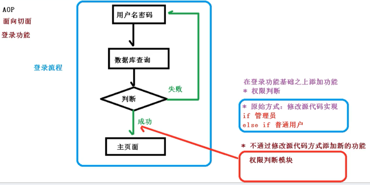


### 2、AOP底层原理

AOP底层使用动态代理

* 第一种：有接口情况，使用JDK动态代理（创建接口实现类代理对象，增强类的方法）

  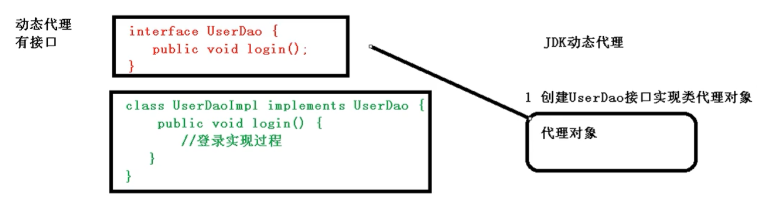

* 第二种：没有接口情况，使用GCLIB动态代理

  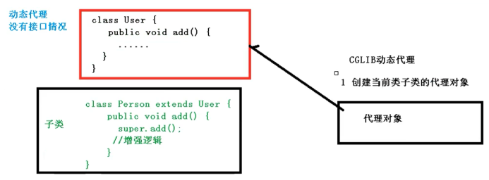


### 3、AOP JDK动态代理

1. JDK动态代理，使用Proxy类，java.lang.reflect.Proxy代理类

   ```java
   newProxyInstance(Classloader loader, 类<?>[]... interfaces, InvocationHandler h)
   ```

   返回指定接口的代理类的实例，该接口将方法调用分派给指定的调用处理程序

   方法有三个参数：

   第一个参数：类加载器

   第二个参数：增强方法所在的类所实现的接口，支持多个接口

   第三个参数：实现这个接口InvocationHandler，创建代理对象，写增强的部分

2. 编写JDK动态代理代码

   1. 创建接口，定义方法

      ```java
      public interface UserDao {
          public int add(int a,int b);
          public String updata(String id);
      }
      ```

   2. 接口实现类

      ```java
      public class UserDaoImpl implements UserDao{
      
          @Override
          public int add(int a, int b) {
              System.out.println("add方法执行了...");
              return a+b;
          }
      
          @Override
          public String updata(String id) {
              System.out.println("updata方法执行了...");
              return id;
          }
      }
      ```

   3. 使用Proxy类创建接口代理对象

      ```java
      public class JDKProxy {
          public static void main(String[] args) {
              // 创建接口实现类代理对象
              Class[] interfaces = {UserDao.class};
              UserDao userDao = new UserDaoImpl();
              UserDao dao = (UserDao)Proxy.newProxyInstance(JDKProxy.class.getClassLoader(),interfaces,new UserDaoProxy(userDao));
              int result = dao.add(1,2);
              System.out.println("result："+result);
          }
      }
      
      class UserDaoProxy implements InvocationHandler{
          // 把创建的谁的代理对象，把谁传递过来
          // 有参构造
          private Object obj;
          public UserDaoProxy(Object obj){
              this.obj = obj;
          }
      
          // 增强的逻辑
          @Override
          public Object invoke(Object proxy, Method method, Object[] args) throws Throwable {
              // 方法之前
              System.out.println("方法之前执行："+method.getName()+"：传递的参数"+ Arrays.toString(args));
      
              // 被增强的方法执行
              Object res = method.invoke(obj,args);
      
              // 方法之后
              System.out.println("方法之后执行："+obj);
      
              return res;
          }
      }
      ```

   

   ### 4、AOP术语

   1. 连接点：类里面可以被增强的方法
   2. 切入点：实际被增强的方法
   3. 通知（增强）：实际增加的逻辑部分（通知有多种类型）
      * 前置通知
      * 后置通知
      * 环绕通知
      * 异常通知
      * 最终通知（finally）
   4. 切面：把通知应用到切入点的过程


### 5、AOP操作准备

1. Spring框架中一般都是基于AspectJ实现AOP操作

   AspectJ本身是单独的框架，不属于Spring组成部分，独立于AOP框架，一般把AspectJ和Spring框架一起使用，进行AOP操作

2. 基于AspectJ实现AOP操作

   * 基于xml配置文件实现
   * 基于注解方式实现

3. 项目里引入相关依赖

   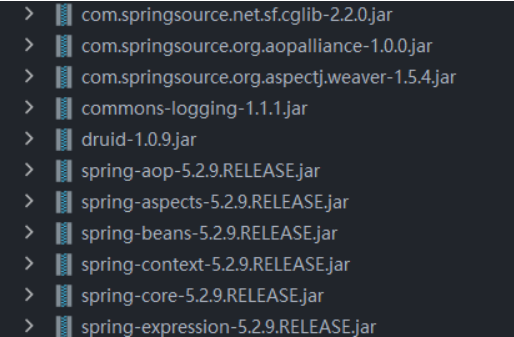

4. 切入点表达式

   * 切入点表达式作用：知道对哪个类的方法进行增强
   * 语法结构：`execution([权限修饰符][返回类型][类全路径][方法名称]([参数列表]))`

   举例1：对com.java.spring5.dao.BookDao类里面的add方法进行增强

   ```java
   execution(* com.java.spring5.dao.BookDao.add(..))
   ```

   举例2：对com.java.spring5.dao.BookDao类里面的所有方法进行增强

   ```java
   execution(* com.java.spring5.dao.BookDao.*(..))
   ```

   举例3：对com.java.spring5.dao包里面所有类，类里面所有方法进行增强

   ```java
   execution(* com.java.spring5.dao.*.*(..))
   ```


### 6、AOP操作 AspectJ注解

1. 创建类，在类里面定义方法

   ```java
   // 待增强类
   @Component
   public class User {
       public void add(){
           System.out.println("add.......");
       }
   }
   ```

2. 创建增强类（编写增强逻辑）

   ```java
   // 增强的类
   @Component
   @Aspect
   public class UserProxy {
       // 前置通知
       public void before(){
           System.out.println("before.....");
       }
   }
   ```

3. 进行通知的配置

   ```xml
   <?xml version="1.0" encoding="UTF-8"?>
   <beans xmlns="http://www.springframework.org/schema/beans"
          xmlns:xsi="http://www.w3.org/2001/XMLSchema-instance"
          xmlns:context="http://www.springframework.org/schema/context"
          xmlns:aop="http://www.springframework.org/schema/aop"
          xsi:schemaLocation="http://www.springframework.org/schema/beans http://www.springframework.org/schema/beans/spring-beans.xsd
                              http://www.springframework.org/schema/context http://www.springframework.org/schema/context/spring-context.xsd
                              http://www.springframework.org/schema/aop http://www.springframework.org/schema/aop/spring-aop.xsd
   ">
       <!--开启注释扫描-->
       <context:component-scan base-package="cn.spring5.Aop.Doem1"></context:component-scan>
   
       <!--开启Aspect生成代理对象-->
       <aop:aspectj-autoproxy></aop:aspectj-autoproxy>
   </beans>
   ```

4. 在增强类上面添加注解@Aspect

5. 在spring配置文件中开启生成代理对象

6. 配置不同类型通知

   ```java
   // 增强的类
   @Component
   @Aspect
   public class UserProxy {
       // 前置通知
       @Before(value = "execution(* cn.spring5.Aop.Doem1.User.add(..))")
       public void before(){
           System.out.println("前置通知.....");
       }
       //返回通知，有异常不执行
       @AfterReturning(value="execution(* cn.spring5.Aop.Doem1.User.add(..))")
       public void afterReturning(){
           System.out.println("返回通知...");
       }
       //后置通知，有没有异常都会执行
       @After(value="execution(* cn.spring5.Aop.Doem1.User.add(..))")
       public void after(){
           System.out.println("后置通知...");
       }
       //异常通知
       @AfterThrowing(value="execution(* cn.spring5.Aop.Doem1.User.add(..))")
       public void AfterTrowing(){
           System.out.println("异常通知...");
       }
       //环绕通知,之前，之后都执行
       @Around(value="execution(* cn.spring5.Aop.Doem1.User.add(..))")
       public void around(ProceedingJoinPoint proceedingJontPoint) throws  Throwable{
           System.out.println("环绕通知之前...");
   
           // 被增强的方法执行
           proceedingJontPoint.proceed();
   
           System.out.println("环绕通知之后...");
       }
   }
   ```

7. 相同接入点抽取

   ```java
   //抽取出来的方法
   @Pointcut(value="execution(* com.spring5.aopanno.User.add(..) )")
   public void pointdemo(){
   }
   //使用公共方法
   @Before(value="pointdemo()")
   public void before(){
       System.out.println("before........");
   }
   ```

8. 有对个增强类对同一个方法进行增强，设置增强类的优先级，在增强类上面添加注解@Order(数字类型值)，数字类型值越小优先级越高

   ```java
   @Component
   @Aspect
   @Order(1)
   public class PersonProxy{
   }
   ```

9. 完全使用注解开发

   ```java
   @Configuration
   //开启注释扫描
   @ComponentScan(basePackages = {"cn.spring5.Aop"})
   //开启Aspect生成代理对象
   @EnableAspectJAutoProxy(proxyTargetClass = true)
   public class ConfigAop {
   }
   ```


### 7、AOP操作 Aspectj配置文件

1. 创建两个类，增强类和被增强类，创建方法

   ```java
   //被增强类
   public class Book{
       public void buy(){
           System.out.println("buy.......");
       }
   }
   //增强类
   public class BookProxy{
       public void before(){
           System.out.println("before.......");
       }
   }
   ```

2. 创建对象

   ```xml
   <!--创建对象-->
   <bean id="book" class="cn.spring5.Aop.aopXml.Book"></bean>
   <bean id="bookProxy" class="cn.spring5.Aop.aopXml.BookProxy"></bean>
   ```

3. 在Spring配置文件中配置切入点

   ```xml
   <!--AOP增强-->
   <aop:config>
       <!--切入点-->
       <aop:pointcut id="p" expression="execution(* cn.spring5.Aop.aopXml.Book.buy(..))"/>
       <!--配置切面-->
       <aop:aspect ref="bookProxy">
           <!--增强作用在具体的方法上-->
           <aop:before method="before" pointcut-ref="p"></aop:before>
       </aop:aspect>
   </aop:config>
   ```

4. 测试

   ```java
   @Test
   public void TestAop2(){
       ApplicationContext context = new ClassPathXmlApplicationContext("bean11.xml");
       Book book = context.getBean("book", Book.class);
       book.buy();
   }
   ```


## 四、JdbcTemplate

### 1、什么是JdbcTemplate

Spring框架对JDBC进行封装，使用jdbcTemplate方便对数据库进行操作

1. 准备工作（引入相关jar包）

   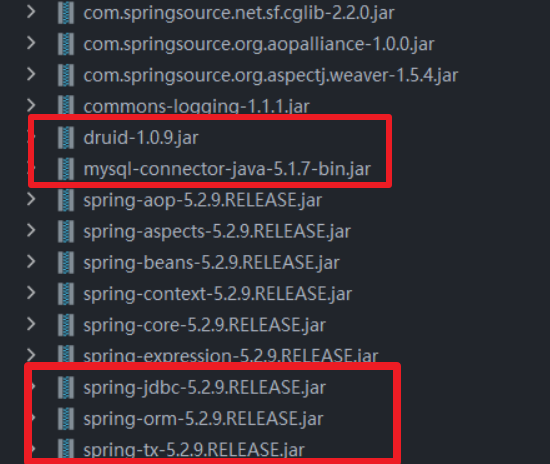

2. Spring配置文件中配置数据库连接池

   ```xml
   <!-- 数据库连接池 -->
   <bean id="dataSource" class="com.alibaba.druid.pool.DruidDataSource"
         destroy-method="close">
       <property name="url" value="jdbc:mysql://127.0.0.1:3306/spring5" />
       <property name="username" value="root" />
       <property name="password" value="root" />
       <property name="driverClassName" value="com.mysql.jdbc.Driver" />
   </bean>
   ```

3. 配置JdbcTemplate对象，注入DataSource

   ```xml
   <!--JdbcTemplate对象-->
   <bean id="jdbcTemplate" class="org.springframework.jdbc.core.JdbcTemplate">
       <!--注入-->
       <property name="dataSource" ref="dataSource"></property>
   </bean>
   ```

4. 创建service类，创建dao类。在dao里面注入jdbcTemplate

   * 配置文件

     ```xml
     <!--组件扫描-->
     <context:component-scan base-package="cn.spring5.Aop"></context:component-scan>
     ```

   * service

     ```java
     @Service
     public class BookService {
         //注入Dao
         @Autowired
         private BookDao bookDao;
     }
     ```

   * dao

     ```java
     @Repository
     public class BookDaoImpl {
         // 注入JdbcTemplate
         @Autowired
         private JdbcTemplate jdbcTemplate;
     }
     ```


### 2、jdbcTemplate操作数据库（添加）

1. 对应数据库的实体类

   ```java
   public class Book {
       private int userID;
       private String userName;
       private String userStatus;
   
       public Book() {
       }
   
       public Book(int userID, String userName, String userStatus) {
           this.userID = userID;
           this.userName = userName;
           this.userStatus = userStatus;
       }
   
       public int getUserID() {
           return userID;
       }
   
       public void setUserID(int userID) {
           this.userID = userID;
       }
   
       public String getUserName() {
           return userName;
       }
   
       public void setUserName(String userName) {
           this.userName = userName;
       }
   
       public String getUserStatus() {
           return userStatus;
       }
   
       public void setUserStatus(String userStatus) {
           this.userStatus = userStatus;
       }
   
       @Override
       public String toString() {
           return "Book{" +
                   "userID='" + userID + '\'' +
                   ", userName='" + userName + '\'' +
                   ", userStatus='" + userStatus + '\'' +
                   '}';
       }
   }
   ```

2. 编写service和dao

   ```java
   @Service
   public class BookService {
       //注入Dao
       @Autowired
       private BookDao bookDao;
   
       public void addBook(Book book){
           bookDao.add(book);
       }
   }
   
   public interface BookDao {
       //添加方法
       void add(Book book);
   }
   ```

   

   * 在dao进行数据库添加操作

   * 调用JdbcTemlate对象里的update方法实现添加操作

     ```java
     update(String sql, Object args)
     //有两个参数：一个是sql语句，第二个参数是可变参数，设置sql值
     ```

   ```java
   @Repository
   public class BookDaoImpl implements BookDao{
       // 注入JdbcTemplate
       @Autowired
       private JdbcTemplate jdbcTemplate;
   
       // 添加方法
       @Override
       public void add(Book book) {
           //创建sql语句
           String sql = "insert into t_book values(?,?,?)";
           //创建sql语句参数
           Object[] args = {book.getUserID(),book.getUserName(),book.getUserStatus()};
           int update = jdbcTemplate.update(sql,args);
           System.out.println(update);
       }
   }
   ```

3. 测试

   ```java
   @Test
   public void TestJDBC(){
       ApplicationContext context = new ClassPathXmlApplicationContext("bean1.xml");
       BookService bookService = context.getBean("bookService", BookService.class);
       Book book = new Book(1001,"Spring5","100.00");
       bookService.addBook(book);
   }
   ```

   

### 3、jdbcTemplate操作数据库（修改和删除）

* BookDao

  ```java
  public interface BookDao {
      //添加方法
      void add(Book book);
  
      //修改方法
      void updataBook(Book book);
  
      //删除方法
      void delete(String id);
  }
  ```

* BookDaoImpl

  ```java
  @Repository
  public class BookDaoImpl implements BookDao{
      // 注入JdbcTemplate
      @Autowired
      private JdbcTemplate jdbcTemplate;
  
      // 修改方法
      @Override
      public void updataBook(Book book) {
          String sql = "update t_book set userName=?,userStatus=? where userId=?";
          Object[] args = {book.getUserName(),book.getUserStatus(),book.getUserID(),};
          int update = jdbcTemplate.update(sql,args);
          System.out.println(update);
      }
  
      // 删除方法
      @Override
      public void delete(String id) {
          String sql = "delete from t_book where userId=?";
          int update = jdbcTemplate.update(sql,id);
          System.out.println(update);
      }
  }
  ```

* BookService

  ```java
  @Service
  public class BookService {
      //注入Dao
      @Autowired
      private BookDao bookDao;
  
      public void updateBook(Book book){
          bookDao.updataBook(book);
      }
  
      public void deleteBook(String id){
          bookDao.delete(id);
      }
  }
  ```

* 测试类

  ```java
  @Test
  public void TestJDBC(){
      ApplicationContext context = new ClassPathXmlApplicationContext("bean1.xml");
      BookService bookService = context.getBean("bookService", BookService.class);
      //        Book book = new Book("1001","Spring5","100.00");
      //        bookService.addBook(book);
  
      Book book = new Book("1","Spring5","100.00");
      bookService.updateBook(book);
  
      bookService.deleteBook("1");
  }
  ```


### 4、jdbcTemplate操作数据库（查询返回某个值）

1. 查询表里有多少条记录，返回某个值

2. 使用jdbcTemplate实现查询返回某个值的代码

   ```java
   queryForObject(String sql, Class requiredType)
   //两个参数，第一个参数，sql语句，第二个参数，返回类型Class
   ```

   ```java
   // 查询表记录数
   @Override
   public int selectCount() {
       String sql = "select count(*) from book";
       int Count = jdbcTemplate.queryForObject(sql,Integer.class);
       return Count;
   }
   ```

   

### 5、jdbcTemplate操作数据库（查询返回对象）

1. 场景：查询图书详情

2. JdbcTemplate实现查询返回对象

   ```java
   queryForObject(String sql, RowMapper rowMapper, Object...args)
   //第一个参数：sql语句
   //第二个参数：RowMapper，是接口，返回不同类型数据，使用这个接口里面实现完成数据封装
   //第三个参数：sql语句值
   ```

   

   ```java
   // 查询返回对象
   @Override
   public Book findBookInfo(String id) {
       String sql = "select * from book where UserId=?";
       Book book = jdbcTemplate.queryForObject(sql,new BeanPropertyRowMapper<Book>(Book.class),id);
       return book;
   }
   ```

3. 测试类

   ```java
   @Test
   public void TestJDBC(){
       ApplicationContext context = new ClassPathXmlApplicationContext("bean1.xml");
       BookService bookService = context.getBean("bookService", BookService.class);
       Book book = bookService.findBookInfo("1001");
       System.out.println(book);
   }
   ```

   

   ### 6、jdbcTemplate操作数据库（查询返回集合）

   1. 场景：查询图书列表分页

   2. jdbcTemplate实现查询返回集合

      ```java
      query(String sql, RowMapper rowMapper, Object...args)
      //第一个参数：sql语句
      //第二个参数：RowMapper，是接口，返回不同类型数据，使用这个接口里面实现完成数据封装
      //第三个参数：sql语句值
      ```

      ```java
      // 查询返回集合
      @Override
      public List<Book> findAllBook() {
          String sql = "select * from book";
          List<Book> bookList = jdbcTemplate.query(sql, new BeanPropertyRowMapper<Book>(Book.class));
          return bookList;
      }
      ```

   

   ### 7、jdbcTemplate操作数据库（批量操作）

   1. 批量操作：操作表里的多项数据

   2. JdbcTemplate实现批量操作

      ```java
      batchUpdate(String sql, List<Object[]> batchArgs)
      //第一个参数：sql语句
      //第二个参数：List集合，添加多条记录数据
      ```

      ```java
      // 批量添加
      @Override
      public void batchAddBook(List<Object[]> batchArgs) {
          String sql = "insert into book values(?,?,?)";
          int[] ints = jdbcTemplate.batchUpdate(sql, batchArgs);
          System.out.println(Arrays.toString(ints));
      }
      ```

   3. 测试类

      ```java
      @Test
      public void TestJDBC(){
          ApplicationContext context = new ClassPathXmlApplicationContext("bean1.xml");
          BookService bookService = context.getBean("bookService", BookService.class);
          //批量添加
          List<Object[]> batchArgs = new ArrayList<>();
          Object[] o1 = {"3","java","a"};
          Object[] o2 = {"4","c++","b"};
          Object[] o3 = {"5","mysql","c"};
          batchArgs.add(o1);
          batchArgs.add(o2);
          batchArgs.add(o3);
          bookService.batchAdd(batchArgs);
      }
      ```

      

   ### 8、jdbcTemplate操作数据库（批量删除、修改）

   ```java
   // 批量修改
   @Override
   public void batchUpdateBook(List<Object[]> batchArgs) {
       String sql = "update book set UserName=?,Password=? where UserID=?";
       int[] ints = jdbcTemplate.batchUpdate(sql, batchArgs);
       System.out.println(Arrays.toString(ints));
   }
   // 批量删除
   @Override
   public void batchDeleteeBook(List<Object[]> batchArgs) {
       String sql = "delete from book where UserID=?";
       int[] ints = jdbcTemplate.batchUpdate(sql, batchArgs);
       System.out.println(Arrays.toString(ints));
   }
   ```

   测试类

   ```java
   @Test
   public void TestJDBC(){
       ApplicationContext context = new ClassPathXmlApplicationContext("bean1.xml");
       BookService bookService = context.getBean("bookService", BookService.class);
       // 批量修改
       List<Object[]> batchArgs = new ArrayList<>();
       Object[] o1 = {"WeiSanJin","java1","3"};
       Object[] o2 = {"WeiSanJin","c++1","4"};
       Object[] o3 = {"WeiSanJin","mysql1","5"};
       batchArgs.add(o1);
       batchArgs.add(o2);
       batchArgs.add(o3);
       bookService.batchUpdate(batchArgs);
   
       // 批量修改
       List<Object[]> batchArgs = new ArrayList<>();
       Object[] o1 = {"3"};
       Object[] o2 = {"4"};
       batchArgs.add(o1);
       batchArgs.add(o2);
       bookService.batchDelete(batchArgs);
   }
   ```

   

## 五、事务概念

### 1、什么是事务

1. 事务是数据库操作最基本单元，逻辑上一组操作，要么都成功，如果有一个失败则所有操作都失败
2. 典型场景：银行转账
   * lucy转账100元给mary
   * lucy少100元，mary多100元

### 2、事务四个特性（ACID）

1. 原子性：要么都成功，要么都失败
2. 一致性：操作之前和操作之后总量不变
3. 隔离性：多事务操作之间不会互相影响
4. 持久性：事务提交之后，表中数据发生变化保存起来

### 3、事务操作（搭建事务操作环境）

1. 创建数据表，添加记录

   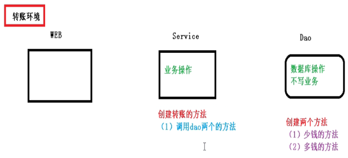

   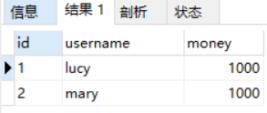

2. 创建service，搭建dao，完成对象创建和注入关系

   service注入dao，在dao注入JdbcTemplate，在JdbcTemplate注入DataSource

   ```java
   @Service
   public class UserService {
       // 注入dao
       @Autowired
       private UserDao userDao;
   }
   
   @Repository
   public class UserDaoImpl implements UserDao{
   
       @Autowired
       private JdbcTemplate jdbcTemplate;
   }
   ```

3. 在dao创建两个方法：多钱和少钱的方法，在service创建方法（转账方法）

   ```java
   @Repository
   public class UserDaoImpl implements UserDao{
   
       @Autowired
       private JdbcTemplate jdbcTemplate;
   
       @Override
       public void addMoney() {
           String sql = "update account set money=money+? wherer username=?";
           jdbcTemplate.update(sql, 100, "mary");
       }
   
       @Override
       public void reduceMoney() {
           String sql = "update account set money=money-? wherer username=?";
           jdbcTemplate.update(sql, 100, "lucy");
       }
   }
   
   @Service
   public class UserService {
       // 注入dao
       @Autowired
       private UserDao userDao;
   
       // 转账方法
       public void accountMoney(){
           userDao.reduceMoney();
           userDao.addMoney();
       }
   }
   ```

4. 测试类

   ```java
   @Test
   public void testAccount(){
       ApplicationContext context = new ClassPathXmlApplicationContext("bean1.xml");
       UserService userService = context.getBean("userService", UserService.class);
       userService.accountMoney();
   }
   ```

5. 上面代码，如果正常秩序没有问题，但是如果代码执行过程中出现异常，有问题

   ```java
   public void accountMoney(){
       userDao.reduceMoney();
       
       // 模拟异常
       int i = 10/0;
   
       userDao.addMoney();
   }
   ```

6. 解决

   * 第一步  开启事务
   * 第二步  进行业务操作
   * 第三步  没有发生异常，事务提交
   * 第四步  出现异常，事务回滚


### 4、事务操作（Spring事务管理介绍）

1. 事务添加到JavaEE三层结构里面Service层（业务逻辑层）

2. 在Spring进行事务管理操作

   * 编程式事务管理
   * 声明式事务管理（使用）

3. 声明式事务管理

   * 基于注解方式（使用）
   * 基于xml配置文件方式

4. 在Spring进行声明式事务管理，底层使用AOP原理

5. Spring事务管理API

   * 提供一个接口，代表事务管理器，这个接口针对不同的框架提供不同的实现类

   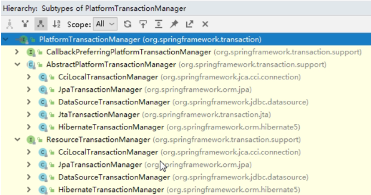


### 5、事务操作（注解声明式事务管理）

1. 在Spring配置文件中配置事务管理器

   ```xml
   <!--创建事务管理器-->
   <bean id="transactionManager" class="org.springframework.jdbc.datasource.DataSourceTransactionManager">
       <!--注入数据源-->
       <property name="dataSource" ref="dataSource"></property>
   </bean>
   ```

2. 在Spring配置文件，开启事务注解

   * 在Spring配置文件引入名称空间tx

     ```xml
     <?xml version="1.0" encoding="UTF-8"?>
     <beans xmlns="http://www.springframework.org/schema/beans"
            xmlns:xsi="http://www.w3.org/2001/XMLSchema-instance"
            xmlns:context="http://www.springframework.org/schema/context"
            xmlns:aop="http://www.springframework.org/schema/aop"
            xmlns:tx="http://www.springframework.org/schema/tx"
            xsi:schemaLocation="http://www.springframework.org/schema/beans http://www.springframework.org/schema/beans/spring-beans.xsd
                                http://www.springframework.org/schema/context http://www.springframework.org/schema/context/spring-context.xsd
                                http://www.springframework.org/schema/aop http://www.springframework.org/schema/aop/spring-aop.xsd
                                http://www.springframework.org/schema/tx http://www.springframework.org/schema/tx/spring-tx.xsd
     ">
     ```

   * 开启事务注解

     ```xml
     <!--开启事务注解-->
     <tx:annotation-driven transaction-manager="transactionManager"></tx:annotation-driven>
     ```

3. 在Service类上面（获取Service类里面方法上面）添加事务注解

   * **@Transactional** 这个注解添加到类上面，也可以添加方法上面

   * 如果把这个注解添加到类上面，这个类里面所有的方法都添加事务

   * 如果把这个注解添加到方法上面，为这个方法添加事务

     ```java
     @Service
     @Transactional
     public class UserService {
     }
     ```


### 6、事务操作（声明式事务管理参数配置）

1. 在service类上面添加@Transactional，在这个注解里面可以配置事务相关参数

   * **propagation**：事务传播行为

     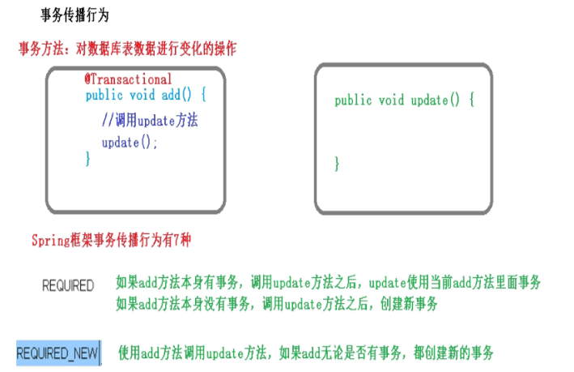

     事务的传播行为可以由传播属性指定，Spring定义了7种传播行为

     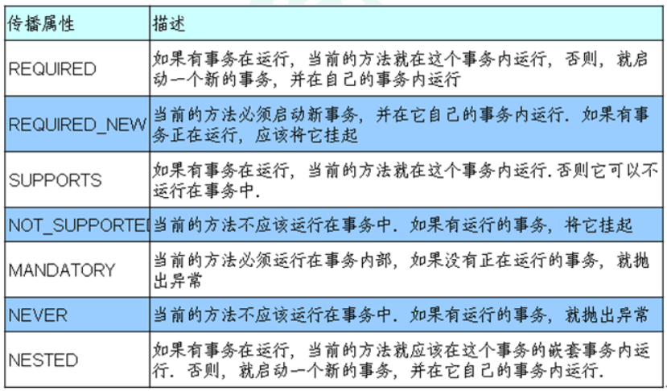

   * **isolation**：事务隔离级别

     1. 事务有特性称为隔离性，多事务操作之间不会产生影响。不考虑隔离性产生很多问题

     2. 有三个读问题：脏读、不可重复读、虚读

        1. 脏读

           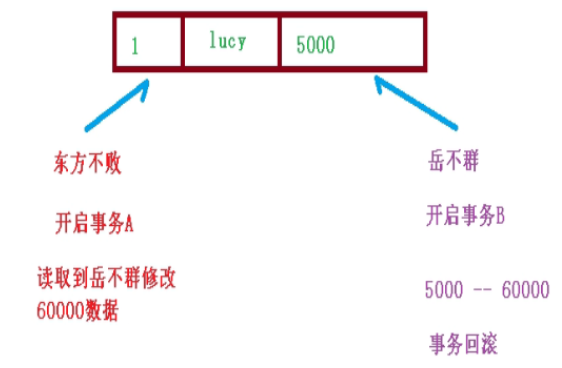

        2. 不可重复读：一个未提交事务读取到另一提交事务修改数据

           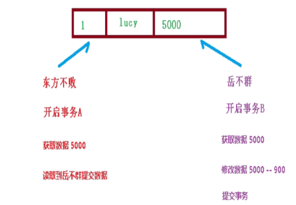

        3. 虚读

           一个未提交事务读取到另一个提交事务添加数据

        4. 解决：通过设置事务隔离级别，解决度问题

           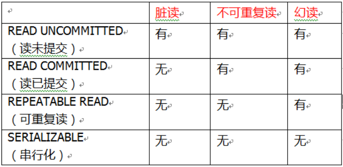

           ```java
           // 添加事务注解
           @Transactional(propagation = Propagation.REQUIRED,isolation = Isolation.REPEATABLE_READ)
           ```

   * **timeout**：超时时间

     * 事务需要在一定时间内进行提交，如果不提交进行回滚

     * 默认值：-1，设置时间以秒单位进行计算

       ```java
       @Transactional(timeout = -1,propagation = Propagation.REQUIRED,isolation = Isolation.REPEATABLE_READ)
       ```

   * **readOnly**：是否只读

     * 读：查询操作，写：添加修改删除操作

     * readOnly默认值false，表示可以查询，可以添加修改删除操作

     * 设置readOnly值为true，只能查询

       ```java
       @Transactional(readOnly = true,timeout = -1,propagation = Propagation.REQUIRED,isolation = Isolation.REPEATABLE_READ)
       ```

   * **rollbackFor**：不回滚

     * 设置出现哪些异常进行事务回滚

   * **norollbackFor**：不回滚

     * 设置出现哪些异常不进行事务回滚


### 7、事务操作（XML声明式事务管理）

1. Spring配置文件中进行配置

   ```xml
   <!--配置对象-->
   <bean id="userService" class="com.java.spring5.service.UserService">
       <property name="userDao" ref="userDao"></property>
   </bean>
   
   <bean id="userDao" class="com.java.spring5.dao.UserDaoImpl" autowire="byName">
       <property name="jdbcTemplate" ref="jdbcTemplate"></property>
   </bean>
   
   <!--数据库连接池-->
   <bean id="dataSource" class="com.alibaba.druid.pool.DruidDataSource" destroy-method="close">
       <property name="driverClassName" value="com.mysql.jdbc.Driver"></property>
       <property name="url" value="jdbc:mysql://localhost:3306/spring5?useUnicode=true&amp;characterEncoding=utf8"></property>
       <property name="username" value="root"></property>
       <property name="password" value="123456"></property>
   </bean>
   
   
   <!--配置JdbcTemplate对象-->
   <bean id="jdbcTemplate" class="org.springframework.jdbc.core.JdbcTemplate">
       <property name="dataSource" ref="dataSource"></property>
   </bean>
   ```

   ```xml
   <!--1. 创建事务管理器-->
   <bean id="transactionManager" class="org.springframework.jdbc.datasource.DataSourceTransactionManager">
       <!--注入数据源-->
       <property name="dataSource" ref="dataSource"></property>
   </bean>
   ```

2. 配置通知

   ```xml
   <!--2. 配置通知-->
   <tx:advice id="txadvice">
       <!--配置事务参数-->
       <tx:attributes>
           <!--指定那种规则的方法上面添加事务-->
           <tx:method name="accountMoney" propagation="REQUIRED"/>
       </tx:attributes>
   </tx:advice>
   ```

3. 配置切入点和切面

   ```xml
   <!--3. 配置切入点和切面-->
   <aop:config>
       <!--配置切入点-->
       <aop:pointcut id="pt" expression="execution(* cn.spring5.Aop.Service.UserService.*(..))"/>
       <!--配置切面-->
       <aop:advisor advice-ref="txadvice" pointcut-ref="pt"></aop:advisor>
   </aop:config>
   ```


### 8、事务操作（完全注解声明式事务管理）

1. 创建配置类，使用配置类替代xml配置文件

   ```java
   @Configuration // 配置类
   @ComponentScan(basePackages = "cn.spring5.Aop") // 组件扫描
   @EnableTransactionManagement // 开启事务
   public class TxConfig {
       // 创建数据库连接池
       @Bean
       public DruidDataSource getDruidDataSource(){
           DruidDataSource dataSource = new DruidDataSource();
           dataSource.setDriverClassName("com.mysql.jdbc.Driver");
           dataSource.setUrl("jdbc:mysql://127.0.0.1:3306/spring5");
           dataSource.setUsername("root");
           dataSource.setPassword("root");
           return dataSource;
       }
   
       //创建JdbcTemplate对象
       @Bean
       public JdbcTemplate getJdbcTemplate(DataSource dataSource){
           JdbcTemplate jdbcTemplate = new JdbcTemplate();
           // 注入DataSource
           jdbcTemplate.setDataSource(dataSource);
           return jdbcTemplate;
       }
   
       // 创建事务管理器
       @Bean
       public DataSourceTransactionManager getDataSourceTransactionManager(DataSource dataSource){
           DataSourceTransactionManager transactionManager = new DataSourceTransactionManager();
           transactionManager.setDataSource(dataSource);
           return transactionManager;
       }
   }
   ```

2. 测试类

   ```java
   @Test
   public void testAccountConfig(){
       ApplicationContext context = new AnnotationConfigApplicationContext(TxConfig.class);
       UserService userService = context.getBean("userService", UserService.class);
       userService.accountMoney();
   }
   ```

   

## 六、Spring5框架新功能

### 1、整合JUnit5单元测试框架

1. 整个Spring5框架的代码基于JDK8，运行时兼容JDK9，许多不建议使用的类和方法在代码库中删除

2. Spring5.0框架自带了通用的日志封装

   * Spring5已经移除Log4jConfigListener，官方建议使用Log4j2

   * Spring5框架整合Log4j2

     * 第一步  引入jar包

       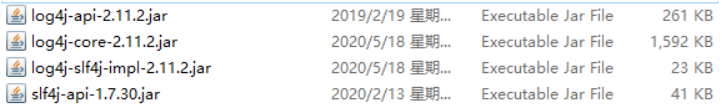

     * 第二步  创建Log4j2.xml配置文件

       ```xml
       <?xml version="1.0" encoding="UTF-8"?>
       <!--日志级别以及优先级排序: OFF > FATAL > ERROR > WARN > INFO > DEBUG > TRACE > ALL -->
       <!--Configuration后面的status用于设置log4j2自身内部的信息输出，可以不设置，当设置成trace时，可以看到log4j2内部各种详细输出-->
       <configuration status="INFO">
           <!--先定义所有的appender-->
           <appenders>
               <!--输出日志信息到控制台-->
               <console name="Console" target="SYSTEM_OUT">
                   <!--控制日志输出的格式-->
                   <PatternLayout pattern="%d{yyyy-MM-dd HH:mm:ss.SSS} [%t] %-5level %logger{36} - %msg%n"/>
               </console>
           </appenders>
           <!--然后定义logger，只有定义了logger并引入的appender，appender才会生效-->
           <!--root：用于指定项目的根日志，如果没有单独指定Logger，则会使用root作为默认的日志输出-->
           <loggers>
               <root level="info">
                   <appender-ref ref="Console"/>
               </root>
           </loggers>
       </configuration>
       ```

     * 测试

       ```java
       public class UserLog {
       
           private static final Logger log = (Logger) LoggerFactory.getLogger(UserLog.class);
       
           public static void main(String[] args) {
               log.info("hello log4j2");
               log.warn("hello log4j2");
           }
       }
       ```

       

3. Spring5框架核心容器支持**@Nullable**注解

   @Nullable注解可以使用在方法、属性、参数上面，表示方法返回可以为空，属性值可以为空，参数值可以为空

   ```java
   // 注解用在方法上面，方法返回值可以为空
   @Nullable
   String getId();
   
   // 注解使用在方法参数里面，方法参数可以为空
   public <T> void registerBean(@Nullable String beanName){
       
   }
   
   // 注解使用在属性上面，属性值可以为空
   @Nullable
   private String bookName;
   ```

4. Spring5核心容器支持函数式风格GenericApplicationContext

   ```java
   @Test
   public void testGenericApplicationContext(){
       // 创建GenericApplicationContext对象
       GenericApplicationContext context = new GenericApplicationContext();
       // 调用context的方法对象注册
       context.refresh();
       context.registerBean(User.class,()->new User());
       // 获取在spring注册的对象
       User user = (User)context.getBean("cn.spring5.Aop.Test.User");
       System.out.println(user);
   }
   ```

   ```java
   //注册Bean时给bean命名
   @Test
   public void testGenericApplicationContext2(){
       GenericApplicationContext context = new GenericApplicationContext();
       context.refresh();
       context.registerBean("userName",User.class, ()->new User());
       User bean = (User)context.getBean("userName");
       System.out.println(bean);
   }
   ```

5. Spring5支持整合JUnit5

   * 整合JUnit4

     * 第一步  引入Spring相关针对测试依赖

       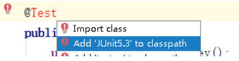

     * 第二步  创建测试类，使用注解方法完成

       ```java
       // 单元测试框架
       @RunWith(SpringJUnit4ClassRunner.class)
       // 加载配置文件
       @ContextConfiguration("classpath:bean2.xml")
       public class JTest4 {
           @Autowired
           private UserService userService;
       
           @Test
           public void test(){
               userService.accountMoney();
           }
       }
       ```

   * 整合JUnit5

     * 第一步  引入JUnit5的jar包

       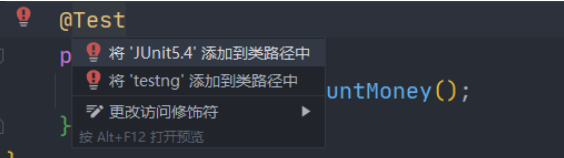

     * 第二步  创建测试类，使用注解完成

       ```java
       @ExtendWith(SpringExtension.class)
       @ContextConfiguration("classpath:bean2.xml")
       public class JTest4 {
           @Autowired
           private UserService userService;
       
           @Test
           public void test1(){
               userService.accountMoney();
           }
       }
       ```

     * 使用复合注解替代上面两个注解完成整合

       ```java
       @SpringJUnitConfig(locations = "classpath:bean2.xml")
       ```


### 2、Webflux - 基本概念

1. SpringWebflux介绍

   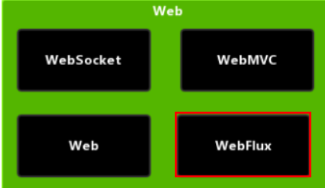

   * 是Spring5添加的新的模块，用于Web开发，功能和SpringMVC类似，Webflux使用当前一种比较流行程响应式编程出现的框架

   * 使用传统web框架，比如SpringMVC这些基于Servlet容器，Webflux是一种一步非阻塞的框架，异步非阻塞的框架在Servlet3.1后才支持，核心是基于Reactor的相关API实现

   * 什么是异步非阻塞？

     * 异步和同步：异步和同步针对调用者，调用者发送请求，如果等着对方回应之后才去做其他事情就是同步，如果发送请求之后不等着对方回应就去做其他事情就是异步
     * 阻塞和非阻塞针对被调用者，被调用者收到请求后，做完请求任务之后才给出反馈的就是阻塞，收到请求之后马上给出反馈然后再去做事就是非阻塞

   * Webflux特点

     * 第一  非阻塞式：在有限资源下，提高系统吞吐量和伸缩性，以Reactor为基础实现响应式编程
     * 第二  函数式编程：Spring5框架基于java8，Webflux使用java8函数式编程方式实现路由请求

   * 比较SpringMVC

     * 两个框架都可以使用注解方式，都运行在Tomcat等容器上

     * SpringMVC采用命令式编程，Webflux采用异步响应式编程

       

   

2. 响应式编程

   响应式编程是一种面向数据流和变化传播的编程范式。这意味着可以在编程语言中很方便 地表达静态或动态的数据流，而相关的计算模型会自动将变化的值通过数据流进行传播。 电子表格程序就是响应式编程的一个例子。单元格可以包含字面值或类似"=B1+C1"的公 式，而包含公式的单元格的值会依据其他单元格的值的变化而变化。

   * Java8及其之前版本

     提供的观察这模式两个类Observer和Observable

     ```java
     public class ObserverDemo extends Observable {
         public static void main(String[] args) {
             ObserverDemo observerDemo = new ObserverDemo();
             // 添加观察者
             observerDemo.addObserver((o,arg)->{
                 System.out.println("发生变化"+arg);
             });
             observerDemo.addObserver((o,arg)->{
                 System.out.println("收到被观察者通知，准备改变"+arg);
             });
             observerDemo.setChanged();// 数据变化
             observerDemo.notifyObservers();//通知
         }
     }
     ```

3. 响应式编程（Reactor实现）

   * 响应式编程操作中，Reactor是满足Reactive规范框架

   * Reactor有两个核心类，Mono和Flux，这两个实现接口Publisher提供丰富操作符。flux对象实现发布者，返回N个元素。Mono实现发布者，返回0或者1个元素

   * Flux和Mono都是数据流的发布者，使用Flux和Mono都可以发出三种数据信号：**元素值，错误信号，完成信号**。错误信号和完成信号都代表终止信号，终止信号用于告诉订阅者数据流结束了，错误信号终止数据流同时把错误信息传递给订阅者

     

4. 代码演示Flux和Mono

   ```xml
   <!--第一步 引入依赖-->
   <dependencies>
       <dependency>
           <groupId>io.projectreactor</groupId>
           <artifactId>reactor-core</artifactId>
           <version>3.1.5.RELEASE</version>
       </dependency>
   </dependencies>
   ```

   ```java
   public static void main(String[] args) {
       // just方法直接声明
       Flux.just(1,2,3,4);
       Mono.just(1);
       // 其他方法
       Integer[] array = {1,2,3,4};
       Flux.fromArray(array);
   
       List<Integer> list = Arrays.asList(array);
       Flux.fromIterable(list);
   
       Stream<Integer> stream = list.stream();
       Flux.fromStream(stream);
   }
   ```

   **三种信号的特点**

   * 错误信号和完成信号都是终止信号，不能共存
   * 如果没有发送任何信号元素值，而是直接发送错误或者完成信号，表示是空数据流
   * 如果没有错误信号，没有完成信号，表示是无限数据流

   调用just或者其他方法只是声明数据流，数据流并没有发出，只有进行订阅之后才会触发数据流，不订阅声明都不会发生的

   ```java
   public static void main(String[] args) {
       // just方法直接声明
       Flux.just(1,2,3,4).subscribe(System.out::print);
       Mono.just(1).subscribe(System.out::println);
   }
   ```

   **操作符**

   * map元素映射为新元素

   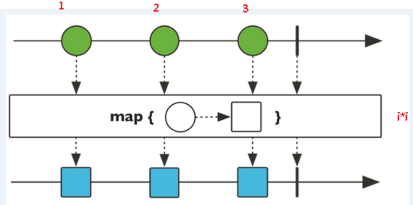

   * flatMap元素映射为流

     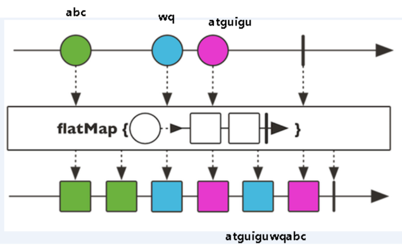


### 3、SpringWebflux执行流程和核心API

SpringWebflux就Reactor，默认使用容器Netty，Netty是高性能的NIO框架，异步非阻塞的框架

* Netty

  BIO

  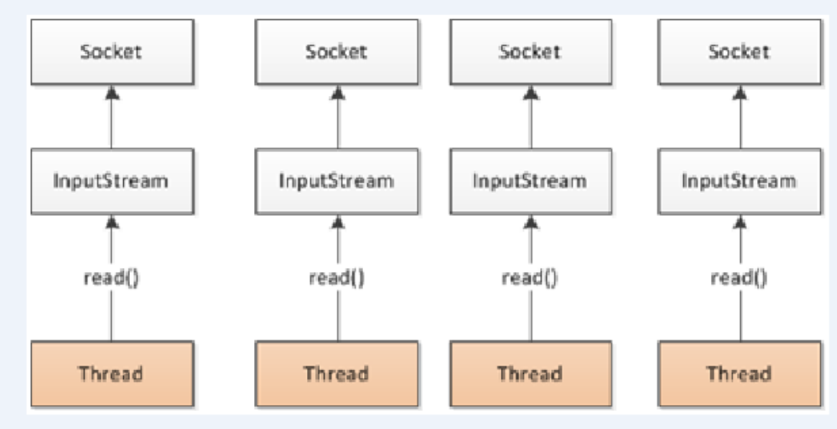

  NIO

  

* SpringWebflux执行过程和SpringMVC相似

  * SpringWebflux核心控制器DispatchHandler，实现接口WebHandler

  * 接口WebHandler有一个方法

    ```java
    public interface WebHandler {
        Mono<Void> handle(ServerWebExchang var1)
    }
    ```

    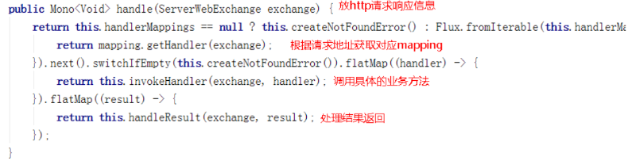

* SpringWebflux里面DispatchHandler，负责请求的处理

  * HandlerMapping：请求查询到处理的方法
  * HandlerAdapter：真正负责请求处理
  * HandlerResuktHandler：响应结束处理

* SpringWebflux实现函数式编程，两个接口：RouterFunction(路由处理)和HandlerFunction(处理函数)


### 4、SpringWebflux（基于注解编程模型）

* SpringWebflux实现方式有两种：

  * 注解编程模型

    使用注解编程模式方式，和之前SpringMVC使用相似，只需要把相关依赖配置到项目中，SpringBoot自动配置相关运行的容器，默认情况下使用Netty服务器

  * 函数式编程模型

* 演示

  * 第一步  创建SpringBoot工程，引入Webflux依赖

    ```xml
    <!--pom.xml-->
    <dependencies>
        <dependency>
            <groupId>org.springframework.boot</groupId>
            <artifactId>spring-boot-starter-webflux</artifactId>
        </dependency>
    </dependencies>
    ```

  * 第二步  配置启动端口

    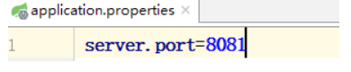

  * 第三步  创建包和相关类

    ```java
    //实体类
    public class User {
        private String name;
        private String gender;
        private Integer age;
    
        public User(String name, String gender, Integer age) {
            this.name = name;
            this.gender = gender;
            this.age = age;
        }
    
        public String getName() {
            return name;
        }
    
        public void setName(String name) {
            this.name = name;
        }
    
        public String getGender() {
            return gender;
        }
    
        public void setGender(String gender) {
            this.gender = gender;
        }
    
        public Integer getAge() {
            return age;
        }
    
        public void setAge(Integer age) {
            this.age = age;
        }
    }
    ```

    ```java
    //创建接口定义操作的方法
    public interface UserService {
        /** 根据id查询用户*/
        Mono<User> getUserById(int id);
    
        /** 查询所有用户*/
        Flux<User> getAllUser();
    
        /** 添加用户*/
        Mono<Void> saveUserInfo(Mono<User> user);
    }
    ```

    ```java
    //接口实现类
    public class UserServiceImpl implements UserService {
        /** 创建map集合存储数据*/
        private final Map<Integer,User> userMap = new HashMap<>();
    
        public UserServiceImpl() {
            this.userMap.put(1, new User("lucy","nan",20));
            this.userMap.put(2, new User("mary","nv",30));
            this.userMap.put(3, new User("jack","nan",40));
            this.userMap.put(4, new User("WeiSanJin","nan",50));
        }
    
        /** 根据id查询*/
        @Override
        public Mono<User> getUserById(int id) {
            return Mono.justOrEmpty(this.userMap.get(id));
        }
    
        /** 查询多个用户*/
        @Override
        public Flux<User> getAllUser() {
            return Flux.fromIterable(this.userMap.values());
        }
    
        /** 添加用户*/
        @Override
        public Mono<Void> saveUserInfo(Mono<User> userMono) {
            return userMono.doOnNext(person -> {
                /* 向map集合里面放值*/
                int id = userMap.size()+1;
                userMap.put(id,person);
            }).thenEmpty(Mono.empty());
        }
    }
    ```

    ```java
    //Controller
    @RestController
    public class UserController {
        /** 注入service*/
        @Autowired
        private UserService userService;
    
        /** id查询*/
        @GetMapping("/user/{id}")
        public Mono<User> getUserId(@PathVariable int id){
            return userService.getUserById(id);
        }
    
        /** 查询所有*/
        @GetMapping("/user")
        public Flux<User> getUser(){
            return userService.getAllUser();
        }
    
        /** 添加*/
        @PostMapping("/saveUser")
        public Mono<Void> saveUser(@RequestBody User user){
            Mono<User> userMono = Mono.just(user);
            return userService.saveUserInfo(userMono);
        }
    
    }
    ```

  * 说明

    SpringMVC方法实现，同步阻塞的方式，基于SpringMVC+Servlet+Tomcat

    SpringWebflux方式实现，异步非阻塞方式，基于SpringWebflux+Reactor+Netty

  

### 5、SpringWebflux（基于函数式编程模型）

1. 在使用函数式编程模型操作的时候，需要自己初始化服务器

2. 基于函数式编程模型时，与两个核心接口：RouterFunction（实现路由功能，请求转发给对应的handler）和HandlerFunction（处理请求生成响应的函数）。核心任务定义两个函数式接口的实现并且启动需要的服务器

3. SpringWebflux请求和响应不再是ServletRequest和ServletResponse，而是ServerRequest和ServerResponse

   * 第一步  把注解编程模型工程复制一份，保留entity和service内容

   * 第二步  创建Handler(具体实现方法)

     ```java
     public class UserHandler {
         private final UserService userService;
         public UserHandler(UserService userService){
             this.userService = userService;
         }
     
         /** 根据id查询*/
         public Mono<ServerResponse> getUserById(ServerRequest request){
             /* 获取id*/
             int userId = Integer.valueOf(request.pathVariable("id"));
             /* 空值处理*/
             Mono<ServerResponse> notFound = ServerResponse.notFound().build();
             /* 调用service方法得到数据*/
             Mono<User> userMono = this.userService.getUserById(userId);
             /* userMono进行转换返回*/
             /* 使用Reactor操作符fluxMap*/
             return userMono
                 .flatMap(person -> ServerResponse.ok().contentType(MediaType.APPLICATION_JSON)
                          .body(BodyInserters.fromObject(person)))
                 .switchIfEmpty(notFound);
         }
     
         /** 查询所有*/
         public Mono<ServerResponse> getAllUser(){
             /* 调用service得到结果*/
             Flux<User> userFlux = this.userService.getAllUser();
             return ServerResponse.ok().contentType(MediaType.APPLICATION_JSON).body(userFlux,User.class);
         }
     
         /** 添加*/
         public Mono<ServerResponse> saveUser(ServerRequest request){
             /* 得到user对象*/
             Mono<User> userMono = request.bodyToMono(User.class);
             return ServerResponse.ok().build(this.userService.saveUserInfo(userMono));
         }
     ```

   * 第三步  初始化服务器，编写Router

     创建路由方法

     ```java
     public class Server {
         /** 创建Router路由*/
         public RouterFunction<ServerResponse> routerFunction(){
             /* 创建hanler对象*/
             UserService userService = new UserServiceImpl();
             UserHandler handler = new UserHandler(userService);
             /* 设置路由*/
             return RouterFunctions.route(
                 GET("/user/{id}").and(accept(APPLICATION_JSON)),handler::getUserById)
                 .andRoute(GET("/user").and(accept(APPLICATION_JSON)),handler::getAllUser);
     
         }
     }
     ```

   * 创建服务器完成适配

     ```java
     public class Server {
         /** 创建服务器完成配置*/
         public void createReactorServer(){
             /*路由和handler适配*/
             RouterFunction<ServerResponse> route = routerFunction();
             HttpHandler httpHandler = RouterFunctions.toHttpHandler(route);
             ReactorHttpHandlerAdapter adapter = new ReactorHttpHandlerAdapter(httpHandler);
     
             /* 创建服务器*/
             HttpServer httpServer = HttpServer.create();
             httpServer.handle(adapter).bindNow();
         }
     }
     ```

   * 最终调用

     ```java
     public class Server {
         public static void main(String[] args) throws Exception {
             Server server = new Server();
             server.createReactorServer();
             System.out.println("enter to exit");
             System.in.read();
         }
     }
     ```

4. 使用WebClient调用

   ```java
   public class Client {
       public static void main(String[] args) {
           /* 调用服务器地址*/
           WebClient webClient = WebClient.create("http://127.0.0.1:8080");
   
           /* 根据ID查询*/
           String id = "1";
           User userResult = webClient.get().uri("/user/{id}",id)
                   .accept(MediaType.APPLICATION_JSON).retrieve().bodyToMono(User.class)
                   .block();
           System.out.println(userResult.getName());
   
           /* 查询所有*/
           Flux<User> results = webClient.get().uri("/user").accept(MediaType.APPLICATION_JSON).retrieve().bodyToFlux(User.class);
           results.map(stu ->stu.getName()).buffer().doOnNext(System.out::println).blockFirst();
       }
   }
   ```


## 课程总结

1. Spring框架概述
   * 轻量级开源JavaEE框架，为了解决企业复杂性，两个核心组成：IOC和AOP
   * Spring5.2.6版本
2. IOC容器
   1. IOC底层原理（工厂、反射等）
   2. IOC接口（BeanFactory）
   3. IOC操作Bean管理（基于xml）
   4. IOC操作Bean管理（基于注解）
3. AOP
   1. AOP底层原理：动态代理，有接口（JDK动态代理），没有接口（CGLIB动态代理）
   2. 术语：切入点、增强（通知）、切面
   3. 基于AspectJ实现AOP操作
4. JdbcTemplate
   1. 使用JdbcTemplate实现数据库CRUD操作
   2. 使用JdbcTemplate实现数据库批量操作
5. 事务管理
   1. 事务概念
   2. 重要概念（传播行为和隔离级别）
   3. 基于注解实现声明式事务管理
   4. 完全注解方式实现声明式事务管理
6. Spring5新功能
   1. 整合日志框架
   2. @Nullable注解
   3. 函数式注册对象
   4. 整合JUnit5单元测试框架
   5. SpringWebflux使用

  

  