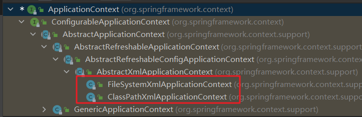

# 第02章_Spring IoC和DI（依赖注入）

---

## 一、IoC概念和原理

### 1、什么是IoC

Spring IOC名为控制反转，负责创建对象，管理对象（通过依赖注入（DI）），装配对象，配置对象，并且管理这些对象的整个声明周期

使用IOC目的：为了降低耦合度

### 2、IOC底层

xml解析、工厂模式、反射

### 3、IOC思想基于IOC容器完成，IOC容器底层就是对象工厂，Spring提供IOC容器实现的两种方式（两个接口）

* BeanFactory接口：

  IOC容器基本实现是Spring内部接口的使用接口，不提供给开发人员进行使用（加载配置文件时候不会创建对象，在获取对象时才会创建对象。）

* ApplicationContext接口：

  BeanFactory接口的子接口，提供更多更强大的功能，提供给开发人员使用（加载配置文件时候就会把在配置文件对象进行创建）推荐使用！

### 4、ApplicationContext通常的实现是什么？

* FileSystemXmlApplicationContext：此容器从一个XML文件中加载beans的定义，XML Bean配置文件的全路径名必须提供给它的构造函数

* ClassPathXmlApplicationContext：此容器也从一个XML文件中加载beans的定义，这里需要正确设置classpath，因为这个容器将在classpath里找bean配置

  

### 5、IOC的优点是什么？

IOC或依赖注入把应用的代码量降到最低。它使应用容易测试，单元测试不再需要单例和JNDI查找机制。最小的代价和最小的侵入性使松散耦合得以实现。IOC容器支持加载服务时的饿汉式初始化和懒汉式

### 6、Bean工厂和Application contexts有什么区别？

Application contexts提供一种方法处理文本消息，一个通常的做法是加载文件资源（比如镜像），它们可以向注册为监听器的bean发布事件。另外，在容器或容器内的对象上执行的那些不得不由bean工厂以程序化方式处理的操作，可以在Application contexts中以声明的方式处理。Application contexts实现了MessageSource接口，该接口的实现以可插拔的方式提供获取本地化消息的方法。

## 二、依赖注入（DI：Dependency Injection）

### 1、什么是Spring的依赖注入？

依赖注入，是IOC的一个方面，是个通常的概念，它有多种解释。这概念是说你不用创建对象，而只需要描述它如何被创建。你不在代码里直接组装你的组件和服务，但是要在配置文件里描述哪些组件需要哪些服务，之后一个容器（IOC容器）负责把他们组装起来。

### 2、有哪些不同类型的IOC(依赖注入)方式？

* **构造器依赖注入**：构造器依赖注入通过容器触发一个类的构造器来实现的，该类有一系列参数，每个参数代表一个对其他类的依赖
* **Setter方法注入**：Setter方法注入是容器通过调用无参构造器或无参static工厂方法实例化bean之后，调用该bean的setter方法，即实现了基于setter的依赖注入

### 3、哪种依赖注入方式建议使用？构造器注入还是Setter方法注入？

两种依赖方式都可以使用，构造器注入和Setter方法注入。最好的解决方案是用构造器参数实现强制依赖，setter方法实现可选依赖