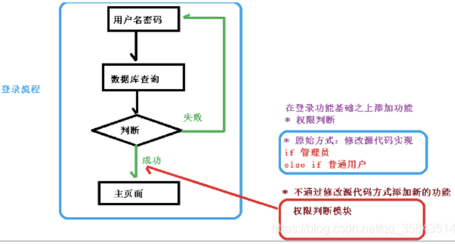

# 第04章_Spring AOP

---

## 一、什么是AOP

### 1、AOP

AOP（Aspect Oriented Programming），即面向切面编程，是OOP的补充，它也提供了模块化。

在面向对象编程中，关键的单元是对象，AOP的关键单元是切面，或者说关注点（可以简单地理解为你程序中的独立模块）。

一些切面可能有集中的代码，但是有些可能被分散或者混杂在一起，例如日志或者事务。这些分散的切面被称为横切关注点。一个横切关注点是一个可以影响到整个应用的关注点，而且应该被尽量地集中到代码的一个地方，例如事务管理、权限、日志、安全等。

AOP让你可以使用简单可插拔的配置，在实际逻辑执行之前、之后或周围动态添加横切关注点。这让代码在当下和将来都变得易于维护。如果你是使用XML来使用切面的话，要添加或删除关注点，你不用重新编译完整的源代码，而仅仅需要修改配置文件就可以了。

总而言之，AOP就是使用不修改源代码的方式，在主干功能里添加新的功能

### 2、Spring AOP中的一些概念

**切面(Aspect)**：AOP核心就是切面，它将多个类的通用行为封装成可重用的模块，该模块含有一组API提供横切功能。比如，一个日志模块可以被称作日志的AOP切面。根据需求的不同，一个应用程序可以有若干切面。在Spring AOP中，切面通过带有@Aspect注解的类实现

**连接点(Join Point)**：在程序执行过程中的一点，例如方法的执行或异常的处理。在Spring AOP中，连接点始终代表方法的执行

**通知(Advice)**：AOP在特定的切入点上执行的增强处理，有before, after, afterReturning, afterThrowing, around

**切入点（Pointcut）**：决定处理如权限校验、日志记录等在何处切入业务代码中（即织入切面）。切点分为execution方式和annotation方式。前者可以用路径表达式指定哪些类织入切面，后者可以指定被哪些注解修饰的代码织入切面

**引介（Introduction）**：引介让一个切面可以声明被通知的对象实现了任何他们没有真正实现的额外接口，而且为这些对象提供接口的实现使用 @DeclareParaents 注解来生成一个引介

**目标对象（Target object）**：一个或多个切面通知的对象。也称为通知对象。由于Spring AOP是使用运行时代理实现的，因此该对象将始终是代理对象

**AOP代理（AOP proxy）**：由AOP框架创建的对象，用于实施Aspect（处理方法执行等）。在Spring Framework中，AOP代理将是JDK动态代理或CGLIB代理

**织入（Weaving）**：织入，就是通过动态代理，在目标对象方法中执行处理内容的过程

### 3、通知的类型

通知（advice）是你在你的程序中想要应用在其他模块中的横切关注点的实现。Advice主要有以下5种类型：

