# Docker基础篇

---

## 1、概述

官网：<https://www.docker.com/>

### 1.1 容器较为官方的解释

**一句话概括容器：容器就是将软件打包成标准化单元，以用于开发、交付和部署**

* **容器镜像是轻量的、可执行的独立软件包** ，包含软件运行所需的所有内容：代码、运行时环境、系统工具、系统库和设置。
* **容器化软件适用于基于 Linux 和 Windows 的应用**，在任何环境中都能够始终如一地运行。
* **容器赋予了软件独立性，使其免受外在环境差异**（例如，开发和预演环境的差异）的影响，从而有助于减少团队间在相同基础设施上运行不同软件时的冲突。

### 1.2 容器较为通俗的解释

**如果需要通俗地描述容器的话，我觉得容器就是一个存放东西的地方，就像书包可以装各种文具、衣柜可以放各种衣服、鞋架可以放各种鞋子一样。我们现在所说的容器存放的东西可能更偏向于应用比如网站、程序甚至是系统环境**

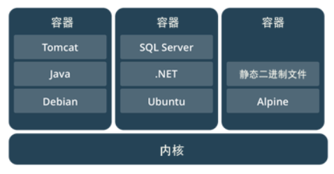


## 2、虚拟化技术和容器技术

Docker 技术是基于 LXC（Linux container- Linux 容器）虚拟容器技术的。

> LXC，其名称来自 Linux 软件容器（Linux Containers）的缩写，一种操作系统层虚拟化（Operating system–level virtualization）技术，为 Linux 内核容器功能的一个用户空间接口。它将应用软件系统打包成一个软件容器（Container），内含应用软件本身的代码，以及所需要的操作系统核心和库。通过统一的名字空间和共用 API 来分配不同软件容器的可用硬件资源，创造出应用程序的独立沙箱运行环境，使得 Linux 用户可以容易的创建和管理系统或应用容器。

**虚拟化技术特点**：

1. 资源占用多
2. 冗余步骤多
3. 启动很慢

**容器化技术**：容器化技术不是模拟的一个完整的操作系统

**比较Docker和虚拟机的不同**：

1. 传统虚拟机，虚拟出硬件，运行一个完整的操作系统，然后在这个系统上安装和运行软件
2. Docker容器内的应用直接运行在宿主机的内核中，容器是没有自己的内核的，也没有虚拟硬件
3. 每个容器都是相互隔离的，每个容器都有属于自己的文件系统，互不影响


## 3、Docker基本组成

**Docker 中有非常重要的三个基本概念，理解了这三个概念，就理解了 Docker 的整个生命周期**

- **镜像（Image）**
- **容器（Container）**
- **仓库（Repository）**

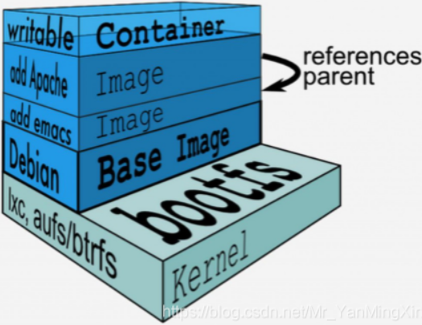


## 4、Docker安装

### 4.1 查看系统内核和系统信息

命令：

```shell
uname -r     #查看系统内核版本
cat /etc/os-release  #查看系统版本
```

示例：

```shell
[root@iZ1608aqb7ntn9Z /]# uname -r
4.18.0-193.14.2.el8_2.x86_64
[root@iZ1608aqb7ntn9Z /]# cat /etc/os-release
NAME="CentOS Linux"
VERSION="8 (Core)"
ID="centos"
ID_LIKE="rhel fedora"
VERSION_ID="8"
PLATFORM_ID="platform:el8"
PRETTY_NAME="CentOS Linux 8 (Core)"
ANSI_COLOR="0;31"
CPE_NAME="cpe:/o:centos:centos:8"
HOME_URL="https://www.centos.org/"
BUG_REPORT_URL="https://bugs.centos.org/"

CENTOS_MANTISBT_PROJECT="CentOS-8"
CENTOS_MANTISBT_PROJECT_VERSION="8"
REDHAT_SUPPORT_PRODUCT="centos"
REDHAT_SUPPORT_PRODUCT_VERSION="8"
```

### 4.2 开始安装Docker

#### 4.2.1 卸载旧版本

命令：

```shell
yum remove docker \
                  docker-client \
                  docker-client-latest \
                  docker-common \
                  docker-latest \
                  docker-latest-logrotate \
                  docker-logrotate \
                  docker-engine
```

示例：

```shell
[root@iZ1608aqb7ntn9Z /]# yum remove docker \
>                   docker-client \
>                   docker-client-latest \
>                   docker-common \
>                   docker-latest \
>                   docker-latest-logrotate \
>                   docker-logrotate \
>                   docker-engine
No match for argument: docker
No match for argument: docker-client
No match for argument: docker-client-latest
No match for argument: docker-common
No match for argument: docker-latest
No match for argument: docker-latest-logrotate
No match for argument: docker-logrotate
No match for argument: docker-engine
没有软件包需要移除。
依赖关系解决。
无需任何处理。
完毕！
```

#### 4.2.2 下载依赖安装包

```shell
yum install -y yum-utils
```

#### 4.2.3 配置镜像仓库

```shell
#国外的地址
yum-config-manager \
    --add-repo \
    https://download.docker.com/linux/centos/docker-ce.repo  
    
# 设置阿里云的Docker镜像仓库
yum-config-manager \
    --add-repo \
    https://mirrors.aliyun.com/docker-ce/linux/centos/docker-ce.repo
```

#### 4.2.4 更新yum软件包

```shell
yum makecache fast
```

#### 4.2.5 下载Docker

```shell
yum install docker-ce docker-ce-cli containerd.io   # 安装社区版
yum install docker-ee docker-ee-cli containerd.io   # 安装企业版
```

一般情况下安装`社区版`


### 4.3 启动Docker

命令：

```shell
systemctl start docker   # 启动Docker
docker version           # 查看当前版本号，是否启动成功
systemctl enable docker  # 设置开机自启动
```

示例：

```shell
[root@iZ1608aqb7ntn9Z /]# systemctl start docker
[root@iZ1608aqb7ntn9Z /]# docker version
Client: Docker Engine - Community
 Version:           20.10.7
 API version:       1.41
 Go version:        go1.13.15
 Git commit:        f0df350
 Built:             Wed Jun  2 11:56:24 2021
 OS/Arch:           linux/amd64
 Context:           default
 Experimental:      true

Server: Docker Engine - Community
 Engine:
  Version:          20.10.7
  API version:      1.41 (minimum version 1.12)
  Go version:       go1.13.15
  Git commit:       b0f5bc3
  Built:            Wed Jun  2 11:54:48 2021
  OS/Arch:          linux/amd64
  Experimental:     false
 containerd:
  Version:          1.4.9
  GitCommit:        e25210fe30a0a703442421b0f60afac609f950a3
 runc:
  Version:          1.0.1
  GitCommit:        v1.0.1-0-g4144b63
 docker-init:
  Version:          0.19.0
  GitCmit:        de40ad0
```


### 4.4 Docker的HelloWorld

命令：

```shell
docker run hello-world
```

示例：

```shell
[root@iZ1608aqb7ntn9Z /]# docker run hello-world
Unable to find image 'hello-world:latest' locally  # 本地没有
latest: Pulling from library/hello-world           # pull一个最新版
b8dfde127a29: Pull complete                        # pull成功
Digest: sha256:df5f5184104426b65967e016ff2ac0bfcd44ad7899ca3bbcf8e44e4461491a9e
Status: Downloaded newer image for hello-world:latest

Hello from Docker!                                 # 运行结果
This message shows that your installation appears to be working correctly.

To generate this message, Docker took the following steps:
 1. The Docker client contacted the Docker daemon.
 2. The Docker daemon pulled the "hello-world" image from the Docker Hub.
    (amd64)
 3. The Docker daemon created a new container from that image which runs the
    executable that produces the output you are currently reading.
 4. The Docker daemon streamed that output to the Docker client, which sent it
    to your terminal.

To try something more ambitious, you can run an Ubuntu container with:
 $ docker run -it ubuntu bash

Share images, automate workflows, and more with a free Docker ID:
 https://hub.docker.com/

For more examples and ideas, visit:
 https://docs.docker.com/get-started/
```


### 5、Docker卸载

```shell
yum remove docker-ce docker-ce-cli containerd.io  # 卸载依赖
rm -rf /var/lib/docker    # 删除资源  . /var/lib/docker是docker的默认工作路径
```


### 6、配置阿里云镜像

### 6.1 进入阿里云官网，搜索容器镜像服务

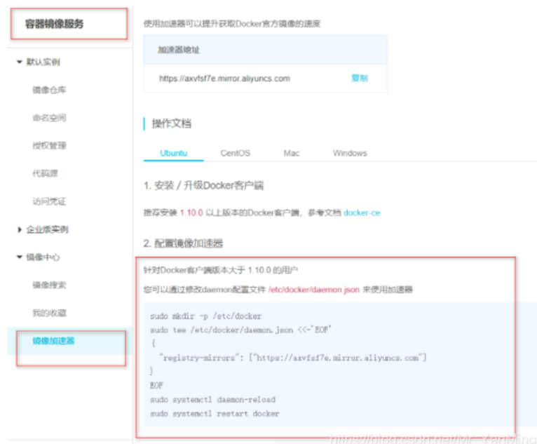

### 6.2 执行命令

```shell
sudo mkdir -p /etc/docker
sudo tee /etc/docker/daemon.json <<-'EOF'
{
  "registry-mirrors": ["https://axvfsf7e.mirror.aliyuncs.com"]
}
EOF
sudo systemctl daemon-reload
sudo systemctl restart docker
```


## 7、Docker运行流程和原理

### 7.1 启动流程

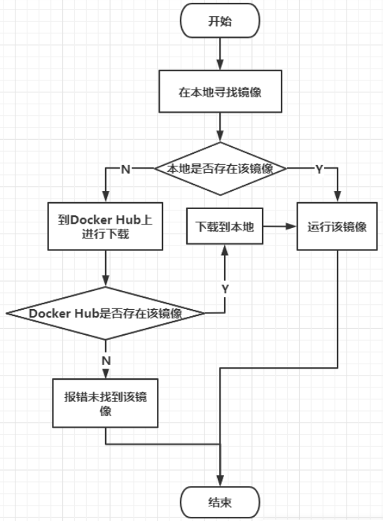

### 7.2 运行原理

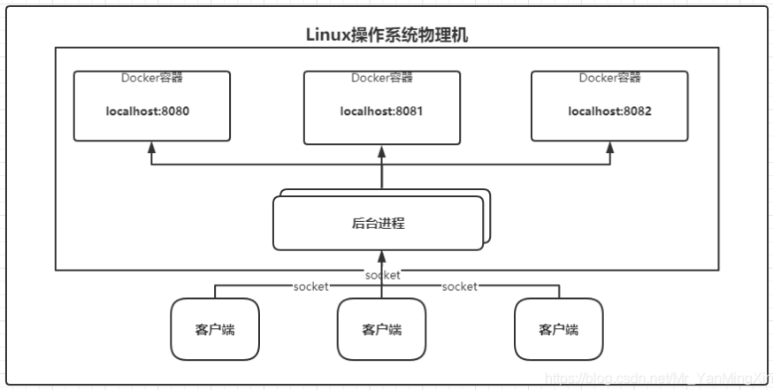

### 7.3 Docker整体架构

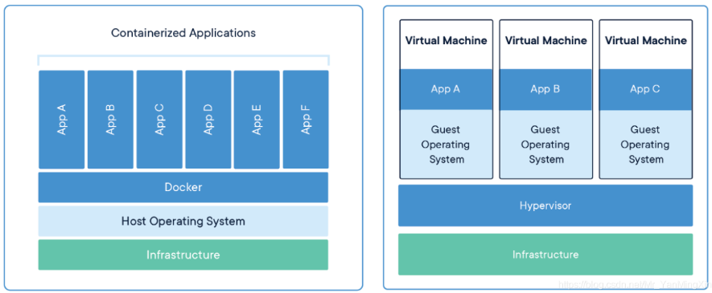


## 8、Docker常压命令

命令的帮助文档地址:https://docs.docker.com/engine/reference/commandline/docker/

### 8.1 基本命令

命令：

```shell
docker version          #查看docker的版本信息
docker info             #查看docker的系统信息,包括镜像和容器的数量
docker 命令 --help       #帮助命令(可查看可选的参数)
docker COMMAND --help
```

示例：

```shell
[root@iZ1608aqb7ntn9Z /]# docker info
Client:
 Context:    default
 Debug Mode: false
 Plugins:
  app: Docker App (Docker Inc., v0.9.1-beta3)
  buildx: Build with BuildKit (Docker Inc., v0.5.1-docker)
  scan: Docker Scan (Docker Inc., v0.8.0)
Server:
 Containers: 1
  Running: 0
  Paused: 0
  Stopped: 1
 Images: 1
 Server Version: 20.10.7
......
```


### 8.2 镜像命令

#### 8.2.1 docker images  ---  查看本地主机的所有镜像

示例：

```shell
[root@iZ1608aqb7ntn9Z /]# docker images
REPOSITORY    TAG       IMAGE ID       CREATED        SIZE
hello-world   latest    d1165f221234   5 months ago   13.3kB
```

列表参数介绍：

```shell
# 解释:
1.REPOSITORY  镜像的仓库源
2.TAG  镜像的标签
3.IMAGE ID 镜像的id
4.CREATED 镜像的创建时间
5.SIZE 镜像的大小
# 可选参数
-a/--all 列出所有镜像
-q/--quiet 只显示镜像的id
```


#### 8.2.2 docker search  ---  搜索镜像

示例：

```shell
[root@iZ1608aqb7ntn9Z /]# docker search mysql
NAME                            DESCRIPTION                                     STARS     OFFICIAL   AUTOMATED
mysql                           MySQL is a widely used, open-source relation…   13556     [OK]
mariadb                         MariaDB Server is a high performing open sou…   5168      [OK]
phpmyadmin                      phpMyAdmin - A web interface for MySQL and M…   699       [OK]
percona                         Percona Server is a fork of the MySQL relati…   596       [OK]
...
```

```shell
#可选参数
Search the Docker Hub for images
Options:
  -f, --filter filter   Filter output based on conditions provided
      --format string   Pretty-print search using a Go template
      --limit int       Max number of search results (default 25)
      --no-trunc        Don't truncate output
            
#搜索收藏数大于3000的镜像
[root@iZwz99sm8v95sckz8bd2c4Z ~]# docker search mysql --filter=STARS=3000
NAME      DESCRIPTION                                     STARS     OFFICIAL   AUTOMATED
mysql     MySQL is a widely used, open-source relation…   10308     [OK]
mariadb   MariaDB is a community-developed fordockerk of MyS…   3819      [OK]
```


#### 8.2.3 docker pull 镜像名[:tag]  ---  下载镜像

示例：

```shell
[root@iZ1608aqb7ntn9Z /]# docker pull mysql:5.7
5.7: Pulling from library/mysql
33847f680f63: Pull complete 
5cb67864e624: Pull complete 
1a2b594783f5: Pull complete 
b30e406dd925: Pull complete 
48901e306e4c: Pull complete 
603d2b7147fd: Pull complete 
802aa684c1c4: Pull complete 
5b5a19178915: Pull complete 
f9ce7411c6e4: Pull complete 
f51f6977d9b2: Pull complete 
aeb6b16ce012: Pull complete 
Digest: sha256:be70d18aedc37927293e7947c8de41ae6490ecd4c79df1db40d1b5b5af7d9596
Status: Downloaded newer image for mysql:5.7
docker.io/library/mysql:5.7
```


#### 8.2.4 docker rmi  ---   删除镜像

```shell
#1.删除指定的镜像id
[root@iZwz99sm8v95sckz8bd2c4Z ~]# docker rmi -f  镜像id
#2.删除多个镜像id
[root@iZwz99sm8v95sckz8bd2c4Z ~]# docker rmi -f  镜像id 镜像id 镜像id
#3.删除全部的镜像id
[root@iZwz99sm8v95sckz8bd2c4Z ~]# docker rmi -f  $(docker images -aq)
```


### 8.3 容器命令

#### 8.3.1 docker run [可选参数] image  ---  运行一个新的容器

```shell
docker run [可选参数] image

#参数说明
--name="名字"           指定容器名字
-d                     后台方式运行
-it                    使用交互方式运行,进入容器查看内容
-p                     指定容器的端口
( -p ip:主机端口:容器端口  配置主机端口映射到容器端口
  -p 主机端口:容器端口
  -p 容器端口)
-P                     随机指定端口(大写的P)
```

示例：

```shell
[root@iZ1608aqb7ntn9Z /]# docker run 8cf625070931
2021-08-03 06:48:07+00:00 [Note] [Entrypoint]: Entrypoint script for MySQL Server 5.7.35-1debian10 started.
2021-08-03 06:48:07+00:00 [Note] [Entrypoint]: Switching to dedicated user 'mysql'
2021-08-03 06:48:07+00:00 [Note] [Entrypoint]: Entrypoint script for MySQL Server 5.7.35-1debian10 started.
2021-08-03 06:48:07+00:00 [ERROR] [Entrypoint]: Database is uninitialized and password option is not specified
    You need to specify one of the following:
    - MYSQL_ROOT_PASSWORD
    - MYSQL_ALLOW_EMPTY_PASSWORD
    - MYSQL_RANDOM_ROOT_PASSWORD
```


#### 8.3.2 进入容器

```shell
[root@iZwz99sm8v95sckz8bd2c4Z ~]# docker run -it [容器ID] /bin/bash
```


### 8.3.3 exit  ---  退出容器

```shell
#exit 停止并退出容器（后台方式运行则仅退出）
#Ctrl+P+Q  不停止容器退出
[root@bd1b8900c547 /]# exit
exit
[root@iZwz99sm8v95sckz8bd2c4Z ~]#
```


#### 8.3.4 docker ps  ---  列出容器

```shell
#docker ps 
     # 列出当前正在运行的容器
-a   # 列出所有容器的运行记录
-n=? # 显示最近创建的n个容器
-q   # 只显示容器的编号


[root@iZwz99sm8v95sckz8bd2c4Z ~]# docker ps
CONTAINER ID   IMAGE     COMMAND   CREATED   STATUS    PORTS     NAMES
[root@iZwz99sm8v95sckz8bd2c4Z ~]# docker ps -a
CONTAINER ID   IMAGE          COMMAND       CREATED         STATUS                     PORTS     NAMES
bca129320bb5   centos         "/bin/bash"   4 minutes ago   Exited (0) 3 minutes ago             optimistic_shtern
bd1b8900c547   centos         "/bin/bash"   6 minutes ago   Exited (0) 5 minutes ago             cool_tesla
cf6adbf1b506   bf756fb1ae65   "/hello"      5 hours ago     Exited (0) 5 hours ago               optimistic_darwin
```


#### 8.3.5 删除容器

```shell
docker rm 容器id                 #删除指定的容器,不能删除正在运行的容器,强制删除使用 rm -f
docker rm -f $(docker ps -aq)   #删除所有的容器
docker ps -a -q|xargs docker rm #删除所有的容器
```


#### 8.3.6 启动和重启容器命令

```shell
docker start 容器id          #启动容器（启动一个或多个已经被停止的容器）
docker restart 容器id        #重启容器
docker stop 容器id           #停止当前运行的容器
docker kill 容器id           #强制停止当前容器
```


### 8.4 其他命令

#### 8.4.1 查看日志

```shell
[root@iZwz99sm8v95sckz8bd2c4Z ~]# docker logs --help

Usage:  docker logs [OPTIONS] CONTAINER

Fetch the logs of a container

Options:
      --details        Show extra details provided to logs
  -f, --follow         Follow log output
      --since string   Show logs since timestamp (e.g. 2013-01-02T13:23:37Z) or relative (e.g. 42m for 42 minutes)
  -n, --tail string    Number of lines to show from the end of the logs (default "all")
  -t, --timestamps     Show timestamps
      --until string   Show logs before a timestamp (e.g. 2013-01-02T13:23:37Z) or relative (e.g. 42m for 42 minutes)

常用：
docker logs -tf 容器id
docker logs --tail number 容器id #num为要显示的日志条数


#docker容器后台运行，必须要有一个前台的进程，否则会自动停止
#编写shell脚本循环执行，使得centos容器保持运行状态
[root@iZwz99sm8v95sckz8bd2c4Z ~]# docker run -d centos /bin/sh -c "while true;do echo hi;sleep 5;done"
c703b5b1911ff84d584390263a35707b6024816e1f46542b61918a6327a570dc
[root@iZwz99sm8v95sckz8bd2c4Z ~]# docker ps
CONTAINER ID   IMAGE     COMMAND                  CREATED          STATUS          PORTS     NAMES
c703b5b1911f   centos    "/bin/sh -c 'while t…"   13 seconds ago   Up 10 seconds             pedantic_banach
[root@iZwz99sm8v95sckz8bd2c4Z ~]# docker logs -tf --tail 10 c703b5b1911f
2020-12-27T03:34:07.255599560Z hi
2020-12-27T03:34:12.257641517Z hi
2020-12-27T03:34:17.259706294Z hi
2020-12-27T03:34:22.261693707Z hi
2020-12-27T03:34:27.262609289Z hi
2020-12-27T03:34:32.267862677Z hi
2020-12-27T03:34:37.270382873Z hi
2020-12-27T03:34:42.272414182Z hi
2020-12-27T03:34:47.274823243Z hi
2020-12-27T03:34:52.277419274Z hi
```


#### 8.4.2 查看容器中进程信息

```shell
[root@iZwz99sm8v95sckz8bd2c4Z ~]# docker top c703b5b1911f
UID                 PID                 PPID                C                   STIME               TTY                 TIME                CMD
root                11156               11135               0                   11:31               ?                   00:00:00            /bin/sh -c while true;do echo hi;sleep 5;done
root                11886               11156               0                   11:43               ?                   00:00:00            /usr/bin/coreutils --coreutils-prog-shebang=sleep /usr/bin/sleep 5
```


#### 8.4.3 查看容器的元数据

```shell
[root@iZwz99sm8v95sckz8bd2c4Z ~]# docker inspect 容器id
```


#### 8.4.4 进入当前正在运行的容器

方式一：

```shell
[root@iZwz99sm8v95sckz8bd2c4Z ~]# docker exec -it c703b5b1911f /bin/bash
[root@c703b5b1911f /]# ls
bin  dev  etc  home  lib  lib64  lost+found  media  mnt  opt  proc  root  run  sbin  srv  sys  tmp  usr  var
[root@c703b5b1911f /]# ps -ef      
UID        PID  PPID  C STIME TTY          TIME CMD
root         1     0  0 03:31 ?        00:00:00 /bin/sh -c while true;do echo hi;sleep 5;done
root       279     0  0 03:54 pts/0    00:00:00 /bin/bash
root       315     1  0 03:56 ?        00:00:00 /usr/bin/coreutils --coreutils-prog-shebang=sleep /usr/bin/sleep 5
root       316   279  0 03:56 pts/0    00:00:00 ps -ef
```

方式二：

```shell
[root@iZwz99sm8v95sckz8bd2c4Z ~]# docker attach c703b5b1911f
```

docker exec进入容器后开启一个新的终端，可以在里面操作

docker attach进入容器正在执行的终端，不会启动新的进程


#### 8.4.5 拷贝容器文件到主机

命令：

```shell
docker cp 容器id:容器内路径 目的主机路径
```

示例：

```shell
[root@iZwz99sm8v95sckz8bd2c4Z ~]# docker exec -it c703b5b1911f /bin/bash
[root@c703b5b1911f /]# cd home
[root@c703b5b1911f home]# ls
#touch 新建文件
[root@c703b5b1911f home]# touch test.java
[root@c703b5b1911f home]# ls
test.java
[root@c703b5b1911f home]# exit
exit
[root@iZwz99sm8v95sckz8bd2c4Z ~]# docker ps
CONTAINER ID   IMAGE     COMMAND                  CREATED          STATUS          PORTS     NAMES
c703b5b1911f   centos    "/bin/sh -c 'while t…"   35 minutes ago   Up 35 minutes             pedantic_banach
[root@iZwz99sm8v95sckz8bd2c4Z ~]# docker cp c703b5b1911f:/home/test.java /home
[root@iZwz99sm8v95sckz8bd2c4Z ~]# ls /home
hai  pan  test.java
```


### 8.5 常用命令小结

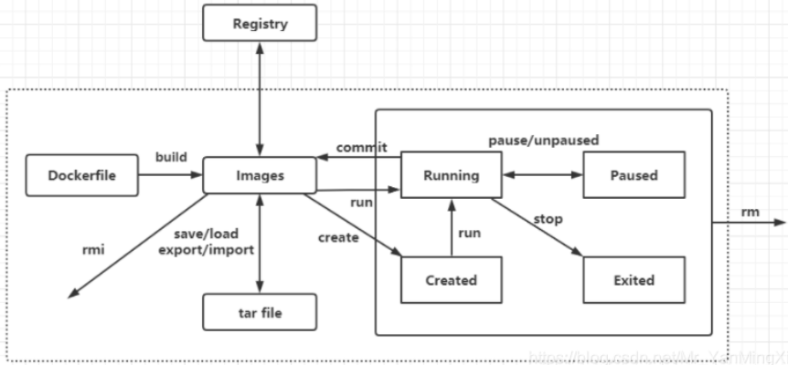

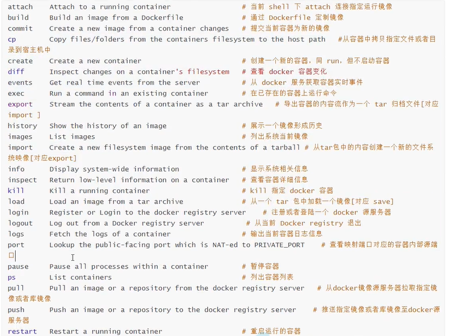

## 9、Docker图形化管理工具

### 9.1 Docker UI

命令：

```shell
docker search dockerui
docker pull abh1nav/dockerui
docker run -d --privileged --name dockerui -p 9000:9000 -v /var/run/docker.sock:/var/run/docker.sock abh1nav/dockerui  
#放开物理机的9000端口对应Docker容器的9000端口
```

示例：

```shell
[root@iZ1608aqb7ntn9Z /]# docker search dockerui
NAME                           DESCRIPTION                                     STARS     OFFICIAL   AUTOMATED
abh1nav/dockerui               An updated version of crosbymichael/dockerui…   99                   [OK]
kevan/dockerui                 Deprecated: Use  uifd/ui-for-docker             15                   [OK]
microbox/dockerui              Trusted Automated dockerui image (16MB size)    8               ......
[root@iZ1608aqb7ntn9Z /]# docker pull abh1nav/dockerui
Using default tag: latest
latest: Pulling from abh1nav/dockerui
Image docker.io/abh1nav/dockerui:latest uses outdated schema1 manifest format. Please upgrade to a schema2 image for better future compatibility. More information at https://docs.docker.com/registry/spec/deprecated-schema-v1/
a3ed95caeb02: Pull complete 
5d3df020ecd3: Pull complete 
bebf5a3b4dfb: Pull complete 
e4452c0fe72b: Pull complete 
6167d9726b07: Pull complete 
53ebae19a314: Pull complete 
Digest: sha256:a9c6c5393f561a0f42f41cfa80572b666e745d9b419569c42bac1e5cf9ceda32
Status: Downloaded newer image for abh1nav/dockerui:latest
docker.io/abh1nav/dockerui:latest
[root@iZ1608aqb7ntn9Z /]#  docker run -d --privileged --name dockerui -p 9000:9000 -v /var/run/docker.sock:/var/run/docker.sock abh1nav/dockerui
e2352bcf98475e17e4d25cd2f30324c4bd1465927b2452126c94d03052a11c91
```

```shell
访问：http://ip地址:9000
```


### 9.2 Shipyard

### 9.3 Portainer

命令：

```shell
docker search portainer
docker pull portainer/portainer
docker run -d --name portainerUI -p 9000:9000 -v /var/run/docker.sock:/var/run/docker.sock portainer/portainer
```

示例：

```shell
[root@iZ1608aqb7ntn9Z /]# docker search portainer
NAME                             DESCRIPTION                                     STARS     OFFICIAL   AUTOMATED
portainer/portainer              This Repo is now deprecated, use portainer/p…   2109                 
portainer/portainer-ce           Portainer CE - Making Docker and Kubernetes …   635                  
portainer/agent                  An agent used to manage all the resources in…   111                  
portainer/templates              App Templates for Portainer http://portainer…   23             ......                  
[root@iZ1608aqb7ntn9Z /]# docker pull portainer/portainer
Using default tag: latest
latest: Pulling from portainer/portainer
94cfa856b2b1: Pull complete 
49d59ee0881a: Pull complete 
a2300fd28637: Pull complete 
Digest: sha256:fb45b43738646048a0a0cc74fcee2865b69efde857e710126084ee5de9be0f3f
Status: Downloaded newer image for portainer/portainer:latest
docker.io/portainer/portainer:latest
[root@iZ1608aqb7ntn9Z /]# docker run -d --name portainerUI -p 9000:9000 -v /var/run/docker.sock:/var/run/docker.sock portainer/portainer
abbf483bd3df0e30eaeb3a0dd708776a6fbbf055e2c87bcb84177df7e86c8ac2
```

```shell
访问:http://ip地址:9000
```


## 10、常见容器部署 ---  Nginx, Tomcat, ES

### 10.1 Ngnix

命令：

```shell
[root@iZ1608aqb7ntn9Z ~]# docker search nginx  # 查找
[root@iZ1608aqb7ntn9Z ~]# docker pull nginx    # 下载
[root@iZ1608aqb7ntn9Z ~]# docker run -d --name nginx -p 9000:80 nginx   # 启动

# 备注
-d 后台运行
--name 给容器命名
-p 3334:80 将宿主机的端口3334映射到该容器的80端口
```

示例：

```shell
[root@iZ1608aqb7ntn9Z ~]# docker search nginx
NAME                              DESCRIPTION                                     STARS     OFFICIAL   AUTOMATED
nginx                             Official build of Nginx.                        15256     [OK]       
jwilder/nginx-proxy               Automated Nginx reverse proxy for docker con…   2054                 [OK]
richarvey/nginx-php-fpm           Container running Nginx + PHP-FPM capable of…   815                  [OK]
......
[root@iZ1608aqb7ntn9Z ~]# docker pull nginx
Using default tag: latest
latest: Pulling from library/nginx
33847f680f63: Already exists 
dbb907d5159d: Pull complete 
8a268f30c42a: Pull complete 
b10cf527a02d: Pull complete 
c90b090c213b: Pull complete 
1f41b2f2bf94: Pull complete 
Digest: sha256:8f335768880da6baf72b70c701002b45f4932acae8d574dedfddaf967fc3ac90
Status: Downloaded newer image for nginx:latest
docker.io/library/nginx:latest
[root@iZ1608aqb7ntn9Z ~]# docker run -d --name nginx -p 9000:80 nginx
e2f7da87581a49d74096814ea8a8ea4dcc739c398f78f9a187807f9e34e8133e
```

测试访问：

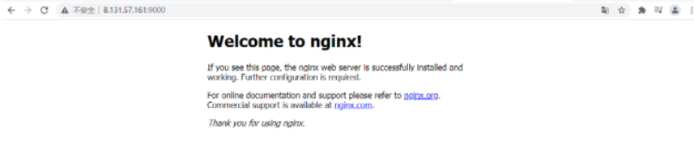


### 10.2 Tomcat

命令：

```shell
[root@iZ1608aqb7ntn9Z ~]# docker search tomcat  # 查找
[root@iZ1608aqb7ntn9Z ~]# docker pull tomcat    # 下载
[root@iZ1608aqb7ntn9Z ~]# docker run -d --name tomcat -p 9000:8080 tomcat   # 启动
```

示例：

```shell
[root@iZ1608aqb7ntn9Z ~]# docker search tomcat
NAME                          DESCRIPTION                                     STARS     OFFICIAL   AUTOMATED
tomcat                        Apache Tomcat is an open source implementati…   3086      [OK]       
tomee                         Apache TomEE is an all-Apache Java EE certif…   91        [OK]    
[root@iZ1608aqb7ntn9Z ~]# docker pull tomcat
Using default tag: latest
latest: Pulling from library/tomcat
627b765e08d1: Pull complete 
c040670e5e55: Pull complete 
073a180f4992: Pull complete 
bf76209566d0: Pull complete 
f10db7ba7580: Pull complete 
5b2f970878fa: Pull complete 
ed434bfebf18: Pull complete 
f6c437110aa9: Pull complete 
a772951f83db: Pull complete 
752225c3768e: Pull complete 
Digest: sha256:6e40250d8fac4eca05c2067cb81f79427e4ddbaf4e78d5ecd21c35e8c5f2bfcf
Status: Downloaded newer image for tomcat:latest
docker.io/library/tomcat:latest
[root@iZ1608aqb7ntn9Z ~]# docker run -d --name tomcat -p 9000:8080 tomcat
f41a3e8b640da739d0b4b9dc161dc59ceb16d9ff899769834cdb4954a954374e
```

测试访问：

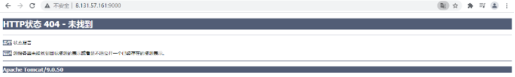


### 10.3 ES

添加 '-e ES_JAVA_OPTS="-Xms128m -Xmx512m" '配置ElasticSearch的虚拟机占用的内存大小。

docker stats 查看资源占用情况

```shell
$ docker run -d --name elasticsearch -p 9200:9200 -p 9300:9300 -e "discovery.type=single-node" -e ES_JAVA_OPTS="-Xms128m -Xmx512m" elasticsearch:7.6.2

[root@iZwz99sm8v95sckz8bd2c4Z ~]# docker run -d --name elasticsearch01 -p 9200:9200 -p 9300:9300 -e "discovery.type=single-node" -e ES_JAVA_OPTS="-Xms128m -Xmx512m" elasticsearch:7.6.2
3b8cd4991814896c523ee67b84ce198e32bd82b1a62d512b198138a58ca946f1
[root@iZwz99sm8v95sckz8bd2c4Z ~]# docker ps
CONTAINER ID   IMAGE                 COMMAND                  CREATED          STATUS         PORTS                                            NAMES
3b8cd4991814   elasticsearch:7.6.2   "/usr/local/bin/dock…"   10 seconds ago   Up 6 seconds   0.0.0.0:9200->9200/tcp, 0.0.0.0:9300->9300/tcp   elasticsearch01
[root@iZwz99sm8v95sckz8bd2c4Z ~]# docker stats
```


### 10.4 端口暴露的原理

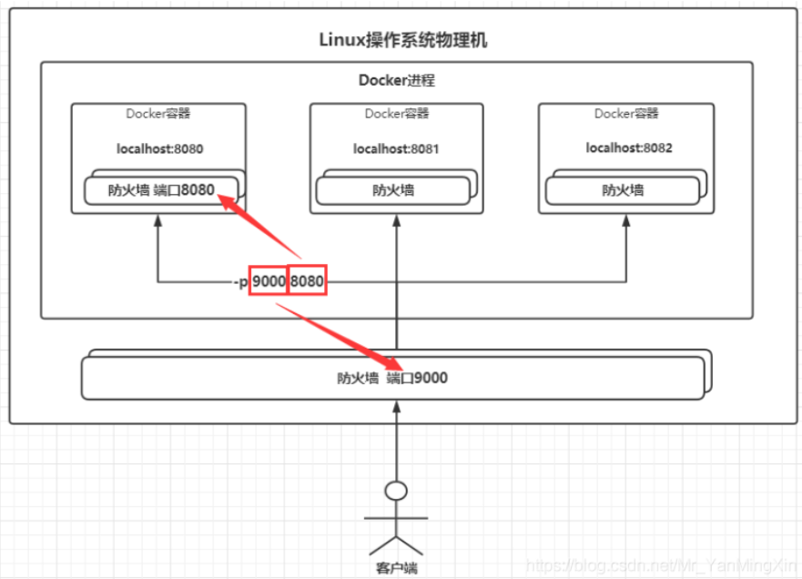