# Docker进阶篇

---

## 1、Docker镜像详解


### 1.1 UnionFS(联合文件系统)

* 联合文件系统（UnionFS）是一种分层、轻量级并且高性能的文件系统，它支持对文件系统的修改作为一次提交来一层层的叠加，同时可以将不同目录挂载到同一个虚拟文件系统下。联合文件系统是 Docker 镜像的基础。镜像可以通过分层来进行继承，基于基础镜像（没有父镜像），可以制作各种具体的应用镜像
* 特性：一次同时加载多个文件系统，但从外面看起来只能看到一个文件系统。联合加载会把各层文件系统叠加起来，这样最终的文件系统会包含所有底层的文件和目录。

### 1.2 镜像加载原理

Docker的镜像实际由一层一层的文件系统组成：

- bootfs（boot file system）主要包含bootloader和kernel。bootloader主要是引导加载kernel，完成后整个内核就都在内存中了。此时内存的使用权已由bootfs转交给内核，系统卸载bootfs。可以被不同的Linux发行版公用。
- rootfs（root file system），包含典型Linux系统中的/dev，/proc，/bin，/etc等标准目录和文件。rootfs就是各种不同操作系统发行版（Ubuntu，Centos等）。因为底层直接用Host的kernel，rootfs只包含最基本的命令，工具和程序就可以了。
- 分层理解
  所有的Docker镜像都起始于一个基础镜像层，当进行修改或增加新的内容时，就会在当前镜像层之上，创建新的容器层。
  容器在启动时会在镜像最外层上建立一层可读写的容器层（R/W），而镜像层是只读的（R/O）。


命令：

```shell
docker commit -m "描述信息" -a "作者" 容器名 目标镜像名:[tag]  # 编辑容器后提交容器成为一个新镜像
```

示例：

```shell
[root@iZ1608aqb7ntn9Z ~]# docker images
REPOSITORY            TAG       IMAGE ID       CREATED        SIZE
tomcat                latest    46cfbf1293b1   13 days ago    668MB
.....
[root@iZ1608aqb7ntn9Z ~]# docker commit --help

Usage:  docker commit [OPTIONS] CONTAINER [REPOSITORY[:TAG]]

Create a new image from a container's changes

Options:
  -a, --author string    Author (e.g., "John Hannibal Smith <hannibal@a-team.com>")
  -c, --change list      Apply Dockerfile instruction to the created image
  -m, --message string   Commit message
  -p, --pause            Pause container during commit (default true)
[root@iZ1608aqb7ntn9Z ~]# docker commit -m "Ymx tomcat" -a "ymx" 46cfbf1293b1 ymxtomcat:1.0
Error response from daemon: No such container: 46cfbf1293b1
[root@iZ1608aqb7ntn9Z ~]# docker commit -m "Ymx tomcat" -a "ymx" tomcat  ymxtomcat:1.0
sha256:ee3100b86b4939d52415da7a62c91d987d91be3ea4776f0ae3d2024b94fed6b4
[root@iZ1608aqb7ntn9Z ~]# docker images
REPOSITORY            TAG       IMAGE ID       CREATED         SIZE
ymxtomcat             1.0       ee3100b86b49   5 seconds ago   668MB
tomcat                latest    46cfbf1293b1   13 days ago     668MB
......
```


## 2、容器数据卷


### 2.1 什么是容器数据卷

为了实现数据持久化，使容器之间可以共享数据。可以将容器内的目录，挂载到宿主机上或其他容器内，实现同步和共享的操作。即使将容器删除，挂载到本地的数据卷也不会丢失。

### 2.2 使用容器数据卷

#### 2.2.1 直接使用命令

```shell
docker run -it -v 主机内目录:容器内目录 镜像名/id
```

将容器内目录挂载到主机内目录上，通过**docker inspect [容器名/ID]**命令查看该容器即可看到挂载信息

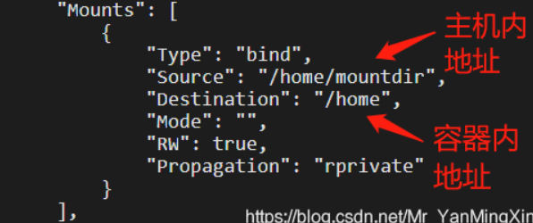

```shell
# 挂载命令
[root@iZ1608aqb7ntn9Z 20210806]# docker run -it -v /opt/Docker/20210806/:/opt centos /bin/bash

# 进入到容器内部
[root@e749444d0ee1 /]# cd opt/
[root@e749444d0ee1 opt]# ls -l
total 0
-rw-r--r-- 1 root root 0 Aug  6 03:35 ymx

# 查看本机
[root@iZ1608aqb7ntn9Z ~]# cd /opt/Docker/20210806/
[root@iZ1608aqb7ntn9Z 20210806]# ll
总用量 0
-rw-r--r-- 1 root root 0 8月   6 11:35 ymx 

# docker inspect [容器名或ID] 查看挂载
[root@iZ1608aqb7ntn9Z 20210806]# docker inspect e749444d0ee1 
......
     "Mounts": [
            {
                "Type": "bind",
                "Source": "/opt/Docker/20210806",  # 对应主机的源目录
                "Destination": "/opt",    # 容器中的目录
                "Mode": "",
                "RW": true,
                "Propagation": "rprivate"
            }
        ],
......
```

建立挂载关系后，只要使用命令在主机内新建一个文件：

```shell
touch /home/mountdir/test.txt
```

就会在容器内的挂载目录下发现相同的文件(test.txt)，从而实现了容器和主机的文件同步和共享：

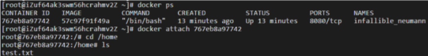


### 2.3 匿名挂载

```shell
docker run -d  -v 容器内目录  镜像名/id  # 匿名挂载
```

匿名挂载后，使用**docker volume ls**命令查看所有挂载的卷：

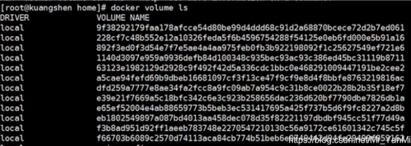

每一个VOLUME NAME对应一个挂载的卷，由于挂载时未指定主机目录，因此无法直接找到目录


### 2.4 具名挂载

```shell
docker run -d  -v 卷名:容器内目录  镜像名/id  # 具名挂载
```

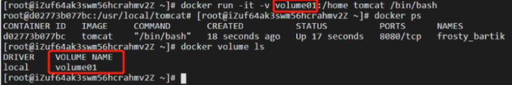

可以发现挂载的卷：volume01，并通过**docker volume inspect 卷名**命令找到主机内目录：

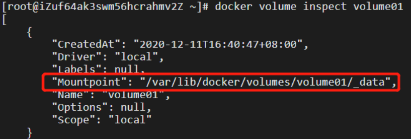

所有docker容器内的卷，在未指定主机内目录时，都在：/var/lib/docker/volumes/卷名/_data下，可通过具名挂载可以方便找到卷，因此广泛使用这种方式进行挂载


### 2.5 数据卷容器


```shell
docker run -it --name container02 --volumes-from container01 镜像名/id  # 将两个容器进行挂载
```


## 3、DockerFile

Dockerfile是用来构建docker镜像的文件

### 3.1 构建步骤：

编写一个dockerfile文件，随后运行命令：

```shell
docker build -f 文件路径 -t 镜像名 .  # 文件名为Dockerfile时可省略且最后的.不要忽略
docker run     # 运行镜像
docker push    # 发布镜像
```

```shell
[root@iZ1608aqb7ntn9Z 20210806]# vim Dockerfile 
# ----------写入内容-----------------
FROM centos      # 来自centos
CMD /bin/bash    # 进入到/bin/bash
CMD echo Hello Dockerfile   # 输出Hello Dockerfile
# ----------写入结束-----------------
[root@iZ1608aqb7ntn9Z 20210806]# docker build -f ./Dockerfile -t mydocker .
Sending build context to Docker daemon   2.56kB
Step 1/3 : FROM centos
 ---> 300e315adb2f
Step 2/3 : CMD /bin/bash
 ---> Running in 526f489adf0b
Removing intermediate container 526f489adf0b
 ---> 3c2af9c73098
Step 3/3 : CMD echo Hello Dockerfile
 ---> Running in 023af54a93e2
Removing intermediate container 023af54a93e2
 ---> 7753b44c9137
Successfully built 7753b44c9137
Successfully tagged mydocker:latest
[root@iZ1608aqb7ntn9Z 20210806]# docker images
REPOSITORY            TAG       IMAGE ID       CREATED          SIZE
mydocker              latest    7753b44c9137   6 seconds ago    209MB
......
[root@iZ1608aqb7ntn9Z 20210806]# docker run -it mydocker
Hello Dockerfile
```


### 3.2 Dockerfile命令

|      命令      |                             效果                             |
| :------------: | :----------------------------------------------------------: |
|      FROM      |                   基础镜像：Centos/Ubuntu                    |
|   MAINTAINER   |                        镜像作者+邮箱                         |
|      RUN       |                   镜像构建时需要运行的命令                   |
|      ADD       |                   为镜像添加内容（压缩包）                   |
|    WORKDIR     |               镜像工作目录（进入容器时的目录）               |
|     VOLUME     |                          挂载的目录                          |
|     EXPOSE     |                         暴露端口配置                         |
| CMD/ENTRYPOINT | 指定这个容器启动时要运行的命令（CMD替代先前命令，ENTRYPOINT在先前命令后追加） |
|      COPY      |                类似于ADD，将文件拷贝到镜像中                 |
|      ENV       |                      构建时设置环境变量                      |


### 3.3 构建过程

* 每个保留关键字（指令）都必须是大写字母

* 从上往下顺序执行

* "#"表示注释

* 每一个指令都会创建提交一个新的镜像层并提交

  

### 3.4 构建实例（jdk+tomcat）

```shell
[root@iZ1608aqb7ntn9Z 20210806]# vim DockerFile2
# -----------写入文件--------------

FROM centos
  
COPY ymx /opt/Docker/20210806/ymx

ADD jdk8.tar.gz /usr/local
ADD tomcat.tar.gz /usr/local

RUN yum -y install vim

ENV MYPATH /usr/local
WORKDIR $MYPATH

ENV JAVA_HOME /usr/local/jdk1.8.0_141
ENV CLASSPATH $JAVA_HOME/lib/dt.jar:$JAVA_HOME/lib/tools.jar
ENV PATH $PATH:$JAVA_HOME/bin

EXPOSE 8080

# -----------写入文件完成--------------
[root@iZ1608aqb7ntn9Z 20210806]# ls
Dockerfile  DockerFile2  ymx
[root@iZ1608aqb7ntn9Z 20210806]# cp /tmp/jdk8.tar.gz jdk8.tar.gz
[root@iZ1608aqb7ntn9Z 20210806]# cp /tmp/tomcat.tar.gz tomcat.tar.gz
[root@iZ1608aqb7ntn9Z 20210806]# ls
Dockerfile  DockerFile2  jdk8.tar.gz  tomcat.tar.gz  ymx
[root@iZ1608aqb7ntn9Z 20210806]# docker build -f ./DockerFile2 -t mytomcat9 . 
Sending build context to Docker daemon    197MB
Step 1/11 : FROM centos
......
Successfully built 86a9a8dd939a
Successfully tagged mytomcat9:latest
[root@iZ1608aqb7ntn9Z 20210806]# docker images
REPOSITORY            TAG       IMAGE ID       CREATED             SIZE
mytomcat9             latest    86a9a8dd939a   26 seconds ago      667MB
......
[root@iZ1608aqb7ntn9Z 20210806]# docker run -it mytomcat9 /bin/bash
[root@ed5fd71834e2 local]# ls
apache-tomcat-9.0.44  bin  etc  games  include  jdk1.8.0_141  lib  lib64  libexec  sbin  share  src
[root@ed5fd71834e2 local]# java -version
java version "1.8.0_141"
Java(TM) SE Runtime Environment (build 1.8.0_141-b15)
Java HotSpot(TM) 64-Bit Server VM (build 25.141-b15, mixed mode)
```


## 4、Docker网络

### 4.1 理解Docker

通过命令**ip addr**查看本地ip地址，我们发现除了本机回环地址和埃里远的内网地址外，还多了一个网卡：Docker0，这是Docker服务启动后自动生成的

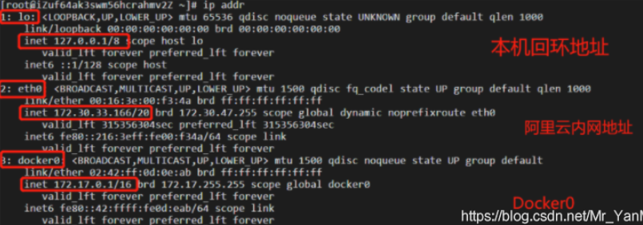

而如果进入一个正在后台运行的tomcat容器，同样使用**ip addr**命令，发现容器得到了一个新的网络：**12: eth@if13**，ip地址：**172.17.0.2**。这是Docker在容器启动时为其分配的

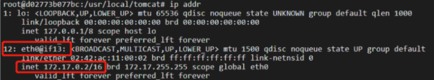

思考一个问题：此时我们的linux主机可以ping通容器内部（**172.17.0.2**）吗？（**注意与容器暴露端口相区分**）

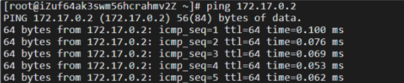

* linux可以ping通docker容器内部，因为docker0的地址为172.17.0.1，容器为172.17.0.2

* 原理：我们每启动一个docker容器，docker就会给容器分配一个默认的可用ip，我们只要安装了docker，就会有一个网卡docker0(bridge)。网卡采用桥接模式，并使用veth-pair技术（veth-pair就是一堆虚拟设备接口，成对出现，一段连着协议，一段彼此相连，充当一个桥梁。）

* 这时我们退出容器，回到主机再次观察主机的ip地址：

  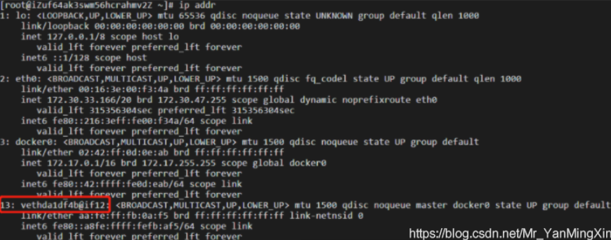

* 我们惊奇地发现了一个新网络**13: vethda1df4b@if12**，对应容器内网络地址的**12: eth@if13**

* 容器和容器之间是可以互相ping通的：容器1→Docker0→容器2

  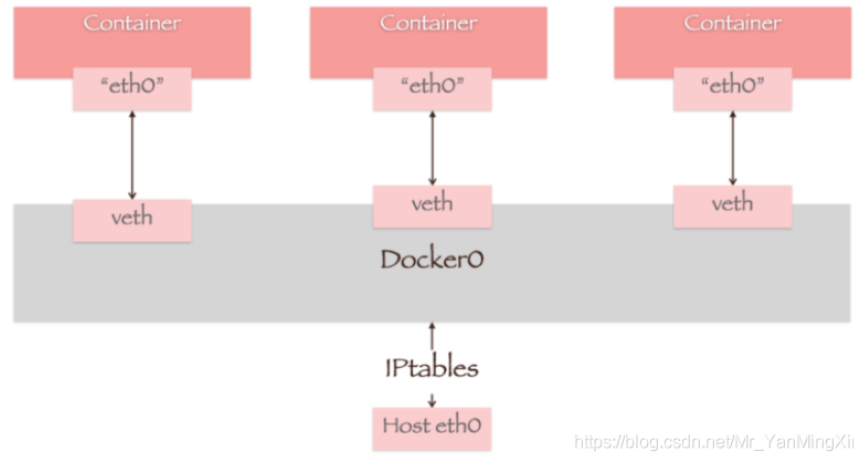

* docker中的所有网络接口都是虚拟的 ，转发效率高。删除容器后，对应的网桥也随之删除


### 4.2    --link

若编写一个微服务并连接数据库，如果数据库ip改变，如何根据容器名而不是ip访问容器？显然直接使用容器名是无法ping通容器内部的

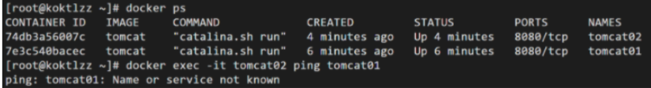

这时我们可以在容器启动命令中加入一个选项：**--link**，使得我们可以根据容器名来访问容器

```shell
docker run -d -P --link 容器名/id 镜像名/id
```

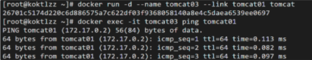

然而反向就不可以ping通，这是因为--link的本质是把需要连接的容器名/id写入启动容器的配置文件中，即增加了一个ip和容器名/id的映射：

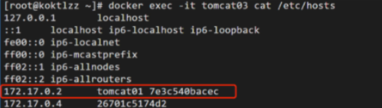

目前已经不建议使用这种方式


### 4.3 自定义网络

```shell
docker network ls    # 查看所有的docker网络
```

docker中的网络模式有：

* bridge：桥接（docker默认）
* none：不配置网络
* host：和宿主机共享网络

创建一个新网络

```shell
docker  network create --driver 网络模式 --subnet 子网ip --gateway 网关 网络名     
```

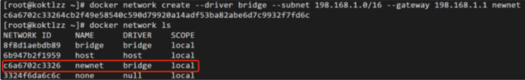

我们不仅在**docker network ls**命令下发现这个新创建的网络network，还可以使用**docker network inspect**命令查看其详细信息，包括我们创建时定义的子网ip和网关

