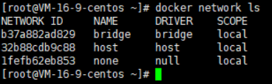
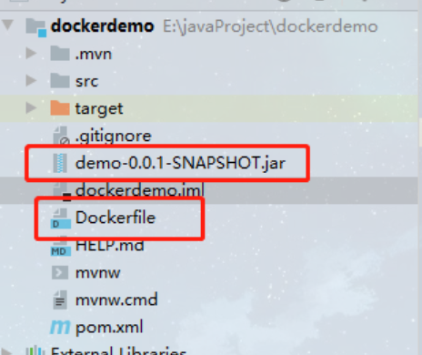

# Docker进阶篇

---

## 1、Docker镜像详解


### 1.1 UnionFS(联合文件系统)

* 联合文件系统（UnionFS）是一种分层、轻量级并且高性能的文件系统，它支持对文件系统的修改作为一次提交来一层层的叠加，同时可以将不同目录挂载到同一个虚拟文件系统下。联合文件系统是 Docker 镜像的基础。镜像可以通过分层来进行继承，基于基础镜像（没有父镜像），可以制作各种具体的应用镜像
* 特性：一次同时加载多个文件系统，但从外面看起来只能看到一个文件系统。联合加载会把各层文件系统叠加起来，这样最终的文件系统会包含所有底层的文件和目录。

### 1.2 镜像加载原理

Docker的镜像实际由一层一层的文件系统组成：

- bootfs（boot file system）主要包含bootloader和kernel。bootloader主要是引导加载kernel，完成后整个内核就都在内存中了。此时内存的使用权已由bootfs转交给内核，系统卸载bootfs。可以被不同的Linux发行版公用。
- rootfs（root file system），包含典型Linux系统中的/dev，/proc，/bin，/etc等标准目录和文件。rootfs就是各种不同操作系统发行版（Ubuntu，Centos等）。因为底层直接用Host的kernel，rootfs只包含最基本的命令，工具和程序就可以了。
- 分层理解
  所有的Docker镜像都起始于一个基础镜像层，当进行修改或增加新的内容时，就会在当前镜像层之上，创建新的容器层。
  容器在启动时会在镜像最外层上建立一层可读写的容器层（R/W），而镜像层是只读的（R/O）。


命令：

```shell
docker commit -m "描述信息" -a "作者" 容器名 目标镜像名:[tag]  # 编辑容器后提交容器成为一个新镜像
```

示例：

```shell
[root@iZ1608aqb7ntn9Z ~]# docker images
REPOSITORY            TAG       IMAGE ID       CREATED        SIZE
tomcat                latest    46cfbf1293b1   13 days ago    668MB
.....
[root@iZ1608aqb7ntn9Z ~]# docker commit --help

Usage:  docker commit [OPTIONS] CONTAINER [REPOSITORY[:TAG]]

Create a new image from a container's changes

Options:
  -a, --author string    Author (e.g., "John Hannibal Smith <hannibal@a-team.com>")
  -c, --change list      Apply Dockerfile instruction to the created image
  -m, --message string   Commit message
  -p, --pause            Pause container during commit (default true)
[root@iZ1608aqb7ntn9Z ~]# docker commit -m "Ymx tomcat" -a "ymx" 46cfbf1293b1 ymxtomcat:1.0
Error response from daemon: No such container: 46cfbf1293b1
[root@iZ1608aqb7ntn9Z ~]# docker commit -m "Ymx tomcat" -a "ymx" tomcat  ymxtomcat:1.0
sha256:ee3100b86b4939d52415da7a62c91d987d91be3ea4776f0ae3d2024b94fed6b4
[root@iZ1608aqb7ntn9Z ~]# docker images
REPOSITORY            TAG       IMAGE ID       CREATED         SIZE
ymxtomcat             1.0       ee3100b86b49   5 seconds ago   668MB
tomcat                latest    46cfbf1293b1   13 days ago     668MB
......
```


### 1.3 分层理解

思考：为什么Docker镜像要采用分层结构？

最大好处莫过于资源共享，比如有多个镜像都从相同的Base镜像构建而来，那么宿主机只需在磁盘上保留一份base镜像，同时内存中也只需要加载一份base镜像，这样就可以为所有的容器服务，而且镜像的每一层都可以被共享

```shell
[root@iZwz9b8v7o84uw1vut700pZ ~]# docker image inspect nginx:latest
[
    {
        "Id": "sha256:605c77e624ddb75e6110f997c58876baa13f8754486b461117934b24a9dc3a85",
        "RepoTags": [
            "nginx:latest"
        ],
        "RepoDigests": [
            "nginx@sha256:0d17b565c37bcbd895e9d92315a05c1c3c9a29f762b011a10c54a66cd53c9b31"
        ],
        "Parent": "",
        "Comment": "",
        "Created": "2021-12-29T19:28:29.892199479Z",
        "Container": "ca3e48389f7160bc9d9a892d316fcbba459344ee3679998739b1c3cd8e56f7da",
        "ContainerConfig": {
            "Hostname": "ca3e48389f71",
            "Domainname": "",
            "User": "",
            "AttachStdin": false,
            "AttachStdout": false,
            "AttachStderr": false,
            "ExposedPorts": {
                "80/tcp": {}
            },
            "Tty": false,
            "OpenStdin": false,
            "StdinOnce": false,
            "Env": [
                "PATH=/usr/local/sbin:/usr/local/bin:/usr/sbin:/usr/bin:/sbin:/bin",
                "NGINX_VERSION=1.21.5",
                "NJS_VERSION=0.7.1",
                "PKG_RELEASE=1~bullseye"
            ],
            "Cmd": [
                "/bin/sh",
                "-c",
                "#(nop) ",
                "CMD [\"nginx\" \"-g\" \"daemon off;\"]"
            ],
            "Image": "sha256:82941edee2f4d17c55563bb926387c3ae39fa1a99777f088bc9d3db885192209",
            "Volumes": null,
            "WorkingDir": "",
            "Entrypoint": [
                "/docker-entrypoint.sh"
            ],
            "OnBuild": null,
            "Labels": {
                "maintainer": "NGINX Docker Maintainers <docker-maint@nginx.com>"
            },
            "StopSignal": "SIGQUIT"
        },
        "DockerVersion": "20.10.7",
        "Author": "",
        "Config": {
            "Hostname": "",
            "Domainname": "",
            "User": "",
            "AttachStdin": false,
            "AttachStdout": false,
            "AttachStderr": false,
            "ExposedPorts": {
                "80/tcp": {}
            },
            "Tty": false,
            "OpenStdin": false,
            "StdinOnce": false,
            "Env": [
                "PATH=/usr/local/sbin:/usr/local/bin:/usr/sbin:/usr/bin:/sbin:/bin",
                "NGINX_VERSION=1.21.5",
                "NJS_VERSION=0.7.1",
                "PKG_RELEASE=1~bullseye"
            ],
            "Cmd": [
                "nginx",
                "-g",
                "daemon off;"
            ],
            "Image": "sha256:82941edee2f4d17c55563bb926387c3ae39fa1a99777f088bc9d3db885192209",
            "Volumes": null,
            "WorkingDir": "",
            "Entrypoint": [
                "/docker-entrypoint.sh"
            ],
            "OnBuild": null,
            "Labels": {
                "maintainer": "NGINX Docker Maintainers <docker-maint@nginx.com>"
            },
            "StopSignal": "SIGQUIT"
        },
        "Architecture": "amd64",
        "Os": "linux",
        "Size": 141479488,
        "VirtualSize": 141479488,
        "GraphDriver": {
            "Data": {
                "LowerDir": "/var/lib/docker/overlay2/4c79c395f5276d6c16a5bb333597bd738c7fa91b2416db4e794feef3da840fd7/diff:/var/lib/docker/overlay2/d470f08d952b1012089ae05d2805014103385170fdfa4ae501190faef6abf68e/diff:/var/lib/docker/overlay2/aaed06144bf25b92f0a78704427cf79b9a9b4b7f4812173b3443d2d09ce59b09/diff:/var/lib/docker/overlay2/8f7e3a46f2c363ebb060a3695efc59fbec3202b01a9a6f17af4b607a93e84133/diff:/var/lib/docker/overlay2/8693e5bafb4e5803078339692b1733d67ce51cfdd37109e0a8cbec45103827cc/diff",
                "MergedDir": "/var/lib/docker/overlay2/3781000955df3873afe2989265b4576804fc9cf710696d18db89c11a502e2446/merged",
                "UpperDir": "/var/lib/docker/overlay2/3781000955df3873afe2989265b4576804fc9cf710696d18db89c11a502e2446/diff",
                "WorkDir": "/var/lib/docker/overlay2/3781000955df3873afe2989265b4576804fc9cf710696d18db89c11a502e2446/work"
            },
            "Name": "overlay2"
        },
        "RootFS": {
            "Type": "layers",
            "Layers": [
                "sha256:2edcec3590a4ec7f40cf0743c15d78fb39d8326bc029073b41ef9727da6c851f",
 "sha256:e379e8aedd4d72bb4c529a4ca07a4e4d230b5a1d3f7a61bc80179e8f02421ad8",
 "sha256:b8d6e692a25e11b0d32c5c3dd544b71b1085ddc1fddad08e68cbd7fda7f70221",
 "sha256:f1db227348d0a5e0b99b15a096d930d1a69db7474a1847acbc31f05e4ef8df8c",
 "sha256:32ce5f6a5106cc637d09a98289782edf47c32cb082dc475dd47cbf19a4f866da",
 "sha256:d874fd2bc83bb3322b566df739681fbd2248c58d3369cb25908d68e7ed6040a6"
            ]
        },
        "Metadata": {
            "LastTagTime": "0001-01-01T00:00:00Z"
        }
    }
]
```

这里指示了分层信息：

```shell
"RootFS": {
            "Type": "layers",
            "Layers": [
 "sha256:2edcec3590a4ec7f40cf0743c15d78fb39d8326bc029073b41ef9727da6c851f",
 "sha256:e379e8aedd4d72bb4c529a4ca07a4e4d230b5a1d3f7a61bc80179e8f02421ad8",
 "sha256:b8d6e692a25e11b0d32c5c3dd544b71b1085ddc1fddad08e68cbd7fda7f70221",
 "sha256:f1db227348d0a5e0b99b15a096d930d1a69db7474a1847acbc31f05e4ef8df8c",
 "sha256:32ce5f6a5106cc637d09a98289782edf47c32cb082dc475dd47cbf19a4f866da",
 "sha256:d874fd2bc83bb3322b566df739681fbd2248c58d3369cb25908d68e7ed6040a6"
            ]
        },
```


在添加额外的镜像层的同时，镜像始终保持是当前所有镜像的组合。下图例子中，每个镜像层包含3个文件，而镜像包含了来自两个镜像层的6个文件


下图中展示了一个稍微复杂的三层镜像，在外部看来整个镜像只有6个文件，这是因为最上层的文件7是文件5的一个更新版本


这种情况下，上传镜像层中的文件覆盖了底层镜像层中的文件，这样就使得文件的更新版本作为一个新镜像添加到镜像当中。

Docker通过存储引擎（新版本采用快照机制）的方式来实现镜像层堆栈，并保证多镜像层对外展示为统一的文件系统

Docker在Window上仅支持windowfilter的一种存储引擎，改引擎基于NTFS文件系统上实现了分层和Cow

下图展示了与系统显示相同的三层镜像，所有镜像堆叠合并，并对外提供统一的视图


**特点**

> Docker镜像都是只读的，当容器启动时，一个新的可写层被加载到镜像的顶部
>
> 这一层就是容器层，容器之下的都叫镜像层


### 1.4 提交镜像

```shell
#使用docker commit 命令提交容器成为一个新的版本
docker commit -m="提交的描述信息"  -a="作者" 容器id 目标镜像名:[TAG] 
```

由于默认的Tomcat镜像的webapps文件夹中没有任何内容，需要从webapps.dist中拷贝文件到webapps文件夹。下面自行制作镜像：就是从webapps.dist中拷贝文件到webapps文件夹下，并提交该镜像作为一个新的镜像。使得该镜像默认的webapps文件夹下就有文件。具体命令如下：

```shell
# 启动默认tomcat，发现webapps目录下没有东西
[root@iZwz9b8v7o84uw1vut700pZ ~]# docker run -it --rm tomcat:9.0
[root@iZwz9b8v7o84uw1vut700pZ ~]# docker exec -it 34a4760d9b87 /bin/bash

root@34a4760d9b87:/usr/local/tomcat# cp -r webapps.dist/* webapps
root@34a4760d9b87:/usr/local/tomcat# cd webapps
root@34a4760d9b87:/usr/local/tomcat/webapps# ls
ROOT  docs  examples  host-manager  manager
```

ip:8080访问，可以看到tomcat的默认首页

如果无法访问，记得查看Linux防火墙的8080端口以及阿里云的安全组有没有开放8080端口

```shell
# 提交自己的镜像  docker commit -m="add webapps" -a="Kay" 34a4760d9b87 mytomcat:1.0
[root@iZwz9b8v7o84uw1vut700pZ ~]# docker commit -m="add webapps" -a="Kay" 34a4760d9b87 mytomcat:1.0
sha256:17cb58cc1f500837eb2bb56ba1802cf2011d7a53b1e9d3f92928b5d7458c1e97

# 可以看到我们自己的镜像 mytomcat 已经提交好了，版本号也是我们自己设定的版本号 1.0
[root@iZwz9b8v7o84uw1vut700pZ ~]# docker images
REPOSITORY            TAG          IMAGE ID       CREATED         SIZE
mytomcat              1.0          17cb58cc1f50   8 seconds ago   685MB
rabbitmq              management   32d80c948e6c   11 days ago     257MB
mongo                 latest       b21ad2afe409   13 days ago     700MB
nginx                 latest       605c77e624dd   3 months ago    141MB
tomcat                9.0          b8e65a4d736d   4 months ago    680MB
hello-world           latest       feb5d9fea6a5   7 months ago    13.3kB
centos                latest       5d0da3dc9764   7 months ago    231MB
portainer/portainer   latest       580c0e4e98b0   13 months ago   79.1MB
```

一个小技巧

**如果想要保存当前容器的状态，就可以通过commit来提交，获得一个镜像就好比虚拟机中的快照，可以保存当前的状态**


## 2、容器数据卷


### 2.1 什么是容器数据卷

为了实现数据持久化，使容器之间可以共享数据。可以将容器内的目录，挂载到宿主机上或其他容器内，实现同步和共享的操作。即使将容器删除，挂载到本地的数据卷也不会丢失。

### 2.2 使用容器数据卷

```shell
docker run -it -v 主机内目录:容器内目录 镜像名/id
```

将主机目录/home/test和容器/home建立数据卷

```shell
docker run -it -v /home/test:/home centos /bin/bash
```

可以发现，home目录下多了test这个文件夹，接下来，容器里面的home目录下的内容都会自动同步到宿主机下的 /home/test目录，在宿主机的内容也会自动同步到容器内


查看是否挂载成功

```shell
[root@VM-20-17-centos home]# docker inspect df7f51983d11(这个是容器id)
```


1. 在主机内新建一个文件：

```shell
[root@df7f51983d11 home]# touch test.java
[root@df7f51983d11 home]# ls
test.java
```

在宿主机的test下查看

```shell
[root@VM-20-17-centos home]# cd test
[root@VM-20-17-centos test]# ls
test.java
```

2. 在宿主机添加文件

```shell
[root@VM-20-17-centos test]# touch test02.java
```

在容器内部查看

```shell
[root@df7f51983d11 home]# ls
test.java  test02.java
```

退出容器（退出容器，宿主机的操作依旧会同步到容器）

```shell
[root@df7f51983d11 home]# exit
exit
```

小技巧

**通同步后，以后只需要在宿主机修改配置文件，容器内的配置就会自动同步，而不需要每次都进入容器去修改配置**


### 2.3 MySql容器建立数据卷同步数据

这里宿主机如果已经有安装Mysql的话，很可能发生冲突，很大可能是本机挂载的配置文件中已经有文件，将容器中的配置给覆盖了，我们将相应的本机文件中的文件配置删除即可

```shell
[root@VM-20-17-centos ~]# docker pull mysql:5.7  #拉取镜像
# 运行容器，需要做数据挂载
# 安装启动mysql，需要配置mysql的密码，不然启动不了
# 官方   docker run --name some-mysql -e MYSQL_ROOT_PASSWORD=123456 -d mysql:5.7
# -v 数据卷挂载，下面的命令是挂载mysql的配置文件 conf.d和mysql的数据文件 data，并且给mysql设置密码
# -e 环境配置
# --name 容器名字
# 开的端口号记得去阿里云的安全组打开
docker run -d -p 3310:3306 -v /home/mysql/conf:/etc/mysql/conf.d -v /home/mysql/data:/var/lib/mysql -e MYSQL_ROOT_PASSWORD=123456 --name mysql01 mysql:5.7

# 启动成功之后，我这里是在本地使用navicat来连接测试
# navicat连接到服务器的3310端口 ，3310和容器内的3306端口映射，然后成功连接

docker rm -f mysql01  #就算把容器删除，宿主机本地的数据依旧还在。如果是在容器内部进行删除数据的操作，那么宿主机就会同步删除，但这里是直接把整个容器删掉，是容器外部的操作，所以宿主机的数据还是会存在的

```


## 3、具名挂载和匿名挂载

### 3.1 匿名挂载

匿名挂载就是在指定数据卷的时候，不指定容器路径对应的主机路径，这样对应的映射的主机路径就是默认的路径/var/lib/docker/volumes/中自动生成的一个随机命名的文件夹

```shell
docker run -d  -v 容器内目录  镜像名/id  # 匿名挂载
```

如下运行并匿名挂载Nginx容器：

```shell
# -P (大写P表示随机映射端口)
# -v后面如果只有一个路径，那就是容器内部的路径。（不指定宿主机的路径的话，宿主机会自动生成目录）
[root@VM-20-17-centos ~]# docker run -d -P --name nginx01 -v /etc/nginx nginx

# 查看所有的数据卷volume的情况, VOLUME NAME这里的值是真实存在的目录。（ VOLUME NAME的值是一串数字和字母，所以称之为匿名挂载）
[root@VM-20-17-centos ~]# docker volume ls
DRIVER    VOLUME NAME
local     0736e4097e5bb9b62b24e5f51088b37cf8271df9edd4f8ff1c8f3284fce72983

# 查看匿名挂载的卷在宿主机中的位置
[root@VM-20-17-centos ~]# docker volume inspect 0736e4097e5bb9b62b24e5f51088b37cf8271df9edd4f8ff1c8f3284fce72983


[
    {
        "CreatedAt": "2022-04-26T08:50:12+08:00",
        "Driver": "local",
        "Labels": null,
        "Mountpoint": "/var/lib/docker/volumes/0736e4097e5bb9b62b24e5f51088b37cf8271df9edd4f8ff1c8f3284fce72983/_data",
        "Name": "0736e4097e5bb9b62b24e5f51088b37cf8271df9edd4f8ff1c8f3284fce72983",
        "Options": null,
        "Scope": "local"
    }
]
```


### 3.2 具名挂载

具名挂载，就是指定文件夹名称，区别于指定路径挂载，这里的指定文件夹名称是在Docker指定的默认数据卷路径下的。通过**docker volume ls**命令可以查看当前数据卷的目录情况

```shell
# 通过 -v 卷名:容器内路径 ，这种方式来指定卷的名字，注意这里juming-nginx前面是没有/的，如果带了/，那就变成路径而不是名字了
[root@VM-20-17-centos ~]# docker run -d -P --name nginx02 -v juming-nginx:/etc/nginx nginx
629b1917332cc9f8529e8ea785c75aa3be813e21b41b0a05c9f795a254f85caf

[root@VM-20-17-centos ~]# docker volume ls
DRIVER    VOLUME NAME
local     0736e4097e5bb9b62b24e5f51088b37cf8271df9edd4f8ff1c8f3284fce72983
local     juming-nginx
```

查看指定的数据卷信息的命令：

```shell
docker volume inspect 数据卷名称
```

```shell
[root@VM-20-17-centos ~]# docker volume inspect juming-nginx
[
    {
        "CreatedAt": "2022-04-26T08:54:52+08:00",
        "Driver": "local",
        "Labels": null,
        "Mountpoint": "/var/lib/docker/volumes/juming-nginx/_data",
        "Name": "juming-nginx",
        "Options": null,
        "Scope": "local"
    }
]
```

可以看到主机数据挂载在/var/lib/docker/volumes/juming-nginx/_data上

**Docker所有数据卷默认在/var/lib/docker/volumes/卷名/_data目录下**

```shell
[root@VM-20-17-centos ~]# cd /var/lib/docker/volumes
[root@VM-20-17-centos volumes]# ls
0736e4097e5bb9b62b24e5f51088b37cf8271df9edd4f8ff1c8f3284fce72983  backingFsBlockDev  juming-nginx  metadata.db
```

匿名挂载、具名挂载，指定路径挂载的命令区别如下：

```shell
-v 容器内路径 #匿名挂载
-v 卷名:容器内路径 #具名挂载
-v /宿主机路径:容器内路径 #指定路径挂载

指定数据卷映射的相关参数：
ro —— readonly 只读。设置了只读则只能操作宿主机的路径，不能操作容器中的对应路径(在容器内部无法操作)。
rw ----- readwrite 可读可写
```


## 4、DockerFile

### 4.1 初识DockerFile

Dockerfile是用来构建docker镜像的文件

前面用docker run 的方式进行挂载，还可以在Dockerfile中使用VOLUME指令来给镜像添加一个或多个数据卷

```shell
[root@VM-20-17-centos home]# mkdir docker-test-volume
[root@VM-20-17-centos home]# ls
docker-test-volume  lighthouse  test
[root@VM-20-17-centos docker-test-volume]# vim dockerfile1
```

使用Dockerfile构建一个新的镜像，dockerfile1文件的内容，匿名挂载了volume01和volume02两个目录

```shell
# 创建一个dockerFile文件，这里每个命令，就是镜像的每一层
FROM centos

VOLUME ["volume01","volume02"]

CMD echo "----end----"
CMD /bin/bash
```

```shell
# 构建镜像
[root@VM-20-17-centos docker-test-volume]# docker build -f /home/docker-test-volume/dockerfile1 -t jackson/centos:1.0 .
Sending build context to Docker daemon  2.048kB
Step 1/4 : FROM centos
 ---> 5d0da3dc9764
Step 2/4 : VOLUME ["volume01","volume02"]
 ---> Running in 964276445ecc
Removing intermediate container 964276445ecc
 ---> 1ffae309159a
Step 3/4 : CMD echo "----end----"
 ---> Running in 1a48788e5f5d
Removing intermediate container 1a48788e5f5d
 ---> 905494613c71
Step 4/4 : CMD /bin/bash
 ---> Running in 5079de04d995
Removing intermediate container 5079de04d995
 ---> 556edf4fffd4
Successfully built 556edf4fffd4
Successfully tagged jackson/centos:1.0
# 查看镜像
[root@VM-20-17-centos docker-test-volume]# docker images
REPOSITORY       TAG       IMAGE ID       CREATED          SIZE
jackson/centos   1.0       556edf4fffd4   44 seconds ago   231MB
nginx            latest    fa5269854a5e   5 days ago       142MB
mysql            5.7       82d2d47667cf   5 days ago       450MB
centos           latest    5d0da3dc9764   7 months ago     231MB
```

```shell

[root@VM-20-17-centos docker-test-volume]# docker run -it 556edf4fffd4 /bin/bash
# 可以发现，刚刚挂载的两个目录volume01和volume02已经生成
[root@a6ddee3ff853 /]# ls  
bin  dev  etc  home  lib  lib64  lost+found  media  mnt  opt  proc  root  run  sbin  srv  sys  tmp  usr  var  volume01	volume02
```


### 4.2 容器数据卷

容器之间的数据共享，可以通过容器数据卷

容器数据卷是指建立数据卷，来同步多个容器间的数据，实现容器间的数据同步


```shell
docker run -it --name container02 --volumes-from container01 镜像名/id  # 将两个容器进行挂载
```

首先启动容器1，volume01、volume02为挂载目录

```shell
[root@VM-20-17-centos docker-test-volume]# docker images
REPOSITORY       TAG       IMAGE ID       CREATED          SIZE
jackson/centos   1.0       556edf4fffd4   25 minutes ago   231MB
nginx            latest    fa5269854a5e   5 days ago       142MB
mysql            5.7       82d2d47667cf   5 days ago       450MB
centos           latest    5d0da3dc9764   7 months ago     231MB
# 之前构建镜像的时候写了版本号，这里启动的时候记得加上版本号，否则就会去docker仓库中找最新的
[root@VM-20-17-centos docker-test-volume]# docker run -it --name docker01 jackson/centos:1.0
```

然后启动容器2，通过参数`--volumes-from`，设置容器2和容器1建立数据卷挂载关系

```shell
[root@VM-20-17-centos ~]# docker run -it --name docker02 --volumes-from docker01 jackson/centos:1.0
# 可以看到，容器2与容器1建立挂载关系后，可以看到容器2也有volume01和volume02
[root@d3fe059ecdb9 /]# ls -l
total 56
lrwxrwxrwx   1 root root    7 Nov  3  2020 bin -> usr/bin
drwxr-xr-x   5 root root  360 Apr 26 01:50 dev
drwxr-xr-x   1 root root 4096 Apr 26 01:50 etc
drwxr-xr-x   2 root root 4096 Nov  3  2020 home
lrwxrwxrwx   1 root root    7 Nov  3  2020 lib -> usr/lib
lrwxrwxrwx   1 root root    9 Nov  3  2020 lib64 -> usr/lib64
drwx------   2 root root 4096 Sep 15  2021 lost+found
drwxr-xr-x   2 root root 4096 Nov  3  2020 media
drwxr-xr-x   2 root root 4096 Nov  3  2020 mnt
drwxr-xr-x   2 root root 4096 Nov  3  2020 opt
dr-xr-xr-x 133 root root    0 Apr 26 01:50 proc
dr-xr-x---   2 root root 4096 Sep 15  2021 root
drwxr-xr-x  11 root root 4096 Sep 15  2021 run
lrwxrwxrwx   1 root root    8 Nov  3  2020 sbin -> usr/sbin
drwxr-xr-x   2 root root 4096 Nov  3  2020 srv
dr-xr-xr-x  13 root root    0 Apr 26 01:50 sys
drwxrwxrwt   7 root root 4096 Sep 15  2021 tmp
drwxr-xr-x  12 root root 4096 Sep 15  2021 usr
drwxr-xr-x  20 root root 4096 Sep 15  2021 var
drwxr-xr-x   2 root root 4096 Apr 26 01:47 volume01
drwxr-xr-x   2 root root 4096 Apr 26 01:47 volume02
```


首先在容器1中的volume01中添加文件

```shell
[root@VM-20-17-centos ~]# docker attach 494b049dd247
[root@494b049dd247 /]# cd volume01
[root@494b049dd247 volume01]# ls
[root@494b049dd247 volume01]# touch docker01
```

然后就可以看到容器2的文件也会添加上

```shell
[root@d3fe059ecdb9 /]# cd volume01
[root@d3fe059ecdb9 volume01]# ls
docker01
```

反过来也是一样，在容器2的volume01中添加文件，容器1也会相应添加上

```shell
# 把容器3与容器1建立挂载，然后在容器3中建立新文件
[root@VM-20-17-centos ~]# docker run -it --name docker03 --volumes-from docker01 jackson/centos:1.0
[root@e5a6f37b1f9b /]# cd volume01
[root@e5a6f37b1f9b volume01]# touch docker03
# 容器1也有docker03这个文件
[root@494b049dd247 volume01]# ls
docker01  docker02  docker03
# 容器2也有docker03这个文件
[root@d3fe059ecdb9 volume01]# ls
docker01  docker02  docker03
```

```shell
# 把容器1删掉
[root@VM-20-17-centos ~]# docker rm -f 494b049dd247
494b049dd247
# 容器2中的文件依旧在
[root@d3fe059ecdb9 volume01]# ls
docker01  docker02  docker03
# 容器3中的文件依旧在
[root@e5a6f37b1f9b volume01]# ls
docker01  docker02  docker03
```

```shell
 # 查看容器3和容器2的挂载目录，可以发现volume01挂载的都是主机中的同一个目录
 
 [root@VM-20-17-centos _data]# docker inspect e5a6f37b1f9b   #查看容器3的挂载目录

 "Mounts": [
            {
                "Type": "volume",
                "Name": "91d3af6b1c1d35b58661ce6d5a3dfed2a251391b24b608e8568bb8fad0c59471",
                "Source": "/var/lib/docker/volumes/91d3af6b1c1d35b58661ce6d5a3dfed2a251391b24b608e8568bb8fad0c59471/_data",
                "Destination": "volume01",
                "Driver": "local",
                "Mode": "",
                "RW": true,
                "Propagation": ""
            },
            {
                "Type": "volume",
                "Name": "df748d8c94d65e44af403da44db9c4fbcdae4c55e34d5c3ce57d6a6a7eca994e",
                "Source": "/var/lib/docker/volumes/df748d8c94d65e44af403da44db9c4fbcdae4c55e34d5c3ce57d6a6a7eca994e/_data",
                "Destination": "volume02",
                "Driver": "local",
                "Mode": "",
                "RW": true,
                "Propagation": ""
            }
        ],

# 查看容器2的挂载目录
[root@VM-20-17-centos _data]# docker inspect d3fe059ecdb9

  "Mounts": [
            {
                "Type": "volume",
                "Name": "df748d8c94d65e44af403da44db9c4fbcdae4c55e34d5c3ce57d6a6a7eca994e",
                "Source": "/var/lib/docker/volumes/df748d8c94d65e44af403da44db9c4fbcdae4c55e34d5c3ce57d6a6a7eca994e/_data",
                "Destination": "volume02",
                "Driver": "local",
                "Mode": "",
                "RW": true,
                "Propagation": ""
            },
            {
                "Type": "volume",
                "Name": "91d3af6b1c1d35b58661ce6d5a3dfed2a251391b24b608e8568bb8fad0c59471",
                "Source": "/var/lib/docker/volumes/91d3af6b1c1d35b58661ce6d5a3dfed2a251391b24b608e8568bb8fad0c59471/_data",
                "Destination": "volume01",
                "Driver": "local",
                "Mode": "",
                "RW": true,
                "Propagation": ""
            }
        ],
```

下面同步两个MySQL的数据库和配置文件，与上面的操作相同，首先建立数据卷，然后给另一个MySQL容器建立容器数据卷挂载，两个mysql不要像狂神那样映射到主机的同一个端口，要映射两个不同的主机端口，否则会冲突。示例如下

```shell
[root@VM-20-17-centos _data]# docker run -d -p 6603:3306 -v /home/mysql/conf:/etc/mysql/conf.d -v /home/mysql/data:/var/lib/mysql -e MYSQL_ROOT_PASSWORD=123456 --name mysql01 mysql:5.7
[root@VM-20-17-centos _data]# docker run -d -p 6604:3306 -e MYSQL_ROOT_PASSWORD=123456 --name mysql02 --volumes-from mysql01 mysql:5.7
```

小结：容器之间配置信息的传递，数据卷容器的生命周期一直持续到没有容器使用为止。但是一旦持久化到了本地，这个时候，本地的数据是不会删除的。


### 4.3 Dockerfile介绍

Dockerfile是用来构建Docker镜像的文本文件，也可以说是命令参数脚本。

```shell
docker build -f 文件路径 -t 镜像名 .  
# 文件名为Dockerfile时可省略且最后的.不要忽略
#  -f 标志指向文件系统中任何位置的Dockerfile

docker run     # 运行镜像
docker push    # 发布镜像到DockerHub、阿里云镜像仓库
```


### 4.4 Dockerfile构建过程

镜像结构图：


编写一个dockerfile文件，随后运行命令：

```shell
[root@iZ1608aqb7ntn9Z 20210806]# vim Dockerfile 
# ----------写入内容-----------------
FROM centos      # 来自centos
CMD /bin/bash    # 进入到/bin/bash
CMD echo Hello Dockerfile   # 输出Hello Dockerfile
# ----------写入结束-----------------
[root@iZ1608aqb7ntn9Z 20210806]# docker build -f ./Dockerfile -t mydocker .
Sending build context to Docker daemon   2.56kB
Step 1/3 : FROM centos
 ---> 300e315adb2f
Step 2/3 : CMD /bin/bash
 ---> Running in 526f489adf0b
Removing intermediate container 526f489adf0b
 ---> 3c2af9c73098
Step 3/3 : CMD echo Hello Dockerfile
 ---> Running in 023af54a93e2
Removing intermediate container 023af54a93e2
 ---> 7753b44c9137
Successfully built 7753b44c9137
Successfully tagged mydocker:latest
[root@iZ1608aqb7ntn9Z 20210806]# docker images
REPOSITORY            TAG       IMAGE ID       CREATED          SIZE
mydocker              latest    7753b44c9137   6 seconds ago    209MB
......
[root@iZ1608aqb7ntn9Z 20210806]# docker run -it mydocker
Hello Dockerfile
```


### 4.5 Dockerfile命令

|    命令    |                             效果                             |
| :--------: | :----------------------------------------------------------: |
|    FROM    |                   基础镜像：Centos/Ubuntu                    |
| MAINTAINER |                        镜像作者+邮箱                         |
|    RUN     |                   镜像构建时需要运行的命令                   |
|    ADD     | 将本地文件添加到容器中，tar类型文件会自动解压(网络压缩资源不会被解压)，可以访问网络资源，类似wget |
|  WORKDIR   |               镜像工作目录（进入容器时的目录）               |
|   VOLUME   |                          挂载的目录                          |
|   EXPOSE   |                         暴露端口配置                         |
|    CMD     | 指定这个容器启动的时候要运行的命令**（只有最后一个会生效，可被替代）** |
| ENTRYPOINT |       指定这个容器启动的时候要运行的命令，可以追加命令       |
|  ONBUILD   | 当构建一个被继承DockerFile，这个时候就会运行ONBUILD的指令，触发指令 |
|    COPY    |   功能类似ADD，但是是不会自动解压文件，也不能访问网络资源    |
|    ENV     |                      构建时设置环境变量                      |

关于DockerFile文件的脚本注意点有：

* 每个保留关键字（指令）都必须是大写字母
* 从上往下顺序执行
* "#"表示注释
* 每一个指令都会创建提交一个新的镜像层并提交

关于Dockerfile指令的详细语法解释：[Dockerfile文件详解](https://www.cnblogs.com/panwenbin-logs/p/8007348.html)
Dockerfile指令介绍的官方文档：https://docs.docker.com/engine/reference/builder/


### 4.6 制作镜像

#### 4.6.1 制作centos镜像

```dockerfile
# 编写配置文件 mydockerfile-centos
FROM centos
MAINTAINER ethan<1258398543@qq.com>

ENV MYPATH /usr/local
WORKDIR $MYPATH

RUN yum -y install vim
RUN yum -y install net-tools

EXPOSE 80

CMD echo $MYPATH
CMD echo "---end---"
CMD /bin/bash
```

逐行解释Dockerfile文件指令：

* FROM centos：该image文件继承官方的centos，后面加冒号如centos:7，用于指定镜像的版本
* ENV MYPATH /usr/local：设置环境变量MYPATH
* WORKDIR $MYPATH：直接使用上面设置的环境变量，指定/usr/local为工作目录
* RUN yum -y install vim：在/usr/local目录下，运行yum -y install vim命令安装工具，注意安装后所有依赖和工具都会打包到image文件中
* EXPOSE 80：将容器80端口暴露出来，允许外部连接端口
* CMD：指定容器启动的时候运行命令

通过这个dockerfile构建镜像，构建镜像命令：

```shell
docker build -f dockerfile文件路径 -t 镜像名[:版本号] . #（这里有个小点.）
```

上面命令中，-t参数用来指定image文件的名字，后面还可以用冒号指定标签。如果不指定，默认标签就是latest。**最后那个点表示Dockerfile文件所在路径上，上例是当前路径，所以是一个点。**

```shell
# 2、通过这个文件构建镜像
docker build -f mydockerfile-centos -t mycentos:0.1 .
```

```shell
# docker history 镜像id  ，来查看某个镜像的构建过程
[root@VM-20-17-centos ~]# docker history 57e9eb8b444b
IMAGE          CREATED         CREATED BY                                      SIZE      COMMENT
57e9eb8b444b   9 minutes ago   /bin/sh -c #(nop)  CMD ["/bin/sh" "-c" "/bin…   0B        
6cffa0f5104b   9 minutes ago   /bin/sh -c #(nop)  CMD ["/bin/sh" "-c" "echo…   0B        
31e18cb4b83e   9 minutes ago   /bin/sh -c #(nop)  CMD ["/bin/sh" "-c" "echo…   0B        
d3df5b1d3108   9 minutes ago   /bin/sh -c #(nop)  EXPOSE 80                    0B        
09063d4813a7   9 minutes ago   /bin/sh -c yum -y install net-tools             166MB     
aa793ff00e9a   9 minutes ago   /bin/sh -c yum -y install vim                   221MB     
4fa5a8baba8e   9 minutes ago   /bin/sh -c #(nop) WORKDIR /usr/local            0B        
ac68d7db82d8   9 minutes ago   /bin/sh -c #(nop)  ENV MYPATH=/usr/local        0B        
5778f439503c   9 minutes ago   /bin/sh -c #(nop)  MAINTAINER Kay<2041290842…   0B        
eeb6ee3f44bd   7 months ago    /bin/sh -c #(nop)  CMD ["/bin/bash"]            0B        
<missing>      7 months ago    /bin/sh -c #(nop)  LABEL org.label-schema.sc…   0B        
<missing>      7 months ago    /bin/sh -c #(nop) ADD file:b3ebbe8bd304723d4…   204MB   
```

**RUN和CMD和ENTRYPOINT的区别**

**RUN命令和CMD命令区别：**

RUN命令在image文件的构建阶段执行，执行结果都会打包进入image文件；CMD命令则是在容器启动后执行。

另外一个Dockerfile可以包含多个RUN命令，但是只能有一个CMD命令

注意指定了CMD命令后，docker container run命令就不能附加命令了，比如前面的/bin/bash，否则会覆盖CMD命令

**CMD和ENTRYPOINT的区别：**

* CMD：指定容器启动的时候要运行的命令，只有最后一个会生效
* ENTRYPOINT：指定容器启动的时候要运行的命令，命令可以追加


CMD命令测试：

```shell
[root@VM-20-17-centos dockerfile]# vim dockerfile-cmd-test
[root@VM-20-17-centos dockerfile]# cat dockerfile-cmd-test 
FROM centos
CMD ["ls","-a"]

[root@VM-20-17-centos dockerfile]# docker build -f dockerfile-cmd-test -t cmdtest:1.0 .
Sending build context to Docker daemon  3.072kB
Step 1/2 : FROM centos
 ---> 5d0da3dc9764
Step 2/2 : CMD ["ls","-a"]
 ---> Running in 4023b35004c1
Removing intermediate container 4023b35004c1
 ---> 19977d0ee131
Successfully built 19977d0ee131
Successfully tagged cmdtest:1.0


[root@VM-20-17-centos dockerfile]# docker run 19977d0ee131
.
..
.dockerenv
bin
dev
etc
home
lib
lib64
lost+found
media
mnt
opt
proc
root
run
sbin
srv
sys
tmp
usr
var

# 想追加命令 -l，但是CMD不给，会报错 ，因为-l不是一个完整的命令 ，应该是ls -l
[root@VM-20-17-centos dockerfile]# docker run 19977d0ee131 -l
docker: Error response from daemon: failed to create shim: OCI runtime create failed: container_linux.go:380: starting container process caused: exec: "-l": executable file not found in $PATH: unknown.
ERRO[0000] error waiting for container: context canceled 


# 想追加命令 ls -l ，可以发现它直接把原先的ls -a替换掉了，而不是追加上去的
[root@VM-20-17-centos dockerfile]# docker run 19977d0ee131  ls -l
total 48
lrwxrwxrwx   1 root root    7 Nov  3  2020 bin -> usr/bin
drwxr-xr-x   5 root root  340 Apr 26 08:00 dev
drwxr-xr-x   1 root root 4096 Apr 26 08:00 etc
drwxr-xr-x   2 root root 4096 Nov  3  2020 home
lrwxrwxrwx   1 root root    7 Nov  3  2020 lib -> usr/lib
lrwxrwxrwx   1 root root    9 Nov  3  2020 lib64 -> usr/lib64
drwx------   2 root root 4096 Sep 15  2021 lost+found
drwxr-xr-x   2 root root 4096 Nov  3  2020 media
drwxr-xr-x   2 root root 4096 Nov  3  2020 mnt
drwxr-xr-x   2 root root 4096 Nov  3  2020 opt
dr-xr-xr-x 117 root root    0 Apr 26 08:00 proc
dr-xr-x---   2 root root 4096 Sep 15  2021 root
drwxr-xr-x  11 root root 4096 Sep 15  2021 run
lrwxrwxrwx   1 root root    8 Nov  3  2020 sbin -> usr/sbin
drwxr-xr-x   2 root root 4096 Nov  3  2020 srv
dr-xr-xr-x  13 root root    0 Apr 26 01:51 sys
drwxrwxrwt   7 root root 4096 Sep 15  2021 tmp
drwxr-xr-x  12 root root 4096 Sep 15  2021 usr
drwxr-xr-x  20 root root 4096 Sep 15  2021 var
```


ENTRYPOINT测试：

```shell
[root@VM-20-17-centos dockerfile]# cat dockerfile-cmd-entrypoint 
FROM centos
ENTRYPOINT ["ls","-a"]

[root@VM-20-17-centos dockerfile]# docker build -f dockerfile-cmd-entrypoint  -t myentrypoint:1.0 .
Sending build context to Docker daemon  4.096kB
Step 1/2 : FROM centos
 ---> 5d0da3dc9764
Step 2/2 : ENTRYPOINT ["ls","-a"]
 ---> Running in 42bb03a59bce
Removing intermediate container 42bb03a59bce
 ---> 4b498a87db2f
Successfully built 4b498a87db2f
Successfully tagged myentrypoint:1.0

[root@VM-20-17-centos dockerfile]# docker run 4b498a87db2f
.
..
.dockerenv
bin
dev
etc
home
lib
lib64
lost+found
media
mnt
opt
proc
root
run
sbin
srv
sys
tmp
usr
var
# 可以发现，是可以直接追加命令的，而不需要完整的命令
[root@VM-20-17-centos dockerfile]# docker run 4b498a87db2f  -l
total 56
drwxr-xr-x   1 root root 4096 Apr 26 08:05 .
drwxr-xr-x   1 root root 4096 Apr 26 08:05 ..
-rwxr-xr-x   1 root root    0 Apr 26 08:05 .dockerenv
lrwxrwxrwx   1 root root    7 Nov  3  2020 bin -> usr/bin
drwxr-xr-x   5 root root  340 Apr 26 08:05 dev
drwxr-xr-x   1 root root 4096 Apr 26 08:05 etc
drwxr-xr-x   2 root root 4096 Nov  3  2020 home
lrwxrwxrwx   1 root root    7 Nov  3  2020 lib -> usr/lib
lrwxrwxrwx   1 root root    9 Nov  3  2020 lib64 -> usr/lib64
drwx------   2 root root 4096 Sep 15  2021 lost+found
drwxr-xr-x   2 root root 4096 Nov  3  2020 media
drwxr-xr-x   2 root root 4096 Nov  3  2020 mnt
drwxr-xr-x   2 root root 4096 Nov  3  2020 opt
dr-xr-xr-x 115 root root    0 Apr 26 08:05 proc
dr-xr-x---   2 root root 4096 Sep 15  2021 root
drwxr-xr-x  11 root root 4096 Sep 15  2021 run
lrwxrwxrwx   1 root root    8 Nov  3  2020 sbin -> usr/sbin
drwxr-xr-x   2 root root 4096 Nov  3  2020 srv
dr-xr-xr-x  13 root root    0 Apr 26 01:51 sys
drwxrwxrwt   7 root root 4096 Sep 15  2021 tmp
drwxr-xr-x  12 root root 4096 Sep 15  2021 usr
drwxr-xr-x  20 root root 4096 Sep 15  2021 var
```


#### 4.6.2 制作tomcat镜像

1. 制作Tomcat镜像

   ```shell
   [t@VM-20-17-centos home]# cd mybuild/
   [root@VM-20-17-centos mybuild]# touch readme.txt
   [root@VM-20-17-centos mybuild]# ls
   apache-tomcat-8.5.40.tar.gz  jdk-8u192-linux-x64.tar.gz  readme.txt
   [root@VM-20-17-centos mybuild]# 
   ```

2. 编写dockerfile文件，文件名使用官方命名Dockerfile，build的时候会默认寻找当前目录下的文件，不需要使用-f参数指定

   ```shell
   [root@iZwz99sm8v95sckz8bd2c4Z tomcat]# vim Dockerfile
   [root@iZwz99sm8v95sckz8bd2c4Z tomcat]# cat Dockerfile
   FROM centos
   MAINTAINER ethan<1258398543@qq.com>
   
   COPY readme.txt /usr/local/readme.txt
   
   ADD jdk-8u251-linux-x64.tar.gz /usr/local/
   ADD apache-tomcat-8.5.55.tar.gz /usr/local/
   
   RUN yum -y install vim
   
   ENV MYPATH /usr/local
   WORKDIR $MYPATH
   
   ENV JAVA_HOME /usr/local/jdk1.8.0_251
   ENV CLASSPATH $JAVA_HOME/lib/dt.jar:$JAVA_HOME/lib/tools.jar
   ENV CATALINA_HOME /usr/local/apache-tomcat-8.5.55
   ENV CATALINA_BASH /usr/local/apache-tomcat-8.5.55
   ENV PATH $PATH:$JAVA_HOME/bin:$CATALINA_HOME/lib:$CATALINA_HOME/bin
   
   EXPOSE 8080
   
   CMD /usr/local/apache-tomcat-8.5.55/bin/startup.sh && tail -F /usr/local/apache-tomcat-8.5.55/bin/logs/catalina.out
   ```

3. 使用该Dockerfile构建镜像

   ```shell
   [root@VM-20-17-centos tomcat]# docker build -t diytomcat .
   # 查看镜像
   [root@VM-20-17-centos tomcat]# docker images
   REPOSITORY       TAG       IMAGE ID       CREATED             SIZE
   diytomcat        latest    35bd17b5d64f   3 minutes ago       835MB
   ```

4. 启动生成的镜像，构建Tomcat容器

   这里设置了数据卷，宿主机的/home/dockerfile/tomcat/test对应该容器的/usr/local/apache-tomcat-8.5.40/webapps/test。这样关于test项目的修复只需要在宿主机上修改就可以了，不需要进入到容器中修改。

   ```shell
   [root@VM-20-17-centos test]# docker run -d -p 8091:8080 --name diytomcat04 -v /home/mybuild/tomcat/test:/usr/local/apache-tomcat-8.5.40/webapps/test diytomcat
   b709d703dd5ac5dc00fba6aad9565618c835f965c6ff7ab2000fba1e4c824c55
   ```

5. 在/home/dockerfile/tomcat/test的目录下，新建index.html 测试Tomcat是否能正常使用

   因为设置了卷挂载所以可以直接在宿主机中进行操作

   ```html
   <!DOCTYPE html>
   <html>
       <head>
            <meta charset="UTF-8"/>
           <title>这是个标题</title>
       </head>
       <body>
           <h1>这是一个一个简单的HTML</h1>
           <p>Hello World！</p>
       </body>
   </html>
   ```

6. 访问测试，浏览器访问查看是否能正常访问


#### 4.6.3 发布镜像到DockerHub

1. 登录https://hub.docker.com/ DockerHub官网进行注册

2. 进行登录

   ```shell
   docker login -u 用户名
   ```

   ```shell
   [root@VM-20-17-centos ~]# docker login -u kownzird
   Password: 
   WARNING! Your password will be stored unencrypted in /root/.docker/config.json.
   Configure a credential helper to remove this warning. See
   https://docs.docker.com/engine/reference/commandline/login/#credentials-store
   
   Login Succeeded
   ```

3. 使用`docker push`命令推送镜像到DockerHub上的仓库

   ```shell
   [root@VM-20-17-centos ~]# docker tag 35bd17b5d64f kownzird/diytomcat:1.0
   [root@VM-20-17-centos ~]# docker images
   REPOSITORY             TAG       IMAGE ID       CREATED        SIZE
   jacksonkkk/diytomcat   1.0       35bd17b5d64f   3 hours ago    835MB
   diytomcat              latest    35bd17b5d64f   3 hours ago    835MB
   myentrypoint           1.0       4b498a87db2f   4 hours ago    231MB
   cmdtest                1.0       19977d0ee131   4 hours ago    231MB
   mycentos01             0.1       57e9eb8b444b   4 hours ago    591MB
   <none>                 <none>    6d621234391f   4 hours ago    231MB
   <none>                 <none>    84c810a6fabf   4 hours ago    231MB
   jackson/centos         1.0       556edf4fffd4   11 hours ago   231MB
   nginx                  latest    fa5269854a5e   6 days ago     142MB
   mysql                  5.7       82d2d47667cf   6 days ago     450MB
   centos                 7         eeb6ee3f44bd   7 months ago   204MB
   centos                 latest    5d0da3dc9764   7 months ago   231MB
   [root@VM-20-17-centos ~]# docker push kownzird/diytomcat:1.0
   ```

   因为push的时候，镜像名前面需要加上用户名(kownzird为用户名，如果用户名不是当前登录用户则会拒绝push请求)，所以需要使用命令复制出一份镜像重新打个tag

   ```shell
   docker tag 镜像名 新的镜像名
   ```


#### 4.6.4 发布镜像到阿里云容器服务

1. 登录阿里云，找到容器镜像服务

2. 创建个人实例

   

3. 创建命名空间

4. 创建镜像仓库

5. 命令行登录阿里云docker仓库

6. 把镜像push到阿里云上

   ```shell
   docker tag 镜像id registry.cn-shenzhen.aliyuncs.com/命名空间/阿里云docker仓库名称:版本号
   docker push registry.cn-shenzhen.aliyuncs.com/命名空间/阿里云docker仓库名称:版本号
   ```

小结：


## 5、Docker网络

### 5.1 理解Docker

通过命令**ip addr**查看本地ip地址，我们发现除了本机回环地址和埃里远的内网地址外，还多了一个网卡：Docker0，这是Docker服务启动后自动生成的


```shell

[root@VM-20-17-centos ~]# docker run -d -P --name tomcat01 tomcat
root@8db5d786b47a:/usr/local/tomcat# apt update && apt install -y iproute2

#查看容器的内部网络地址  ip addr
[root@VM-20-17-centos ~]# docker exec -it tomcat01 ip addr
1: lo: <LOOPBACK,UP,LOWER_UP> mtu 65536 qdisc noqueue state UNKNOWN group default qlen 1000
    link/loopback 00:00:00:00:00:00 brd 00:00:00:00:00:00
    inet 127.0.0.1/8 scope host lo
       valid_lft forever preferred_lft forever
74: eth0@if75: <BROADCAST,MULTICAST,UP,LOWER_UP> mtu 1500 qdisc noqueue state UP group default 
    link/ether 02:42:ac:11:00:02 brd ff:ff:ff:ff:ff:ff link-netnsid 0
    inet 172.17.0.2/16 brd 172.17.255.255 scope global eth0
       valid_lft forever preferred_lft forever
       
# Linux主机可以ping通容器内部       
[root@VM-20-17-centos ~]# ping 172.17.0.2
PING 172.17.0.2 (172.17.0.2) 56(84) bytes of data.
64 bytes from 172.17.0.2: icmp_seq=1 ttl=64 time=0.051 ms
64 bytes from 172.17.0.2: icmp_seq=2 ttl=64 time=0.056 ms
64 bytes from 172.17.0.2: icmp_seq=3 ttl=64 time=0.060 ms
64 bytes from 172.17.0.2: icmp_seq=4 ttl=64 time=0.052 ms
```

每启动一个docker容器，docker就会给docker容器分配一个ip，Linux下只要安装了docker，就会有一个网卡docker0

桥接模式，使用的技术是veth-pair技术

再次输入命令ip addr，发现多了一个网卡


```shell
# 可以发现启动的容器所带来的网卡，是一对一对的。（容器删除，对应的网卡也会自动删除）
# evth-pair 就是一对虚拟设备接口，他们都是成对出现的，一端连着协议，一端彼此相连
# 正因为这个特性，veth-pair 充当一个桥梁，连接各种虚拟网络设备
# OpenStac 、 Docker容器之间的连接、OVS的连接，都是使用veth-pair技术
```

测试tomcat02是否能ping通tomcat01

```shell
docker exec -it tomcat02 ping 172.17.0.2
```


结论：tomcat01和tomcat02是共用一个路由器  --  docker0

所有容器不指定网络的情况下，都是docker0路由的，docker会给我们的容器分配一个默认的可用ip

Docker使用的是Linux中的桥接，宿主机是一个Docker容器的网桥 -- docker0

Docker中所有的网络接口都是虚拟的（虚拟的转发效率高）


扩展文章：<https://blog.csdn.net/huangjhai/article/details/120425457>


### 5.2 Docker默认的网络模式

使用以下命令查看所有的Docker网络

```shell
docker network ls
```



Docker默认提供了四个网络模式

1. bridge：容器默认的网络是桥接模式（自己搭建的网络默认也是使用桥接模式，启动容器默认也是使用桥接模式）。此模式会为每一个容器分配、设置ip等，并将容器连接到一个docker0虚拟网桥，通过docker0网桥以及Iptables net表配置与宿主机通信
2. none：不配置网络，容器有独立的Network namespace，但没有对其进行任何网络设置，如分配veth pair和网桥连接，配置ip等
3. host：容器和宿主机共享Network namespace，容器将不会虚拟出自己的网卡，配置自己的ip等，而是使用宿主机的ip和端口
4. cointainer：创建的容器不会创建自己的网卡，配置自己的ip容器网络连通。容器和另外一个容器共享Network namespace（共享Ip、端口范围）

容器默认使用bridge网路模式，我们使用该docker run --network=选项指定容器使用的网络：

host模式： --net=host

none模式：--net=none

bridge模式：--net=bridge，默认设置

container模式：--net=container:NAME_or_ID

#### 5.2.1 host模式

Namespace的简要说明：
Docker使用了Linux的Namespaces技术来进行资源隔离，如PID Namespace隔离进程，Mount Namespace隔离文件系统，Network Namespace隔离网络等。

一个Network Namespace提供了一份独立的网络环境，包括网卡、路由、Iptable规则等都与其他的NetworkNamespace隔离。一个Docker容器一般会分配一个独立的Network Namespace。

如果启动容器的时候使用host模式，那么这个容器将不会获得一个独立的Network Namespace，而是和宿主机共用一个Network Namespace。容器将不会虚拟出自己的网卡，配置自己的IP等，而是使用宿主机的IP和端口。但是，容器的其他方面，如文件系统、进程列表等还是和宿主机隔离的。

使用host模式的容器可以直接使用宿主机的IP地址与外界通信，容器内部的服务端口也可以使用宿主机的端口，不需要进行NAT，host最大的优势就是网络性能比较好，但是docker host上已经使用的端口就不能再用了，网络的隔离性不好。Host模式的模型图，如下图所示：


备注：eth0是10.126.130.4为宿主机的内网地址


#### 5.2.2 container模式

这个模式指定新创建的容器和已经存在的一个容器共享一个 Network Namespace，而不是和宿主机共享。新创建的容器不会创建自己的网卡，配置自己的 IP，而是和一个指定的容器共享 IP、端口范围等。同样，两个容器除了网络方面，其他的如文件系统、进程列表等还是隔离的。两个容器的进程可以通过 lo 网卡设备通信。Container模式模型示意图如下：


#### 5.2.3 none模式

使用none模式，Docker容器拥有自己的Network Namespace，但是，并不为Docker容器进行任何网络配置。也就是说，这个Docker容器没有网卡、IP、路由等信息。需要我们自己为Docker容器添加网卡、配置IP等。

这种网络模式下容器只有lo回环网络，没有其他网卡。none模式可以在容器创建时通过–network=none来指定。这种类型的网络没有办法联网，封闭的网络能很好的保证容器的安全性。

None模式示意图:


#### 5.2.4 bridge模式

当Docker进程启动时，会在主机上创建一个名为docker0的虚拟网桥，此主机上启动的Docker容器会连接到这个虚拟网桥上。虚拟网桥的工作方式和物理交换机类似，这样主机上的所有容器就通过交换机连在了一个二层网络中。

从docker0子网中分配一个IP给容器使用，并设置docker0的IP地址为容器的默认网关。在主机上创建一对虚拟网卡veth pair设备，Docker将veth pair设备的一端放在新创建的容器中，并命名为eth0（容器的网卡），另一端放在主机中，以vethxxx这样类似的名字命名，并将这个网络设备加入到docker0网桥中。可以通过brctl show命令查看。

bridge模式是docker的默认网络模式，不写–net参数，就是bridge模式。使用docker run -p时，docker实际是在iptables做了DNAT规则，实现端口转发功能。可以使用iptables -t nat -vnL查看。bridge模式如下图所示：


当Docker server启动时，会在主机上创建一个名为docker0的虚拟网桥，此主机上启动的Docker容器会连接到这个虚拟网桥上。Docker0使用到的技术是evth-pair技术。在默认bridge网络模式下，我们每启动一个Docker容器，Docker就会给Docker容器配置一个ip。

Docker容器完成bridge网络配置的过程如下：

1. 在主机上创建一对虚拟卡veth pair设备，veth设备总是成对出现，它们组成了一个数据的通道，数据从一个设备进入，就会从另一个设备出来。因此，veth设备常用来连接两个网络设备

2. Docker将veth pair设备的一端放在新创建的容器中，并命名为eth0。另一端放在主机中，以veth65f9这样类似的名字命名，并将这个网络设备加入到docker0网桥中。

3. 从docker0子网中分配一个IP给容器使用，并设置docker0的IP地址为容器的默认网关

   

### 5.3    --link

（--link现在已经不推荐使用，了解即可）

> 在微服务部署的场景下，注册中心是使用服务名来唯一识别微服务的，而我们上线部署的时候微服务对应的IP地址可能会改动，所以我们需要使用容器名来配置容器间的网络连接。使用–link可以完成这个功能。

ping如果是报错的OCI的，记得先进容器内部执行，之所以会报错是因为这里的tomcat没有ping这个命令，需要先安装

```shell
apt update && apt install -y net-tools
```

```shell
# 通过--link让容器之间互相ping通
docker run -d -P --name tomcat03 --link tomcat02 tomcat
docker exec -it tomcat03 /bin/bash   # 进入容器内部

apt update && apt install -y net-tools  # 安装ping命令所依赖的包
apt-get update
apt install iputils-ping

apt update && apt install -y iproute2  # 安装ip addr命令依赖的包 

# docker exec -it tomcat03 ping tomcat02
[root@VM-20-17-centos ~]# docker exec -it tomcat03 ping tomcat02
PING tomcat02 (172.17.0.3) 56(84) bytes of data.
64 bytes from tomcat02 (172.17.0.3): icmp_seq=1 ttl=64 time=0.097 ms
64 bytes from tomcat02 (172.17.0.3): icmp_seq=2 ttl=64 time=0.074 ms
64 bytes from tomcat02 (172.17.0.3): icmp_seq=3 ttl=64 time=0.051 ms

# 反向ping，发现ping不通
# docker exec -it tomcat02 ping tomcat03
[root@VM-20-17-centos ~]# docker exec -it tomcat02 ping tomcat03
ping: tomcat03: Name or service not known

[root@VM-20-17-centos ~]# docker network ls
NETWORK ID     NAME      DRIVER    SCOPE
09fb7082262f   bridge    bridge    local
3571c95cd476   host      host      local
f43080225231   none      null      local

# docker network  inspect 桥接网络id
[root@VM-20-17-centos ~]# docker network inspect 09fb7082262f
```


--link的原理：就是在外面的hosts配置中增加了一个 172.17.0.3 tomcat02 a3f54784bc41 映射

```shell
[root@VM-20-17-centos ~]# docker exec -it tomcat03 cat /etc/hosts
127.0.0.1	localhost
::1	localhost ip6-localhost ip6-loopback
fe00::0	ip6-localnet
ff00::0	ip6-mcastprefix
ff02::1	ip6-allnodes
ff02::2	ip6-allrouters
172.17.0.3	tomcat02 a3f54784bc41  #tomcat03 可以ping 通tomcat02的原因，因为配置文件写好了，只要请求tomcat02，直接就转发到172.17.0.3
172.17.0.4	7450b8509942

# 发现02的没有配置03的
[root@VM-20-17-centos ~]# docker exec -it tomcat02 cat /etc/hosts
127.0.0.1	localhost
::1	localhost ip6-localhost ip6-loopback
fe00::0	ip6-localnet
ff00::0	ip6-mcastprefix
ff02::1	ip6-allnodes
ff02::2	ip6-allrouters
172.17.0.3	a3f54784bc41
```


### 5.4 自定义网络

因为docker0，默认情况下不能通过容器名进行访问。需要通过–link进行设置连接。这样的操作比较麻烦，更推荐的方式是自定义网络，容器都使用该自定义网络，就可以实现通过容器名来互相访问了。

```shell
docker network ls    # 查看所有的docker网络
```

创建一个新网络

```shell
docker  network create --driver 网络模式 --subnet 子网ip --gateway 网关 网络名     
```

```shell
[root@VM-20-17-centos ~]# docker network ls
NETWORK ID     NAME      DRIVER    SCOPE
09fb7082262f   bridge    bridge    local
3571c95cd476   host      host      local
f43080225231   none      null      local
# --net bridge 是默认参数，不写也会自动带上的
# docker run -d -P --name tomcat01 --net bridge tomcat 

[root@VM-20-17-centos ~]# docker network create --help
Usage:  docker network create [OPTIONS] NETWORK
Create a network
Options:
      --attachable           Enable manual container attachment
      --aux-address map      Auxiliary IPv4 or IPv6 addresses used by Network driver (default map[])
      --config-from string   The network from which to copy the configuration
      --config-only          Create a configuration only network
  -d, --driver string        Driver to manage the Network (default "bridge")
      --gateway strings      IPv4 or IPv6 Gateway for the master subnet
      --ingress              Create swarm routing-mesh network
      --internal             Restrict external access to the network
      --ip-range strings     Allocate container ip from a sub-range
      --ipam-driver string   IP Address Management Driver (default "default")
      --ipam-opt map         Set IPAM driver specific options (default map[])
      --ipv6                 Enable IPv6 networking
      --label list           Set metadata on a network
  -o, --opt map              Set driver specific options (default map[])
      --scope string         Control the network's scope
      --subnet strings       Subnet in CIDR format that represents a network segment


# 自定义网络
--driver bridge   #指定bridge驱动程序来管理网络
--subnet 192.168.0.0/16 #指定网段的CIDR格式的子网
--gateway 192.168.0.1 	#指定主子网的IPv4或IPv6网关

[root@VM-20-17-centos ~]# docker network create --driver bridge --subnet 192.168.0.0/16 --gateway 192.168.0.1 mynet
bd09d0023cc17bb06679eea4a70707f3d0deef462e49a883e849b38ce4bc059a
[root@VM-20-17-centos ~]# docker network ls
NETWORK ID     NAME      DRIVER    SCOPE
09fb7082262f   bridge    bridge    local
3571c95cd476   host      host      local
bd09d0023cc1   mynet     bridge    local
f43080225231   none      null      local
[root@VM-20-17-centos ~]# docker network inspect mynet
[
    {
        "Name": "mynet",
        "Id": "bd09d0023cc17bb06679eea4a70707f3d0deef462e49a883e849b38ce4bc059a",
        "Created": "2022-04-27T09:11:51.194880776+08:00",
        "Scope": "local",
        "Driver": "bridge",
        "EnableIPv6": false,
        "IPAM": {
            "Driver": "default",
            "Options": {},
            "Config": [
                {
                    "Subnet": "192.168.0.0/16",
                    "Gateway": "192.168.0.1"
                }
            ]
        },
        "Internal": false,
        "Attachable": false,
        "Ingress": false,
        "ConfigFrom": {
            "Network": ""
        },
        "ConfigOnly": false,
        "Containers": {},
        "Options": {},
        "Labels": {}
    }
]

# 下面启动两个容器，指定使用该自定义网络mynet，测试处于自定义网络下的容器，是否可以直接通过容器名进行网络访问。
[root@VM-20-17-centos ~]# docker run -d -P --name tomcat-net-01 --net mynet tomcat
5742920d6a3cafe5d88bca0ef66d2b56d475c887984bd7948e114cc57b915720
[root@VM-20-17-centos ~]# docker run -d -P --name tomcat-net-02 --net mynet tomcat
d50e701c062d2d041728a0422d2c47b9ec6c80aea8b920ee32d2bb9674eca624


[root@VM-20-17-centos ~]# docker network inspect mynet
"Containers": {
            "5742920d6a3cafe5d88bca0ef66d2b56d475c887984bd7948e114cc57b915720": {
                "Name": "tomcat-net-01",
                "EndpointID": "690a2421dcef5530238b37487ed2c879db8a8f776388bf3e0444a8914576ca57",
                "MacAddress": "02:42:c0:a8:00:02",
                "IPv4Address": "192.168.0.2/16",
                "IPv6Address": ""
            },
            "d50e701c062d2d041728a0422d2c47b9ec6c80aea8b920ee32d2bb9674eca624": {
                "Name": "tomcat-net-02",
                "EndpointID": "e36caa80fefa8d1a700ed37cad51047db542e5057297435f558161921335d230",
                "MacAddress": "02:42:c0:a8:00:03",
                "IPv4Address": "192.168.0.3/16",
                "IPv6Address": ""
            }
        },
 # 进入01，安装ping命令       
[root@VM-20-17-centos ~]# docker exec -it tomcat-net-01 /bin/bash
root@5742920d6a3c:/usr/local/tomcat# apt-get update
root@5742920d6a3c:/usr/local/tomcat# apt install iputils-ping
# 进入02，安装ping命令
[root@VM-20-17-centos ~]# docker exec -it tomcat-net-02 /bin/bash
root@d50e701c062d:/usr/local/tomcat# apt-get update
root@d50e701c062d:/usr/local/tomcat# apt install iputils-ping


[root@VM-20-17-centos ~]# docker exec -it tomcat-net-01 ping 192.168.0.3

# 直接通过名字ping通
[root@VM-20-17-centos ~]# docker exec -it tomcat-net-01 ping tomcat-net-02
PING tomcat-net-02 (192.168.0.3) 56(84) bytes of data.
64 bytes from tomcat-net-02.mynet (192.168.0.3): icmp_seq=1 ttl=64 time=0.057 ms
64 bytes from tomcat-net-02.mynet (192.168.0.3): icmp_seq=2 ttl=64 time=0.062 ms
^C
--- tomcat-net-02 ping statistics ---
2 packets transmitted, 2 received, 0% packet loss, time 999ms
rtt min/avg/max/mdev = 0.057/0.059/0.062/0.002 ms


# 反过来通过02 ping 01，一样能通
[root@VM-20-17-centos ~]# docker exec -it tomcat-net-02 ping tomcat-net-01
PING tomcat-net-01 (192.168.0.2) 56(84) bytes of data.
64 bytes from tomcat-net-01.mynet (192.168.0.2): icmp_seq=1 ttl=64 time=0.058 ms
64 bytes from tomcat-net-01.mynet (192.168.0.2): icmp_seq=2 ttl=64 time=0.057 ms
64 bytes from tomcat-net-01.mynet (192.168.0.2): icmp_seq=3 ttl=64 time=0.063 ms
64 bytes from tomcat-net-01.mynet (192.168.0.2): icmp_seq=4 ttl=64 time=0.063 ms
64 bytes from tomcat-net-01.mynet (192.168.0.2): icmp_seq=5 ttl=64 time=0.078 ms
^C
--- tomcat-net-01 ping statistics ---
5 packets transmitted, 5 received, 0% packet loss, time 4000ms
rtt min/avg/max/mdev = 0.057/0.063/0.078/0.007 ms
```


### 5.5 Docker网络之间的互联

没有设置的情况下，不同网络间的容器是无法进行网络连接的。如图，两个不同的网络docker0和自定义网络mynet的网络模型图：


在默认网络bridge下启动容器tomcat-01，尝试连接mynet网络下的tomcat-net-01容器


可以看到是无法网络连接的，不同Docker网络之间的容器需要连接的话需要把作为调用方的容器注册一个ip到被调用方所在的网络上，需要使用如下命令

```shell
[root@VM-20-17-centos ~]# docker network connect --help
Usage:  docker network connect [OPTIONS] NETWORK CONTAINER
Connect a container to a network
Options:
      --alias strings           Add network-scoped alias for the container
      --driver-opt strings      driver options for the network
      --ip string               IPv4 address (e.g., 172.30.100.104)
      --ip6 string              IPv6 address (e.g., 2001:db8::33)
      --link list               Add link to another container
      --link-local-ip strings   Add a link-local address for the container

# 打通tomcat01 和mynet这个网络
[root@VM-20-17-centos ~]# docker network connect mynet tomcat01
[root@VM-20-17-centos ~]# docker network inspect mynet

# tomcat01这个容器现在就有了两个ip地址 
```


```shell
# 可以发现，现在tomcat01已经能打通tomcat-net-01
[root@VM-20-17-centos ~]# docker exec -it tomcat01 ping tomcat-net-01
PING tomcat-net-01 (192.168.0.2) 56(84) bytes of data.
64 bytes from tomcat-net-01.mynet (192.168.0.2): icmp_seq=1 ttl=64 time=0.064 ms
64 bytes from tomcat-net-01.mynet (192.168.0.2): icmp_seq=2 ttl=64 time=0.060 ms
^C
--- tomcat-net-01 ping statistics ---
2 packets transmitted, 2 received, 0% packet loss, time 1000ms
rtt min/avg/max/mdev = 0.060/0.062/0.064/0.002 ms
# tomcat02没有跟mynet这个网络打通，所以依旧无法ping通
[root@VM-20-17-centos ~]# docker exec -it tomcat02 ping tomcat-net-01
ping: tomcat-net-01: Name or service not known
```


### 5.6 Docker网络实战练习

#### 5.6.1 Redis集群部署

下面部署如图所示的三主三从的Redis集群


```shell
# 创建网络名为redis的自定义网络
[root@VM-20-17-centos ~]# docker network create redis --subnet 172.38.0.0/16
941d8f6648642f8f7f210a06d6c0001f1b704e8404a4826849b152d64896fca3
[root@VM-20-17-centos ~]# docker network ls
NETWORK ID     NAME      DRIVER    SCOPE
09fb7082262f   bridge    bridge    local
3571c95cd476   host      host      local
bd09d0023cc1   mynet     bridge    local
f43080225231   none      null      local
941d8f664864   redis     bridge    local
```

通过以下脚本创建六个redis的配置信息

```shell
for port in $(seq 1 6); \
do \
mkdir -p /mydata/redis/node-${port}/conf
touch /mydata/redis/node-${port}/conf/redis.conf
# cat << EOF 随意输入一堆字符，当输入EOF的时候才真正结束
cat << EOF >/mydata/redis/node-${port}/conf/redis.conf
port 6379 
bind 0.0.0.0
cluster-enabled yes 
cluster-config-file nodes.conf
cluster-node-timeout 5000
cluster-announce-ip 172.38.0.1${port}
cluster-announce-port 6379
cluster-announce-bus-port 16379
appendonly yes
EOF
done
```

```shell
[root@VM-20-17-centos ~]# cd /mydata/
[root@VM-20-17-centos mydata]# ls
redis
[root@VM-20-17-centos mydata]# cd redis/
[root@VM-20-17-centos redis]# ls
node-1  node-2  node-3  node-4  node-5  node-6
```

依次启动六个redis，设置对应的容器数据卷挂载

```shell
#第1个Redis容器
docker run -p 6371:6379 -p 16371:16379 --name redis-1 \
    -v /mydata/redis/node-1/data:/data \
    -v /mydata/redis/node-1/conf/redis.conf:/etc/redis/redis.conf \
    -d --net redis --ip 172.38.0.11 redis:5.0.9-alpine3.11 redis-server /etc/redis/redis.conf
#第2个Redis容器
docker run -p 6372:6379 -p 16372:16379 --name redis-2 \
    -v /mydata/redis/node-2/data:/data \
    -v /mydata/redis/node-2/conf/redis.conf:/etc/redis/redis.conf \
    -d --net redis --ip 172.38.0.12 redis:5.0.9-alpine3.11 redis-server /etc/redis/redis.conf
#第3个Redis容器
docker run -p 6373:6379 -p 16373:16379 --name redis-3 \
    -v /mydata/redis/node-3/data:/data \
    -v /mydata/redis/node-3/conf/redis.conf:/etc/redis/redis.conf \
    -d --net redis --ip 172.38.0.13 redis:5.0.9-alpine3.11 redis-server /etc/redis/redis.conf
#第4个Redis容器
docker run -p 6374:6379 -p 16374:16379 --name redis-4 \
    -v /mydata/redis/node-4/data:/data \
    -v /mydata/redis/node-4/conf/redis.conf:/etc/redis/redis.conf \
    -d --net redis --ip 172.38.0.14 redis:5.0.9-alpine3.11 redis-server /etc/redis/redis.conf
#第5个Redis容器
docker run -p 6375:6379 -p 16375:16379 --name redis-5 \
    -v /mydata/redis/node-5/data:/data \
    -v /mydata/redis/node-5/conf/redis.conf:/etc/redis/redis.conf \
    -d --net redis --ip 172.38.0.15 redis:5.0.9-alpine3.11 redis-server /etc/redis/redis.conf
#第6个Redis容器
docker run -p 6376:6379 -p 16376:16379 --name redis-6 \
    -v /mydata/redis/node-6/data:/data \
    -v /mydata/redis/node-6/conf/redis.conf:/etc/redis/redis.conf \
    -d --net redis --ip 172.38.0.16 redis:5.0.9-alpine3.11 redis-server /etc/redis/redis.conf

# 日志查看  docker logs redis-1   docker logs redis-2
```

进入容器

```shell
#  这个redis镜像中没有bash，是sh ，这里进入的是redis-1这个容器
[root@VM-20-17-centos redis]# docker exec -it redis-1 /bin/sh
# 创建集群
/data # redis-cli --cluster create 172.38.0.11:6379 172.38.0.12:6379 172.38.0.13:6379 172.38.0.14:6379 172.38.0.15:6379 172.38.0.16:6379 --cluster-replicas 1

[OK] All nodes agree about slots configuration.
>>> Check for open slots...
>>> Check slots coverage...
[OK] All 16384 slots covered.
```

查看集群信息

```shell
# redis-cli -c
# cluster info
# cluster nodes
/data # redis-cli -c
127.0.0.1:6379> cluster info
cluster_state:ok
cluster_slots_assigned:16384
cluster_slots_ok:16384
cluster_slots_pfail:0
cluster_slots_fail:0
cluster_known_nodes:6
cluster_size:3
cluster_current_epoch:6
cluster_my_epoch:1
cluster_stats_messages_ping_sent:203
cluster_stats_messages_pong_sent:206
cluster_stats_messages_sent:409
cluster_stats_messages_ping_received:201
cluster_stats_messages_pong_received:203
cluster_stats_messages_meet_received:5
cluster_stats_messages_received:409
127.0.0.1:6379> cluster nodes
1fe798431adf6929e7c4c42dfe68a06cf2afc8fc 172.38.0.12:6379@16379 master - 0 1651026759598 2 connected 5461-10922   # 主机
8772dc6ea9377834bd6478dc705abe6fa3a655f1 172.38.0.14:6379@16379 slave # 从机 24b2f2cf14ad8edc16b336ec539ca38c615f030a 0 1651026759000 4 connected  
002d5169ffa41b51d434a53a62388e039fabb3ad 172.38.0.16:6379@16379 slave # 从机 1fe798431adf6929e7c4c42dfe68a06cf2afc8fc 0 1651026758095 6 connected  
5859376a31233072e1761c82a43a55d4a4508740 172.38.0.11:6379@16379 myself,master - 0 1651026758000 1 connected 0-5460  # 主机
5edeb5a195a1ae0f0e9b54018312e4f129c5bdab 172.38.0.15:6379@16379 slave   # 从机 5859376a31233072e1761c82a43a55d4a4508740 0 1651026760099 5 connected
24b2f2cf14ad8edc16b336ec539ca38c615f030a 172.38.0.13:6379@16379 master - 0 1651026759097 3 connected 10923-16383   # 主机


/data # redis-cli -c
127.0.0.1:6379> set test02 ceshi
-> Redirected to slot [14163] located at 172.38.0.13:6379
OK

[root@VM-20-17-centos ~]# docker stop redis-3
redis-3
#要重进集群，因为当前连的是172.38.0.13的，而正好在刚刚被我们停掉了，所以要重新进入集群，然后再次查看
/data # redis-cli -c
127.0.0.1:6379> get test02
-> Redirected to slot [14163] located at 172.38.0.14:6379
"ceshi"
```


#### 5.6.2 SpringBoot项目打包Docker镜像

1. 构建springboot项目

   ```java
   package dockerdemo.demo;
   import org.springframework.boot.SpringApplication;
   import org.springframework.boot.autoconfigure.SpringBootApplication;
   @SpringBootApplication
   public class DemoApplication {
       public static void main(String[] args) {
           SpringApplication.run(DemoApplication.class, args);
       }
   }
   ```

2. 应用打包

   

3. 编写Dockerfile

   ```dockerfile
   FROM java:8
   COPY *.jar /app.jar
   CMD ["--server.port=8080"]
   EXPOSE 8080
   ENTRYPOINT ["java","-jar","/app.jar"]
   ```

   把jar包从target里面复制出来，因为Dockerfile里面写的是当前目录下的所有jar包，而Dockerfile的当前目录是处于根目录

   

   把jar包和Dockerfile放到服务器某个目录下

   

4. 构建镜像

   ```shell
   [root@VM-20-17-centos springbootdocker]# docker build -t kaydockerdemo .
   [root@VM-20-17-centos springbootdocker]# docker images
   REPOSITORY      TAG                IMAGE ID       CREATED              SIZE
   kaydockerdemo   latest             946edb0ba69b   About a minute ago   661MB
   tomcat          latest             0183eb12bb0c   29 hours ago         680MB
   redis           5.0.9-alpine3.11   3661c84ee9d0   2 years ago          29.8MB
   java            8                  d23bdf5b1b1b   5 years ago          643MB
   ```

5. 发布运行

   ```shell
   # 运行容器
   [root@VM-20-17-centos springbootdocker]# docker run -d -P --name kay-springboot-web kaydockerdemo
   46fb7e19f24c984b137a6b69dc3e9ef0741aad711fd82faf1107f3c74a4d2f3a
   [root@VM-20-17-centos springbootdocker]# docker ps
   CONTAINER ID   IMAGE           COMMAND                  CREATED          STATUS          PORTS                                         NAMES
   46fb7e19f24c   kaydockerdemo   "java -jar /app.jar …"   43 seconds ago   Up 42 seconds   0.0.0.0:49161->8080/tcp, :::49161->8080/tcp   kay-springboot-web
   [root@VM-20-17-centos springbootdocker]# curl localhost:49161
   hello
   ```

   **注意**

   如果在运行docker期间有进行防火墙操作，那么一定要重启docker

   ```shell
   systemctl restart docker
   ```

   
