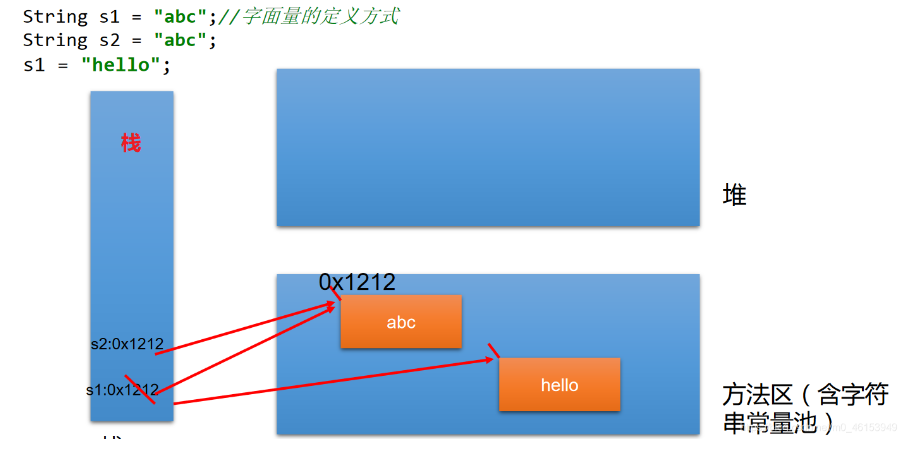
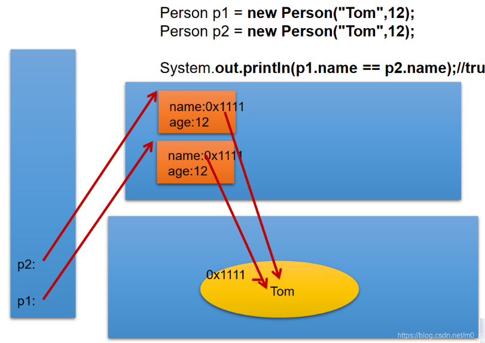

## 十、常用类

### 1. 字符串相关的类

#### 1.1 String类的概述

String:字符串，使用一对 " " 来表示

1. String声明为 `final`，不可被继承

2. String实现了Serializable接口：表示字符串是支持序列化的

   ​		 实现了Comparable接口：表示String可以比较大小

3. String内部定义了 `final char[] value` 用于存储字符串数据

4. String代表不可变的字符序列，不可变性

   

#### 1.2 理解String的不可变性

体现：

1. 当对字符串重新赋值时，需要重写指定内存区域赋值，不能使用原有的value进行赋值
2. 当对现有的字符串进行连接操作时，也需要重新指定内存区域赋值，不能使用原有value进行赋值
3. 当调用String的replace()方法修改指定字符或字符串时，也需要重新指定内存区域赋值
4. 通过字面量的方式（区别于new）给一个字符串赋值，此时的字符串值声明在字符串常量池中
5. 字符串常量池中是不会存储相同内容的字符串的

```java
import org.junit.Test;

/**
 * String的使用
 */
public class StringTest {
	@Test
    public void Test1(){
        String s1 = "abc";  //字面量的定义方式
        String s2 = "abc";
        s1 = "hello";

        System.out.println(s1 == s2);//比较s1和s2的地址值

        System.out.println(s1);//hello
        System.out.println(s2);//abc

        System.out.println("*********************");

        String s3 = "abc";
        s3 += "def";
        System.out.println(s3);//abcdef

        System.out.println("**********************");

        String s4 = "abc";
        String s5 = s4.replace('a', 'm');
        System.out.println(s4);//abc
        System.out.println(s5);//mbc
    }
}
```




#### 1.3 String不同实例化方式的对比

方式一：通过字面量定义

方式二：通过new + 构造器的方式

**问题：String s = new String("abc");方式创建对象，在内存中创建了几个对象？**

**两个**：一个是堆空间中new结构，另一个是char[]对应的常量池中的数据：“abc”

1. String对象的创建

   ```java
   String str = "hello";
   
   //本质上this.value = new char[0];
   String  s1 = new String(); 
   
   //this.value = original.value;
   String  s2 = new String(String original); 
   
   //this.value = Arrays.copyOf(value, value.length);
   String  s3 = new String(char[] a);
   
   String  s4 = new String(char[] a,int startIndex,int count);
   ```

   

   

   

2. String str = "abc";  与 String str2 = new String("abc");的区别

   * 字符串常量存储在字符串常量池中，目的是共享
   * 字符串非常量对象存储在堆中

   


3. 练习

   ```java
   import org.junit.Test;
   
   /**
    * String的使用
    */
   public class StringTest {
       @Test
       public void test2(){
           //通过字面量定义的方式：此时的s1和s2的数据javaEE声明在方法区中的字符串常量池中。
           String s1 = "javaEE";
           String s2 = "javaEE";
   
           //通过new + 构造器的方式:此时的s3和s4保存的地址值，是数据在堆空间中开辟空间以后对应的地址值。
           String s3 = new String("javaEE");
           String s4 = new String("javaEE");
   
           System.out.println(s1 == s2);//true
           System.out.println(s1 == s3);//false
           System.out.println(s1 == s4);//false
           System.out.println(s3 == s4);//false
   
           System.out.println("***********************");
           Person p1 = new Person("Tom",12);
           Person p2 = new Person("Tom",12);
   
           System.out.println(p1.name.equals(p2.name));//true
           System.out.println(p1.name == p2.name);//true
   
           p1.name = "Jerry";
           System.out.println(p2.name);//Tom
       }
   }
   ```

   ```java
   //Person类
   public class Person {
   
       String name;
       int age;
   
       public Person(String name, int age) {
           this.name = name;
           this.age = age;
       }
   
       public Person() {
   
       }
   }
   ```

   


#### 1.4 String不同拼接操作的对比

1. 常量与常量的拼接结果在常量池中，且常量池中不会存在相同内容的常量
2. 只要其中有一个是变量，结果就在堆中
3. 如果拼接结果调用 `intern()`方法，返回值就在常量池中

```java
import org.junit.Test;

public class StringTest {
    @Test
    public void test4(){
        String s1 = "javaEEhadoop";
        String s2 = "javaEE";
        String s3 = s2 + "hadoop";
        System.out.println(s1 == s3);//false

        final String s4 = "javaEE";//s4:常量
        String s5 = s4 + "hadoop";
        System.out.println(s1 == s5);//true

    }

    @Test
    public void test3(){
        String s1 = "javaEE";
        String s2 = "hadoop";

        String s3 = "javaEEhadoop";
        String s4 = "javaEE" + "hadoop";
        String s5 = s1 + "hadoop";
        String s6 = "javaEE" + s2;
        String s7 = s1 + s2;

        System.out.println(s3 == s4);//true
        System.out.println(s3 == s5);//false
        System.out.println(s3 == s6);//false
        System.out.println(s5 == s6);//false
        System.out.println(s3 == s7);//false
        System.out.println(s5 == s6);//false
        System.out.println(s5 == s7);//false
        System.out.println(s6 == s7);//false

        String s8 = s5.intern();//返回值得到的s8使用的常量值中已经存在的“javaEEhadoop”
        System.out.println(s3 == s8);//true
    }
}
```


##### 1.4.1 String使用陷阱

1. String s1 = "a";

   说明：在字符串常量池中创建了一个字面量为"a"的字符串

2. s1 = s1 + "b";

   说明：实际上原来的"a"字符串对象已经丢弃，现在在堆空间中产生了一个字符串s1+"b"("ab")。如果多次执行这些改变串内容的操作，会导致大量副本字符串对象存留在内存中，降低效率。若循环中出现该操作，会极大影响程序性能。

3. String s2 = "ab";

   说明：直接在字符串常量池中创建一个字面量为"ab"的字符串

4. String s3 = "a" + "b";

   说明：s3指向字符串常量池中已经创建的"ab的字符串"

5. String s4 = s1.intern();

   说明：堆空间的s1对象在调用intern()后，会将常量池中已经存在的"ab"字符串赋值给s4

6. 练习

   

   

#### 1.5 String一道面试题

```java
/**
 * 一道面试题
 */
public class StringTest {
    String str = new String("good");
    char[] ch = { 't', 'e', 's', 't' };

    public void change(String str, char ch[]) {
        str = "test ok";
        ch[0] = 'b';
    }
    public static void main(String[] args) {
        StringTest ex = new StringTest();
        ex.change(ex.str, ex.ch);
        System.out.println(ex.str);//good
        System.out.println(ex.ch);//best
    }
}
```


#### 1.6 JVM中涉及字符串的内存结构


三种JVM

* Sun公司的HotSpot
* BEA公司的JRockit
* IBM公司的J9 VM


#### 1.7 String的常用方法1

```java
int length()：//返回字符串的长度：return value.length
char charAt(int index)：//返回某索引处的字符return value[index]
boolean isEmpty()：//判断是否是空字符串：return value.length==0
String toLowerCase()：//使用默认语言环境，将String中的所有字符转换为小写
String toUpperCase()：//使用默认语言环境，将String中的所有字符转换为大写
String trim()：//返回字符串的副本，忽略前导空白和尾部空白
boolean equals(Object obj)：//比较字符串的内容是否相同
boolean equalsIgnoreCase(String anotherString)：//与equals方法类似，忽略大小写
String concat(String str)：//将指定字符串连接到此字符串的结尾。等价于用“+”
int compareTo(String anotherString)：//比较两个字符串的大小
String substring(int beginIndex)：//返回一个新的字符串，它是此字符串的从beginIndex开始截取到最后的一个子字符串。
String substring(int beginIndex,int endIndex)：//返回一个新字符串，它是此字符串从beginIndex开始截取到endIndex(不包含)的一个子字符串。
```

```java
import org.junit.Test;

public class StringMethodTest {

    @Test
    public void test2(){
        String s1 = "HelloWorld";
        String s2 = "helloworld";
        System.out.println(s1.equals(s2));//false
        System.out.println(s1.equalsIgnoreCase(s2));//true
        
        String s3 = "abc";
        String s4 = s3.concat("def");
        System.out.println(s4);//abcdef

        String s5 = "abc";
        String s6 = new String("abe");
        System.out.println(s5.compareTo(s6));//-2   //涉及到字符串的排序

        String s7 = "周围好吵啊";
        String s8 = s7.substring(2);
        System.out.println(s7);
        System.out.println(s8);

        String s9 = s7.substring(0, 2);
        System.out.println(s9);
    }

    @Test
    public void Test1(){
        String s1 = "helloworld";
        System.out.println(s1.length());
        System.out.println(s1.length());
        System.out.println(s1.charAt(0));
        System.out.println(s1.charAt(9));
//        System.out.println(s1.charAt(10));
//        s1 = "";
        System.out.println(s1.isEmpty());

        String s2 = s1.toLowerCase();
        System.out.println(s1);//s1不可变的，仍然为原来的字符串
        System.out.println(s2);//改成小写以后的字符串

        String s3 = "   he  llo   world   ";
        String s4 = s3.trim();
        System.out.println("-----" + s3 + "-----");
        System.out.println("-----" + s4 + "-----");
    }

}
```


#### 1.8 String的常用方法2

```java
boolean endsWith(String suffix)：//测试此字符串是否以指定的后缀结束
boolean startsWith(String prefix)：//测试此字符串是否以指定的前缀开始
boolean startsWith(String prefix, int toffset)：//测试此字符串从指定索引开始的子字符串是否以指定前缀开始
boolean contains(CharSequence s)：//当且仅当此字符串包含指定的 char 值序列时，返回 true
int indexOf(String str)：//返回指定子字符串在此字符串中第一次出现处的索引
int indexOf(String str, int fromIndex)：//返回指定子字符串在此字符串中第一次出现处的索引，从指定的索引开始
int lastIndexOf(String str)：//返回指定子字符串在此字符串中最右边出现处的索引
int lastIndexOf(String str, int fromIndex)：//返回指定子字符串在此字符串中最后一次出现处的索引，从指定的索引开始反向搜索
    注：indexOf和lastIndexOf方法如果未找到都是返回-1
```

```java
import org.junit.Test;

public class StringMethodTest {
    @Test
    public void test3(){
        String str1 = "helloworld";
        boolean b1 = str1.endsWith("rld");
        System.out.println(b1);

        boolean b2 = str1.startsWith("He");
        System.out.println(b2);

        boolean b3 = str1.startsWith("ll",2);
        System.out.println(b3);

        String str2 = "wor";
        System.out.println(str1.contains(str2));

        System.out.println(str1.indexOf("lo"));

        System.out.println(str1.indexOf("lo",5));

        String str3 = "hellorworld";

        System.out.println(str3.lastIndexOf("or"));
        System.out.println(str3.lastIndexOf("or",6));

        //什么情况下，indexOf(str)和lastIndexOf(str)返回值相同？
        //情况一：存在唯一的一个str。情况二：不存在str
    }
}
```


#### 1.9 String的常用方法3

```java
替换：
String replace(char oldChar, char newChar)：//返回一个新的字符串，它是通过用 newChar 替换此字符串中出现的所有 oldChar 得到的。
String replace(CharSequence target, CharSequence replacement)：//使用指定的字面值替换序列替换此字符串所有匹配字面值目标序列的子字符串。
String replaceAll(String regex, String replacement)：//使用给定的 replacement 替换此字符串所有匹配给定的正则表达式的子字符串。
String replaceFirst(String regex, String replacement)：//使用给定的 replacement 替换此字符串匹配给定的正则表达式的第一个子字符串。

匹配:
boolean matches(String regex)：//告知此字符串是否匹配给定的正则表达式。

切片：
String[] split(String regex)：//根据给定正则表达式的匹配拆分此字符串。
String[] split(String regex, int limit)：//根据匹配给定的正则表达式来拆分此字符串，最多不超过limit个，如果超过了，剩下的全部都放到最后一个元素中。
```

```java
import org.junit.Test;

public class StringMethodTest {

    @Test
    public void test4(){
        String str1 = "西藏布达拉宫欢迎您";
        String str2 = str1.replace('西','东');

        System.out.println(str1);
        System.out.println(str2);

        String str3 = str1.replace("北京", "南京");
        System.out.println(str3);

        System.out.println("*************************");
        String str = "12hello34world5java7891mysql456";
        //把字符串中的数字替换成,，如果结果中开头和结尾有，的话去掉
        String string = str.replaceAll("\\d+", ",").replaceAll("^,|,$", "");
        System.out.println(string);

        System.out.println("*************************");
        str = "12345";
        //判断str字符串中是否全部有数字组成，即有1-n个数字组成
        boolean matches = str.matches("\\d+");
        System.out.println(matches);
        String tel = "0571-4534289";
        //判断这是否是一个杭州的固定电话
        boolean result = tel.matches("0571-\\d{7,8}");
        System.out.println(result);

        System.out.println("*************************");
        str = "hello|world|java";
        String[] strs = str.split("\\|");
        for (int i = 0; i < strs.length; i++) {
            System.out.println(strs[i]);
        }
        System.out.println();
        str2 = "hello.world.java";
        String[] strs2 = str2.split("\\.");
        for (int i = 0; i < strs2.length; i++) {
            System.out.println(strs2[i]);
        }
    }
}
```


#### 1.10 String与基本数据类型包装类的转换

String与基本数据类型、包装类之间的转换

* String -->  基本数据类型、包装类：调用包装类的静态方法：parseXxx(str)
* 基本数据类型、包装类 -->  String：调用String重载的valueOf(xxx)

```java
import org.junit.Test;

/**
 * 涉及到String类与其他结构之间的转换
 */
public class StringTest1 {

    @Test
    public void test1(){
        String str1 = "123";
//        int num = (int)str1;//错误的
        int num = Integer.parseInt(str1);

        String str2 = String.valueOf(num);   //"123
        String str3 = num + "";

        System.out.println(str1 == str3);   //false
    }

}
```


#### 1.11 String与char[]之间的转换

String与char[]之间的转换

* String  -->  char[]：调用String的toCharArray()

* char[]  -->  String：调用String构造器

```java
import org.junit.Test;

/**
 * 涉及到String类与其他结构之间的转换
 */
public class StringTest1 {

    @Test
    public void test2(){
        String str1 = "abc123"; //题目： a21cb3

        char[] charArray = str1.toCharArray();
        for (int i = 0; i < charArray.length; i++) {
            System.out.println(charArray[i]);
        }

        char[] arr = new char[]{'h','e','l','l','o'};
        String str2 = new String(arr);
        System.out.println(str2);
    }
}
```


#### 1.12 String与byte[]之间的转换

String 与 byte[]之间的转换

* 编码：String --> byte[]：调用String的getBytes()
* 解码：byte[] -->  String：调用String构造器

编码：字符串 -->  字节（看得懂 -->  看不懂的二进制数据）

解码：编码的逆过程，字节  -->  字符串（看不懂的二进制数据  -->  看得懂）

说明：解码时，要求解码使用的字符集必须与编码时使用的字符集一致，否则会出现乱码

```java
import org.junit.Test;

import java.io.UnsupportedEncodingException;
import java.util.Arrays;

/**
 * 涉及到String类与其他结构之间的转换
 */
public class StringTest1 {

    @Test
    public void test3() throws UnsupportedEncodingException {
        String str1 = "abc123重工";
        byte[] bytes = str1.getBytes();//使用默认的字符编码集,进行转换
        System.out.println(Arrays.toString(bytes));

        byte[] gbks = str1.getBytes("gbk");//使用gbk字符集进行编码。
        System.out.println(Arrays.toString(gbks));

        System.out.println("*****************************");

        String str2 = new String(bytes);//使用默认的字符集，进行解码。
        System.out.println(str2);

        String str3 = new String(gbks);
        System.out.println(str3);//出现乱码。原因：编码集和解码集不一致！

        String str4 = new String(gbks,"gbk");
        System.out.println(str4);//没有出现乱码。原因：编码集和解码集一致！
    }
}
```


#### 1.13 String算法考查说明

1. 模拟一个trim方法，去除字符串两段的空格

   ```java
   import org.junit.Test;
   
   /*
    * 1.模拟一个trim方法，去除字符串两端的空格。
    * 
    */
   public class StringExer {
   
   	// 第1题
   	public String myTrim(String str) {
   		if (str != null) {
   			int start = 0;// 用于记录从前往后首次索引位置不是空格的位置的索引
   			int end = str.length() - 1;// 用于记录从后往前首次索引位置不是空格的位置的索引
   
   			while (start < end && str.charAt(start) == ' ') {
   				start++;
   			}
   
   			while (start < end && str.charAt(end) == ' ') {
   				end--;
   			}
   			if (str.charAt(start) == ' ') {
   				return "";
   			}
   
   			return str.substring(start, end + 1);
   		}
   		return null;
   	}
   	
   	@Test
   	public void testMyTrim() {
   		String str = "   a   ";
   		// str = " ";
   		String newStr = myTrim(str);
   		System.out.println("---" + newStr + "---");
   	}
   }
   ```

   

2. 将一个字符串进行反转。将字符串中指定部分进行反转。如"abcdefg"反转为"abfedcg"

   ```java
   import org.junit.Test;
   
   public class StringDemo {
   
       /**
        * 将一个字符串进行反转。将字符串中指定部分进行反转。比如“abcdefg”反转为”abfedcg”
        *
        * 方式一：转换为char[]
        */
       public String reverse(String str,int startIndex,int endIndex){
   
           if(str != null && str.length() != 0) {
               char[] arr = str.toCharArray();
               for (int x = startIndex, y = endIndex; x < y; x++, y--) {
                   char temp = arr[x];
                   arr[x] = arr[y];
                   arr[y] = temp;
               }
               return new String(arr);
           }
           return null;
       }
   
       /**
        * 方式二：使用String的拼接
        */
       public String reverse2(String str, int startIndex, int endIndex) {
           if(str != null) {
               // 第一部分
               String reverStr = str.substring(0,startIndex);// ab
               // 第二部分
               for (int i = endIndex; i >= startIndex; i--) {
                   reverStr += str.charAt(i);
               } // abfedc
               // 第三部分
               reverStr += str.substring(endIndex + 1);
   
               return reverStr;
           }
           return null;
       }
   
       //方式三：使用StringBuffer/StringBuilder替换String
       public String reverse3(String str, int startIndex, int endIndex) {
           StringBuilder builder = new StringBuilder(str.length());
   
           if(str != null) {
               //第一部分
               builder.append(str.substring(0, startIndex));
   
               //第二部分
               for (int i = endIndex; i >= startIndex; i--) {
   
                   builder.append(str.charAt(i));
               }
               //第三部分
               builder.append(str.substring(endIndex + 1));
   
               return builder.toString();
           }
           return null;
       }
   
       @Test
       public void testReverse() {
           String str = "abcdefg";
           String str1 = reverse3(str, 2, 5);
           System.out.println(str1);// abfedcg
   
       }
   }
   ```

   

3. 获取一个字符串在另一个字符串中出现的次数。比如获取"ab"在"abkkcahjsabskajhjhab"中出现的次数

   ```java
   import org.junit.Test;
   
   public class StringDemo2 {
       /**
        * 获取一个字符串在另一个字符串中出现的次数。
        * 比如：获取“ ab”在“abkkcadkabkebfkabkskab” 中出现的次数
        *
        */
   
       /**
        * 获取subStr在mainStr中出现的次数
        * @param mainStr
        * @param subStr
        */
       public int getCount(String mainStr,String subStr){
           int mainLength = mainStr.length();
           int subLength = subStr.length();
           int count = 0;
           int index = 0;
   
           if(mainLength >= subLength){
   
               //方式一：
   //            while((index = mainStr.indexOf(subStr)) != -1){
   //                count++;
   //                mainStr = mainStr.substring(index + subStr.length());
   //            }
               //方式二：对方式一的改进
               while((index = mainStr.indexOf(subStr,index)) != -1){
                   count++;
                   index += subLength;
               }
   
               return count;
           }else{
               return 0;
           }
       }
   
       @Test
       public void testGetCount(){
           String mainStr = "abkkcadkabkebfkabkskab";
           String subStr = "ab";
           int count = getCount(mainStr,subStr);
           System.out.println(count);
       }
   
   }
   ```

4. 获取两个字符串中最大相同子串，比如：

   str1 = "abcwerthelloyuiodef"; str2 = "cvhellobnm";

   提示：将短的那个串进行长度依次递减的子串，与较长的串进行比较

   ```java
   import org.junit.Test;
   
   import java.util.Arrays;
   
   public class StringDemo3 {
       /**
        * 获取两个字符串中最大相同子串。比如：
        * str1 = "abcwerthelloyuiodef“;str2 = "cvhellobnm"
        * 提示：将短的那个串进行长度依次递减的子串与较长的串比较。
        */
       //前提：两个字符串中只有一个最大相同子串
       public String getMaxSameString(String str1,String str2){
           if(str1 != null && str2 != null){
               String maxStr = (str1.length() >= str2.length())? str1 : str2;
               String minStr = (str1.length() < str2.length())? str1 : str2;
               int length = minStr.length();
   
               for(int i = 0;i < length;i++){
                   for(int x = 0,y = length - i;y <= length;x++,y++){
                       String subStr = minStr.substring(x,y);
                       if(maxStr.contains(subStr)){
                           return subStr;
                       }
                   }
               }
           }
           return null;
       }
   
       // 如果存在多个长度相同的最大相同子串
       // 此时先返回String[]，后面可以用集合中的ArrayList替换，较方便
       public String[] getMaxSameString1(String str1, String str2) {
           if (str1 != null && str2 != null) {
               StringBuffer sBuffer = new StringBuffer();
               String maxString = (str1.length() > str2.length()) ? str1 : str2;
               String minString = (str1.length() > str2.length()) ? str2 : str1;
   
               int len = minString.length();
               for (int i = 0; i < len; i++) {
                   for (int x = 0, y = len - i; y <= len; x++, y++) {
                       String subString = minString.substring(x, y);
                       if (maxString.contains(subString)) {
                           sBuffer.append(subString + ",");
                       }
                   }
   //                System.out.println(sBuffer);
                   if (sBuffer.length() != 0) {
                       break;
                   }
               }
               String[] split = sBuffer.toString().replaceAll(",$", "").split("\\,");
               return split;
           }
   
           return null;
       }
   
       @Test
       public void testGetMaxSameString(){
           String str1 = "abcwerthello1yuiodefabcdef";
           String str2 = "cvhello1bnmabcdef";
           String[] maxSameStrings = getMaxSameString1(str1, str2);
           System.out.println(Arrays.toString(maxSameStrings));
       }
   }
   ```

5. 对字符串中的字符进行自然顺序排序

   提示：

   1. 字符串变成字符数组
   2. 对数组排序，选择，冒泡，Arrays.sort();
   3. 将排序后的数组变成字符串

   ```java
   import org.junit.Test;
   import java.util.Arrays;
   
   public class StringDemo4 {
   
   	// 第5题
   	@Test
   	public void testSort() {
   		String str = "abcwerthelloyuiodef";
   		char[] arr = str.toCharArray();
   		Arrays.sort(arr);
   
   		String newStr = new String(arr);
   		System.out.println(newStr);
   	}
   }
   ```


#### 1.14 StringBuffer和StringBuilder的介绍


