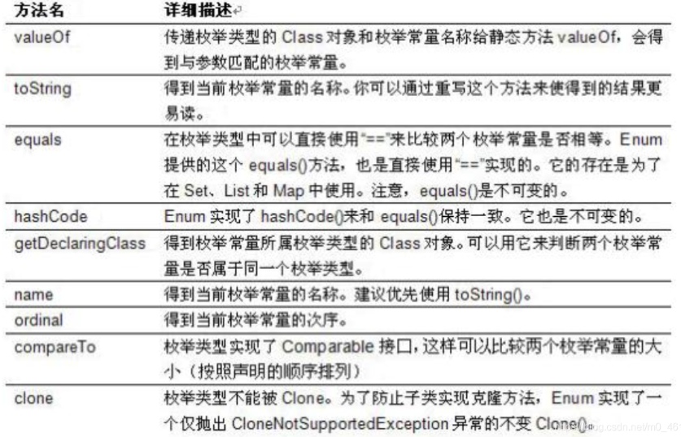

## 十一、枚举与注解

### 1. 枚举类的使用

#### 1.1 枚举类的理解

* 类的对象只有有限个，确定的。
* 当需要定义一组常量时，强烈建议使用枚举类
* 枚举类的实现
  * JDK1.5之前需要自定义枚举类
  * JDK1.5之后新增 `enum`关键字用于定义枚举类
* 若枚举只有一个对象，则可以作为一种单例模式的实现方式


#### 1.2 自定义枚举类

枚举类的属性

* 枚举类对象的属性不允许被改动，所以应该使用`private final`修饰
* 枚举类的使用`private final`修饰的属性应该在构造器中为其赋值
* 若枚举类显式的定义了带参数的构造器，则在列出枚举值时也必须对应的传入参数

```java
public class SeasonTest {
    public static void main(String[] args) {
        Season spring = Season.SPRING;
        System.out.println(spring);
    }
}
//自定义枚举类
class Season{
    //1.声明Season对象的属性:private final修饰
    private final String seasonName;
    private final String seasonDesc;

    //2.私有化类的构造器,并给对象属性赋值
    private Season(String seasonName,String seasonDesc){
        this.seasonName = seasonName;
        this.seasonDesc = seasonDesc;
    }

    //3.提供当前枚举类的多个对象
    public static final Season SPRING = new Season("春天","万物复苏");
    public static final Season SUMMER = new Season("夏天","烈日炎炎");
    public static final Season AUTUMN = new Season("秋天","金秋送爽");
    public static final Season WINTER = new Season("冬天","白雪皑皑");

    //4.其他诉求：获取枚举类对象的属性
    public String getSeasonName() {
        return seasonName;
    }

    public String getSeasonDesc() {
        return seasonDesc;
    }

    //4.其他诉求1：提供toString()
    @Override
    public String toString() {
        return "Season{" +
                "seasonName='" + seasonName + '\'' +
                ", seasonDesc='" + seasonDesc + '\'' +
                '}';
    }
}
```


#### 1.3 使用enum关键字定义枚举类

使用说明

* 使用enum定义的枚举类默认继承了java.lang.Enum类。因此不能再继承其他类
* 枚举类的构造器只能使用private权限修饰符
* 枚举类的所有实例必须在枚举类中显示列出（`,`分割  `;`结尾）。列出的实例系统会自动添加`public static final`修饰
* 必须在枚举类的第一行声明枚举类对象

JDK1.5中可以在switch表达式中使用Enum定义的枚举类的对象作为表达式，case子句可以直接使用枚举值的名字，无需添加枚举类作为限定

```java
/**
 * 使用enum关键字定义枚举类
 * 说明：定义的枚举类默认继承于java.lang.Enum类
 */
public class SeasonTest1 {
    public static void main(String[] args) {
        Season1 summer = Season1.SUMMER;
        //toString():
        System.out.println(summer.toString());
        
        System.out.println(Season1.class.getSuperclass());
    }
}

//使用enum关键字枚举类
enum Season1{
    //1.提供当前枚举类的对象，多个对象之间用","隔开，末尾对象";"结束
    SPRING("春天","万物复苏"),
    SUMMER("夏天","烈日炎炎"),
    AUTUMN("秋天","金秋送爽"),
    WINTER("冬天","白雪皑皑");

    //2.声明Season对象的属性:private final修饰
    private final String seasonName;
    private final String seasonDesc;

    //3.私有化类的构造器,并给对象属性赋值
    private Season1(String seasonName,String seasonDesc){
        this.seasonName = seasonName;
        this.seasonDesc = seasonDesc;
    }

    //4.其他诉求：获取枚举类对象的属性
    public String getSeasonName() {
        return seasonName;
    }

    public String getSeasonDesc() {
        return seasonDesc;
    }

    //4.其他诉求1：提供toString()
//    @Override
//    public String toString() {
//        return "Season{" +
//                "seasonName='" + seasonName + '\'' +
//                ", seasonDesc='" + seasonDesc + '\'' +
//                '}';
//    }
}
```


#### 1.4 Enum类中的常见方法



* `values()`方法：返回枚举类的对象数组
* `valueOf(String str)`：可以把一个字符串转为对应的枚举类对象，要求字符串必须是枚举类对象的名字，否则会有运行时异常：IllegalArgumentException
* `toString()`：返回当前枚举类对象常量的名称

```java
public class SeasonTest1 {
    public static void main(String[] args) {
        Season1 summer = Season1.SUMMER;
        //toString():
        System.out.println(summer.toString());

//        System.out.println(Season1.class.getSuperclass());
        System.out.println("**************************");
        //values():返回所有的枚举类对象构成的数组
        Season1[] values = Season1.values();
        for(int i = 0;i < values.length;i++){
            System.out.println(values[i]);
        }
        System.out.println("****************************");
        Thread.State[] values1 = Thread.State.values();
        for(int i = 0;i < values1.length;i++){
            System.out.println(values1[i]);
        }

        //valueOf(String objName):返回枚举类中对象名是objName的对象。
        Season1 winter = Season1.valueOf("WINTER");
        //如果没有objName的枚举类对象，则抛异常：IllegalArgumentException
//        Season1 winter = Season1.valueOf("WINTER1");
        System.out.println(winter);

    }
}

//使用enum关键字枚举类
enum Season1{
    //1.提供当前枚举类的对象，多个对象之间用","隔开，末尾对象";"结束
    SPRING("春天","万物复苏"),
    SUMMER("夏天","烈日炎炎"),
    AUTUMN("秋天","金秋送爽"),
    WINTER("冬天","白雪皑皑");

    //2.声明Season对象的属性:private final修饰
    private final String seasonName;
    private final String seasonDesc;

    //3.私有化类的构造器,并给对象属性赋值
    private Season1(String seasonName,String seasonDesc){
        this.seasonName = seasonName;
        this.seasonDesc = seasonDesc;
    }

    //4.其他诉求：获取枚举类对象的属性
    public String getSeasonName() {
        return seasonName;
    }

    public String getSeasonDesc() {
        return seasonDesc;
    }

    //4.其他诉求1：提供toString()
//    @Override
//    public String toString() {
//        return "Season{" +
//                "seasonName='" + seasonName + '\'' +
//                ", seasonDesc='" + seasonDesc + '\'' +
//                '}';
//    }
}
```


#### 1.5 使用enum关键字定义的枚举类实现接口

情况一：实现接口，在enum类中实现抽象方法

情况二：让枚举类的对象分别实现接口中的抽象方法

```java
public class SeasonTest1 {
    public static void main(String[] args) {
        //values():返回所有的枚举类对象构成的数组
        Season1[] values = Season1.values();
        for(int i = 0;i < values.length;i++){
            System.out.println(values[i]);
            values[i].show();
        }

        //valueOf(String objName):返回枚举类中对象名是objName的对象。
        Season1 winter = Season1.valueOf("WINTER");
        winter.show();
    }
}

interface Info{
    void show();
}

//使用enum关键字枚举类
enum Season1 implements Info{
    //1.提供当前枚举类的对象，多个对象之间用","隔开，末尾对象";"结束
    SPRING("春天","春暖花开"){
        @Override
        public void show() {
            System.out.println("一元复始、万物复苏");
        }
    },
    SUMMER("夏天","夏日炎炎"){
        @Override
        public void show() {
            System.out.println("蝉声阵阵、烈日当空");
        }
    },
    AUTUMN("秋天","秋高气爽"){
        @Override
        public void show() {
            System.out.println("天高气清、金桂飘香");
        }
    },
    WINTER("冬天","冰天雪地"){
        @Override
        public void show() {
            System.out.println("寒冬腊月、滴水成冰");
        }
    };

    //2.声明Season对象的属性:private final修饰
    private final String seasonName;
    private final String seasonDesc;

    //3.私有化类的构造器,并给对象属性赋值
    private Season1(String seasonName,String seasonDesc){
        this.seasonName = seasonName;
        this.seasonDesc = seasonDesc;
    }

    //4.其他诉求：获取枚举类对象的属性
    public String getSeasonName() {
        return seasonName;
    }

    public String getSeasonDesc() {
        return seasonDesc;
    }

    //4.其他诉求1：提供toString()
//    @Override
//    public String toString() {
//        return "Season{" +
//                "seasonName='" + seasonName + '\'' +
//                ", seasonDesc='" + seasonDesc + '\'' +
//                '}';
//    }

//    @Override
//    public void show() {
//        System.out.println("这是一个季节。");
//    }
}
```


### 2. 注解的使用

#### 2.1 注解的理解

* 从JDK 5.0 开始, Java 增加了对元数据(MetaData) 的支持, 也就是Annotation(注解)
  Annotation 其实就是代码里的特殊标记, 这些标记可以在编译, 类加载, 运行时被读取, 并执行相应的处理。通过使用Annotation, 程序员可以在不改变原有逻辑的情况下, 在源文件中嵌入一些补充信息。代码分析工具、开发工具和部署工具可以通过这些补充信息进行验证或者进行部署。
* Annotation 可以像修饰符一样被使用, 可用于修饰包,类, 构造器, 方法, 成员变量, 参数, 局部变量的声明, 这些信息被保存在Annotation 的“name=value” 对中。
* 在JavaSE中，注解的使用目的比较简单，例如标记过时的功能，忽略警告等。在JavaEE/Android中注解占据了更重要的角色，例如用来配置应用程序的任何切面，代替JavaEE旧版中所遗留的繁冗代码和XML配置等。
* 未来的开发模式都是基于注解的，JPA是基于注解的，Spring2.5以上都是基于注解的，Hibernate3.x以后也是基于注解的，现在的Struts2有一部分也是基于注解的了，注解是一种趋势，一定程度上可以说：框架= 注解+ 反射+ 设计模式。


#### 2.2 Annotation的使用示例

使用Annotation时要在前面加上@符号