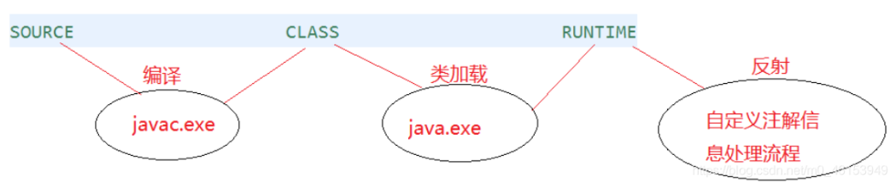
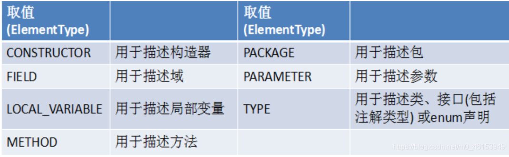
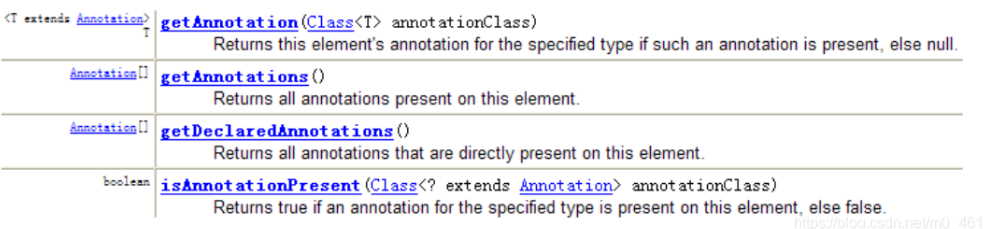

## 十一、枚举与注解

### 1. 枚举类的使用

#### 1.1 枚举类的理解

* 类的对象只有有限个，确定的。
* 当需要定义一组常量时，强烈建议使用枚举类
* 枚举类的实现
  * JDK1.5之前需要自定义枚举类
  * JDK1.5之后新增 `enum`关键字用于定义枚举类
* 若枚举只有一个对象，则可以作为一种单例模式的实现方式


#### 1.2 自定义枚举类

枚举类的属性

* 枚举类对象的属性不允许被改动，所以应该使用`private final`修饰
* 枚举类的使用`private final`修饰的属性应该在构造器中为其赋值
* 若枚举类显式的定义了带参数的构造器，则在列出枚举值时也必须对应的传入参数

```java
public class SeasonTest {
    public static void main(String[] args) {
        Season spring = Season.SPRING;
        System.out.println(spring);
    }
}
//自定义枚举类
class Season{
    //1.声明Season对象的属性:private final修饰
    private final String seasonName;
    private final String seasonDesc;

    //2.私有化类的构造器,并给对象属性赋值
    private Season(String seasonName,String seasonDesc){
        this.seasonName = seasonName;
        this.seasonDesc = seasonDesc;
    }

    //3.提供当前枚举类的多个对象
    public static final Season SPRING = new Season("春天","万物复苏");
    public static final Season SUMMER = new Season("夏天","烈日炎炎");
    public static final Season AUTUMN = new Season("秋天","金秋送爽");
    public static final Season WINTER = new Season("冬天","白雪皑皑");

    //4.其他诉求：获取枚举类对象的属性
    public String getSeasonName() {
        return seasonName;
    }

    public String getSeasonDesc() {
        return seasonDesc;
    }

    //4.其他诉求1：提供toString()
    @Override
    public String toString() {
        return "Season{" +
                "seasonName='" + seasonName + '\'' +
                ", seasonDesc='" + seasonDesc + '\'' +
                '}';
    }
}
```


#### 1.3 使用enum关键字定义枚举类

使用说明

* 使用enum定义的枚举类默认继承了java.lang.Enum类。因此不能再继承其他类
* 枚举类的构造器只能使用private权限修饰符
* 枚举类的所有实例必须在枚举类中显示列出（`,`分割  `;`结尾）。列出的实例系统会自动添加`public static final`修饰
* 必须在枚举类的第一行声明枚举类对象

JDK1.5中可以在switch表达式中使用Enum定义的枚举类的对象作为表达式，case子句可以直接使用枚举值的名字，无需添加枚举类作为限定

```java
/**
 * 使用enum关键字定义枚举类
 * 说明：定义的枚举类默认继承于java.lang.Enum类
 */
public class SeasonTest1 {
    public static void main(String[] args) {
        Season1 summer = Season1.SUMMER;
        //toString():
        System.out.println(summer.toString());
        
        System.out.println(Season1.class.getSuperclass());
    }
}

//使用enum关键字枚举类
enum Season1{
    //1.提供当前枚举类的对象，多个对象之间用","隔开，末尾对象";"结束
    SPRING("春天","万物复苏"),
    SUMMER("夏天","烈日炎炎"),
    AUTUMN("秋天","金秋送爽"),
    WINTER("冬天","白雪皑皑");

    //2.声明Season对象的属性:private final修饰
    private final String seasonName;
    private final String seasonDesc;

    //3.私有化类的构造器,并给对象属性赋值
    private Season1(String seasonName,String seasonDesc){
        this.seasonName = seasonName;
        this.seasonDesc = seasonDesc;
    }

    //4.其他诉求：获取枚举类对象的属性
    public String getSeasonName() {
        return seasonName;
    }

    public String getSeasonDesc() {
        return seasonDesc;
    }

    //4.其他诉求1：提供toString()
//    @Override
//    public String toString() {
//        return "Season{" +
//                "seasonName='" + seasonName + '\'' +
//                ", seasonDesc='" + seasonDesc + '\'' +
//                '}';
//    }
}
```


#### 1.4 Enum类中的常见方法


* `values()`方法：返回枚举类的对象数组
* `valueOf(String str)`：可以把一个字符串转为对应的枚举类对象，要求字符串必须是枚举类对象的名字，否则会有运行时异常：IllegalArgumentException
* `toString()`：返回当前枚举类对象常量的名称

```java
public class SeasonTest1 {
    public static void main(String[] args) {
        Season1 summer = Season1.SUMMER;
        //toString():
        System.out.println(summer.toString());

//        System.out.println(Season1.class.getSuperclass());
        System.out.println("**************************");
        //values():返回所有的枚举类对象构成的数组
        Season1[] values = Season1.values();
        for(int i = 0;i < values.length;i++){
            System.out.println(values[i]);
        }
        System.out.println("****************************");
        Thread.State[] values1 = Thread.State.values();
        for(int i = 0;i < values1.length;i++){
            System.out.println(values1[i]);
        }

        //valueOf(String objName):返回枚举类中对象名是objName的对象。
        Season1 winter = Season1.valueOf("WINTER");
        //如果没有objName的枚举类对象，则抛异常：IllegalArgumentException
//        Season1 winter = Season1.valueOf("WINTER1");
        System.out.println(winter);

    }
}

//使用enum关键字枚举类
enum Season1{
    //1.提供当前枚举类的对象，多个对象之间用","隔开，末尾对象";"结束
    SPRING("春天","万物复苏"),
    SUMMER("夏天","烈日炎炎"),
    AUTUMN("秋天","金秋送爽"),
    WINTER("冬天","白雪皑皑");

    //2.声明Season对象的属性:private final修饰
    private final String seasonName;
    private final String seasonDesc;

    //3.私有化类的构造器,并给对象属性赋值
    private Season1(String seasonName,String seasonDesc){
        this.seasonName = seasonName;
        this.seasonDesc = seasonDesc;
    }

    //4.其他诉求：获取枚举类对象的属性
    public String getSeasonName() {
        return seasonName;
    }

    public String getSeasonDesc() {
        return seasonDesc;
    }

    //4.其他诉求1：提供toString()
//    @Override
//    public String toString() {
//        return "Season{" +
//                "seasonName='" + seasonName + '\'' +
//                ", seasonDesc='" + seasonDesc + '\'' +
//                '}';
//    }
}
```


#### 1.5 使用enum关键字定义的枚举类实现接口

情况一：实现接口，在enum类中实现抽象方法

情况二：让枚举类的对象分别实现接口中的抽象方法

```java
public class SeasonTest1 {
    public static void main(String[] args) {
        //values():返回所有的枚举类对象构成的数组
        Season1[] values = Season1.values();
        for(int i = 0;i < values.length;i++){
            System.out.println(values[i]);
            values[i].show();
        }

        //valueOf(String objName):返回枚举类中对象名是objName的对象。
        Season1 winter = Season1.valueOf("WINTER");
        winter.show();
    }
}

interface Info{
    void show();
}

//使用enum关键字枚举类
enum Season1 implements Info{
    //1.提供当前枚举类的对象，多个对象之间用","隔开，末尾对象";"结束
    SPRING("春天","春暖花开"){
        @Override
        public void show() {
            System.out.println("一元复始、万物复苏");
        }
    },
    SUMMER("夏天","夏日炎炎"){
        @Override
        public void show() {
            System.out.println("蝉声阵阵、烈日当空");
        }
    },
    AUTUMN("秋天","秋高气爽"){
        @Override
        public void show() {
            System.out.println("天高气清、金桂飘香");
        }
    },
    WINTER("冬天","冰天雪地"){
        @Override
        public void show() {
            System.out.println("寒冬腊月、滴水成冰");
        }
    };

    //2.声明Season对象的属性:private final修饰
    private final String seasonName;
    private final String seasonDesc;

    //3.私有化类的构造器,并给对象属性赋值
    private Season1(String seasonName,String seasonDesc){
        this.seasonName = seasonName;
        this.seasonDesc = seasonDesc;
    }

    //4.其他诉求：获取枚举类对象的属性
    public String getSeasonName() {
        return seasonName;
    }

    public String getSeasonDesc() {
        return seasonDesc;
    }

    //4.其他诉求1：提供toString()
//    @Override
//    public String toString() {
//        return "Season{" +
//                "seasonName='" + seasonName + '\'' +
//                ", seasonDesc='" + seasonDesc + '\'' +
//                '}';
//    }

//    @Override
//    public void show() {
//        System.out.println("这是一个季节。");
//    }
}
```


### 2. 注解的使用

#### 2.1 注解的理解

* 从JDK 5.0 开始, Java 增加了对元数据(MetaData) 的支持, 也就是Annotation(注解)
  Annotation 其实就是代码里的特殊标记, 这些标记可以在编译, 类加载, 运行时被读取, 并执行相应的处理。通过使用Annotation, 程序员可以在不改变原有逻辑的情况下, 在源文件中嵌入一些补充信息。代码分析工具、开发工具和部署工具可以通过这些补充信息进行验证或者进行部署。
* Annotation 可以像修饰符一样被使用, 可用于修饰包,类, 构造器, 方法, 成员变量, 参数, 局部变量的声明, 这些信息被保存在Annotation 的“name=value” 对中。
* 在JavaSE中，注解的使用目的比较简单，例如标记过时的功能，忽略警告等。在JavaEE/Android中注解占据了更重要的角色，例如用来配置应用程序的任何切面，代替JavaEE旧版中所遗留的繁冗代码和XML配置等。
* 未来的开发模式都是基于注解的，JPA是基于注解的，Spring2.5以上都是基于注解的，Hibernate3.x以后也是基于注解的，现在的Struts2有一部分也是基于注解的了，注解是一种趋势，一定程度上可以说：框架= 注解+ 反射+ 设计模式。


#### 2.2 Annotation的使用示例

* 使用Annotation时要在前面加上@符号,并把该**Annotation当成一个修饰符使用**，用于修饰它支持的程序元素
* 示例1：生成文档相关的注解
  * @author标明开发该类模块的作者，多个作者之间使用,分割
  * @version标明该类模块的版本
  * @see参考转向，也就是相关主题
  * @since从哪个版本开始增加的
  * @param对方法中某参数的说明，如果没有参数就不能写
  * @return对方法返回值的说明，如果方法的返回值类型是void就不能写
  * @exception对方法可能抛出的异常进行说明，如果方法没有用throws显式抛出的异常就不能写其中
    * @param@return和@exception这三个标记都是只用于方法的。
    * @param的格式要求：@param形参名形参类型形参说明
    * @return的格式要求：@return返回值类型返回值说明
    * @exception的格式要求：@exception异常类型异常说明
    * @param和@exception可以并列多个
* 示例2：在编译时进行格式检查（JDK内置的三个基本注解）
  * @Override：限定重写父类方法，该注解只能用于方法
  * @Deprecated：用于表示所修饰的元素（类、方法等），通常是因为所修饰的结构危险或存在更好的选择
  * @SuppressWarnings：抑制编译器警告
* 示例3：跟踪代码依赖性，实现替代配置文件功能
  * Servlet3.0提供了注解，使得不再需要在web.xml文件中及逆行Servlet的部署
  * spring框架中关于“事务”的管理

```java
import java.util.ArrayList;
import java.util.Date;

public class AnnotationTest {
    public static void main(String[] args) {
        Person p = new Student();
        p.walk();

        Date date = new Date(2020, 10, 11);
        System.out.println(date);

        @SuppressWarnings("unused")
        int num = 10;

//        System.out.println(num);

        @SuppressWarnings({ "unused", "rawtypes" })
        ArrayList list = new ArrayList();
    }
}

class Person{
    private String name;
    private int age;

    public Person() {
        super();
    }

    public Person(String name, int age) {
        this.name = name;
        this.age = age;
    }
    public void walk(){
        System.out.println("学习中……");
    }
    public void eat(){
        System.out.println("摸鱼中……");
    }
}

interface Info{
    void show();
}

class Student extends Person implements Info{

    @Override
    public void walk() {
        System.out.println("喷子走开");
    }

    @Override
    public void show() {

    }
}
```


#### 2.3 如何自定义注解

参照@SuppressWarnings定义

1. 注解声明为`@interface`
2. 内部定义成员，通常使用value表示
3. 可以指定成员的默认值，使用default定义
4. 如果自定义注解没有成员，表面是一个标识作用

如果注解有成员，在使用注解时需要指明成员的值

自定义注解必须配上注解的信息处理流程（使用反射）才有意义

自定义注解通过都会指明两个元注解：Retention、Target

```java
public @interface MyAnnotation {

    String value();
}

@MyAnnotation(value = "hello")
```


#### 2.4 jdk中4个基本的元注解的使用1

* JDK的元注解用于修饰其他注解定义

* JDK5.0提供了4个标准的元注解类型

  * Retention
  * Target
  * Documented
  * Inherited

* `@Retention`只能用于修饰一个注解定义，用于指定该注解的生命周期，包含一个`RetentionPolicy`类型的成员变量，使用@Retention时必须为该value成员变量指定值

  * RetentionPolicy.SOURCE：在源文件中有效（即源文件保留），编译器直接丢弃这种策略的注解
  * RetentionPolicy.CLASS：在class文件中有效（即class保留），当运行java程序时，JVM不会保留注解，这是默认值。
  * Retention.RUNTIME：在运行时有效（即运行时保留），当运行java程序时，JVM会保留注释，程序可以通过反射获得该注释

  

```java
import java.lang.annotation.Retention;
import java.lang.annotation.RetentionPolicy;

@Retention(RetentionPolicy.SOURCE)
public @interface MyAnnotation {

    String value();

}

public class AnnotationTest {
    public static void main(String[] args) {

    }
}

@MyAnnotation(value = "hello")
class Person{
    private String name;
    private int age;

    public Person() {
        super();
    }

    @MyAnnotation(value = "jack")
    public Person(String name, int age) {
        this.name = name;
        this.age = age;
    }
    
    public void walk(){
        System.out.println("学习中……");
    }
    public void eat(){
        System.out.println("摸鱼中……");
    }
}
```


#### 2.5 jdk中4个基本的元注解的使用2

* `@Target`：用于修饰注解定义，用于指定被修饰的注解能够用于修饰哪些程序元素，@Target也包含一个名为value的成员变量

  

  

* `@Documented`：用于指定该元注解修饰的Annotation类将被javadoc工具提取成文档，默认情况下javadoc是不包含注解的

  * 定义为Documented的注解必须设置Retention值为RUNTIME

* `@Inherited`：被修饰的注解将具有继承性，如果某个类使用了被@Inherited修饰的注解，则其子类将自动有该注解

```java
import org.junit.Test;

import java.lang.annotation.Annotation;
import java.util.ArrayList;
import java.util.Date;

public class AnnotationTest {
    public static void main(String[] args) {

    }

    @Test
    public void testGetAnnotation(){
        Class clazz = Student.class;
        Annotation[] annotations = clazz.getAnnotations();
        for(int i = 0;i < annotations.length;i++){
            System.out.println(annotations[i]);
        }
    }
}

@MyAnnotation(value = "hello")
class Person{
    private String name;
    private int age;

    public Person() {
        super();
    }

    @MyAnnotation
    public Person(String name, int age) {
        this.name = name;
        this.age = age;
    }

    @MyAnnotation
    public void walk(){
        System.out.println("学习中……");
    }
    public void eat(){
        System.out.println("摸鱼中……");
    }
}


@Inherited
@Retention(RetentionPolicy.RUNTIME)
@Target({TYPE, FIELD, METHOD, PARAMETER, CONSTRUCTOR, LOCAL_VARIABLE,TYPE_PARAMETER,TYPE_USE})
public @interface MyAnnotation {
    String value() default "book";
}
```


#### 2.6 利用 反射获取注解信息

* JDK5.0在`java.lang.reflect`包下新增了`AnnotatedElement`接口，该接口代表程序中可以接受注解的程序元素

* 当一个Annotation类被定义为运行时注解后，该注解才是运行时可见，当class文件被载入时保存在class文件中的Annotation才会被虚拟机读取

* 程序可以调用AnnotatedElement对象的如下方法来访问Annotation信息

  


#### 2.7 jdk8新特性：可重复注解

1. 在MyAnnotation上声明@Repeatable，成员值为MyAnnotations.class
2. MyAnnotation的Target和Retention等元注解与MyAnnotations相同

```java
import java.lang.annotation.Retention;
import java.lang.annotation.RetentionPolicy;
import java.lang.annotation.Target;

import static java.lang.annotation.ElementType.*;

@Retention(RetentionPolicy.RUNTIME)
@Target({TYPE, FIELD, METHOD, PARAMETER, CONSTRUCTOR, LOCAL_VARIABLE})
public @interface MyAnnotations {

    MyAnnotation[] value();
}
```

```java
import java.lang.annotation.*;
import static java.lang.annotation.ElementType.*;

@Repeatable(MyAnnotations.class)
@Retention(RetentionPolicy.RUNTIME)
@Target({TYPE, FIELD, METHOD, PARAMETER, CONSTRUCTOR, LOCAL_VARIABLE,TYPE_PARAMETER,TYPE_USE})
public @interface MyAnnotation {

    String value() default "hello";

}
```

```java
import java.lang.annotation.Annotation;

public class AnnotationTest {
    public static void main(String[] args) {
    }
}

@MyAnnotation(value = "hi")
@MyAnnotation(value = "abc")
//jdk 8之前的写法：
//@MyAnnotations({@MyAnnotation(value="hi"),@MyAnnotation(value="hi")})
```


#### 2.8 jdk8新特性：类型注解

* JDK1.8之后，关于元注解`@Target`的参数类型`ElementType`枚举值多了两个：**TYPE_PARAMETER**和**TYPE_USE**
* JDK8之前，注解只能是在声明的地方使用，JDK8开始，注解可以应用在任何地方
  * `ElementType.TYPE_PARAMETER`表示该注解能写在类型变量的声明语句中
  * `ElementType.TYPE_USE`表示该注解能写在使用类型的任何语句中

```java
import java.util.ArrayList;

public class AnnotationTest {
 
}


class Generic<@MyAnnotation T>{

    public void show() throws @MyAnnotation RuntimeException{

        ArrayList<@MyAnnotation String> list = new ArrayList<>();

        int num = (@MyAnnotation int) 10L;
    }
}
```

```java
//MyAnnotation
import java.lang.annotation.*;

import static java.lang.annotation.ElementType.*;

@Retention(RetentionPolicy.RUNTIME)
@Target({TYPE, FIELD, METHOD, PARAMETER, CONSTRUCTOR, LOCAL_VARIABLE,TYPE_PARAMETER,TYPE_USE})
public @interface MyAnnotation {

    String value() default "hello";
}
```

