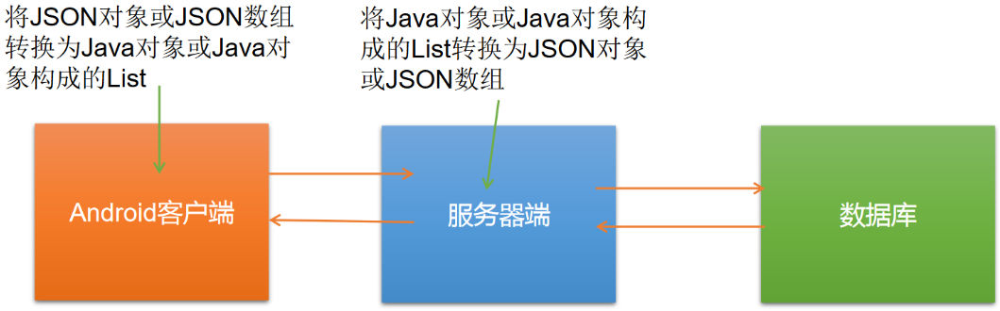
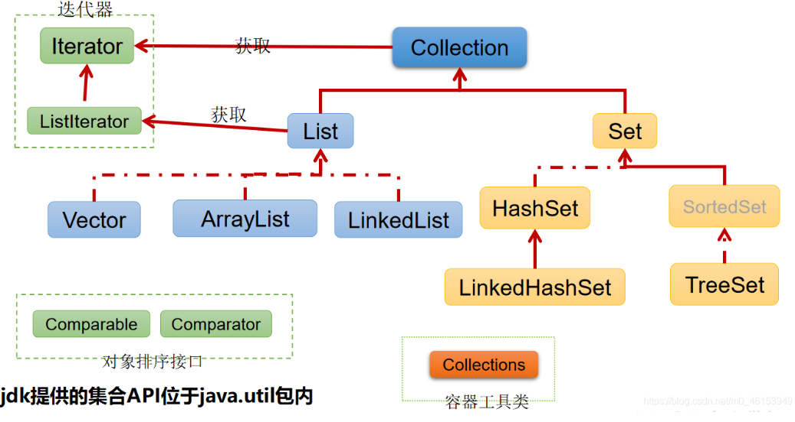
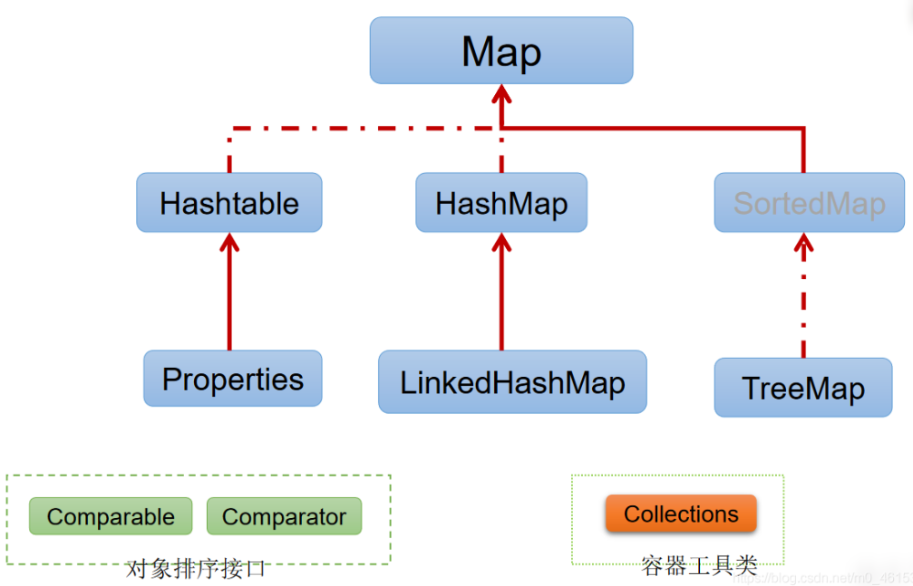
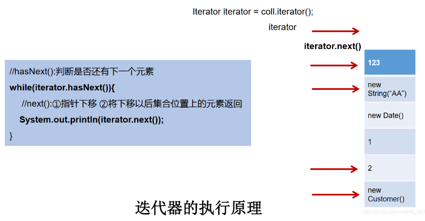
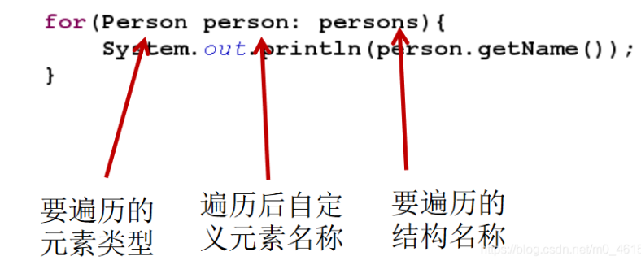
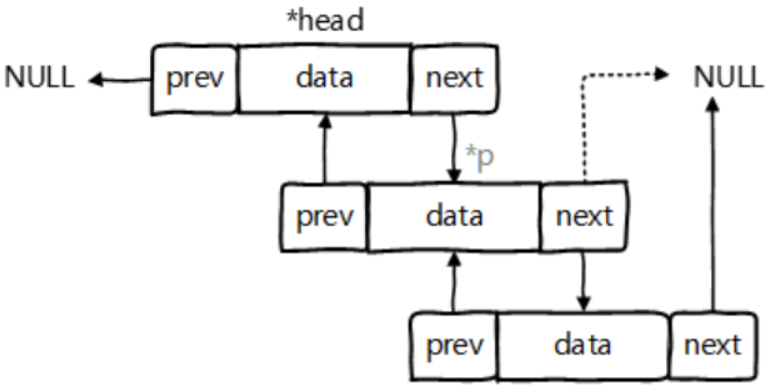
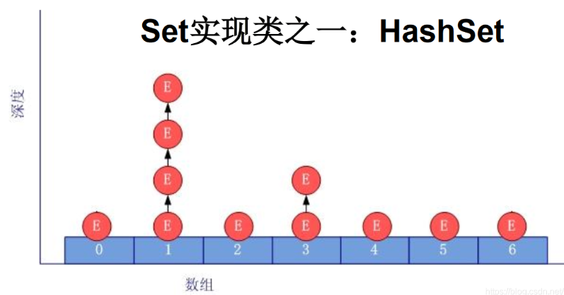

## 十二、集合

### 1. Java集合框架概述

#### 1.1 集合框架与数组的对比及概述

1. 集合、数组都是对多个数据进行存储操作的结构，简称Java容器

   说明：此时的存储，主要是指内存层面的存储，不涉及到持久化存储（.txt， .png，数据库中）

2. 数组在存储多个数据方面的特点：

   1. 一旦初始化以后，长度就确定了，长度不可修改
   2. 数组一旦定义好，数据类型也就确定，只能操作指定类型的数据
   3. 数组中提供的方法非常有限，对于添加、删除、插入数据等操作，非常不便，同时效率不高
   4. 获取数组中的实际元素的个数需求，数组没有现成的属性或方法可用
   5. 数组存储的特点：有序、可重复。对于无序、不可重复的需求，不能满足

3. 使用场景

   


#### 1.2 集合框架涉及到的API

Java集合可分为**Collection**和**Map**两种体系

* Collection接口：单列数据，定义了存取一组对象的方法的集合
  * List：元素有序、可重复的集合
  * Set：元素无序、不可重复的集合
* Map接口：双列数据，保存具有映射关系的key-value对的集合

1. Collection接口继承树

   

   

2. Map接口继承树

   


Collection接口：单列集合，用来存储一个一个的对象
		/---List接口：存储有序的、可重复的数据。  -->“动态”数组
				/---ArrayList、LinkedList、Vector
		/---Set接口：存储无序的、不可重复的数据   -->高中讲的“集合”
				/---HashSet、LinkedHashSet、TreeSet

Map接口：双列集合，用来存储一对(key - value)一对的数据   -->高中函数：y = f(x)
		/---HashMap、LinkedHashMap、TreeMap、Hashtable、Properties

### 2. Collection接口方法

#### 2.1 概述

* Collection接口是List、Set和Queue接口的父接口，该接口定义的方法既可用于操作Set集合，也可以操作List和Queue集合

* JDK不提供此接口的任何直接实现，而是提供更具体的子接口实现（Set、List）

* 在JDK5之前，Java集合会丢掉容器中所有对象的数据类型，并把所有对象都当成Object类型去处理

  JDK5之后，增加了**泛型**，java集合可以记住容器中对象的数据类型


#### 2.2 Collection接口中常用方法1

1. 添加
   * add(Object obj)
   * addAll(Collection coll)
2. 获取有效元素个数
   * int size()
3. 清空集合
   * void clear()
4. 是否是空集合
   * boolean isEmpty()
5. 是否包含某个元素
   * boolean contains(Object obj)：是通过元素的**equals方法**来判断是否是同一个对象
   * boolean containsAll(Collection c)：也是调用元素的equals方法来比较的，拿两个集合的元素挨个比较
6. 删除
   * boolean remove(Object obj)：通过元素的equals方法判断是否是要删除的那个元素，只会删除找到的第一个元素
   * boolean removeAll(Collection coll)：取当前集合的差集
7. 取两个集合的交集
   * boolean retainAll(Collection c)：把交集的结果存在当前集合中，不影响c
8. 集合是否相等
   * boolean equals(Object obj)
9. 转成对象数组
   * Object[] toArray()
10. 获取集合对象的哈希值
    * hashCode()
11. 遍历
    * iterator()：返回迭代器对象，用于集合遍历

```java
import org.junit.Test;
import java.util.ArrayList;
import java.util.Collection;
import java.util.Date;

/**
 *
 * 三、Collection接口中的方法的使用
 *
 */
public class CollectionTest {

    @Test
    public void test1(){
        Collection coll = new ArrayList();

        //add(Object e):将元素e添加到集合coll中
        coll.add("AA");
        coll.add("BB");
        coll.add(123);  //自动装箱
        coll.add(new Date());

        //size():获取添加的元素的个数
        System.out.println(coll.size());    //4

        //addAll(Collection coll1):将coll1集合中的元素添加到当前的集合中
        Collection coll1 = new ArrayList();
        coll1.add(456);
        coll1.add("CC");
        coll.addAll(coll1);

        System.out.println(coll.size());    //6
        System.out.println(coll);

        //clear():清空集合元素
        coll.clear();

        //isEmpty():判断当前集合是否为空
        System.out.println(coll.isEmpty());
    }
}
```


#### 2.3 Collection接口中的常用方法2

向Collection接口的实现类的对象中添加数据obj时，要求obj所在类要重写equals()

```java
//Person类
import java.util.Objects;

public class Person {

    private String name;
    private int age;

    public Person() {
        super();
    }

    public Person(String name, int age) {
        this.name = name;
        this.age = age;
    }

    public String getName() {
        return name;
    }

    public void setName(String name) {
        this.name = name;
    }

    public int getAge() {
        return age;
    }

    public void setAge(int age) {
        this.age = age;
    }

    @Override
    public String toString() {
        return "Person{" +
                "name='" + name + '\'' +
                ", age=" + age +
                '}';
    }

    @Override
    public boolean equals(Object o) {
        System.out.println("Person equals()....");
        if (this == o) return true;
        if (o == null || getClass() != o.getClass()) return false;
        Person person = (Person) o;
        return age == person.age &&
                Objects.equals(name, person.name);
    }

    @Override
    public int hashCode() {

        return Objects.hash(name, age);
    }
}
```

```java
//测试类
import org.junit.Test;

import java.util.ArrayList;
import java.util.Arrays;
import java.util.Collection;

/**
 * Collection接口中声明的方法的测试
 *
 * 结论：
 * 向Collection接口的实现类的对象中添加数据obj时，要求obj所在类要重写equals().
 */
public class CollectinoTest {

    @Test
    public void test(){
        Collection coll = new ArrayList();
        coll.add(123);
        coll.add(456);

//        Person p = new Person("Jerry",20);
//        coll.add(p);
        coll.add(new Person("Jerry",20));

        coll.add(new String("Tom"));
        coll.add(false);

        //1.contains(Object obj):判断当前集合中是否包含obj
        //我们在判断时会调用obj对象所在类的equals()。
        boolean contains = coll.contains(123);
        System.out.println(contains);
        System.out.println(coll.contains(new String("Tam")));
//        System.out.println(coll.contains(p));//true
        System.out.println(coll.contains(new Person("Jerry",20)));//false -->true

        //2.containsAll(Collection coll1):判断形参coll1中的所有元素是否都存在于当前集合中。
        Collection coll1 = Arrays.asList(123,4567);
        System.out.println(coll.containsAll(coll1));
    }
}
```


#### 2.4 Collection接口中的常用方法3

```java
//Person类
import java.util.Objects;

public class Person {

    private String name;
    private int age;

    public Person() {
        super();
    }

    public Person(String name, int age) {
        this.name = name;
        this.age = age;
    }

    public String getName() {
        return name;
    }

    public void setName(String name) {
        this.name = name;
    }

    public int getAge() {
        return age;
    }

    public void setAge(int age) {
        this.age = age;
    }

    @Override
    public String toString() {
        return "Person{" +
                "name='" + name + '\'' +
                ", age=" + age +
                '}';
    }

    @Override
    public boolean equals(Object o) {
        System.out.println("Person equals()....");
        if (this == o) return true;
        if (o == null || getClass() != o.getClass()) return false;
        Person person = (Person) o;
        return age == person.age &&
                Objects.equals(name, person.name);
    }

    @Override
    public int hashCode() {

        return Objects.hash(name, age);
    }
}
```

```java
//测试类
import org.junit.Test;

import java.util.ArrayList;
import java.util.Arrays;
import java.util.Collection;

/**
 * Collection接口中声明的方法的测试
 *
 * 结论：
 * 向Collection接口的实现类的对象中添加数据obj时，要求obj所在类要重写equals().
 *
 */
public class CollectinoTest {

    @Test
    public void test2(){
        //3.remove(Object obj):从当前集合中移除obj元素。
        Collection coll = new ArrayList();
        coll.add(123);
        coll.add(456);
        coll.add(new Person("Jerry",20));
        coll.add(new String("Tom"));
        coll.add(false);

        coll.remove(1234);
        System.out.println(coll);

        coll.remove(new Person("Jerry",20));
        System.out.println(coll);

        //4. removeAll(Collection coll1):差集：从当前集合中移除coll1中所有的元素。
        Collection coll1 = Arrays.asList(123,456);
        coll.removeAll(coll1);
        System.out.println(coll);
    }

    @Test
    public void test3(){
        Collection coll = new ArrayList();
        coll.add(123);
        coll.add(456);
        coll.add(new Person("Jerry",20));
        coll.add(new String("Tom"));
        coll.add(false);

        //5.retainAll(Collection coll1):交集：获取当前集合和coll1集合的交集，并返回给当前集合
//        Collection coll1 = Arrays.asList(123,456,789);
//        coll.retainAll(coll1);
//        System.out.println(coll);

        //6.equals(Object obj):要想返回true，需要当前集合和形参集合的元素都相同。
        Collection coll1 = new ArrayList();
        coll1.add(456);
        coll1.add(123);
        coll1.add(new Person("Jerry",20));
        coll1.add(new String("Tom"));
        coll1.add(false);

        System.out.println(coll.equals(coll1));
    }
}
```


#### 2.5 Collection接口中的常用方法4

```java
//Person类
import java.util.Objects;

public class Person {

    private String name;
    private int age;

    public Person() {
        super();
    }

    public Person(String name, int age) {
        this.name = name;
        this.age = age;
    }

    public String getName() {
        return name;
    }

    public void setName(String name) {
        this.name = name;
    }

    public int getAge() {
        return age;
    }

    public void setAge(int age) {
        this.age = age;
    }

    @Override
    public String toString() {
        return "Person{" +
                "name='" + name + '\'' +
                ", age=" + age +
                '}';
    }

    @Override
    public boolean equals(Object o) {
        System.out.println("Person equals()....");
        if (this == o) return true;
        if (o == null || getClass() != o.getClass()) return false;
        Person person = (Person) o;
        return age == person.age &&
                Objects.equals(name, person.name);
    }

    @Override
    public int hashCode() {

        return Objects.hash(name, age);
    }
}
```

```java
//测试类
import org.junit.Test;

import java.util.ArrayList;
import java.util.Arrays;
import java.util.Collection;
import java.util.List;

/**
 * Collection接口中声明的方法的测试
 *
 * 结论：
 * 向Collection接口的实现类的对象中添加数据obj时，要求obj所在类要重写equals().
 *
 */
public class CollectinoTest {

    @Test
    public void test4(){
        Collection coll = new ArrayList();
        coll.add(123);
        coll.add(456);
        coll.add(new Person("Jerry",20));
        coll.add(new String("Tom"));
        coll.add(false);

        //7.hashCode():返回当前对象的哈希值
        System.out.println(coll.hashCode());

        //8.集合 --->数组：toArray()
        Object[] arr = coll.toArray();
        for(int i = 0;i < arr.length;i++){
            System.out.println(arr[i]);
        }

        //拓展：数组 --->集合:调用Arrays类的静态方法asList()
        List<String> list = Arrays.asList(new String[]{"AA", "BB", "CC"});
        System.out.println(list);

        List arr1 = Arrays.asList(123, 456);
        System.out.println(arr1);//[123, 456]

        List arr2 = Arrays.asList(new int[]{123, 456});
        System.out.println(arr2.size());//1

        List arr3 = Arrays.asList(new Integer[]{123, 456});
        System.out.println(arr3.size());//2

        //9.iterator():返回Iterator接口的实例，用于遍历集合元素。放在IteratorTest.java中测试
    }
}
```


### 3. Iterator迭代器接口

* Iterator对象称为迭代器（设计模式的一种）,主要用于遍历Collection集合中的元素

* GOF给迭代器模式的定义为：提供一种方法访问一个容器(container)对象中各个元素，而又不需要暴露该对象的内部细节。**迭代器模式，就是为容器而生**

* Collection接口继承了java.lang.Iterator接口，该接口有一个iterator()方法，那么所有实现了Collection接口的集合类都有一个iterator()方法，用以返回一个实现了Iterator接口的对象

* **Iterator仅用于遍历集合**，Iterator本身不提供承装对象的能力。如果需要创建Iterator对象，则必须有一个被迭代的集合

* **集合对象每次调用iterator()方法都得到一个全新的迭代器对象**，默认游标都在集合的第一个元素之前

  

#### 3.1 使用Iterator遍历Collection

集合元素的遍历操作，使用迭代器Iterator接口

1. 内部方法：`hasNext()和next()`
2. 集合对象每次调用`iterator()`方法都得到一个全新的迭代器对象，默认游标都在集合的第一个元素之前

```java
import org.junit.Test;

import java.util.ArrayList;
import java.util.Collection;
import java.util.Iterator;

public class IteratorTest {

    @Test
    public void test(){
        Collection coll = new ArrayList();
        coll.add(123);
        coll.add(456);
        coll.add(new Person("Jerry",20));
        coll.add(new String("Tom"));
        coll.add(false);

        Iterator iterator = coll.iterator();

        //方式一：
//        System.out.println(iterator.next());
//        System.out.println(iterator.next());
//        System.out.println(iterator.next());
//        System.out.println(iterator.next());
//        System.out.println(iterator.next());
//        //报异常：NoSuchElementException
//        //因为：在调用it.next()方法之前必须要调用it.hasNext()进行检测。若不调用，且下一条记录无效，直接调用it.next()会抛出NoSuchElementException异常。
//        System.out.println(iterator.next());

        //方式二：不推荐
//        for(int i = 0;i < coll.size();i++){
//            System.out.println(iterator.next());
//        }

        //方式三：推荐
        while(iterator.hasNext()){
            System.out.println(iterator.next());
        }
    }
}
```


#### 3.2 迭代器Iterator的执行原理




#### 3.3 Iterator遍历集合的两种错误写法

```java
import org.junit.Test;

import java.util.ArrayList;
import java.util.Collection;
import java.util.Iterator;

public class IteratorTest {

    @Test
    public void test2(){
        Collection coll = new ArrayList();
        coll.add(123);
        coll.add(456);
        coll.add(new Person("Jerry",20));
        coll.add(new String("Tom"));
        coll.add(false);

        //错误方式一：
//        Iterator iterator = coll.iterator();
//        while(iterator.next() != null){
//            System.out.println(iterator.next());
//        }

        //错误方式二：
        //集合对象每次调用iterator()方法都得到一个全新的迭代器对象，默认游标都在集合的第一个元素之前。
        while(coll.iterator().hasNext()){
            System.out.println(coll.iterator().next());
        }
    }
}
```


#### 3.4 Iterator迭代器remove()的使用

内部定义了remove()，可以在遍历的时候删除集合中的元素，此方法不同于集合直接调用remove()

```java
import org.junit.Test;

import java.util.ArrayList;
import java.util.Collection;
import java.util.Iterator;

public class IteratorTest {

    //测试Iterator中的remove()方法
    @Test
    public void test3(){
        Collection coll = new ArrayList();
        coll.add(123);
        coll.add(456);
        coll.add(new Person("Jerry",20));
        coll.add(new String("Tom"));
        coll.add(false);

        //删除集合中”Tom”
        //如果还未调用next()或在上一次调用 next 方法之后已经调用了 remove 方法，
        // 再调用remove都会报IllegalStateException。
        Iterator iterator = coll.iterator();
        while(iterator.hasNext()){
//            iterator.remove();
            Object obj = iterator.next();
            if("Tom".equals(obj)){
                iterator.remove();
//                iterator.remove();                
            }
        }

        //遍历集合
        iterator = coll.iterator();
        while(iterator.hasNext()){
            System.out.println(iterator.next());
        }

    }
}
```

注意：

* Iterator可以删除集合的元素，但是是遍历过程中通过迭代器对象的remove方法，不是集合对象的remove方法
* **如果还未调用next()或在上一次调用next方法之后已经调用remove方法，再调用remove都会报IllegalStateException**


#### 3.5 新特性foreach循环遍历集合或数组

* Java5.0提供了foreach循环迭代访问Collection和数组

* 遍历操作不需获取Collection或数组的长度，需要使用索引访问元素

* 遍历集合的底层调用Iterator完成操作

  

```java
import org.junit.Test;

import java.util.ArrayList;
import java.util.Collection;

/**
 * jdk 5.0 新增了foreach循环，用于遍历集合、数组
 *
 */
public class ForTest {

    @Test
    public void test(){
        Collection coll = new ArrayList();
        coll.add(123);
        coll.add(456);
        coll.add(new Person("Jerry",20));
        coll.add(new String("Tom"));
        coll.add(false);

        //for(集合元素的类型 局部变量 : 集合对象),内部仍然调用了迭代器。
        for(Object obj : coll){
            System.out.println(obj);
        }
    }

    @Test
    public void test2(){
        int[] arr = new int[]{1,2,3,4,5,6};
        //for(数组元素的类型 局部变量 : 数组对象)
        for(int i : arr){
            System.out.println(i);
        }
    }

    //练习题
    @Test
    public void test3(){
        String[] arr = new String[]{"SS","KK","RR"};

//        //方式一：普通for赋值
//        for(int i = 0;i < arr.length;i++){
//            arr[i] = "HH";
//        }

        //方式二：增强for循环
        for(String s : arr){
            s = "HH";
        }

        for(int i = 0;i < arr.length;i++){
            System.out.println(arr[i]);
        }
    }
}
```


### 4. Collection子接口之一：List接口

* 鉴于Java中数组用来存储数据的局限性，通常使用List替代数组
* List集合类中元素有序，且可重复，集合中每个元素都有其对应的顺序索引
* List容器的元素都对应一个整数型的序号记载其在容器中的位置，可以根据序号存取容器中的元素
* JDK API中List接口的实现类常用的有：ArrayList、LinkedList和Vector

#### 4.1 List接口常用实现类的对比

1. List接口框架

   |----Collection接口：单列集合，用来存储一个一个的对象

   ​			|----List接口：存储有序的、可重复的数据。  -->“动态”数组,替换原有的数组

   ​						|----ArrayList：作为List接口的主要实现类；线程不安全的，效率高；底层使用Object[] elementData存储

   ​						|----LinkedList：对于频繁的插入、删除操作，使用此类效率比ArrayList高；底层使用双向链表存储

   ​						|----Vector：作为List接口的古老实现类；线程安全的，效率低；底层使用Object[] elementData存储

   

   面试题：比较ArrayList、LinkedList、Vector三者的异同？

   同：三个类都是实现了List接口，存储数据的特点相同：存储有序的、可重复的数据

   不同：见上


#### 4.2 ArrayList的源码分析

* ArrayList是List接口的典型实现类、主要实现类
* 本质上ArrayList是对象引用的一个“变长”数组

2. ArrayList的源码分析：

   1. JDK7情况下：

      ```java
      ArrayList list = new ArrayList();//底层创建了长度是10的Object[]数组elementData
      list.add(123);//elementData[0] = new Integer(123);
      ...
      list.add(11);//如果此次的添加导致底层elementData数组容量不够，则扩容。
      //默认情况下，扩容为原来的容量的1.5倍，同时需要将原有数组中的数据复制到新的数组中。
      ```

      结论：建议开发中使用带参的构造器：ArrayList list = new ArrayList(int capacity)

      

   2. JDK8中ArrayList的变化

      ```java
      ArrayList list = new ArrayList();//底层Object[] elementData初始化为{}.并没有创建长度为10的数组
      
      list.add(123);//第一次调用add()时，底层才创建了长度10的数组，并将数据123添加到elementData[0]
       ...
      //后续的添加和扩容操作与jdk 7 无异。
      ```

   3. 小结：JDK7中的ArrayList的对象的创建类似于单例的饿汉式，而JDK8中的ArrayList的对象创建类似于单例的懒汉式，延迟了数组的创建，节省内存


#### 4.3 LinkedList的源码分析

* 对于频繁的插入或删除元素的操作，建议使用LinkedList类，效率较高

* LinkedList：双向列表，内部没有声明数组，而是定义了Node类型的first和last，用于记录首末元素。同时定义内部类Node，作为LinkedList中保存数据的基本结构

  

3. LinkedList的源码分析

   ```java
   /**
     *       LinkedList list = new LinkedList(); 内部声明了Node类型的first和last属性，默认值为null
     *       list.add(123);//将123封装到Node中，创建了Node对象。
     *
     *       其中，Node定义为：体现了LinkedList的双向链表的说法
     *       private static class Node<E> {
     *            E item;
     *            Node<E> next;
     *            Node<E> prev;
     *
     *            Node(Node<E> prev, E element, Node<E> next) {
     *            this.item = element;
     *            this.next = next;     //next变量记录下一个元素的位置
     *            this.prev = prev;     //prev变量记录前一个元素的位置
     *            }
     *        }
     */
   ```


#### 4.4 Vector的源码分析

* Vector是一个古老的集合，JDK1.0就有了。大多数操作与ArrayList相同，区别在于Vector是线程安全的
* 在各种list中，最好把ArrayList作为缺省选择；当插入删除频繁时，使用LinkedList；Vector总是比ArrayList慢，尽量避免

4. Vector的源码分析：

   JDK7和JDK8中通过Vector()构造器创建对象时，底层都创建了长度为10的数组，在扩容方面，默认扩容为原来数组长度的2倍


#### 4.5 List接口中的常用方法测试

List除了从Collection集合继承的方法外。List集合里添加了一些根据索引来操作集合的方法

* `void add(int index, Object ele)`：在index位置插入ele元素
* `boolean addAll(int index, Collection eles)`：从index位置开始将eles中所有元素添加进来
* `Object get(int index)`：获取指定Index位置的元素
* `int indexOf(Object obj)`：返回obj在集合中首次出现的位置
* `int lastIndexOf(Onject obj)`：返回obj在当前集合中末次出现的位置
* `Object remove(int index)`：移除指定Index位置的元素，并返回此元素
* `Object set(int index, Object ele)`：设置指定Index位置的元素为ele
* `List subList(int fromIndex, int toIndex)`：返回从fromIndex到toIndex位置的子集合

```java
import org.junit.Test;
import java.util.ArrayList;
import java.util.Arrays;
import java.util.Iterator;
import java.util.List;

/**
 *
 * 5.List接口的常用方法
 */
public class ListTest {
    /**
     * 总结：常用方法
     * 增：add(Object obj)
     * 删：remove(int index) / remove(Object obj)
     * 改：set(int index, Object ele)
     * 查：get(int index)
     * 插：add(int index, Object ele)
     * 长度：size()
     * 遍历：① Iterator迭代器方式
     *      ② 增强for循环
     *      ③ 普通的循环
     *
     */

    @Test
    public void test3(){
        ArrayList list = new ArrayList();
        list.add(123);
        list.add(456);
        list.add("AA");

        //方式一：Iterator迭代器方式
        Iterator iterator = list.iterator();
        while(iterator.hasNext()){
            System.out.println(iterator.next());
        }

        System.out.println("***************");

        //方式二：增强for循环
        for(Object obj : list){
            System.out.println(obj);
        }

        System.out.println("***************");

        //方式三：普通for循环
        for(int i = 0;i < list.size();i++){
            System.out.println(list.get(i));
        }
    }

    @Test
    public void tets2(){
        ArrayList list = new ArrayList();
        list.add(123);
        list.add(456);
        list.add("AA");
        list.add(new Person("Tom",12));
        list.add(456);
        //int indexOf(Object obj):返回obj在集合中首次出现的位置。如果不存在，返回-1.
        int index = list.indexOf(4567);
        System.out.println(index);

        //int lastIndexOf(Object obj):返回obj在当前集合中末次出现的位置。如果不存在，返回-1.
        System.out.println(list.lastIndexOf(456));

        //Object remove(int index):移除指定index位置的元素，并返回此元素
        Object obj = list.remove(0);
        System.out.println(obj);
        System.out.println(list);

        //Object set(int index, Object ele):设置指定index位置的元素为ele
        list.set(1,"CC");
        System.out.println(list);

        //List subList(int fromIndex, int toIndex):返回从fromIndex到toIndex位置的左闭右开区间的子集合
        List subList = list.subList(2, 4);
        System.out.println(subList);
        System.out.println(list);
    }

    @Test
    public void test(){
        ArrayList list = new ArrayList();
        list.add(123);
        list.add(456);
        list.add("AA");
        list.add(new Person("Tom",12));
        list.add(456);

        System.out.println(list);

        //void add(int index, Object ele):在index位置插入ele元素
        list.add(1,"BB");
        System.out.println(list);

        //boolean addAll(int index, Collection eles):从index位置开始将eles中的所有元素添加进来
        List list1 = Arrays.asList(1, 2, 3);
        list.addAll(list1);
//        list.add(list1);
        System.out.println(list.size());//9

        //Object get(int index):获取指定index位置的元素
        System.out.println(list.get(2));

    }
}
```


#### 4.6 List面试题

**题目1**

**ArrayList、LinkedList、Vector的异同？谈谈理解**

**ArrayList底层是什么？扩容机制？Vector和ArrayList的最大区别？**

```java
   /**
     * ArrayList和LinkedList的异同二者都线程不安全，相对线程安全的Vector，执行效率高。
     * 此外，ArrayList是实现了基于动态数组的数据结构，LinkedList基于链表的数据结构。
     * 对于随机访问get和set，ArrayList觉得优于LinkedList，因为LinkedList要移动指针。
     * 对于新增和删除操作add(特指插入)和remove，LinkedList比较占优势，因为ArrayList要移动数据。
     * 
     * ArrayList和Vector的区别Vector和ArrayList几乎是完全相同的,
     * 唯一的区别在于Vector是同步类(synchronized)，属于强同步类。
     * 因此开销就比ArrayList要大，访问要慢。正常情况下,
     * 大多数的Java程序员使用ArrayList而不是Vector,
     * 因为同步完全可以由程序员自己来控制。Vector每次扩容请求其大小的2倍空间，
     * 而ArrayList是1.5倍。Vector还有一个子类Stack。
     */
```


**题目2**

```java
import org.junit.Test;

import java.util.ArrayList;
import java.util.List;

public class ListEver {
    /**
     * 区分List中remove(int index)和remove(Object obj)
     */

    @Test
    public void testListRemove() {
        List list = new ArrayList();
        list.add(1);
        list.add(2);
        list.add(3);
        updateList(list);
        System.out.println(list);//
    }

    private void updateList(List list) {
//        list.remove(2); //不会删除数据位2的元素，只会删除index=2的元素
        list.remove(new Integer(2));
    }
}
```


### 5. Collection子接口之二：Set接口

* Set接口是Collection的子接口，set接口没有提供额外的方法

* Set集合不允许包含相同的元素，如果试把两个相同的元素加入同一个Set集合，则添加操作失败

* **Set判断两个对象是否相同不是使用`==`运算符，而是根据`equals()`方法**

  

#### 5.1 Set接口实现类的对比

Set接口的框架

​	|----Collection接口：单列集合，用来存储一个一个的对象
​				|----Set接口：存储无序的、不可重复的数据   -->高中讲的“集合”
​							|----HashSet：作为Set接口的主要实现类；线程不安全的；可以存储null值
​										|----LinkedHashSet：作为HashSet的子类；
​										遍历其内部数据时，可以按照添加的顺序遍历，对于频繁的遍历操作，LinkedHashSet效率高于HashSet.
​							|----TreeSet：可以按照添加对象的指定属性，进行排序。


Set：存储无序的、不可重复的数据

1. 无序性：不等于随机性，存储的数据在底层数组中并非按照数据索引的顺序添加，而是根据数据的哈希值决定的
2. 不可重复性：保证添加的元素按照equals()判断时，不能返回true，即相同的元素只能添加一个

#### 5.2 Set的无序性与不可重复性的理解

```java
//User类
public class User{
    private String name;
    private int age;

    public User() {
    }

    public User(String name, int age) {
        this.name = name;
        this.age = age;
    }

    public String getName() {
        return name;
    }

    public void setName(String name) {
        this.name = name;
    }

    public int getAge() {
        return age;
    }

    public void setAge(int age) {
        this.age = age;
    }

    @Override
    public String toString() {
        return "User{" +
                "name='" + name + '\'' +
                ", age=" + age +
                '}';
    }

    @Override
    public boolean equals(Object o) {
        System.out.println("User equals()....");
        if (this == o) return true;
        if (o == null || getClass() != o.getClass()) return false;

        User user = (User) o;

        if (age != user.age) return false;
        return name != null ? name.equals(user.name) : user.name == null;
    }

    @Override
    public int hashCode() { 
        int result = name != null ? name.hashCode() : 0;
        result = 31 * result + age;
        return result;
    }
}
```

```java
//测试类
import org.junit.Test;

import java.util.HashSet;
import java.util.Iterator;
import java.util.Set;

/**
 *
 * 1.Set接口中没有定义额外的方法，使用的都是Collection中声明过的方法。
 *
 */
public class SetTest {

    @Test
    public void test(){
        Set set = new HashSet();
        set.add(123);
        set.add(456);
        set.add("fgd");
        set.add("book");
        set.add(new User("Tom",12));
        set.add(new User("Tom",12));
        set.add(129);

        Iterator iterator = set.iterator();
        while(iterator.hasNext()){
            System.out.println(iterator.next());
        }
    }
}
```


#### 5.3 HashSet中元素的添加过程

* HashSet是Set接口的典型实现，大多数使用Set集合时都使用这个实现类
* HashSet按Hash算法来存储集合中的元素，因此具有很好的存取、查找、删除性能
* HashSet具有以下特点：不能保证元素的排列顺序
  * HashSet**不是线程安全的**
  * **集合元素可以是null**
* **底层也是数组，初始容量为16，当如果使用率超过0.75，（16*0.75=12）就会扩大容量为原来的2倍**
* **HashSet集合判断两个元素相等的标准：两个对象通过`hashCode()`方法比较相等，并且两个对象的`equals()`方法返回值也相等**
* 对于存放Set容器中的对象，对应的类一定要重写`equals()`和`hashCode(Object obj)`方法，以实现对象相等规则，即**相等的对象必须具有相等的散列码**


添加元素的过程：HashSet

我们向HashSet中添加元素a,首先调用元素a所在类的hashCode()方法，计算元素a的哈希值，此哈希值接着通过某种算法计算出在HashSet底层数组中的存放位置（即为：索引位置），判断数组此位置上是否已经有元素：

* 如果此位置上没有其他元素，则元素a添加成功。 --->情况1
* 如果此位置上有其他元素b(或以链表形式存在的多个元素），则比较元素a与元素b的hash值
  * 如果hash值不相同，则元素a添加成功。--->情况2
  * 如果hash值相同，进而需要调用元素a所在类的equals()方法：
    * equals()返回true,元素a添加失败
    * equals()返回false,则元素a添加成功。--->情况3


对于添加成功的情况2和情况3而言：元素a 与已经存在指定索引位置上数据以链表的方式存储。

jdk 7 :元素a放到数组中，指向原来的元素。

jdk 8 :原来的元素在数组中，指向元素a 

总结：七上八下




#### 5.4 关于hashCode()和equals()的重写

##### 5.4.1 重写hashCode()方法的基本原则

* 在程序运行时，同一个对象多次调用`hashCode()`方法应该返回相同的值

* 当两个对象的`equals()`方法比较返回true，这两个对象的`hashCode()`方法的返回值也应该相等

* 对象中用作`equals()`方法比较的`Field`，都应该用来计算`hashCode`值

  

##### 5.4.2 重写equals()方法的基本原则

* 当一个类有自己特有的“逻辑相等”概念,当改写equals()的时候，总是要改写hashCode()，根据一个类的equals方法（改写后），两个截然不同的实例有可能在逻辑上是相等的，但是，根据Object.hashCode()方法，它们仅仅是两个对象。
* 因此，违反了“相等的对象必须具有相等的散列码”。
* 结论：复写equals方法的时候一般都需要同时复写hashCode方法。通常参与计算hashCode的对象的属性也应该参与到equals()中进行计算。


#### 5.4.3 Eclipse/IDEA工具里hashCode()重写

在自定义类中可以调用工具自动重写equals和hashCode。问题：为什么用Eclipse/IDEA复写hashCode方法，有31这个数字？

* 选择系数的时候要选择尽量大的系数。因为如果计算出来的hash地址越大，所谓的“冲突”就越少，查找起来效率也会提高。（减少冲突）
* 并且31只占用5bits,相乘造成数据溢出的概率较小。
* 31可以由i*31== (i<<5)-1来表示,现在很多虚拟机里面都有做相关优化。（提高算法效率）
* 31是一个素数，素数作用就是如果我用一个数字来乘以这个素数，那么最终出来的结果只能被素数本身和被乘数还有1来整除！(减少冲突)

```java
/**
  * 2.要求：向Set(主要指：HashSet、LinkedHashSet)中添加的数据，其所在的类一定要重写hashCode()和equals()
  *   要求：重写的hashCode()和equals()尽可能保持一致性：相等的对象必须具有相等的散列码
  *        重写两个方法的小技巧：对象中用作 equals() 方法比较的 Field，都应该用来计算 hashCode 值。
 */
```


#### 5.5 LinkedHashSet的使用

* 