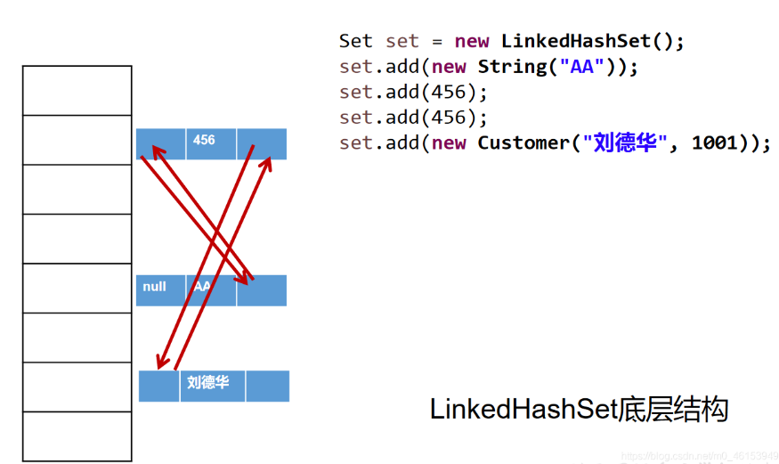
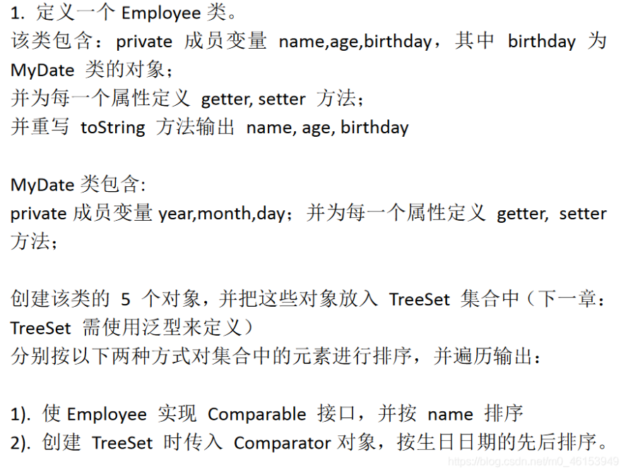
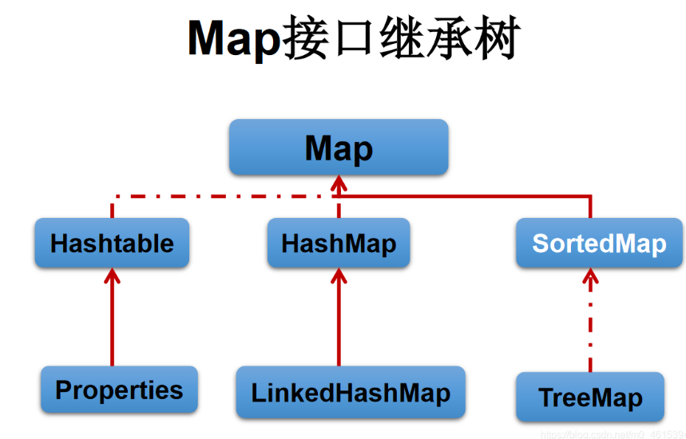
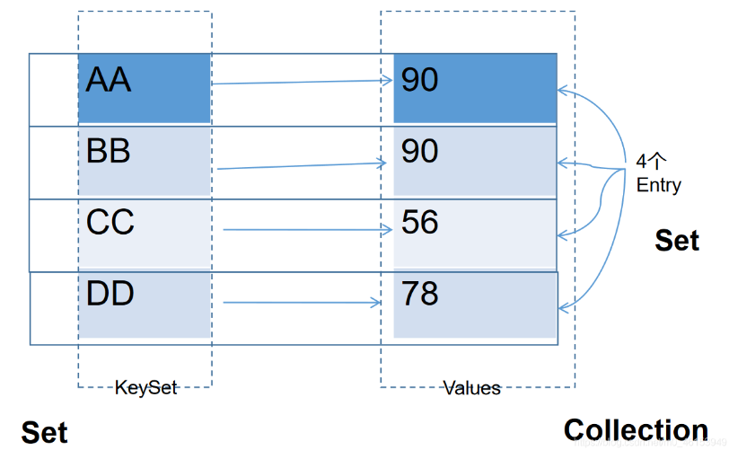
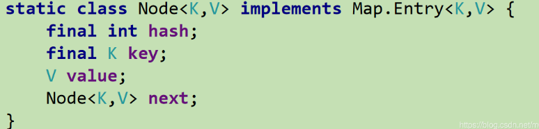
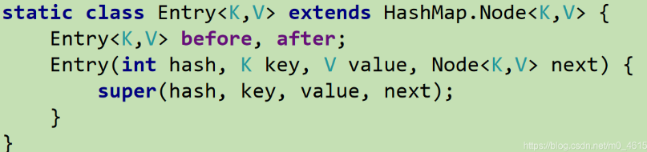

## 十二、集合

### 1. Java集合框架概述

#### 1.1 集合框架与数组的对比及概述

1. 集合、数组都是对多个数据进行存储操作的结构，简称Java容器

   说明：此时的存储，主要是指内存层面的存储，不涉及到持久化存储（.txt， .png，数据库中）

2. 数组在存储多个数据方面的特点：

   1. 一旦初始化以后，长度就确定了，长度不可修改
   2. 数组一旦定义好，数据类型也就确定，只能操作指定类型的数据
   3. 数组中提供的方法非常有限，对于添加、删除、插入数据等操作，非常不便，同时效率不高
   4. 获取数组中的实际元素的个数需求，数组没有现成的属性或方法可用
   5. 数组存储的特点：有序、可重复。对于无序、不可重复的需求，不能满足

3. 使用场景

   


#### 1.2 集合框架涉及到的API

Java集合可分为**Collection**和**Map**两种体系

* Collection接口：单列数据，定义了存取一组对象的方法的集合
  * List：元素有序、可重复的集合
  * Set：元素无序、不可重复的集合
* Map接口：双列数据，保存具有映射关系的key-value对的集合

1. Collection接口继承树

   

   

2. Map接口继承树

   


Collection接口：单列集合，用来存储一个一个的对象
		/---List接口：存储有序的、可重复的数据。  -->“动态”数组
				/---ArrayList、LinkedList、Vector
		/---Set接口：存储无序的、不可重复的数据   -->高中讲的“集合”
				/---HashSet、LinkedHashSet、TreeSet

Map接口：双列集合，用来存储一对(key - value)一对的数据   -->高中函数：y = f(x)
		/---HashMap、LinkedHashMap、TreeMap、Hashtable、Properties

### 2. Collection接口方法

#### 2.1 概述

* Collection接口是List、Set和Queue接口的父接口，该接口定义的方法既可用于操作Set集合，也可以操作List和Queue集合

* JDK不提供此接口的任何直接实现，而是提供更具体的子接口实现（Set、List）

* 在JDK5之前，Java集合会丢掉容器中所有对象的数据类型，并把所有对象都当成Object类型去处理

  JDK5之后，增加了**泛型**，java集合可以记住容器中对象的数据类型


#### 2.2 Collection接口中常用方法1

1. 添加
   * add(Object obj)
   * addAll(Collection coll)
2. 获取有效元素个数
   * int size()
3. 清空集合
   * void clear()
4. 是否是空集合
   * boolean isEmpty()
5. 是否包含某个元素
   * boolean contains(Object obj)：是通过元素的**equals方法**来判断是否是同一个对象
   * boolean containsAll(Collection c)：也是调用元素的equals方法来比较的，拿两个集合的元素挨个比较
6. 删除
   * boolean remove(Object obj)：通过元素的equals方法判断是否是要删除的那个元素，只会删除找到的第一个元素
   * boolean removeAll(Collection coll)：取当前集合的差集
7. 取两个集合的交集
   * boolean retainAll(Collection c)：把交集的结果存在当前集合中，不影响c
8. 集合是否相等
   * boolean equals(Object obj)
9. 转成对象数组
   * Object[] toArray()
10. 获取集合对象的哈希值
    * hashCode()
11. 遍历
    * iterator()：返回迭代器对象，用于集合遍历

```java
import org.junit.Test;
import java.util.ArrayList;
import java.util.Collection;
import java.util.Date;

/**
 *
 * 三、Collection接口中的方法的使用
 *
 */
public class CollectionTest {

    @Test
    public void test1(){
        Collection coll = new ArrayList();

        //add(Object e):将元素e添加到集合coll中
        coll.add("AA");
        coll.add("BB");
        coll.add(123);  //自动装箱
        coll.add(new Date());

        //size():获取添加的元素的个数
        System.out.println(coll.size());    //4

        //addAll(Collection coll1):将coll1集合中的元素添加到当前的集合中
        Collection coll1 = new ArrayList();
        coll1.add(456);
        coll1.add("CC");
        coll.addAll(coll1);

        System.out.println(coll.size());    //6
        System.out.println(coll);

        //clear():清空集合元素
        coll.clear();

        //isEmpty():判断当前集合是否为空
        System.out.println(coll.isEmpty());
    }
}
```


#### 2.3 Collection接口中的常用方法2

向Collection接口的实现类的对象中添加数据obj时，要求obj所在类要重写equals()

```java
//Person类
import java.util.Objects;

public class Person {

    private String name;
    private int age;

    public Person() {
        super();
    }

    public Person(String name, int age) {
        this.name = name;
        this.age = age;
    }

    public String getName() {
        return name;
    }

    public void setName(String name) {
        this.name = name;
    }

    public int getAge() {
        return age;
    }

    public void setAge(int age) {
        this.age = age;
    }

    @Override
    public String toString() {
        return "Person{" +
                "name='" + name + '\'' +
                ", age=" + age +
                '}';
    }

    @Override
    public boolean equals(Object o) {
        System.out.println("Person equals()....");
        if (this == o) return true;
        if (o == null || getClass() != o.getClass()) return false;
        Person person = (Person) o;
        return age == person.age &&
                Objects.equals(name, person.name);
    }

    @Override
    public int hashCode() {

        return Objects.hash(name, age);
    }
}
```

```java
//测试类
import org.junit.Test;

import java.util.ArrayList;
import java.util.Arrays;
import java.util.Collection;

/**
 * Collection接口中声明的方法的测试
 *
 * 结论：
 * 向Collection接口的实现类的对象中添加数据obj时，要求obj所在类要重写equals().
 */
public class CollectinoTest {

    @Test
    public void test(){
        Collection coll = new ArrayList();
        coll.add(123);
        coll.add(456);

//        Person p = new Person("Jerry",20);
//        coll.add(p);
        coll.add(new Person("Jerry",20));

        coll.add(new String("Tom"));
        coll.add(false);

        //1.contains(Object obj):判断当前集合中是否包含obj
        //我们在判断时会调用obj对象所在类的equals()。
        boolean contains = coll.contains(123);
        System.out.println(contains);
        System.out.println(coll.contains(new String("Tam")));
//        System.out.println(coll.contains(p));//true
        System.out.println(coll.contains(new Person("Jerry",20)));//false -->true

        //2.containsAll(Collection coll1):判断形参coll1中的所有元素是否都存在于当前集合中。
        Collection coll1 = Arrays.asList(123,4567);
        System.out.println(coll.containsAll(coll1));
    }
}
```


#### 2.4 Collection接口中的常用方法3

```java
//Person类
import java.util.Objects;

public class Person {

    private String name;
    private int age;

    public Person() {
        super();
    }

    public Person(String name, int age) {
        this.name = name;
        this.age = age;
    }

    public String getName() {
        return name;
    }

    public void setName(String name) {
        this.name = name;
    }

    public int getAge() {
        return age;
    }

    public void setAge(int age) {
        this.age = age;
    }

    @Override
    public String toString() {
        return "Person{" +
                "name='" + name + '\'' +
                ", age=" + age +
                '}';
    }

    @Override
    public boolean equals(Object o) {
        System.out.println("Person equals()....");
        if (this == o) return true;
        if (o == null || getClass() != o.getClass()) return false;
        Person person = (Person) o;
        return age == person.age &&
                Objects.equals(name, person.name);
    }

    @Override
    public int hashCode() {

        return Objects.hash(name, age);
    }
}
```

```java
//测试类
import org.junit.Test;

import java.util.ArrayList;
import java.util.Arrays;
import java.util.Collection;

/**
 * Collection接口中声明的方法的测试
 *
 * 结论：
 * 向Collection接口的实现类的对象中添加数据obj时，要求obj所在类要重写equals().
 *
 */
public class CollectinoTest {

    @Test
    public void test2(){
        //3.remove(Object obj):从当前集合中移除obj元素。
        Collection coll = new ArrayList();
        coll.add(123);
        coll.add(456);
        coll.add(new Person("Jerry",20));
        coll.add(new String("Tom"));
        coll.add(false);

        coll.remove(1234);
        System.out.println(coll);

        coll.remove(new Person("Jerry",20));
        System.out.println(coll);

        //4. removeAll(Collection coll1):差集：从当前集合中移除coll1中所有的元素。
        Collection coll1 = Arrays.asList(123,456);
        coll.removeAll(coll1);
        System.out.println(coll);
    }

    @Test
    public void test3(){
        Collection coll = new ArrayList();
        coll.add(123);
        coll.add(456);
        coll.add(new Person("Jerry",20));
        coll.add(new String("Tom"));
        coll.add(false);

        //5.retainAll(Collection coll1):交集：获取当前集合和coll1集合的交集，并返回给当前集合
//        Collection coll1 = Arrays.asList(123,456,789);
//        coll.retainAll(coll1);
//        System.out.println(coll);

        //6.equals(Object obj):要想返回true，需要当前集合和形参集合的元素都相同。
        Collection coll1 = new ArrayList();
        coll1.add(456);
        coll1.add(123);
        coll1.add(new Person("Jerry",20));
        coll1.add(new String("Tom"));
        coll1.add(false);

        System.out.println(coll.equals(coll1));
    }
}
```


#### 2.5 Collection接口中的常用方法4

```java
//Person类
import java.util.Objects;

public class Person {

    private String name;
    private int age;

    public Person() {
        super();
    }

    public Person(String name, int age) {
        this.name = name;
        this.age = age;
    }

    public String getName() {
        return name;
    }

    public void setName(String name) {
        this.name = name;
    }

    public int getAge() {
        return age;
    }

    public void setAge(int age) {
        this.age = age;
    }

    @Override
    public String toString() {
        return "Person{" +
                "name='" + name + '\'' +
                ", age=" + age +
                '}';
    }

    @Override
    public boolean equals(Object o) {
        System.out.println("Person equals()....");
        if (this == o) return true;
        if (o == null || getClass() != o.getClass()) return false;
        Person person = (Person) o;
        return age == person.age &&
                Objects.equals(name, person.name);
    }

    @Override
    public int hashCode() {

        return Objects.hash(name, age);
    }
}
```

```java
//测试类
import org.junit.Test;

import java.util.ArrayList;
import java.util.Arrays;
import java.util.Collection;
import java.util.List;

/**
 * Collection接口中声明的方法的测试
 *
 * 结论：
 * 向Collection接口的实现类的对象中添加数据obj时，要求obj所在类要重写equals().
 *
 */
public class CollectinoTest {

    @Test
    public void test4(){
        Collection coll = new ArrayList();
        coll.add(123);
        coll.add(456);
        coll.add(new Person("Jerry",20));
        coll.add(new String("Tom"));
        coll.add(false);

        //7.hashCode():返回当前对象的哈希值
        System.out.println(coll.hashCode());

        //8.集合 --->数组：toArray()
        Object[] arr = coll.toArray();
        for(int i = 0;i < arr.length;i++){
            System.out.println(arr[i]);
        }

        //拓展：数组 --->集合:调用Arrays类的静态方法asList()
        List<String> list = Arrays.asList(new String[]{"AA", "BB", "CC"});
        System.out.println(list);

        List arr1 = Arrays.asList(123, 456);
        System.out.println(arr1);//[123, 456]

        List arr2 = Arrays.asList(new int[]{123, 456});
        System.out.println(arr2.size());//1

        List arr3 = Arrays.asList(new Integer[]{123, 456});
        System.out.println(arr3.size());//2

        //9.iterator():返回Iterator接口的实例，用于遍历集合元素。放在IteratorTest.java中测试
    }
}
```


### 3. Iterator迭代器接口

* Iterator对象称为迭代器（设计模式的一种）,主要用于遍历Collection集合中的元素

* GOF给迭代器模式的定义为：提供一种方法访问一个容器(container)对象中各个元素，而又不需要暴露该对象的内部细节。**迭代器模式，就是为容器而生**

* Collection接口继承了java.lang.Iterator接口，该接口有一个iterator()方法，那么所有实现了Collection接口的集合类都有一个iterator()方法，用以返回一个实现了Iterator接口的对象

* **Iterator仅用于遍历集合**，Iterator本身不提供承装对象的能力。如果需要创建Iterator对象，则必须有一个被迭代的集合

* **集合对象每次调用iterator()方法都得到一个全新的迭代器对象**，默认游标都在集合的第一个元素之前

  

#### 3.1 使用Iterator遍历Collection

集合元素的遍历操作，使用迭代器Iterator接口

1. 内部方法：`hasNext()和next()`
2. 集合对象每次调用`iterator()`方法都得到一个全新的迭代器对象，默认游标都在集合的第一个元素之前

```java
import org.junit.Test;

import java.util.ArrayList;
import java.util.Collection;
import java.util.Iterator;

public class IteratorTest {

    @Test
    public void test(){
        Collection coll = new ArrayList();
        coll.add(123);
        coll.add(456);
        coll.add(new Person("Jerry",20));
        coll.add(new String("Tom"));
        coll.add(false);

        Iterator iterator = coll.iterator();

        //方式一：
//        System.out.println(iterator.next());
//        System.out.println(iterator.next());
//        System.out.println(iterator.next());
//        System.out.println(iterator.next());
//        System.out.println(iterator.next());
//        //报异常：NoSuchElementException
//        //因为：在调用it.next()方法之前必须要调用it.hasNext()进行检测。若不调用，且下一条记录无效，直接调用it.next()会抛出NoSuchElementException异常。
//        System.out.println(iterator.next());

        //方式二：不推荐
//        for(int i = 0;i < coll.size();i++){
//            System.out.println(iterator.next());
//        }

        //方式三：推荐
        while(iterator.hasNext()){
            System.out.println(iterator.next());
        }
    }
}
```


#### 3.2 迭代器Iterator的执行原理


#### 3.3 Iterator遍历集合的两种错误写法

```java
import org.junit.Test;

import java.util.ArrayList;
import java.util.Collection;
import java.util.Iterator;

public class IteratorTest {

    @Test
    public void test2(){
        Collection coll = new ArrayList();
        coll.add(123);
        coll.add(456);
        coll.add(new Person("Jerry",20));
        coll.add(new String("Tom"));
        coll.add(false);

        //错误方式一：
//        Iterator iterator = coll.iterator();
//        while(iterator.next() != null){
//            System.out.println(iterator.next());
//        }

        //错误方式二：
        //集合对象每次调用iterator()方法都得到一个全新的迭代器对象，默认游标都在集合的第一个元素之前。
        while(coll.iterator().hasNext()){
            System.out.println(coll.iterator().next());
        }
    }
}
```


#### 3.4 Iterator迭代器remove()的使用

内部定义了remove()，可以在遍历的时候删除集合中的元素，此方法不同于集合直接调用remove()

```java
import org.junit.Test;

import java.util.ArrayList;
import java.util.Collection;
import java.util.Iterator;

public class IteratorTest {

    //测试Iterator中的remove()方法
    @Test
    public void test3(){
        Collection coll = new ArrayList();
        coll.add(123);
        coll.add(456);
        coll.add(new Person("Jerry",20));
        coll.add(new String("Tom"));
        coll.add(false);

        //删除集合中”Tom”
        //如果还未调用next()或在上一次调用 next 方法之后已经调用了 remove 方法，
        // 再调用remove都会报IllegalStateException。
        Iterator iterator = coll.iterator();
        while(iterator.hasNext()){
//            iterator.remove();
            Object obj = iterator.next();
            if("Tom".equals(obj)){
                iterator.remove();
//                iterator.remove();                
            }
        }

        //遍历集合
        iterator = coll.iterator();
        while(iterator.hasNext()){
            System.out.println(iterator.next());
        }

    }
}
```

注意：

* Iterator可以删除集合的元素，但是是遍历过程中通过迭代器对象的remove方法，不是集合对象的remove方法
* **如果还未调用next()或在上一次调用next方法之后已经调用remove方法，再调用remove都会报IllegalStateException**


#### 3.5 新特性foreach循环遍历集合或数组

* Java5.0提供了foreach循环迭代访问Collection和数组

* 遍历操作不需获取Collection或数组的长度，需要使用索引访问元素

* 遍历集合的底层调用Iterator完成操作

  

```java
import org.junit.Test;

import java.util.ArrayList;
import java.util.Collection;

/**
 * jdk 5.0 新增了foreach循环，用于遍历集合、数组
 *
 */
public class ForTest {

    @Test
    public void test(){
        Collection coll = new ArrayList();
        coll.add(123);
        coll.add(456);
        coll.add(new Person("Jerry",20));
        coll.add(new String("Tom"));
        coll.add(false);

        //for(集合元素的类型 局部变量 : 集合对象),内部仍然调用了迭代器。
        for(Object obj : coll){
            System.out.println(obj);
        }
    }

    @Test
    public void test2(){
        int[] arr = new int[]{1,2,3,4,5,6};
        //for(数组元素的类型 局部变量 : 数组对象)
        for(int i : arr){
            System.out.println(i);
        }
    }

    //练习题
    @Test
    public void test3(){
        String[] arr = new String[]{"SS","KK","RR"};

//        //方式一：普通for赋值
//        for(int i = 0;i < arr.length;i++){
//            arr[i] = "HH";
//        }

        //方式二：增强for循环
        for(String s : arr){
            s = "HH";
        }

        for(int i = 0;i < arr.length;i++){
            System.out.println(arr[i]);
        }
    }
}
```


### 4. Collection子接口之一：List接口

* 鉴于Java中数组用来存储数据的局限性，通常使用List替代数组
* List集合类中元素有序，且可重复，集合中每个元素都有其对应的顺序索引
* List容器的元素都对应一个整数型的序号记载其在容器中的位置，可以根据序号存取容器中的元素
* JDK API中List接口的实现类常用的有：ArrayList、LinkedList和Vector

#### 4.1 List接口常用实现类的对比

1. List接口框架

   |----Collection接口：单列集合，用来存储一个一个的对象

   ​			|----List接口：存储有序的、可重复的数据。  -->“动态”数组,替换原有的数组

   ​						|----ArrayList：作为List接口的主要实现类；线程不安全的，效率高；底层使用Object[] elementData存储

   ​						|----LinkedList：对于频繁的插入、删除操作，使用此类效率比ArrayList高；底层使用双向链表存储

   ​						|----Vector：作为List接口的古老实现类；线程安全的，效率低；底层使用Object[] elementData存储

   

   面试题：比较ArrayList、LinkedList、Vector三者的异同？

   同：三个类都是实现了List接口，存储数据的特点相同：存储有序的、可重复的数据

   不同：见上


#### 4.2 ArrayList的源码分析

* ArrayList是List接口的典型实现类、主要实现类
* 本质上ArrayList是对象引用的一个“变长”数组

2. ArrayList的源码分析：

   1. JDK7情况下：

      ```java
      ArrayList list = new ArrayList();//底层创建了长度是10的Object[]数组elementData
      list.add(123);//elementData[0] = new Integer(123);
      ...
      list.add(11);//如果此次的添加导致底层elementData数组容量不够，则扩容。
      //默认情况下，扩容为原来的容量的1.5倍，同时需要将原有数组中的数据复制到新的数组中。
      ```

      结论：建议开发中使用带参的构造器：ArrayList list = new ArrayList(int capacity)

      

   2. JDK8中ArrayList的变化

      ```java
      ArrayList list = new ArrayList();//底层Object[] elementData初始化为{}.并没有创建长度为10的数组
      
      list.add(123);//第一次调用add()时，底层才创建了长度10的数组，并将数据123添加到elementData[0]
       ...
      //后续的添加和扩容操作与jdk 7 无异。
      ```

   3. 小结：JDK7中的ArrayList的对象的创建类似于单例的饿汉式，而JDK8中的ArrayList的对象创建类似于单例的懒汉式，延迟了数组的创建，节省内存


#### 4.3 LinkedList的源码分析

* 对于频繁的插入或删除元素的操作，建议使用LinkedList类，效率较高

* LinkedList：双向列表，内部没有声明数组，而是定义了Node类型的first和last，用于记录首末元素。同时定义内部类Node，作为LinkedList中保存数据的基本结构

  

3. LinkedList的源码分析

   ```java
   /**
     *       LinkedList list = new LinkedList(); 内部声明了Node类型的first和last属性，默认值为null
     *       list.add(123);//将123封装到Node中，创建了Node对象。
     *
     *       其中，Node定义为：体现了LinkedList的双向链表的说法
     *       private static class Node<E> {
     *            E item;
     *            Node<E> next;
     *            Node<E> prev;
     *
     *            Node(Node<E> prev, E element, Node<E> next) {
     *            this.item = element;
     *            this.next = next;     //next变量记录下一个元素的位置
     *            this.prev = prev;     //prev变量记录前一个元素的位置
     *            }
     *        }
     */
   ```


#### 4.4 Vector的源码分析

* Vector是一个古老的集合，JDK1.0就有了。大多数操作与ArrayList相同，区别在于Vector是线程安全的
* 在各种list中，最好把ArrayList作为缺省选择；当插入删除频繁时，使用LinkedList；Vector总是比ArrayList慢，尽量避免

4. Vector的源码分析：

   JDK7和JDK8中通过Vector()构造器创建对象时，底层都创建了长度为10的数组，在扩容方面，默认扩容为原来数组长度的2倍


#### 4.5 List接口中的常用方法测试

List除了从Collection集合继承的方法外。List集合里添加了一些根据索引来操作集合的方法

* `void add(int index, Object ele)`：在index位置插入ele元素
* `boolean addAll(int index, Collection eles)`：从index位置开始将eles中所有元素添加进来
* `Object get(int index)`：获取指定Index位置的元素
* `int indexOf(Object obj)`：返回obj在集合中首次出现的位置
* `int lastIndexOf(Onject obj)`：返回obj在当前集合中末次出现的位置
* `Object remove(int index)`：移除指定Index位置的元素，并返回此元素
* `Object set(int index, Object ele)`：设置指定Index位置的元素为ele
* `List subList(int fromIndex, int toIndex)`：返回从fromIndex到toIndex位置的子集合

```java
import org.junit.Test;
import java.util.ArrayList;
import java.util.Arrays;
import java.util.Iterator;
import java.util.List;

/**
 *
 * 5.List接口的常用方法
 */
public class ListTest {
    /**
     * 总结：常用方法
     * 增：add(Object obj)
     * 删：remove(int index) / remove(Object obj)
     * 改：set(int index, Object ele)
     * 查：get(int index)
     * 插：add(int index, Object ele)
     * 长度：size()
     * 遍历：① Iterator迭代器方式
     *      ② 增强for循环
     *      ③ 普通的循环
     *
     */

    @Test
    public void test3(){
        ArrayList list = new ArrayList();
        list.add(123);
        list.add(456);
        list.add("AA");

        //方式一：Iterator迭代器方式
        Iterator iterator = list.iterator();
        while(iterator.hasNext()){
            System.out.println(iterator.next());
        }

        System.out.println("***************");

        //方式二：增强for循环
        for(Object obj : list){
            System.out.println(obj);
        }

        System.out.println("***************");

        //方式三：普通for循环
        for(int i = 0;i < list.size();i++){
            System.out.println(list.get(i));
        }
    }

    @Test
    public void tets2(){
        ArrayList list = new ArrayList();
        list.add(123);
        list.add(456);
        list.add("AA");
        list.add(new Person("Tom",12));
        list.add(456);
        //int indexOf(Object obj):返回obj在集合中首次出现的位置。如果不存在，返回-1.
        int index = list.indexOf(4567);
        System.out.println(index);

        //int lastIndexOf(Object obj):返回obj在当前集合中末次出现的位置。如果不存在，返回-1.
        System.out.println(list.lastIndexOf(456));

        //Object remove(int index):移除指定index位置的元素，并返回此元素
        Object obj = list.remove(0);
        System.out.println(obj);
        System.out.println(list);

        //Object set(int index, Object ele):设置指定index位置的元素为ele
        list.set(1,"CC");
        System.out.println(list);

        //List subList(int fromIndex, int toIndex):返回从fromIndex到toIndex位置的左闭右开区间的子集合
        List subList = list.subList(2, 4);
        System.out.println(subList);
        System.out.println(list);
    }

    @Test
    public void test(){
        ArrayList list = new ArrayList();
        list.add(123);
        list.add(456);
        list.add("AA");
        list.add(new Person("Tom",12));
        list.add(456);

        System.out.println(list);

        //void add(int index, Object ele):在index位置插入ele元素
        list.add(1,"BB");
        System.out.println(list);

        //boolean addAll(int index, Collection eles):从index位置开始将eles中的所有元素添加进来
        List list1 = Arrays.asList(1, 2, 3);
        list.addAll(list1);
//        list.add(list1);
        System.out.println(list.size());//9

        //Object get(int index):获取指定index位置的元素
        System.out.println(list.get(2));

    }
}
```


#### 4.6 List面试题

**题目1**

**ArrayList、LinkedList、Vector的异同？谈谈理解**

**ArrayList底层是什么？扩容机制？Vector和ArrayList的最大区别？**

```java
   /**
     * ArrayList和LinkedList的异同二者都线程不安全，相对线程安全的Vector，执行效率高。
     * 此外，ArrayList是实现了基于动态数组的数据结构，LinkedList基于链表的数据结构。
     * 对于随机访问get和set，ArrayList觉得优于LinkedList，因为LinkedList要移动指针。
     * 对于新增和删除操作add(特指插入)和remove，LinkedList比较占优势，因为ArrayList要移动数据。
     * 
     * ArrayList和Vector的区别Vector和ArrayList几乎是完全相同的,
     * 唯一的区别在于Vector是同步类(synchronized)，属于强同步类。
     * 因此开销就比ArrayList要大，访问要慢。正常情况下,
     * 大多数的Java程序员使用ArrayList而不是Vector,
     * 因为同步完全可以由程序员自己来控制。Vector每次扩容请求其大小的2倍空间，
     * 而ArrayList是1.5倍。Vector还有一个子类Stack。
     */
```


**题目2**

```java
import org.junit.Test;

import java.util.ArrayList;
import java.util.List;

public class ListEver {
    /**
     * 区分List中remove(int index)和remove(Object obj)
     */

    @Test
    public void testListRemove() {
        List list = new ArrayList();
        list.add(1);
        list.add(2);
        list.add(3);
        updateList(list);
        System.out.println(list);//
    }

    private void updateList(List list) {
//        list.remove(2); //不会删除数据位2的元素，只会删除index=2的元素
        list.remove(new Integer(2));
    }
}
```


### 5. Collection子接口之二：Set接口

* Set接口是Collection的子接口，set接口没有提供额外的方法

* Set集合不允许包含相同的元素，如果试把两个相同的元素加入同一个Set集合，则添加操作失败

* **Set判断两个对象是否相同不是使用`==`运算符，而是根据`equals()`方法**

  

#### 5.1 Set接口实现类的对比

Set接口的框架

​	|----Collection接口：单列集合，用来存储一个一个的对象
​				|----Set接口：存储无序的、不可重复的数据   -->高中讲的“集合”
​							|----HashSet：作为Set接口的主要实现类；线程不安全的；可以存储null值
​										|----LinkedHashSet：作为HashSet的子类；
​										遍历其内部数据时，可以按照添加的顺序遍历，对于频繁的遍历操作，LinkedHashSet效率高于HashSet.
​							|----TreeSet：可以按照添加对象的指定属性，进行排序。


Set：存储无序的、不可重复的数据

1. 无序性：不等于随机性，存储的数据在底层数组中并非按照数据索引的顺序添加，而是根据数据的哈希值决定的
2. 不可重复性：保证添加的元素按照equals()判断时，不能返回true，即相同的元素只能添加一个

#### 5.2 Set的无序性与不可重复性的理解

```java
//User类
public class User{
    private String name;
    private int age;

    public User() {
    }

    public User(String name, int age) {
        this.name = name;
        this.age = age;
    }

    public String getName() {
        return name;
    }

    public void setName(String name) {
        this.name = name;
    }

    public int getAge() {
        return age;
    }

    public void setAge(int age) {
        this.age = age;
    }

    @Override
    public String toString() {
        return "User{" +
                "name='" + name + '\'' +
                ", age=" + age +
                '}';
    }

    @Override
    public boolean equals(Object o) {
        System.out.println("User equals()....");
        if (this == o) return true;
        if (o == null || getClass() != o.getClass()) return false;

        User user = (User) o;

        if (age != user.age) return false;
        return name != null ? name.equals(user.name) : user.name == null;
    }

    @Override
    public int hashCode() { 
        int result = name != null ? name.hashCode() : 0;
        result = 31 * result + age;
        return result;
    }
}
```

```java
//测试类
import org.junit.Test;

import java.util.HashSet;
import java.util.Iterator;
import java.util.Set;

/**
 *
 * 1.Set接口中没有定义额外的方法，使用的都是Collection中声明过的方法。
 *
 */
public class SetTest {

    @Test
    public void test(){
        Set set = new HashSet();
        set.add(123);
        set.add(456);
        set.add("fgd");
        set.add("book");
        set.add(new User("Tom",12));
        set.add(new User("Tom",12));
        set.add(129);

        Iterator iterator = set.iterator();
        while(iterator.hasNext()){
            System.out.println(iterator.next());
        }
    }
}
```


#### 5.3 HashSet中元素的添加过程

* HashSet是Set接口的典型实现，大多数使用Set集合时都使用这个实现类
* HashSet按Hash算法来存储集合中的元素，因此具有很好的存取、查找、删除性能
* HashSet具有以下特点：不能保证元素的排列顺序
  * HashSet**不是线程安全的**
  * **集合元素可以是null**
* **底层也是数组，初始容量为16，当如果使用率超过0.75，（16*0.75=12）就会扩大容量为原来的2倍**
* **HashSet集合判断两个元素相等的标准：两个对象通过`hashCode()`方法比较相等，并且两个对象的`equals()`方法返回值也相等**
* 对于存放Set容器中的对象，对应的类一定要重写`equals()`和`hashCode(Object obj)`方法，以实现对象相等规则，即**相等的对象必须具有相等的散列码**


添加元素的过程：HashSet

我们向HashSet中添加元素a,首先调用元素a所在类的hashCode()方法，计算元素a的哈希值，此哈希值接着通过某种算法计算出在HashSet底层数组中的存放位置（即为：索引位置），判断数组此位置上是否已经有元素：

* 如果此位置上没有其他元素，则元素a添加成功。 --->情况1
* 如果此位置上有其他元素b(或以链表形式存在的多个元素），则比较元素a与元素b的hash值
  * 如果hash值不相同，则元素a添加成功。--->情况2
  * 如果hash值相同，进而需要调用元素a所在类的equals()方法：
    * equals()返回true,元素a添加失败
    * equals()返回false,则元素a添加成功。--->情况3


对于添加成功的情况2和情况3而言：元素a 与已经存在指定索引位置上数据以链表的方式存储。

jdk 7 :元素a放到数组中，指向原来的元素。

jdk 8 :原来的元素在数组中，指向元素a 

总结：七上八下


#### 5.4 关于hashCode()和equals()的重写

##### 5.4.1 重写hashCode()方法的基本原则

* 在程序运行时，同一个对象多次调用`hashCode()`方法应该返回相同的值

* 当两个对象的`equals()`方法比较返回true，这两个对象的`hashCode()`方法的返回值也应该相等

* 对象中用作`equals()`方法比较的`Field`，都应该用来计算`hashCode`值

  

##### 5.4.2 重写equals()方法的基本原则

* 当一个类有自己特有的“逻辑相等”概念,当改写equals()的时候，总是要改写hashCode()，根据一个类的equals方法（改写后），两个截然不同的实例有可能在逻辑上是相等的，但是，根据Object.hashCode()方法，它们仅仅是两个对象。
* 因此，违反了“相等的对象必须具有相等的散列码”。
* 结论：复写equals方法的时候一般都需要同时复写hashCode方法。通常参与计算hashCode的对象的属性也应该参与到equals()中进行计算。


##### 5.4.3 Eclipse/IDEA工具里hashCode()重写

在自定义类中可以调用工具自动重写equals和hashCode。问题：为什么用Eclipse/IDEA复写hashCode方法，有31这个数字？

* 选择系数的时候要选择尽量大的系数。因为如果计算出来的hash地址越大，所谓的“冲突”就越少，查找起来效率也会提高。（减少冲突）
* 并且31只占用5bits,相乘造成数据溢出的概率较小。
* 31可以由i*31== (i<<5)-1来表示,现在很多虚拟机里面都有做相关优化。（提高算法效率）
* 31是一个素数，素数作用就是如果我用一个数字来乘以这个素数，那么最终出来的结果只能被素数本身和被乘数还有1来整除！(减少冲突)

```java
/**
  * 2.要求：向Set(主要指：HashSet、LinkedHashSet)中添加的数据，其所在的类一定要重写hashCode()和equals()
  *   要求：重写的hashCode()和equals()尽可能保持一致性：相等的对象必须具有相等的散列码
  *        重写两个方法的小技巧：对象中用作 equals() 方法比较的 Field，都应该用来计算 hashCode 值。
 */
```


#### 5.5 LinkedHashSet的使用

* LinkedHashSet 是 HashSet的子类
* LinkedHashSet根据元素的hashcode值来决定元素的存储位置，同时使用双向链表维护元素的次序，使得元素看起来是以**插入顺序保存**的
* LinkedHashSet**插入性能略低于**HashSet，但在迭代访问Set里的全部元素时由很好的性能
* LinkedHashSet不允许集合元素重复

LinkedHashSet作为HashSet的子类，在添加数据同时，每个数据还维护了两个引用，记录此前一个数据和后一个数据

优点：对于频繁的遍历操作，LinkedHashSet效率高于HashSet



```java
//User类
public class User{
    private String name;
    private int age;

    public User() {
    }

    public User(String name, int age) {
        this.name = name;
        this.age = age;
    }

    public String getName() {
        return name;
    }

    public void setName(String name) {
        this.name = name;
    }

    public int getAge() {
        return age;
    }

    public void setAge(int age) {
        this.age = age;
    }

    @Override
    public String toString() {
        return "User{" +
                "name='" + name + '\'' +
                ", age=" + age +
                '}';
    }

    @Override
    public boolean equals(Object o) {
        System.out.println("User equals()....");
        if (this == o) return true;
        if (o == null || getClass() != o.getClass()) return false;

        User user = (User) o;

        if (age != user.age) return false;
        return name != null ? name.equals(user.name) : user.name == null;
    }

    @Override
    public int hashCode() { //return name.hashCode() + age;
        int result = name != null ? name.hashCode() : 0;
        result = 31 * result + age;
        return result;
    }
}
```

```java
//测试类
import org.junit.Test;

import java.util.Iterator;
import java.util.LinkedHashSet;
import java.util.Set;

public class SetTest {

    @Test
    public void test2(){
        Set set = new LinkedHashSet();
        set.add(456);
        set.add(123);
        set.add(123);
        set.add("AA");
        set.add("CC");
        set.add(new User("Tom",12));
        set.add(new User("Tom",12));
        set.add(129);

        Iterator iterator = set.iterator();
        while(iterator.hasNext()){
            System.out.println(iterator.next());
        }
    }
}
```


#### 5.6 TreeSet的自然排序

* TreeSer是SortedSet接口的实现类，TreeSet可以确保集合元素处于排序状态
* TreeSet底层使用红黑树结构存储数据
* 新增的方法如下：
  * `Comparator comparator()`
  * `Object first()`
  * `Object last()`
  * `Object lower(Object e)`
  * `Object higher(Object e)`
  * `SortedSet subSet(fromElement, toElement)`
  * `SortedSet headSet(toElement)`
  * `SortedSet tailSet(fromElement)`
* TreeSet两种排序方法：**自然排序和定制排序**，默认情况下TreeSet采用自然排序
* TreeSet和TreeMap采用红黑树存储结构
* 特点：有序，查找速度比List快
* **自然排序**：TreeSet会调用集合元素的`compareTo(Object obj)`方法来比较元素之间的大小关系，然后将集合元素按升序（默认情况）排列
* **如果试图把一个对象添加到TreeSet时，则该对象的类必须实现Comparable接口**
  * 实现Comparable的类必须实现`compareTo(Object obj)`方法，两个对象即通过`compareTo`方法返回值来比较大小
* Comparable的典型实现：
  * BigDecimal、BigInteger以及所有的数值型对应的包装类：俺对应的数值大小进行比较
  * Character：按字符的unicode值进行比较
  * Boolean：true对应的包装类实例大于false对应的包装类实例
  * String：按字符串字符的unicode值进行比较
  * Date、Time：后边的时间、日期比前面的大
* 向TreeSet中添加元素时只有第一个元素无须比较`compareTo`方法，后面添加的所有元素都会调用`compareTo`方法进行比较
* **因为只有相同类的两个实例才会比较大小，所以向TreeSet中添加的应该是用一个类的对象**
* 对于TreeSet集合，**判断两个对象是否相等的唯一标准**：两个对象通过`compareTo(Object obj)`方法比较返回值
* 当需要把一个对象放入TreeSet中，重写该对象对应的`equals()`方法时，应该保证方法与`compareTo(Object obj)`方法有一致的结果：两个对象通过equals()方法比较返回true，则通过compareTo(Object obj)方法比较应返回0


1. 向TreeSet中添加数据，要求是相同类的对象
2. 两种排序方式：自然排序（实现Comparable接口）和定制排序（Comparator）
3. 自然排序中，比较两个对象是否相同的标准为：compareTo()返回0，不再是equals()
4. 定制排序中，比较两个对象是否相同的标准为：compare()返回0，不再是equals()

```java
//User类
public class User implements Comparable{
    private String name;
    private int age;

    public User() {
    }

    public User(String name, int age) {
        this.name = name;
        this.age = age;
    }

    public String getName() {
        return name;
    }

    public void setName(String name) {
        this.name = name;
    }

    public int getAge() {
        return age;
    }

    public void setAge(int age) {
        this.age = age;
    }

    @Override
    public String toString() {
        return "User{" +
                "name='" + name + '\'' +
                ", age=" + age +
                '}';
    }

    @Override
    public boolean equals(Object o) {
        System.out.println("User equals()....");
        if (this == o) return true;
        if (o == null || getClass() != o.getClass()) return false;

        User user = (User) o;

        if (age != user.age) return false;
        return name != null ? name.equals(user.name) : user.name == null;
    }

    @Override
    public int hashCode() { //return name.hashCode() + age;
        int result = name != null ? name.hashCode() : 0;
        result = 31 * result + age;
        return result;
    }

    //按照姓名从大到小排列,年龄从小到大排列
    @Override
    public int compareTo(Object o) {
        if (o instanceof User) {
            User user = (User) o;
//            return this.name.compareTo(user.name);  //按照姓名从小到大排列
//            return -this.name.compareTo(user.name);  //按照姓名从大到小排列
            int compare = -this.name.compareTo(user.name);  //按照姓名从大到小排列
            if(compare != 0){   //年龄从小到大排列
                return compare;
            }else{
                return Integer.compare(this.age,user.age);
            }
        } else {
            throw new RuntimeException("输入的类型不匹配");
        }
    }
}
```

```java
//测试类
import org.junit.Test;

import java.util.Iterator;
import java.util.TreeSet;

/**
 * 1.向TreeSet中添加的数据，要求是相同类的对象。
 * 2.两种排序方式：自然排序（实现Comparable接口） 和 定制排序（Comparator）
 * 3.自然排序中，比较两个对象是否相同的标准为：compareTo()返回0.不再是equals().
 * 4.定制排序中，比较两个对象是否相同的标准为：compare()返回0.不再是equals().
 */
public class TreeSetTest {

    @Test
    public void test() {
        TreeSet set = new TreeSet();

        //失败：不能添加不同类的对象
//        set.add(123);
//        set.add(456);
//        set.add("AA");
//        set.add(new User("Tom",12));

        //举例一：
//        set.add(34);
//        set.add(-34);
//        set.add(43);
//        set.add(11);
//        set.add(8);

        //举例二：
        set.add(new User("Tom",12));
        set.add(new User("Jerry",32));
        set.add(new User("Jim",2));
        set.add(new User("Mike",65));
        set.add(new User("Jack",33));
        set.add(new User("Jack",56));

        Iterator iterator = set.iterator();
        while(iterator.hasNext()){
            System.out.println(iterator.next());
        }
    }
}
```


#### 5.7 TreeSet的定制排序

* TreeSet的自然排序要求元素所属的类实现Comparable接口，如果元素所属的类没有实现Comparable接口，或不希望按照升序（默认情况）的方式排列元素或希望按照其他属性大小进行排序，则考虑使用定制排序。定制排序通过`Comparator`接口来实现，需要重写`compare(T o1, T o2)`方法
* 利用`int compare(T o1, T o2)`方法，比较o1和o2的大小：如果方法返回正整数，则表示o1大于o2；如果返回0，表示相等；返回负整数，表示o1小于o2
* 要实现**定制排序**，需要将实现`Comparator`接口的实例作为形参传递给TreeSet构造器
* 只能向TreeSet中添加类型相同的对象，否则发生`ClassCastException`异常
* 定制排序判断两个元素相等的标准是：通过Comparator比较两个元素返回0

```java
//User类
public class User implements Comparable{
    private String name;
    private int age;

    public User() {
    }

    public User(String name, int age) {
        this.name = name;
        this.age = age;
    }

    public String getName() {
        return name;
    }

    public void setName(String name) {
        this.name = name;
    }

    public int getAge() {
        return age;
    }

    public void setAge(int age) {
        this.age = age;
    }

    @Override
    public String toString() {
        return "User{" +
                "name='" + name + '\'' +
                ", age=" + age +
                '}';
    }

    @Override
    public boolean equals(Object o) {
        System.out.println("User equals()....");
        if (this == o) return true;
        if (o == null || getClass() != o.getClass()) return false;

        User user = (User) o;

        if (age != user.age) return false;
        return name != null ? name.equals(user.name) : user.name == null;
    }

    @Override
    public int hashCode() { //return name.hashCode() + age;
        int result = name != null ? name.hashCode() : 0;
        result = 31 * result + age;
        return result;
    }

    //按照姓名从大到小排列,年龄从小到大排列
    @Override
    public int compareTo(Object o) {
        if (o instanceof User) {
            User user = (User) o;
//            return this.name.compareTo(user.name);  //按照姓名从小到大排列
//            return -this.name.compareTo(user.name);  //按照姓名从大到小排列
            int compare = -this.name.compareTo(user.name);  //按照姓名从大到小排列
            if(compare != 0){   //年龄从小到大排列
                return compare;
            }else{
                return Integer.compare(this.age,user.age);
            }
        } else {
            throw new RuntimeException("输入的类型不匹配");
        }
    }
}
```

```java
//测试类
import org.junit.Test;

import java.util.Comparator;
import java.util.Iterator;
import java.util.TreeSet;

public class TreeSetTest {

    @Test
    public void tets2(){
        Comparator com = new Comparator() {
            //按照年龄从小到大排列
            @Override
            public int compare(Object o1, Object o2) {
                if(o1 instanceof User && o2 instanceof User){
                    User u1 = (User)o1;
                    User u2 = (User)o2;
                    return Integer.compare(u1.getAge(),u2.getAge());
                }else{
                    throw new RuntimeException("输入的数据类型不匹配");
                }
            }
        };

        TreeSet set = new TreeSet(com);
        set.add(new User("Tom",12));
        set.add(new User("Jerry",32));
        set.add(new User("Jim",2));
        set.add(new User("Mike",65));
        set.add(new User("Mary",33));
        set.add(new User("Jack",33));
        set.add(new User("Jack",56));


        Iterator iterator = set.iterator();
        while(iterator.hasNext()){
            System.out.println(iterator.next());
        }
    }
}
```


#### 5.8 TreeSet课后练习



```java
//MyDate类
/**
 * MyDate类包含:
 * private成员变量year,month,day；并为每一个属性定义getter,  setter 方法；
 */
public class MyDate implements Comparable{
    private int year;
    private int month;
    private int day;

    public int getYear() {
        return year;
    }

    public void setYear(int year) {
        this.year = year;
    }

    public int getMonth() {
        return month;
    }

    public void setMonth(int month) {
        this.month = month;
    }

    public int getDay() {
        return day;
    }

    public void setDay(int day) {
        this.day = day;
    }

    public MyDate() {
    }

    public MyDate(int year, int month, int day) {
        this.year = year;
        this.month = month;
        this.day = day;
    }

    @Override
    public String toString() {
        return "MyDate{" +
                "year=" + year +
                ", month=" + month +
                ", day=" + day +
                '}';
    }

    @Override
    public int compareTo(Object o) {
        if(o instanceof MyDate){
            MyDate m = (MyDate)o;

            //比较年
            int minusYear = this.getYear() - m.getYear();
            if(minusYear != 0){
                return minusYear;
            }
            //比较月
            int minusMonth = this.getMonth() - m.getMonth();
            if(minusMonth != 0){
                return minusMonth;
            }
            //比较日
            return this.getDay() - m.getDay();
        }

        throw new RuntimeException("传入的数据类型不一致！");
    }
}
```

```java
//Employee类
/**
 * 定义一个Employee类。
 * 该类包含：private成员变量name,age,birthday，
 * 其中birthday 为MyDate 类的对象；
 * 并为每一个属性定义getter, setter 方法；
 * 并重写toString 方法输出name, age, birthday
 */
public class Employee implements Comparable{
    private String name;
    private int age;
    private MyDate birthday;

    public String getName() {
        return name;
    }

    public void setName(String name) {
        this.name = name;
    }

    public int getAge() {
        return age;
    }

    public void setAge(int age) {
        this.age = age;
    }

    public MyDate getBirthday() {
        return birthday;
    }

    public void setBirthday(MyDate birthday) {
        this.birthday = birthday;
    }

    public Employee() {
    }

    public Employee(String name, int age, MyDate birthday) {
        this.name = name;
        this.age = age;
        this.birthday = birthday;
    }

    @Override
    public String toString() {
        return "Employee{" +
                "name='" + name + '\'' +
                ", age=" + age +
                ", birthday=" + birthday +
                '}';
    }

    //按name排序
    @Override
    public int compareTo(Object o){
        if(o instanceof Employee){
            Employee e = (Employee)o;
            return this.name.compareTo(e.name);
        }
//        return 0;
        throw new RuntimeException("传入的数据类型不一致");
    }
}
```

```java
//测试类
import org.junit.Test;

import java.util.Comparator;
import java.util.Iterator;
import java.util.TreeSet;

/**
 * 创建该类的5 个对象，并把这些对象放入TreeSet 集合中
 * （下一章：TreeSet 需使用泛型来定义）分别按以下两种方式
 * 对集合中的元素进行排序，并遍历输出：
 *
 * 1). 使Employee 实现Comparable 接口，并按name 排序
 * 2). 创建TreeSet 时传入Comparator对象，按生日日期的先后排序。
 */
public class EmployeeTest {

    //问题二：按生日日期的先后排序
    @Test
    public void test2(){
        TreeSet set = new TreeSet(new Comparator() {
            @Override
            public int compare(Object o1, Object o2) {
                if(o1 instanceof Employee && o2 instanceof Employee){
                    Employee e1 = (Employee)o1;
                    Employee e2 = (Employee)o2;

                    MyDate b1 = e1.getBirthday();
                    MyDate b2 = e2.getBirthday();

                    //方式一：
//                    //比较年
//                    int minusYear = b1.getYear() - b2.getYear();
//                    if(minusYear != 0){
//                        return minusYear;
//                    }
//
//                    //比较月
//                    int minusMonth = b1.getMonth() - b2.getMonth();
//                    if(minusMonth != 0){
//                        return minusMonth;
//                    }
//
//                    //比较日
//                    return b1.getDay() - b2.getDay();

                    //方式二：
                    return b1.compareTo(b2);
                }
//                return 0;
                throw new RuntimeException("传入的数据类型不一致！");
            }
        });

        Employee e1 = new Employee("wangxianzhi",41,new MyDate(334,5,4));
        Employee e2 = new Employee("simaqian",43,new MyDate(-145,7,12));
        Employee e3 = new Employee("yanzhenqin",44,new MyDate(709,5,9));
        Employee e4 = new Employee("zhangqian",51,new MyDate(-179,8,12));
        Employee e5 = new Employee("quyuan",21,new MyDate(-340,12,4));

        set.add(e1);
        set.add(e2);
        set.add(e3);
        set.add(e4);
        set.add(e5);

        Iterator iterator = set.iterator();
        while (iterator.hasNext()){
            System.out.println(iterator.next());
        }
    }

    //问题一：使用自然排序
    @Test
    public void test(){
        TreeSet set = new TreeSet();

        Employee e1 = new Employee("wangxianzhi",41,new MyDate(334,5,4));
        Employee e2 = new Employee("simaqian",43,new MyDate(-145,7,12));
        Employee e3 = new Employee("yanzhenqin",44,new MyDate(709,5,9));
        Employee e4 = new Employee("zhangqian",51,new MyDate(-179,8,12));
        Employee e5 = new Employee("quyuan",21,new MyDate(-340,12,4));

        set.add(e1);
        set.add(e2);
        set.add(e3);
        set.add(e4);
        set.add(e5);

        Iterator iterator = set.iterator();
        while (iterator.hasNext()){
            System.out.println(iterator.next());
        }
    }
}
```


#### 5.9 Set课后两道面试题

1. 在List内去除重复的数字值

   ```java
   import org.junit.Test;
   
   import java.util.ArrayList;
   import java.util.Collection;
   import java.util.HashSet;
   import java.util.List;
   
   public class CollectionTest {
   
       //练习：在List内去除重复数字值，要求尽量简单
       public static List duplicateList(List list) {
           HashSet set = new HashSet();
           set.addAll(list);
           return new ArrayList(set);
       }
       @Test
       public void test2(){
           List list = new ArrayList();
           list.add(new Integer(1));
           list.add(new Integer(2));
           list.add(new Integer(2));
           list.add(new Integer(4));
           list.add(new Integer(4));
           List list2 = duplicateList(list);
           for (Object integer : list2) {
               System.out.println(integer);
           }
       }
   }
   ```


2. 示例

   ```java
   //Person类
   public class Person {
   
       int id;
       String name;
   
       public Person(int id, String name) {
           this.id = id;
           this.name = name;
       }
   
       public Person() {
   
       }
   
       @Override
       public String toString() {
           return "Person{" +
                   "id=" + id +
                   ", name='" + name + '\'' +
                   '}';
       }
   
       @Override
       public boolean equals(Object o) {
           if (this == o) return true;
           if (o == null || getClass() != o.getClass()) return false;
   
           Person person = (Person) o;
   
           if (id != person.id) return false;
           return name != null ? name.equals(person.name) : person.name == null;
       }
   
       @Override
       public int hashCode() {
           int result = id;
           result = 31 * result + (name != null ? name.hashCode() : 0);
           return result;
       }
   }
   ```

   ```java
   import org.junit.Test;
   
   import java.util.ArrayList;
   import java.util.Collection;
   import java.util.HashSet;
   import java.util.List;
   
   public class CollectionTest {
   
       @Test
       public void test3(){
           HashSet set = new HashSet();
           Person p1 = new Person(1001,"AA");
           Person p2 = new Person(1002,"BB");
   
           set.add(p1);
           set.add(p2);
           System.out.println(set);
   
           p1.name = "CC";
           set.remove(p1);
           System.out.println(set);
           set.add(new Person(1001,"CC"));
           System.out.println(set);
           set.add(new Person(1001,"AA"));
           System.out.println(set);
       }
   }
   ```

   

### 6. Map接口




#### 6.1 Map接口及其多个实现类的对比

1. Map实现类的结构

   |----Map:双列数据，存储key-value对的数据   ---类似于高中的函数：y = f(x)
   			|----HashMap:作为Map的主要实现类；线程不安全的，效率高；存储null的key和value
   						|----LinkedHashMap:保证在遍历map元素时，可以按照添加的顺序实现遍历。
   								原因：在原有的HashMap底层结构基础上，添加了一对指针，指向前一个和后一个元素。
   								对于频繁的遍历操作，此类执行效率高于HashMap。

   ​			|----TreeMap:保证按照添加的key-value对进行排序，实现排序遍历。此时考虑key的自然排序或定制排序
   ​						底层使用红黑树
   ​			|----Hashtable:作为古老的实现类；线程安全的，效率低；不能存储null的key和value
   ​						|----Properties:常用来处理配置文件。key和value都是String类型

   HashMap的底层：数组+链表（JDK7及之前）

   ​							 数组+链表+红黑树（JDK8）

   

   试题：

   HashMap的底层实现原理？

   HashMap和Hashtable的异同？

   CurrentHashMap与Hashtable的异同

```java
public class MapTest {
    @Test
    public void test(){
        Map map = new HashMap();
//        map = new Hashtable();
        map.put(null,123);
    }
}
```


#### 6.2 Map中存储的key-value的特点

* `Map`与`Collection`并列存在，用于保存具有映射关系的数据：`key-value`
* `Map`中的Key和Value都可以是任何引用类型的数据
* `Map`中的Key用`Set`来存放，不允许重复，即同一个`Map`对象所对应的类，必须重写`hashCode()`和`equals()`方法
* 常用String类作为Map的键
* Key和Value之间存在单向一对一关系，即通过指定的Key总能找到唯一的、确定的Value
* Map接口的常用实现类：`HashMap、TreeMap、LinkedHashMap、Properties`，其中HashMap是Map空额口使用频率最高的实现类




2. Map结构的理解

   Map中的Key：无序、不可重复，使用Set存储所有的Key  -->  Key所在类要重写equals()和hashCode() 

   Map中的Value：无序、可重复的，使用Collection存储所有的Value --> value所在的类要重写equals()

   Map中的entry：无序、不可重复的，使用Set存储所有的entry


#### 6.3 Map实现类之一：HashMap

* `HashMap`是`Map`接口使用频率最高的实现类
* 允许使用null键和null值，与HashSet一样不保证映射的顺序
* 所有的Key构成的集合是Set：无序、不可重复的，Key所在的类要重写：equals()和hashCode()
* 所有的Value构成的集合是Collection：无序、可重复的，Value所在类要重写：equals()
* 一个Key-Value构成一个entry
* 所有的entry构成的集合是Set：无序、不可重复
* HashMap判断两个Key相等的标准是：两个Key通过equals()方法返回true，hashCode值也相等
* HashMap判断两个Value相等的标准是：两个Value通过equals()方法返回true


#### 6.4 HashMap的底层实现原理

JDK7及以前版本：HashMap是数据+链表结构（链地址法）

JDK8版本发布以后：HashMap是数组+链表+红黑树实现


**HashMap源码中的重要常量**

```java
/*
 *      DEFAULT_INITIAL_CAPACITY : HashMap的默认容量，16
 *      DEFAULT_LOAD_FACTOR：HashMap的默认加载因子：0.75
 *      threshold：扩容的临界值，=容量*填充因子：16 * 0.75 => 12
 *      TREEIFY_THRESHOLD：Bucket中链表长度大于该默认值，转化为红黑树:8
 *      MIN_TREEIFY_CAPACITY：桶中的Node被树化时最小的hash表容量:64
*/
```


##### 6.4.1 HashMap在JDK7中的底层实现原理

* HashMap的内部存储结构其实是数组和链表的结合。当实例化一个HashMap时，系统会创建一个长度为Capacity的Entry数组，这个长度在哈希表中被称为容量(Capacity)，在这个数组中可以存放元素的位置我们称之为“桶”(bucket)，每个bucket都有自己的索引，系统可以根据索引快速的查找bucket中的元素。
* 每个bucket中存储一个元素，即一个Entry对象，但每一个Entry对象可以带一个引用变量，用于指向下一个元素，因此，在一个桶中，就有可能生成一个Entry链。而且新添加的元素作为链表的head。
* 添加元素的过程：
  * 向HashMap中添加entry1(key，value)，需要首先计算entry1中key的哈希值(根据key所在类的hashCode()计算得到)，此哈希值经过处理以后，得到在底层Entry[]数组中要存储的位置i。
  * 如果位置i上没有元素，则entry1直接添加成功。
  * 如果位置i上已经存在entry2(或还有链表存在的entry3，entry4)，则需要通过循环的方法，依次比较entry1中key的hash值和其他的entry的hash值。
  * 如果彼此hash值不同，则直接添加成功。
  * 如果hash值相同，继续比较二者是否equals。如果返回值为true，则使用entry1的value去替换equals为true的entry的value。
  * 如果遍历一遍以后，发现所有的equals返回都为false,则entry1仍可添加成功。entry1指向原有的entry元素。


3. HashMap的底层实现原理（JDK7）

   ```java
   HashMap map = new HashMap(); //实例化以后，底层创建了长度是16的一维数组Entry[] table
   map.put(key1,value1);
   /*
   调用key1所在类的hashCode()计算key1哈希值，此哈希值经过某种算法计算后，得到Entry数组中的存放位置
   如果此位置上的数据为空，此时的key1-value1添加成功 ---- 情况1
   如果此位置上的数据不为空（意味着此位置上存在一个或多个数据（以链表形式存在）），比较key1和已经存在的一个或多个数据的哈希值：
   	如果key1的哈希值与已经存在的数据的哈希值都不相同，此时key1-value1添加成功 --- 情况2
   	如果key1的哈希值和已经存在的某一个数据(key2-value2)的哈希值相同，继续比较：调用equals(key2)方法：
   		如果equals()返回false:此时key1-value1添加成功  --- 情况3
   		如果equals()返回true:使用value1替换value2
   		
   补充：关于情况2和情况3，此时key1-value1和原来的数据以链表的方式存储
   */
   ```

   在不断的添加过程中，会涉及到扩容问题，当超出临界值（且要存放的位置非空），扩容。

   默认的扩容方式，扩容为原来容量的2倍，并将原有的数据复制过来

   

   HashMap的扩容：

   ​		当HashMap中的元素越来越多的时候，hash冲突的几率也就越来越高，因为数组的长度是固定的。所以为了提高查询的效率，
   ​		就要对HashMap的数组进行扩容，而在HashMap数组扩容之后，最消耗性能的点就出现了：

   ​		原数组中的数据必须重新计算其在新数组中的位置，并放进去，这就是resize。

   

   那么HashMap什么时候进行扩容呢？
   		当HashMap中的元素个数超过数组大小(数组总大小length,不是数组中个数size)loadFactor时，就 会 进 行 数 组 扩 容，
   		loadFactor的默认值(DEFAULT_LOAD_FACTOR)为0.75，这是一个折中的取值。
   		也就是说，默认情况下，数组大小(DEFAULT_INITIAL_CAPACITY)为16，
   		那么当HashMap中元素个数超过16 * 0.75=12（这个值就是代码中的threshold值，也叫做临界值）的时候，就把数组的大小扩展		为2*16=32，即扩大一倍，然后重新计算每个元素在数组中的位置，而这是一个非常消耗性能的操作，
   		所以如果我们已经预知HashMap中元素的个数，那么预设元素的个数能够有效的提高HashMap的性能。

   

   ##### 6.4.2 HashMap在JDK8的底层实现原理

   * HashMap的内部存储结构其实是数组+链表+红黑树的结合。当实例化一个HashMap时，会初始化initialCapacity和loadFactor，在put第一对映射关系时，系统会创建一个长度为initialCapacity的Node数组，这个长度在哈希表中被称为容量(Capacity)，在这个数组中可以存放元素的位置我们称之为“桶”(bucket)，每个bucket都有自己的索引，系统可以根据索引快速的查找bucket中的元素

   * 每个bucket中存储一个元素，即一个Node对象，但每一个Node对象可以带一个引用变量next，用于指向下一个元素，因此，在一个桶中，就有可能生成一个Node链。也可能是一个一个TreeNode对象，每一个TreeNode对象可以有两个叶子结点left和right，因此，在一个桶中，就有可能生成一个TreeNode树。而新添加的元素作为链表的last，或树的叶子结点。

   * 那么**HashMap什么时候进行扩容和树形化呢？**

     当HashMap中的元素个数超过数组大小(数组总大小length,不是数组中个数size)*loadFactor时，就会进行数组扩容，loadFactor的默认值(DEFAULT_LOAD_FACTOR)为0.75，这是一个折中的取值。也就是说，默认情况下，数组大小(DEFAULT_INITIAL_CAPACITY)为16，那么当HashMap中元素个数超过16*0.75=12（这个值就是代码中的threshold值，也叫做临界值）的时候，就把数组的大小扩展为2*16=32，即扩大一倍，然后重新计算每个元素在数组中的位置，而这是一个非常消耗性能的操作，所以如果我们已经预知HashMap中元素的个数，那么预设元素的个数能够有效的提高HashMap的性能。

   * 当HashMap中的其中一个链的对象个数如果达到了8个，此时如果capacity没有达到64，那么HashMap会先扩容解决，如果已经达到了64，那么这个链会变成红黑树，结点类型由Node变成TreeNode类型。当然，如果当映射关系被移除后，下次resize方法时判断树的结点个数低于6个，也会把红黑树再转为链表。

   * **关于映射关系的key是否可以修改？answer：不要修改**

     映射关系存储到HashMap中会存储key的hash值，这样就不用在每次查找时重新计算每一个Entry或Node（TreeNode）的hash值了，因此如果已经put到Map中的映射关系，再修改key的属性，而这个属性又参与hashcode值的计算，那么会导致匹配不上。

   

   JDK8相较于JDK7在底层实现方面的不同：

   1. new HashMap()：底层没有创建一个长度为16的数组
   2. JDK8的底层数组是：Node[]，而非Entry[]
   3. 首次调用put()方法时，底层创建长度为16的数组
   4. JDK7底层结构只有：数组+链表，JDK8底层结构：数组+链表+红黑树
      1. 形成链表时，七上八下（JDK7：新元素指向旧元素，JDK8：旧的元素指向新元素）
      2. 当数组的某一个索引位置上的元素以链表形式存在的数据个数 > 8且当前数组的长度 > 64，此时此索引位置上的所有数据改为使用红黑树存储

   

   #### 6.7 LinkedHashMap的底层实现原理

   * `LinkedHashMap`是`HashMap`的子类

   * 在HashMap存储结构的基础上，使用了一对双向链表来记录添加元素的顺序

   * 与`LinkedHashSet`类似，`LinkedHashMap`可以维护Map的迭代顺序：迭代顺序与Key-Value对的插入顺序一致

   * HashMap中的内部类：Node

     

   * LinkedHashMap中的内部类：Entry

     

   

4. LinkedHashMap的底层实现原理

   ```java
   /*
    *  四、LinkedHashMap的底层实现原理（了解）
    *      源码中：
    *      static class Entry<K,V> extends HashMap.Node<K,V> {
    *            Entry<K,V> before, after;//能够记录添加的元素的先后顺序
    *            Entry(int hash, K key, V value, Node<K,V> next) {
    *               super(hash, key, value, next);
    *            }
    *        } 
    */
   import org.junit.Test;
   
   import java.util.HashMap;
   import java.util.LinkedHashMap;
   import java.util.Map;
   
   public class MapTest {
   
       @Test
       public void test2(){
           Map map = new HashMap();
           map = new LinkedHashMap();
           map.put(123,"AA");
           map.put(345,"BB");
           map.put(12,"CC");
   
           System.out.println(map);
       }
   }
   ```

   

#### 6.5 Map中的常用方法

5. Map中定义的方法

   * 添加、删除、修改操作

     ```java
     Object put(Object key,Object value)：//将指定key-value添加到(或修改)当前map对象中
     void putAll(Map m)://将m中的所有key-value对存放到当前map中
     Object remove(Object key)：//移除指定key的key-value对，并返回value
     void clear()：//清空当前map中的所有数据
     ```

   * 元素查询操作

     ```java
     Object get(Object key)：//获取指定key对应的value
     boolean containsKey(Object key)：//是否包含指定的key
     boolean containsValue(Object value)：//是否包含指定的value
     int size()：//返回map中key-value对的个数
     boolean isEmpty()：//判断当前map是否为空
     boolean equals(Object obj)：//判断当前map和参数对象obj是否相等
     ```

   * 元视图操作的方法

     ```java
     Set keySet()：//返回所有key构成的Set集合
     Collection values()：//返回所有value构成的Collection集合
     Set entrySet()：//返回所有key-value对构成的Set集合
     ```

   ```java
   import org.junit.Test;
   import java.util.*;
   
   public class MapTest {
       /**
        *  元素查询的操作：
        *  Object get(Object key)：获取指定key对应的value
        *  boolean containsKey(Object key)：是否包含指定的key
        *  boolean containsValue(Object value)：是否包含指定的value
        *  int size()：返回map中key-value对的个数
        *  boolean isEmpty()：判断当前map是否为空
        *  boolean equals(Object obj)：判断当前map和参数对象obj是否相等
        */
       @Test
       public void test4(){
           Map map = new HashMap();
           map.put("AA",123);
           map.put(45,123);
           map.put("BB",56);
           // Object get(Object key)
           System.out.println(map.get(45));
           //containsKey(Object key)
           boolean isExist = map.containsKey("BB");
           System.out.println(isExist);
   
           isExist = map.containsValue(123);
           System.out.println(isExist);
   
           map.clear();
   
           System.out.println(map.isEmpty());
       }
   
       /**
        * 添加、删除、修改操作：
        *  Object put(Object key,Object value)：将指定key-value添加到(或修改)当前map对象中
        *  void putAll(Map m):将m中的所有key-value对存放到当前map中
        *  Object remove(Object key)：移除指定key的key-value对，并返回value
        *  void clear()：清空当前map中的所有数据
        */
       @Test
       public void test3(){
           Map map = new HashMap();
           //添加
           map.put("AA",123);
           map.put(45,123);
           map.put("BB",56);
           //修改
           map.put("AA",87);
   
           System.out.println(map);
   
           Map map1 = new HashMap();
           map1.put("CC",123);
           map1.put("DD",456);
           map.putAll(map1);
   
           System.out.println(map);
   
           //remove(Object key)
           Object value = map.remove("CC");
           System.out.println(value);
           System.out.println(map);
   
           //clear()
           map.clear();//与map = null操作不同
           System.out.println(map.size());
           System.out.println(map);
       }
   }
   ```

   

#### 6.6 Map中的常用方法2

* 总结：常用方法

  ```java
  添加：put(Object key,Object value)
  删除：remove(Object key)
  修改：put(Object key,Object value)
  查询：get(Object key)
  长度：size()
  遍历：keySet() / values() / entrySet()
  ```

* 面试题

  1. HashMap底层实现原理

  2. HashMap和Hashtable异同

     * 1.HashMap与Hashtable都实现了Map接口。由于HashMap的非线程安全性，效率上可能高于Hashtable。Hashtable的方法是Synchronize的，而HashMap不是，在多个线程访问Hashtable时，不需要自己为它的方法实现同步，而HashMap 就必须为之提供外同步。

      *      2.HashMap允许将null作为一个entry的key或者value，而Hashtable不允许。
      *      3.HashMap把Hashtable的contains方法去掉了，改成containsvalue和containsKey。因为contains方法容易让人引起误解。
      *      4.Hashtable继承自Dictionary类，而HashMap是Java1.2引进的Map interface的一个实现。
      *      5.Hashtable和HashMap采用的hash/rehash算法都大概一样，所以性能不会有很大的差异。

  ```java
  import org.junit.Test;
  
  import java.util.*;
  
  public class MapTest {
  
      /**
       *  元视图操作的方法：
       *  Set keySet()：返回所有key构成的Set集合
       *  Collection values()：返回所有value构成的Collection集合
       *  Set entrySet()：返回所有key-value对构成的Set集合
       */
      @Test
      public void test5(){
          Map map = new HashMap();
          map.put("AA",123);
          map.put(45,1234);
          map.put("BB",56);
  
          //遍历所有的key集：keySet()
          Set set = map.keySet();
          Iterator iterator = set.iterator();
          while(iterator.hasNext()){
              System.out.println(iterator.next());
          }
          System.out.println("*****************");
  
          //遍历所有的values集：values()
          Collection values = map.values();
          for(Object obj : values){
              System.out.println(obj);
          }
          System.out.println("***************");
          //遍历所有的key-values
          //方式一：
          Set entrySet = map.entrySet();
          Iterator iterator1 = entrySet.iterator();
          while (iterator1.hasNext()){
              Object obj = iterator1.next();
              //entrySet集合中的元素都是entry
              Map.Entry entry = (Map.Entry) obj;
              System.out.println(entry.getKey() + "---->" + entry.getValue());
  
          }
          System.out.println("/");
  
          //方式二：
          Set keySet = map.keySet();
          Iterator iterator2 = keySet.iterator();
          while(iterator2.hasNext()){
              Object key = iterator2.next();
              Object value = map.get(key);
              System.out.println(key + "=====" + value);
          }
      }
  }
  ```


#### 6.7 TreeMap两种添加方式的使用

`TreeMap`存储`Key-Value`时，需要根据Key-Value对进行排序，TreeMap可以保证所有Key-Value对处于**有序状态**

TreeSet底层使用**红黑树**结构存储数据

TreeMap的Key排序：

* **自然排序**：TreeMap所有Key必须实现`Comparable`接口，而且所有的Key应该是同一个类的对象，否则将会抛出`ClassCastException`
* **定制排序**：创建TreeMap时，传入一个`Comparator`对象，该对象负责对TreeMap中所有Key进行排序，此时不需要Map的Key实现Comparable接口

TreeMap判断两个Key相等的标准：两个Key通过`comparaTo()`方法或`compare()`方法返回0

```java
//User类
public class User implements Comparable{
    private String name;
    private int age;

    public User() {
    }

    public User(String name, int age) {
        this.name = name;
        this.age = age;
    }

    public String getName() {
        return name;
    }

    public void setName(String name) {
        this.name = name;
    }

    public int getAge() {
        return age;
    }

    public void setAge(int age) {
        this.age = age;
    }

    @Override
    public String toString() {
        return "User{" +
                "name='" + name + '\'' +
                ", age=" + age +
                '}';
    }

    @Override
    public boolean equals(Object o) {
        System.out.println("User equals()....");
        if (this == o) return true;
        if (o == null || getClass() != o.getClass()) return false;

        User user = (User) o;

        if (age != user.age) return false;
        return name != null ? name.equals(user.name) : user.name == null;
    }

    @Override
    public int hashCode() { //return name.hashCode() + age;
        int result = name != null ? name.hashCode() : 0;
        result = 31 * result + age;
        return result;
    }

    //按照姓名从大到小排列,年龄从小到大排列
    @Override
    public int compareTo(Object o) {
        if(o instanceof User){
            User user = (User)o;
//            return -this.name.compareTo(user.name);
            int compare = -this.name.compareTo(user.name);
            if(compare != 0){
                return compare;
            }else{
                return Integer.compare(this.age,user.age);
            }
        }else{
            throw new RuntimeException("输入的类型不匹配");
        }
    }
}
```

```java
//测试类
import org.junit.Test;

import java.util.*;

public class TreeMapTest {

    /**
     * 向TreeMap中添加key-value，要求key必须是由同一个类创建的对象
     * 因为要按照key进行排序：自然排序 、定制排序
     */
    //自然排序
    @Test
    public void test(){
        TreeMap map = new TreeMap();
        User u1 = new User("Tom",23);
        User u2 = new User("Jerry",32);
        User u3 = new User("Jack",20);
        User u4 = new User("Rose",18);

        map.put(u1,98);
        map.put(u2,89);
        map.put(u3,76);
        map.put(u4,100);

        Set entrySet = map.entrySet();
        Iterator iterator1 = entrySet.iterator();
        while (iterator1.hasNext()){
            Object obj = iterator1.next();
            Map.Entry entry = (Map.Entry) obj;
            System.out.println(entry.getKey() + "---->" + entry.getValue());

        }
    }

    //定制排序
    @Test
    public void test2(){
        TreeMap map = new TreeMap(new Comparator() {
            @Override
            public int compare(Object o1, Object o2) {
                if(o1 instanceof User && o2 instanceof User){
                    User u1 = (User)o1;
                    User u2 = (User)o2;
                    return Integer.compare(u1.getAge(),u2.getAge());
                }
                throw new RuntimeException("输入的类型不匹配！");
            }
        });
        User u1 = new User("Tom",23);
        User u2 = new User("Jerry",32);
        User u3 = new User("Jack",20);
        User u4 = new User("Rose",18);

        map.put(u1,98);
        map.put(u2,89);
        map.put(u3,76);
        map.put(u4,100);

        Set entrySet = map.entrySet();
        Iterator iterator1 = entrySet.iterator();
        while (iterator1.hasNext()){
            Object obj = iterator1.next();
            Map.Entry entry = (Map.Entry) obj;
            System.out.println(entry.getKey() + "---->" + entry.getValue());
        }
    }
}
```


#### 6.8 Hashtable

* Hashtable是个古老的Map 实现类，JDK1.0就提供了。不同于HashMap，Hashtable是线程安全的。
* Hashtable实现原理和HashMap相同，功能相同。底层都使用哈希表结构，查询速度快，很多情况下可以互用。
* 与HashMap不同，Hashtable不允许使用null 作为key和value
* 与HashMap一样，Hashtable也不能保证其中Key-Value 对的顺序
* Hashtable判断两个key相等、两个value相等的标准，与HashMap一致。


#### 6.9 Properties处理属性文件

* `Properties`类是`Hashtable`的子类，改对象用于处理属性文件
* 由于属性文件里key、value都是字符串类型，所以`Properties`里的key和value都是字符串类型
* 存取数据时，建议使用`setProperty(String key, String value)`方法和`getProperty(String key)`方法

1. 新建jdbc.properties文件

2. 编写源码

   ```java
   import java.io.FileInputStream;
   import java.io.IOException;
   import java.util.Properties;
   
   public class PropertiesTest {
       //Properties:常用来处理配置文件。key和value都是String类型
       public static void main(String[] args){
           //快捷键：ALT+Shift+Z
           FileInputStream fis = null;
           try {
               Properties pros = new Properties();
               fis = new FileInputStream("jdbc.properties");
               pros.load(fis); //加载流对应文件
   
               String name = pros.getProperty("name");
               String password = pros.getProperty("password");
   
               System.out.println("name = " + name + ",password = " + password);
           } catch (IOException e) {
               e.printStackTrace();
           } finally {
               if(fis != null){
                   try {
                       fis.close();
                   } catch (IOException e) {
                       e.printStackTrace();
                   }
               }
           }
       }
   }
   ```


### 7. Collections工具类

* 操作数组的工具类：`Arrays`
* `Collections`是一个操作`Set、Lsit、Map`等集合的工具类
* `Collections`中提供了一系列静态的方法对集合元素进行排序、查询和修改等操作，还提供了对集合对象设置不可变、对集合对象实现同步控制等方法
* 排序操作（均为static方法）
  * `reverse(List)`：反转List中元素的顺序
  * `shuffle(List)`：对List集合元素进行随机排序
  * `sort(List)`：根据元素的自然顺序对指定List集合元素按升序排序
  * `sort(List, Comparator)`：根据指定Comparator产生的顺序对List集合元素进行排序
  * `swap(List, int, int)`：将指定List集合中的i处元素和j处元素进行交换


#### 7.1 Collections工具类常用方法的测试

```java
import org.junit.Test;

import java.util.ArrayList;
import java.util.Arrays;
import java.util.Collections;
import java.util.List;

/**
 * Collections:操作Collection、Map的工具类
 *
 * 面试题：Collection 和 Collections的区别？
 *       Collection是集合类的上级接口，继承于他的接口主要有Set 和List.
 *       Collections是针对集合类的一个帮助类，他提供一系列静态方法实现对各种集合的搜索、排序、线程安全化等操作.
 */
public class CollectionTest {
    /**
     * reverse(List)：反转 List 中元素的顺序
     * shuffle(List)：对 List 集合元素进行随机排序
     * sort(List)：根据元素的自然顺序对指定 List 集合元素按升序排序
     * sort(List，Comparator)：根据指定的 Comparator 产生的顺序对 List 集合元素进行排序
     * swap(List，int， int)：将指定 list 集合中的 i 处元素和 j 处元素进行交换
     *
     * Object max(Collection)：根据元素的自然顺序，返回给定集合中的最大元素
     * Object max(Collection，Comparator)：根据 Comparator 指定的顺序，返回给定集合中的最大元素
     * Object min(Collection)
     * Object min(Collection，Comparator)
     * int frequency(Collection，Object)：返回指定集合中指定元素的出现次数
     * void copy(List dest,List src)：将src中的内容复制到dest中
     * boolean replaceAll(List list，Object oldVal，Object newVal)：使用新值替换 List 对象的所有旧值
     *
     */

    @Test
    public void test(){
        List list = new ArrayList();
        list.add(123);
        list.add(43);
        list.add(765);
        list.add(765);
        list.add(765);
        list.add(-97);
        list.add(0);

        System.out.println(list);

//        Collections.reverse(list);
//        Collections.shuffle(list);
//        Collections.sort(list);
//        Collections.swap(list,1,2);
        int frequency = Collections.frequency(list, 123);

        System.out.println(list);
        System.out.println(frequency);
    }

    @Test
    public void test2(){
        List list = new ArrayList();
        list.add(123);
        list.add(43);
        list.add(765);
        list.add(-97);
        list.add(0);

        //报异常：IndexOutOfBoundsException("Source does not fit in dest")
//        List dest = new ArrayList();
//        Collections.copy(dest,list);
        //正确的：
        List dest = Arrays.asList(new Object[list.size()]);
        System.out.println(dest.size());//list.size();
        Collections.copy(dest,list);

        System.out.println(dest);

        /**
         * Collections 类中提供了多个 synchronizedXxx() 方法，
         * 该方法可使将指定集合包装成线程同步的集合，从而可以解决
         * 多线程并发访问集合时的线程安全问题
         */
        //返回的list1即为线程安全的List
        List list1 = Collections.synchronizedList(list);
    }
}
```


#### 7.2 Enumeration

`Enumeration`接口是`Iterator`迭代器的古老版本

```java
Enumeration stringEnum = new StringTokenizer("a-b*c-d-e-g", "-");
while(stringEnum.hasMoreElements()){
    Object obj= stringEnum.nextElement();System.out.println(obj); 
}
```

