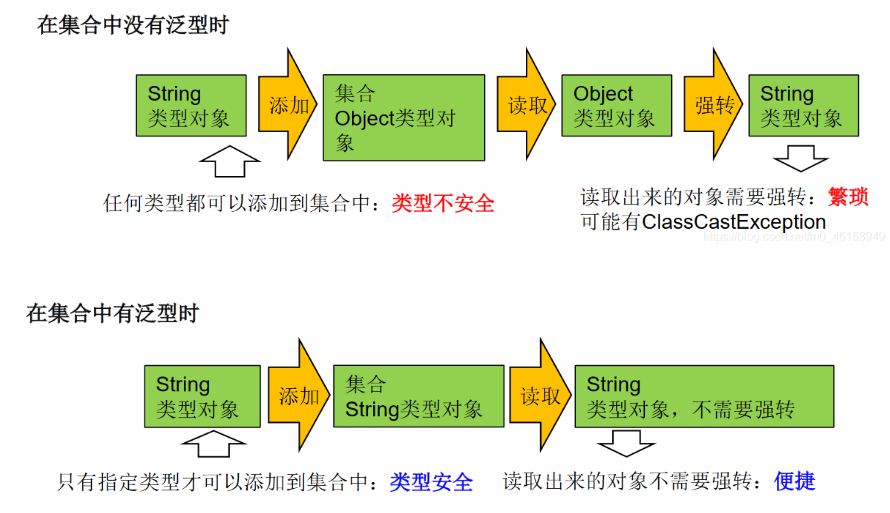

## 十三、泛型

### 1. 为什么要有泛型

泛型：标签

#### 1.1 泛型的设计背景

集合容器类在设计阶段/声明阶段不能确定这个容器到底实际存的是什么类型的对象，所以在**JDK1.5之前只能把元素类型设计为Object，JDK1.5之后使用泛型来解决**。因为这个时候除了元素的类型不确定，其他的部分是确定的，例如关于这个元素如何保存，如何管理等是确定的，因此此时**把元素的类型设计成一个参数，这个类型参数叫做泛型**。Collection，List，ArrayList这个就是类型参数，即泛型。

#### 1.2 泛型作用



Java泛型可以保证如果程序在编译时没有发出警告，运行时就不会产生ClassCastException异常，同时代码更加简洁健壮


### 2. 在集合中使用泛型

泛型的类型必须是类，不能是基本数据类型。需要用到基本数据类型的位置，拿包装类替代

1. JDK5.0新增特征

2. 在集合中使用泛型：

   1. 集合接口或集合类在JDK5.0时都修改为带泛型的结构

   2. 在实例化集合类时，乐意指明具体的泛型类型

   3. 指明完以后，在集合类或接口中凡是定义类或接口时，内部结构（方法、构造器、属性等）使用到类的泛型的位置，都指定为实例化的泛型类型

      如：add(E e)  -->  实例化以后：add(Integer e)

   4. 

#### 2.1 举例

```java

```

