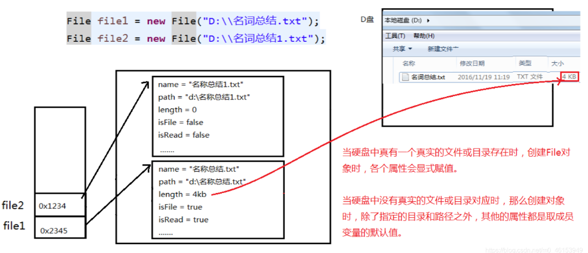
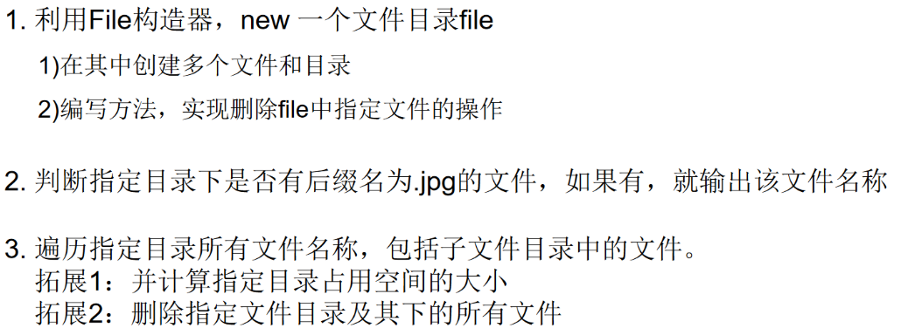

## 十四、IO流

### 1. File类的使用

#### 1.1 File类的实例化

* `java.io.File`类：文件和文件目录路径的抽象表示形式，与平台无关
* File能新建、删除、重命名文件和目录，但File不能访问文件内容本身。如果需要访问文件内容本身则需要使用输入/输出流
* 想要在Java程序中表示一个真实存在的文件或目录，需要有一个File对象，但Java程序中的一个File对象，可能没有一个真实存在的文件或目录
* File对象可以作为参数传递给流的构造器

1. 如何创建File类实例

   ```java
   File(String filePath)://以filePath为路径创建File对象，可以是绝对路径或者相对路径
   File(String parentPath,String childPath)://以parentPath为父路径，childPath为子路径创建File对象。
   File(File parentFile,String childPath)://根据一个父File对象和子文件路径创建File对象
   ```

2. 相对路径：相较于某个路径下，指明的路径

   绝对路径：包含盘符在内的文件或文件目录的路径

3. 路径分隔符：

   Window: `\\`

   unix: `/`

4. Java程序支持跨平台运行，因此路径分隔符要慎用

5. 为解决跨平台路径分隔符问题，File类提供一个常量：

   ```java
   public static final String separator
   ```

   根据操作系统，动态提供分隔符

   ```java
   File file1= new File("d:\\Work\\info.txt");
   File file2= new File("d:"+ File.separator+ "Work"+ File.separator+ "info.txt");
   File file3= new File("d:/Work");
   ```

```java
import org.junit.Test;
import java.io.File;

/**
 * File类的使用
 *
 * 1. File类的一个对象，代表一个文件或一个文件目录(俗称：文件夹)
 * 2. File类声明在java.io包下
 *
 */
public class FileTest {

    @Test
    public void test(){
        //构造器1：
        File file1 = new File("hello.txt");//相对于当前module
        File file2 = new File("F:\\java\\Work2\\JavaSenior\\day08\\num.txt");

        System.out.println(file1);
        System.out.println(file2);

        //构造器2：
        File file3 = new File("D:\\workspace_idea1","JavaSenior");
        System.out.println(file3);

        //构造器3：
        File file4 = new File(file3,"hi.txt");
        System.out.println(file4);
    }
}
```


#### 1.2 File类的常用方法1

```java
public String getAbsolutePath()：//获取绝对路径
public String getPath() ：//获取路径
public String getName() ：//获取名称
public String getParent()：//获取上层文件目录路径。若无，返回null
public long length() ：//获取文件长度（即：字节数）。不能获取目录的长度。
public long lastModified() ：//获取最后一次的修改时间，毫秒值

//如下的两个方法适用于文件目录：
public String[] list() ：//获取指定目录下的所有文件或者文件目录的名称数组
public File[] listFiles() ：//获取指定目录下的所有文件或者文件目录的File数组
    
//File类的重命名功能
public boolean renameTo(File dest)://把文件重命名为指定的文件路径
//比如：file1.renameTo(file2)为例：
//要想保证返回true,需要file1在硬盘中是存在的，且file2不能在硬盘中存在。
```

```java
import org.junit.Test;

import java.io.File;
import java.util.Date;

/**
 * File类的使用
 *
 * 1. File类的一个对象，代表一个文件或一个文件目录(俗称：文件夹)
 * 2. File类声明在java.io包下
 */
public class FileTest {

    @Test
    public void test2(){
        File file = new File("Hello.txt");
        File file2 = new File("F:\\java\\Work2\\JavaSenior\\day08\\num.txt");

        System.out.println(file.getAbsolutePath());
        System.out.println(file.getPath());
        System.out.println(file.getName());
        System.out.println(file.getParent());
        System.out.println(file.length());
        System.out.println(new Date(file.lastModified()));

        System.out.println();

        System.out.println(file2.getAbsolutePath());
        System.out.println(file2.getPath());
        System.out.println(file2.getName());
        System.out.println(file2.getParent());
        System.out.println(file2.length());
        System.out.println(file2.lastModified());
    }

    @Test
    public void test3(){
        //文件需存在！！！
        File file = new File("F:\\java\\Work2\\JavaSenior");

        String[] list = file.list();
        for(String s : list){
            System.out.println(s);
        }

        System.out.println();

        File[] files = file.listFiles();
        for(File f : files){
            System.out.println(f);
        }
    }

    /**
     * File类的重命名功能
     *
     *  public boolean renameTo(File dest):把文件重命名为指定的文件路径
     *    比如：file1.renameTo(file2)为例：
     *         要想保证返回true,需要file1在硬盘中是存在的，且file2不能在硬盘中存在。
     */
    @Test
    public void test4(){
        File file1 = new File("hello.txt");
        File file2 = new File("D:\\book\\num.txt");

        boolean renameTo = file2.renameTo(file1);
        System.out.println(renameTo);
    }
}
```


#### 1.3 File类的常用方法2



```java
public boolean isDirectory()：//判断是否是文件目录
public boolean isFile() ：//判断是否是文件
public boolean exists() ：//判断是否存在
public boolean canRead() ：//判断是否可读
public boolean canWrite() ：//判断是否可写
public boolean isHidden() ：//判断是否隐藏
    
//创建硬盘中对应的文件或文件目录
public boolean createNewFile() ：//创建文件。若文件存在，则不创建，返回false
public boolean mkdir() ：//创建文件目录。如果此文件目录存在，就不创建了。如果此文件目录的上层目录不存在，也不创建。
public boolean mkdirs() ：//创建文件目录。如果此文件目录存在，就不创建了。如果上层文件目录不存在，一并创建

//删除磁盘中的文件或文件目录
public boolean delete()：删除文件或者文件夹
//删除注意事项：Java中的删除不走回收站。
```

```java
import org.junit.Test;

import java.io.File;
import java.io.IOException;
import java.util.Date;

/**
 * File类的使用
 *
 * 1. File类的一个对象，代表一个文件或一个文件目录(俗称：文件夹)
 * 2. File类声明在java.io包下
 * 3. File类中涉及到关于文件或文件目录的创建、删除、重命名、修改时间、文件大小等方法，
 *    并未涉及到写入或读取文件内容的操作。如果需要读取或写入文件内容，必须使用IO流来完成。
 * 4. 后续File类的对象常会作为参数传递到流的构造器中，指明读取或写入的"终点".
 */
public class FileTest {


    @Test
    public void test5(){
        File file1 = new File("hello.txt");
        file1 = new File("hello1.txt");

        System.out.println(file1.isDirectory());
        System.out.println(file1.isFile());
        System.out.println(file1.exists());
        System.out.println(file1.canRead());
        System.out.println(file1.canWrite());
        System.out.println(file1.isHidden());

        System.out.println();

        File file2 = new File("D:\\book");
        file2 = new File("D:\\book1");
        System.out.println(file2.isDirectory());
        System.out.println(file2.isFile());
        System.out.println(file2.exists());
        System.out.println(file2.canRead());
        System.out.println(file2.canWrite());
        System.out.println(file2.isHidden());
    }


    @Test
    public void test6() throws IOException {
        File file1 = new File("hi.txt");
        if(!file1.exists()){
            //文件的创建
            file1.createNewFile();
            System.out.println("创建成功");
        }else{//文件存在
            file1.delete();
            System.out.println("删除成功");
        }
    }

    @Test
    public void test7(){
        //文件目录的创建
        File file1 = new File("d:\\io\\io1\\io3");

        boolean mkdir = file1.mkdir();
        if(mkdir){
            System.out.println("创建成功1");
        }

        File file2 = new File("d:\\io\\io1\\io4");

        boolean mkdir1 = file2.mkdirs();
        if(mkdir1){
            System.out.println("创建成功2");
        }
        //要想删除成功，io4文件目录下不能有子目录或文件
        File file3 = new File("D:\\io\\io1\\io4");
        file3 = new File("D:\\io\\io1");
        System.out.println(file3.delete());
    }
}
```


#### 1.4 练习



```java
//1、FileTest类
import org.junit.Test;

import java.io.File;
import java.io.IOException;

/**
 * 1. 利用File构造器，new一个文件目录file
 *    1)在其中创建多个文件和目录
 *    2)编写方法，实现删除file中指定文件的操作
 */
public class FileTest {
    @Test
    public void test() throws IOException {
        File file = new File("D:\\io\\io1\\hello.txt");
        //创建一个与file同目录下的另外一个文件，文件名为：haha.txt
        File destFile = new File(file.getParent(),"haha.txt");
        boolean newFile = destFile.createNewFile();
        if(newFile){
            System.out.println("创建成功！");
        }
    }
}
```

```java
//2、FindJPGFileTest类
import org.junit.Test;

import java.io.File;
import java.io.FilenameFilter;

/**
 * 2.判断指定目录下是否有后缀名为.jpg的文件，如果有，就输出该文件名称
 */
public class FindJPGFileTest {
    @Test
    public void test(){
        File srcFile = new File("d:\\code");

        String[] fileNames = srcFile.list();
        for(String fileName : fileNames){
            if(fileName.endsWith(".jpg")){
                System.out.println(fileName);
            }
        }
    }

    @Test
    public void test2(){
        File srcFile = new File("d:\\code");

        File[] listFiles = srcFile.listFiles();
        for(File file : listFiles){
            if(file.getName().endsWith(".jpg")){
                System.out.println(file.getAbsolutePath());
            }
        }
    }

    /**
     * File类提供了两个文件过滤器方法
     * public String[] list(FilenameFilter filter)
     * public File[] listFiles(FileFilter filter)
     */
    @Test
    public void test3(){
        File srcFile = new File("d:\\code");

        File[] subFiles = srcFile.listFiles(new FilenameFilter() {

            @Override
            public boolean accept(File dir, String name) {
                return name.endsWith(".jpg");
            }
        });

        for(File file : subFiles){
            System.out.println(file.getAbsolutePath());
        }
    }
}

```

```java
//3、ListFilesTest类
import java.io.File;

/**
 * 3. 遍历指定目录所有文件名称，包括子文件目录中的文件。
 *      拓展1：并计算指定目录占用空间的大小
 *      拓展2：删除指定文件目录及其下的所有文件
 */
public class ListFilesTest {
    public static void main(String[] args) {
        // 递归:文件目录
        /** 打印出指定目录所有文件名称，包括子文件目录中的文件 */

        // 1.创建目录对象
        File dir = new File("E:\\teach\\01_javaSE\\_尚硅谷Java编程语言\\3_软件");

        // 2.打印目录的子文件
        printSubFile(dir);
    }

    public static void printSubFile(File dir) {
        // 打印目录的子文件
        File[] subfiles = dir.listFiles();

        for (File f : subfiles) {
            if (f.isDirectory()) {// 文件目录
                printSubFile(f);
            } else {// 文件
                System.out.println(f.getAbsolutePath());
            }
        }
    }

    // 方式二：循环实现
    // 列出file目录的下级内容，仅列出一级的话
    // 使用File类的String[] list()比较简单
    public void listSubFiles(File file) {
        if (file.isDirectory()) {
            String[] all = file.list();
            for (String s : all) {
                System.out.println(s);
            }
        } else {
            System.out.println(file + "是文件！");
        }
    }

    // 列出file目录的下级，如果它的下级还是目录，接着列出下级的下级，依次类推
    // 建议使用File类的File[] listFiles()
    public void listAllSubFiles(File file) {
        if (file.isFile()) {
            System.out.println(file);
        } else {
            File[] all = file.listFiles();
            // 如果all[i]是文件，直接打印
            // 如果all[i]是目录，接着再获取它的下一级
            for (File f : all) {
                listAllSubFiles(f);// 递归调用：自己调用自己就叫递归
            }
        }
    }

    // 拓展1：求指定目录所在空间的大小
    // 求任意一个目录的总大小
    public long getDirectorySize(File file) {
        // file是文件，那么直接返回file.length()
        // file是目录，把它的下一级的所有大小加起来就是它的总大小
        long size = 0;
        if (file.isFile()) {
            size += file.length();
        } else {
            File[] all = file.listFiles();// 获取file的下一级
            // 累加all[i]的大小
            for (File f : all) {
                size += getDirectorySize(f);// f的大小;
            }
        }
        return size;
    }

    // 拓展2：删除指定的目录
    public void deleteDirectory(File file) {
        // 如果file是文件，直接delete
        // 如果file是目录，先把它的下一级干掉，然后删除自己
        if (file.isDirectory()) {
            File[] all = file.listFiles();
            // 循环删除的是file的下一级
            for (File f : all) {// f代表file的每一个下级
                deleteDirectory(f);
            }
        }
        // 删除自己
        file.delete();
    }
}
```

