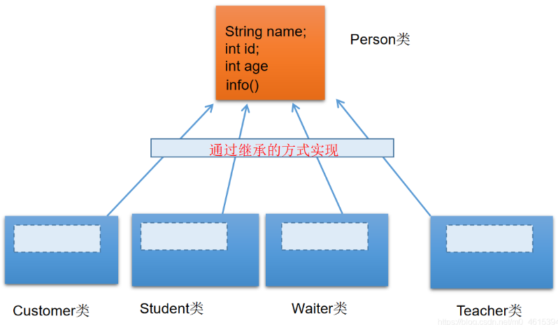
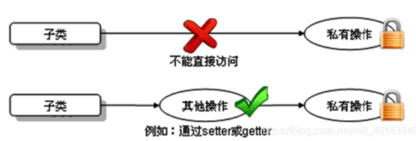
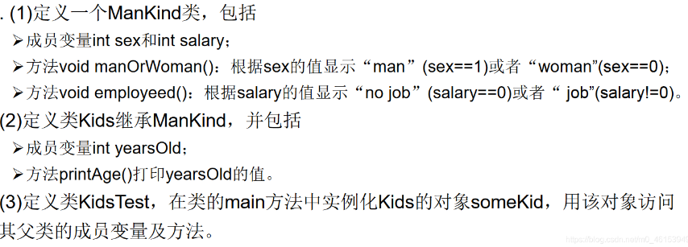
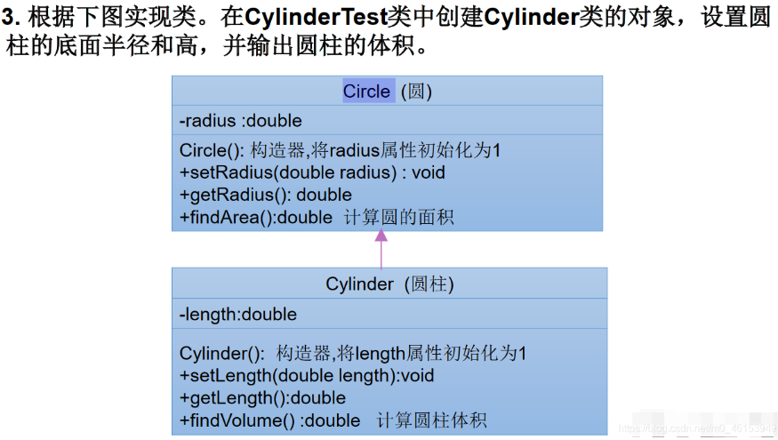
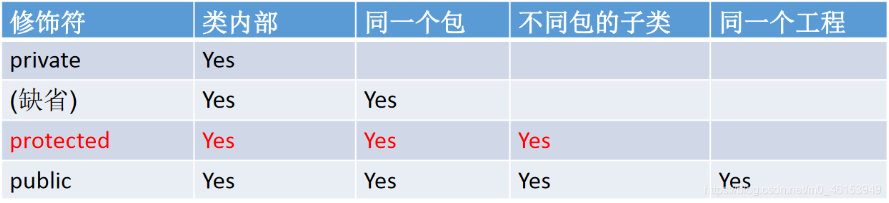
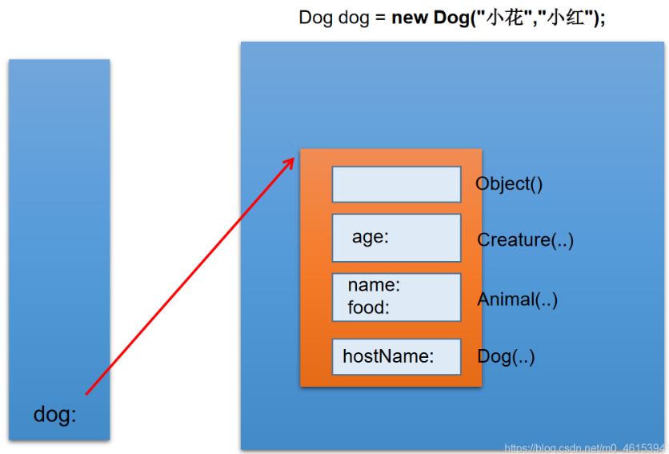
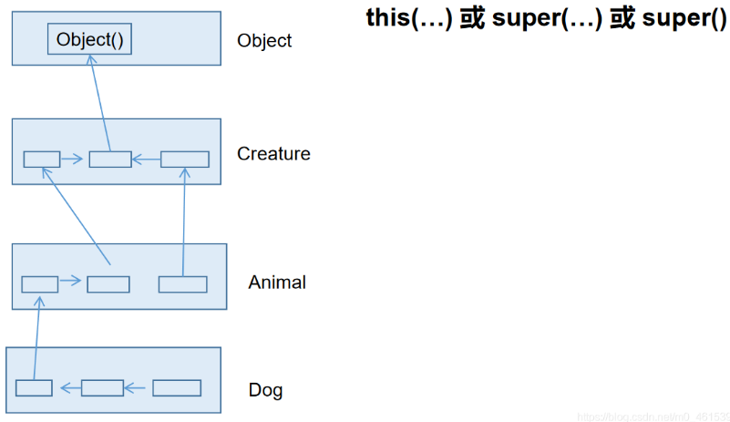

## 六、面向对象（中）

### 1. 继承性的使用于理解

**面向对象的特征二：继承性**

为什么要有继承？
多个类中存在相同属性和行为时，将这些内容抽取到单独一个类中，那么多个类无需再定义这些属性和行为，只要继承那个类即可。

#### 1.1 继承性

一、继承性的好处

1. 减少了代码冗余，提高代码复用性
2. 便于功能的扩展
3. 为之后多态性的使用，提高了前提


二、继承性的格式

```shell
class A extends B{ }
```

A:子类、派生类、subclass

B:父类、超类、基类、superclass

* 体现：一旦子类A继承父类后，子类A中就获取了父类B中声明的结构：属性、方法

  特别的，父类中声明为private的属性或方法，子类继承父类后，仍认为获取了父类中的私有结构

* 子类继承父类后，还可以声明自己特有的属性或方法，实现功能的扩展

  子类和父类的关系：不同于子集与集合的关系

  extends:延展，扩展






三、Java中关于继承性的规定

1. 一个类可以被多个类继承
2. Java中类的单继承性：一个类只能有一个父类
3. 子父类是相对的概念
4. 子类直接继承的父类，称为直接父类，简介继承的父类，称为间接父类
5. 子类继承父类后，就获取了直接父类以及所有间接父类中声明的属性和方法


四、

1. 如果没有显式的声明一个类的父类，则此类继承于java.lang.Object类
2. 所有的java类（除了java.lang.Object）都直接或间接地继承于java.lang.Object
3. 所有的java类具有java.lang.Object类声明的功能


#### 1.2 继承性练习

**练习1**



```java
//ManKind类
/*
 * 定义一个ManKind类，包括
 * 成员变量int sex和int salary；
 * 方法void manOrWoman()：根据sex的值显示“man”(sex==1)或者“woman”(sex==0)；
 * 方法void employeed()：根据salary的值显示“no job”(salary==0)或者“job”(salary!=0)。
 * 
 */
public class ManKind {

	private int sex;	//性别
	private int salary;	//薪资
	
	public ManKind() {
		
	}

	public ManKind(int sex, int salary) {
		this.sex = sex;
		this.salary = salary;
	}

	public void manOrWoman(){
		if(sex==1){
			System.out.println("man");
		}else if(sex==0){
			System.out.println("woman");
		}
	}
	
	public void employeed(){
		if(salary==0){
			System.out.println("no job");
		}else if(salary!=0){
			System.out.println("job");
		}
	}

	public int getSex() {
		return sex;
	}

	public void setSex(int sex) {
		this.sex = sex;
	}

	public int getSalary() {
		return salary;
	}

	public void setSalary(int salary) {
		this.salary = salary;
	}	
}
```

```java
//Kids类
/*
 * 定义类Kids继承ManKind，并包括
 * 成员变量int yearsOld；
 * 方法printAge()打印yearsOld的值
 * 
 */
public class Kids extends ManKind{

	private int yearsOld;	//年限
	
	public Kids() {

	}

	public Kids(int yearsOld) {
		this.yearsOld = yearsOld;
	}

	public int getYearsOld() {
		return yearsOld;
	}

	public void setYearsOld(int yearsOld) {
		this.yearsOld = yearsOld;
	}

	public void printAge(){
		System.out.println("I am " + yearsOld);
	}
}
```

```java
/*
 * 定义类KidsTest，在类的main方法中实例化Kids的对象someKid，
 * 用该对象访问其父类的成员变量及方法。
 * 
 */
public class KidsTest {
	public static void main(String[] args) {
		
		Kids someKid = new Kids(12);
		
		someKid.printAge();
		
		someKid.setYearsOld(15);
		someKid.setSalary(0);
		someKid.setSex(1);
		
		someKid.employeed();
		someKid.manOrWoman();
	}
}
```


**练习2**



```java
//Circle类
public class Circle {

	public double radius;	//半径
	
	public Circle(){
		radius = 1.0;
	}

	public double getRadius() {
		return radius;
	}

	public void setRadius(double radius) {
		this.radius = radius;
	}
	
	public double findArea(){	//计算圆的面积
		return Math.PI * radius * radius;
	}
}
```

```java
public class Cylinder extends Circle{
	private double length;
	
	public Cylinder(){
		length = 1.0;
	}

	public double getLength() {
		return length;
	}

	public void setLength(double length) {
		this.length = length;
	}
	
	public double findVolume(){	//计算圆柱体积
		return findArea() * length;
	}
}
```

```java
public class CylinderTest {
	public static void main(String[] args) {
		
		Cylinder cy = new Cylinder();
		
		cy.setRadius(2.1);
		cy.setLength(3.4);
		double volues = cy.findVolume();
		System.out.println("圆柱的体积:" + volues);
		
		double area = cy.findArea();
		System.out.println("圆的面积: " + area);
	}
}
```


### 2. 方法的重写（override / overwrite）

1. 重写：子类继承父类后，可以对父类中的方法进行覆盖操作

2. 应用：重写以后，当创建子类对象以后，通过子类对象去调用父类中同名同参数方法时，执行的是子类重写父类的方法。即在程序执行时，子类的方法将覆盖父类的方法

3. **区分方法的重载与重写**：

   方法的重写Overriding和重载Overloading是Java多态性的不同表现。

   重写Overriding是父类与子类之间多态性的一种表现，重载Overloading是一个类中多态性的一种表现。如果在子类中定义某方法与其父类有相同的名称和参数，我们说该方法被重写 (Overriding)。子类的对象使用这个方法时，将调用子类中的定义，对它而言，父类中的定义如同被"屏蔽"了。如果在一个类中定义了多个同名的方法，它们或有不同的参数个数或有不同的参数类型，则称为方法的重载(Overloading)。

#### 2.1 方法重写的细节

方法的声明：`权限修饰符 返回值类型 方法名(形参列表){ // 方法体}`

重写的规定：

1. 子类重写的方法的方法名和形参列表必须和父类被重写的方法的方法名、形参列表相同

2. 子类重写的方法使用的访问权限不能小于父类被重写的方法的访问权限

   特殊情况：子类不能重写父类中声明为private权限的方法

3. 返回值类型：

   * 父类被重写的方法的返回值类型是void，则子类重写的方法的返回值类型只能是void
   * 父类被重写的方法的返回值类型是A类型，则子类重写的方法的返回值类型可以是A类或A类的子类
   * 父类被重写的方法的返回值类型如果是基本数据类型(如：double)，则子类重写的方法的返回值类型必须是相同的基本数据类型(必须double)

4. 子类方法抛出的异常不能大于父类被重写的方法抛出的异常

5. 子类与父类中同名同参数的方法必须同时声明为非static的（即为重写），或者同时声明为static的（不是重写），因为static方法是属于类的，子类无法覆盖父类的方法。

```java
//Person类
public class Person {

	String name;
	int age;
	
	public Person(){
		
	}
	
	public Person(String name,int age){
		this.name = name;
		this.age = age;
	}
	
//	public void eat(){
//		System.out.println("吃饭");
//	}
	static void eat(){
		System.out.println("吃饭");
	}
	
	public void walk(int distance){
		System.out.println("走路，走的距离是：" + distance + "公里");
		show();
	}
	
	private void show(){
		System.out.println("我是一个人。");
	}
	
	public Object info(){
		return null;
	}
	
	public double info1(){
		return 1.0;
	}
}
```

```java
//Student类
public class Student extends Person{

	String major;
	
	public Student(){
		
	}
	
	public Student(String major){
		this.major = major;
	}
	
	public void study(){
		System.out.println("学习，专业是:" + major);
	}
	
	//对父类中的eat()进行了重写
//	public void eat(){
//		System.out.println("学生应该多吃有营养的。");
//	}
	
	//这样不会报错，但已经不是重写了！！
	public static void eat(){
		System.out.println("学生应该多吃有营养的。");
	}
	
	public void show(){
		System.out.println("我是一个学生。");
	}
	
	public String info(){
		return null;
	}
	
	//不是一个类型，所以报错。
//	public int info1(){
//		return 1;
//	}
	
	//可以直接将父类的方法的第一行粘过来，直接写方法体
//	public void walk(int distance){
//		System.out.println("重写的方法");
//	}
	
	//直接输入父类的方法名，Alt + /，选择即可生成
	@Override
	public void walk(int distance) {
		System.out.println("自动生成");
	}
}
```

```java
public class PersonTest {
	public static void main(String[] args) {
		Student s = new Student("计算机科学与技术");
		s.eat();
		s.walk(10);
		System.out.println("*******************");
		
		s.study();
		
		Person p1 = new Person();
		p1.eat();
	}
}
```


#### 2.2 方法重写的练习

**练习1**

修改练习1.2中定义的类Kids，在Kids中重新定义employeed()方法，覆盖父类ManKind中定义的employeed()方法，输出“Kids should study and no job.” 

```java
//ManKind类
public class ManKind {

	private int sex;	//性别
	private int salary;	//薪资
	
	public ManKind() {
		
	}

	public ManKind(int sex, int salary) {
		this.sex = sex;
		this.salary = salary;
	}

	public void manOrWoman(){
		if(sex==1){
			System.out.println("man");
		}else if(sex==0){
			System.out.println("woman");
		}
	}
	
	public void employeed(){
		if(salary==0){
			System.out.println("no job");
		}else if(salary!=0){
			System.out.println("job");
		}
	}

	public int getSex() {
		return sex;
	}

	public void setSex(int sex) {
		this.sex = sex;
	}

	public int getSalary() {
		return salary;
	}

	public void setSalary(int salary) {
		this.salary = salary;
	}	
}
```

```java
//Kids类
public class Kids extends ManKind{

	private int yearsOld;	//年限
	
	public Kids() {

	}

	public Kids(int yearsOld) {
		this.yearsOld = yearsOld;
	}

	public int getYearsOld() {
		return yearsOld;
	}

	public void setYearsOld(int yearsOld) {
		this.yearsOld = yearsOld;
	}

	public void printAge(){
		System.out.println("I am " + yearsOld);
	}
	
	public void employeed(){
		System.out.println("Kids should study and no job.");
	}
}
```

```java
public class KidsTest {
	public static void main(String[] args) {
		
		Kids someKid = new Kids(12);
		
		someKid.printAge();
		
		someKid.setYearsOld(15);
		someKid.setSalary(0);
		someKid.setSex(1);
		
		someKid.employeed();
		someKid.manOrWoman();
	}
}
```


### 3. 四种**访问权限**修饰符



```java
//Order类
package githubb;
/*
 * 体会四种不同的权限修饰符
 */
public class Order {

	private int orderPrivate;
	int orderDefault;
	protected int orderProtected;
	public int orderPublic;
	
	private void methodPrivate(){
		orderPrivate = 1;
		orderDefault = 2;
		orderProtected = 3;
		orderPublic = 4;
	}
	
	void methodDefault(){
		orderPrivate = 1;
		orderDefault = 2;
		orderProtected = 3;
		orderPublic = 4;
	}
	
	protected void methodProtected(){
		orderPrivate = 1;
		orderDefault = 2;
		orderProtected = 3;
		orderPublic = 4;
	}
	
	public void methodPublic(){
		orderPrivate = 1;
		orderDefault = 2;
		orderProtected = 3;
		orderPublic = 4;
	}
}
```

```java
//Ordertest类
package githubb;

public class OrderTest {
	public static void main(String[] args) {
		
		Order order = new Order();
		
		order.orderDefault = 1;
		order.orderProtected = 2;
		order.orderPublic = 3;
		
		order.methodDefault();
		order.methodProtected();
		order.methodPublic();
		
		//同一个包中的其它类，不可以调用Order类中私有的属性
//		order.orderPrivate = 4;	//The field Order.orderPrivate is not visible
//		order.methoPrivate();
	}
}
```

```java
//SubOrder类
package githubc;

import githubb.Order;

public class SubOrder extends Order{

	public void method(){
		orderProtected = 1;
		orderPublic = 2;
		
		methodProtected();
		methodPublic();
		
		//在不同包的子类中，不能调用Order类中声明为private和缺省的权限的属性、方法
//		orderDefault = 3;
//		orderPrivate = 4;
//		
//		methodDefault();
//		methodPrivate();
	}
}
```

```java
//OrderTest类
package githubc;

import githubb.Order;

public class OrderTest {
	public static void main(String[] args) {
		
		Order order = new Order();
		order.orderPublic = 1;
		order.methodPublic();
		
		//不同包下的普通类(非子类)要使用Order类，不可以调用声明为private、缺省、protected权限的属性、方法。
//		order.orderPrivate = 2;
//		order.orderProtected = 3;
//		order.orderProtected = 4;
//		
//		order.methodPrivate();
//		order.methodDefault();
//		order.methodProtected();
		
	}
	
	public void show(Order order){
		order.orderPublic = 1;
		order.methodPublic();
		
		//不同包下的普通类(非子类)要使用Order类，不可以调用声明为private、缺省、protected权限的属性、方法。
//		order.orderPrivate = 2;
//		order.orderProtected = 3;
//		order.orderProtected = 4;
//		
//		order.methodPrivate();
//		order.methodDefault();
//		order.methodProtected();
	}
}
```


### 4. 关键字：super

1. super理解为：父类的
2. super可以用来调用：属性、方法、构造器
3. super的使用：
   1. 可以在子类的方法或构造器中，通过“super.属性” 或 “super.方法” 的方式，显式调用父类中声明的属性或方法，通常情况下，省略“super.”
   2. 特殊情况下，当子类和父类中定义了同名的属性时，要想在子类中调用父类中声明的属性，则必须显式的使用 "super.属性" 的方式，表名调用的是父类中声明的属性
   3. 特殊情况下，当子类重写了父类中的方法后，想在子类的方法中调用父类中被重写的方法时，必须显式的使用 “super.方法”的方式，表明调用的是父类中被重写的方法
4. super调用构造器
   1. 可以在子类的构造器中显示的使用 “super(形参列表)”的方式，调用父类中声明的指定的构造器
   2. “super(形参列表)”的使用，必须声明在子类构造器的首行
   3. 在类的构造器中，针对 "this(形参列表)" 或 "super(形参列表)" 只能二选一，不能同时出现
   4. 在构造器首行，既没有显式的声明 "this(形参列表)" 或 "super(形参列表)，则默认的调用的是父类中的空参构造器 super()
   5. 在类的多个构造器中，至少有一个类的构造器使用了 “super(形参列表)”，调用父类中的构造器

```java
//Person类
public class Person {

	String name;
	int age;
	int id = 1003;	//身份证号
	
	public Person(){
		System.out.println("我无处不在");
	}
	
	public Person(String name){
		this.name = name;
	}
	
	public Person(String name,int age){
		this(name);
		this.age = age;
	}
	
	public void eat(){
		System.out.println("人，吃饭");
	}
	
	public void walk(){
		System.out.println("人，走路");
	}
}
```

```java
//Student类
public class Student extends Person{
	
	String major;
	int id = 1002;	//学号
	
	public Student(){

	}
	
	public Student(String name,int age,String major){
//		this.age = age;
//		this.name = name;
		super(name,age);
		this.major = major;
	}
	
	public Student(String major){
		this.major = major;
	}
	
	public void eat(){
		System.out.println("学生多吃有营养的食物");
	}
	
	public void Study(){
		System.out.println("学生，学习知识。");
		this.eat();
		//如果，想调用父类中被重写的，不想调用子类中的方法，可以：
		super.eat();
		super.walk();//子父类中未重写的方法，用"this."或"super."调用都可以
	}
	public void show(){
		System.out.println("name = " + this.name + ",age = " + super.age);
		System.out.println("id = " + this.id);	
		System.out.println("id = " + super.id);
	}
}
```

```java
public class SuperTest {
	public static void main(String[] args) {
		
		Student s = new Student();
		s.show();
		
		s.Study();
		
		Student s1 = new Student("Ton",21,"IT" );
		s1.show();
		
		System.out.println("***********************");
		Student s2 = new Student();
		
	}
}
```


### 5. 子类对象实例化过程

1. 从结果上看：

   子类继承父类后，就获取了父类中声明的属性或方法

   创建子类的对象中，在堆空间中就会加载所有父类中声明的属性

2. 从过程上看：

   当通过子类的构造器创建子类对象时，一定会直接或间接的调用其父类构造器

   直到调用了java.lang.Object类中空参的构造器为止

3. 虽然创建子类对象时，调用了父类的构造器，但自始至终就创建过一个对象，即new的子对象






**练习**

```java
//Account类
/*
 * 写一个名为Account的类模拟账户。该类的属性和方法如下图所示。
 * 该类包括的属性：账号id，余额balance，年利率annualInterestRate；
 * 包含的方法：访问器方法（getter和setter方法），
 * 返回月利率的方法getMonthlyInterest()，
 * 取款方法withdraw()，存款方法deposit()。
 * 
 */
public class Account {

	private int id;	//账号
	private double balance;	//余额
	private double annualInterestRate;	//年利率
	
	public Account(int id, double balance, double annualInterestRate) {
		super();
		this.id = id;
		this.balance = balance;
		this.annualInterestRate = annualInterestRate;
	}

	public int getId() {
		return id;
	}

	public void setId(int id) {
		this.id = id;
	}

	public double getBalance() {
		return balance;
	}

	public void setBalance(double balance) {
		this.balance = balance;
	}

	public double getAnnualInterestRate() {
		return annualInterestRate;
	}

	public void setAnnualInterestRate(double annualInterestRate) {
		this.annualInterestRate = annualInterestRate;
	}
	
	public double getMonthlyInterest(){	//返回月利率的方法
		return annualInterestRate / 12;
	}
	
	public void withdraw (double amount){	//取款方法
		if(balance >= amount){
			balance -= amount;
			return;
		}
		System.out.println("余额不足");
	}
	
	public void deposit (double amount){	//存款方法
		if(amount > 0){
			balance += amount;
			
		}
	}
}
```

```java
//AccountTest类
/*
 * 写一个用户程序测试Account类。在用户程序中，
 * 创建一个账号为1122、余额为20000、年利率4.5%的Account对象。
 * 使用withdraw方法提款30000元，并打印余额。再使用withdraw方法提款2500元，
 * 使用deposit方法存款3000元，然后打印余额和月利率。
 */
public class AccountTest {
	public static void main(String[] args) {
		Account acct = new Account(1122,20000,0.045);
		
		acct.withdraw(30000);
		System.out.println("你的账户余额为:" + acct.getBalance());
		acct.withdraw(2500);
		System.out.println("你的账户余额为:" + acct.getBalance());
		acct.deposit(3000);
		System.out.println("你的账户余额为:" + acct.getBalance());

		System.out.println("月利率为: " + (acct.getAnnualInterestRate() * 100) + "%");
	}
}
```

```java
//CheckAccount类
/*
 * 创建Account类的一个子类CheckAccount代表可透支的账户，该账户中定义一个属性overdraft代表可透支限额。
 * 在CheckAccount类中重写withdraw方法，其算法如下：
 * 如果（取款金额<账户余额），
 * 可直接取款
 * 如果（取款金额>账户余额），
 * 计算需要透支的额度
 * 判断可透支额overdraft是否足够支付本次透支需要，如果可以
 * 		将账户余额修改为0，冲减可透支金额
 * 如果不可以
 * 		提示用户超过可透支额的限额
 * 
 */
public class CheckAccount extends Account{

	private double overdraft;	//代表可透支限额
	
	public CheckAccount(int id, double balance, double annualInterestRate,double overdraft){
		super(id, balance, annualInterestRate);
		this.overdraft = overdraft;
	}
	
	public double getOverdraft() {
		return overdraft;
	}

	public void setOverdraft(double overdraft) {
		this.overdraft = overdraft;
	}

	@Override
	public void withdraw(double amount) {
		if(getBalance() >= amount){	//余额足够消费
			//方式一
//			setBalance(getBalance() - amount); 
			//方式二
			super.withdraw(amount);
		}else if(overdraft >= amount - getBalance()){	//余额不够
			
			overdraft -= (amount - getBalance());
//			setBalance(0);
			//或
			super.withdraw(getBalance());
			
		}else{	//超过可透支限额
			System.out.println("超过可透支限额！");
		}
	}
}
```

```java
//CheckAccountTest类
/*
 * 写一个用户程序测试CheckAccount类。在用户程序中，
 * 创建一个账号为1122、余额为20000、年利率4.5%，
 * 可透支限额为5000元的CheckAccount对象。
 * 使用withdraw方法提款5000元，并打印账户余额和可透支额。
 * 再使用withdraw方法提款18000元，并打印账户余额和可透支额。
 * 再使用withdraw方法提款3000元，并打印账户余额和可透支额。
 * 
 */
public class CheckAccountTest {
	public static void main(String[] args) {
		CheckAccount cat = new CheckAccount(1122,20000,0.045,5000);
		
		cat.withdraw(5000);
		System.out.println("您的账户余额为: " + cat.getBalance());
		System.out.println("您的可透支额度为: " + cat.getOverdraft());
		
		cat.withdraw(18000);
		System.out.println("您的账户余额为: " + cat.getBalance());
		System.out.println("您的可透支额度为: " + cat.getOverdraft());
		
		cat.withdraw(3000);
		System.out.println("您的账户余额为: " + cat.getBalance());
		System.out.println("您的可透支额度为: " + cat.getOverdraft());
	}
}
```


### 6. 面向对象特征之三：多态性

1. 理解多态性：可以理解为一个事物的多种态性

2. 何为多态性：

   对象的多态性：父类的引用指向子类的对象（或子类的对象赋值给父类的引用）

3. 多态性的使用：虚拟方法调用

   有了对象多态性以后，在编译期，只能调用父类声明的方法，但在执行期实际执行的是子类重写父类的方法

   简称：编译时，看左边；运行时，看右边

   若编译时类型和运行时类型不一致，就出现了对象的多态性(Polymorphism)

   多态情况下，

   ​		"看左边"：看的是父类的引用(父类中不具备子类特有的方法)

   ​		"看右边"：看的是子类的对象(实际运行的是子类重写父类的方法)

4. 多态性使用的前提：

   1. 类的继承关系
   2. 方法的重写

5. 对象的多态性：只适用于方法，不适用与属性（编译和运行都看左边）

```java
//Person类
public class Person {
	String name;
	int age;
	
	public void eat(){
		System.out.println("人，吃饭");
	}
	
	public void walk(){
		System.out.println("人，走路");
	}	
}
```

