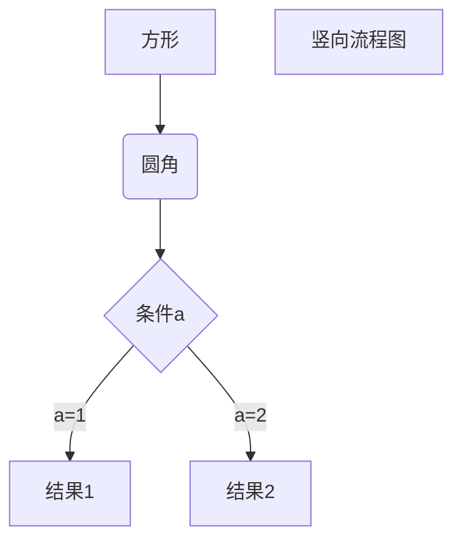

## 1. 标题
使用 # 号可表示 1-6 级标题，一级标题对应一个 # 号，二级标题对应两个 # 号，以此类推。
# 一级标题
## 二级标题
### 三级标题
#### 四级标题
##### 五级标题
###### 六级标题


## 2.段落

### 	2-1.字体

​		*斜体文本*
​		_斜体文本_
​		**粗体文本**
​		__粗体文本__
​		***斜粗体文本***
​		___斜粗体文本___

### 2-2.分割线

​	在一行中用三个以上的星号、减号、底线来建立一个分隔线，行内不能有其他东西。你也可以在星号或是减号中间插入空格

***

* * *

---

- - -

___


### 	2-3.删除线

​		AA
​		BB
​		~~CC~~

### 	2-4.下划线

​	下划线可以通过 HTML 的 **<u>** 标签来实现：

​		<u>AA</u>
​		<u>BB</u>

### 	2-5.脚注

​		创建脚注格式类似这样 [^RUNOOB]。

[^RUNOOB]:菜鸟教程 -- 学的不仅是技术，更是梦想！！！


## 3.列表

无序列表使用星号(*****)、加号(**+**)或是减号(**-**)作为列表标记，这些标记后面要添加一个空格，然后再填写内容：


* 第一项
* 第二项
* 第三项

+ 第一项
+ 第二项
+ 第三项

- 第一项
- 第二项
- 第三项

有序列表使用数字并加上 **.** 号来表示，

1. 第一项
2. 第二项
3. 第三项


## 4.区块

​	Markdown 区块引用是在段落开头使用 **>** 符号 ，然后后面紧跟一个**空格**符号：

	> 区块引用
	> 区块引用

​	另外区块是可以嵌套的，一个 **>** 符号是最外层，两个 **>** 符号是第一层嵌套，

	> 第一层
	>
	> > 第二层
	> >
	> > * 第一项
	> >
	> > 2. 第二项


## 5.代码区块

​	用 **```** 包裹一段代码，并指定一种语言

`void fun(); `

```javascript
$(document).ready(function () {
    alert('RUNOOB');
});
```


## 6.链接

```markdown
[链接名称](链接地址)

或者

<链接地址>
```

（按住ctrl + 点击跳转页面）这是我的链接 [Kownzird](https://github.com/Kownzird?tab=repositories)
	<https://www.baidu.com>


### 高级链接

​	通过变量来设置一个链接，变量赋值在文档末尾进行：
​	

​	这个链接用 1 作为网址变量 [Google][1]
​	这个链接用 runoob 作为网址变量 [Runoob][runoob]
​	然后在文档的结尾为变量赋值（网址)


## 7.图片

​	图片格式如下：

```markdown


```

- 开头一个感叹号 !
- 接着一个方括号，里面放上图片的替代文字
- 接着一个普通括号，里面放上图片的网址，最后还可以用引号包住并加上选择性的 'title' 属性的文字。


[神州十二号出舱][2]


## 8.表格

Markdown 制作表格使用 **|** 来分隔不同的单元格，使用 **-** 来分隔表头和其他行。

```
|  表头   | 表头  |
|  ----  | ----  |
| 单元格  | 单元格 |
| 单元格  | 单元格 |
```

| 表头 | 表头 | 表头 |
| ---- | :---- | ----: |
|      |      |      |


## 9.高级技巧

### 	9-1.支持的 HTML 元素

​	使用 <kbd>Ctrl</kbd>+<kbd>Alt</kbd>+<kbd>Del</kbd> 重启电脑

### 9-2.转义

​	Markdown 使用了很多特殊符号表示特定的意义，要显示特定的符号则需要使用转义字符，Markdown 使用反斜杠转义特殊字符：

​	**文本加粗**
​	\*\*文本加粗\*\*

```markdown
\   反斜线
`   反引号
*   星号
_   下划线
{}  花括号
[]  方括号
()  小括号
#   井字号
+   加号
-   减号
.   英文句点
!   感叹号
```

### 	9-3.公式

$$
\mathbf{V}_1 \times \mathbf{V}_2 =  \begin{vmatrix} 
\mathbf{i} & \mathbf{j} & \mathbf{k} \\
\frac{\partial X}{\partial u} &  \frac{\partial Y}{\partial u} & 0 \\
\frac{\partial X}{\partial v} &  \frac{\partial Y}{\partial v} & 0 \\
\end{vmatrix}
${$tep1}{\style{visibility:hidden}{(x+1)(x+1)}}
$$


### 9-4.流程图

1. 横向流程图源码格式

   ```mermaid
   graph LR
   A[方形] -->B(圆角)
   B --> C{条件a}
   C -->|a=1| D[结果1]
   C -->|a=2| E[结果2]
   F[横向流程图]
   ```


​	2. 竖向流程图源码格式




3. 标准流程图源码格式

   ```flow
   st=>start: 开始框
   op=>operation: 处理框
   cond=>condition: 判断框(是或否?)
   sub1=>subroutine: 子流程
   io=>inputoutput: 输入输出框
   e=>end: 结束框
   st->op->cond
   cond(yes)->io->e
   cond(no)->sub1(right)->op
   ```
   


	4. 标准流程图源码格式（横向）

```flow
st=>start: 开始框
op=>operation: 处理框
cond=>condition: 判断框(是或否?)
sub1=>subroutine: 子流程
io=>inputoutput: 输入输出框
e=>end: 结束框
st(right)->op(right)->cond
cond(yes)->io(bottom)->e
cond(no)->sub1(right)->op
```


[1]: http://www.google.com/
[runoob]: http://www.runoob.com/

[2]:https://pics3.baidu.com/feed/4bed2e738bd4b31c04d62303cd8be4779f2ff802.jpeg?token=700161b93c765e135aa8730c1ee6a83e


