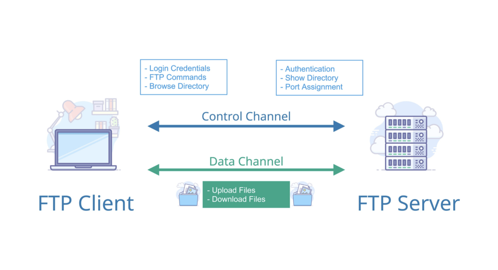
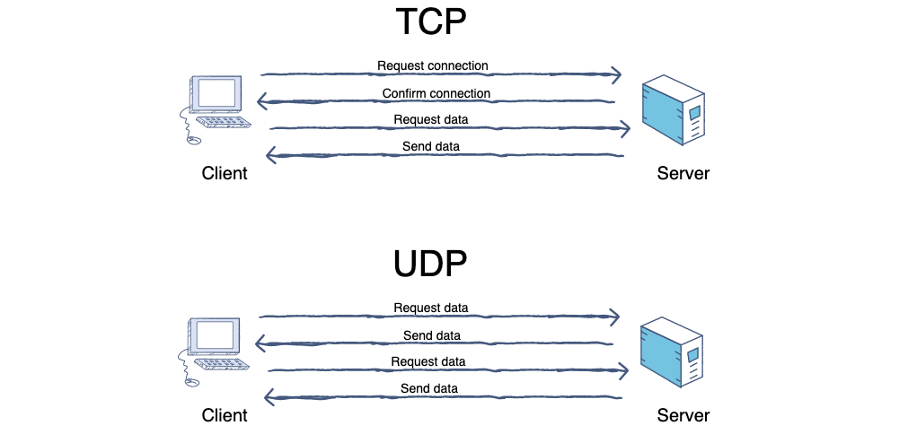

## HTTP:超文本传输协议

**超文本传输协议（HTTP，HyperText Transfer Protocol)** 主要是为 Web 浏览器与 Web 服务器之间的通信而设计的。当我们使用浏览器浏览网页的时候，我们网页就是通过 HTTP 请求进行加载的，整个过程如下图所示。

HTTP 协是基于 TCP协议，发送 HTTP 请求之前首先要建立 TCP 连接也就是要经历 3 次握手。目前使用的 HTTP 协议大部分都是 1.1。在 1.1 的协议里面，默认是开启了 Keep-Alive 的，这样的话建立的连接就可以在多次请求中被复用了。

另外， HTTP 协议是”无状态”的协议，它无法记录客户端用户的状态，一般我们都是通过 Session 来记录客户端用户的状态。

## SMTP:简单邮件传输(发送)协议

**简单邮件传输(发送)协议（SMTP，Simple Mail Transfer Protocol）** 基于 TCP 协议，用来发送电子邮件。

注意⚠️：**接受邮件的协议不是 SMTP 而是 POP3 协议。**

SMTP 协议这块涉及的内容比较多，下面这两个问题比较重要：

1. 电子邮件的发送过程
2. 如何判断邮箱是真正存在的？

**电子邮件的发送过程？**

比如我的邮箱是“dabai@cszhinan.com”，我要向“xiaoma@qq.com”发送邮件，整个过程可以简单分为下面几步：

1. 通过 **SMTP**  协议，我将我写好的邮件交给163邮箱服务器（邮局）。
2. 163邮箱服务器发现我发送的邮箱是qq邮箱，然后它使用 SMTP协议将我的邮件转发到 qq邮箱服务器。
3. qq邮箱服务器接收邮件之后就通知邮箱为“xiaoma@qq.com”的用户来收邮件，然后用户就通过 **POP3/IMAP** 协议将邮件取出。

**如何判断邮箱是真正存在的？**

很多场景(比如邮件营销)下面我们需要判断我们要发送的邮箱地址是否真的存在，这个时候我们可以利用 SMTP 协议来检测：

1. 查找邮箱域名对应的  SMTP 服务器地址
2. 尝试与服务器建立连接
3. 连接成功后尝试向需要验证的邮箱发送邮件
4. 根据返回结果判定邮箱地址的真实性

推荐几个在线邮箱是否有效检测工具：

1. https://verify-email.org/
2. http://tool.chacuo.net/mailverify
3. https://www.emailcamel.com/

## POP3/IMAP:邮件接收的协议

这两个协议没必要多做阐述，只需要了解 **POP3 和 IMAP 两者都是负责邮件接收的协议**即可。另外，需要注意不要将这两者和 SMTP 协议搞混淆了。**SMTP 协议只负责邮件的发送，真正负责接收的协议是POP3/IMAP。**  

IMAP 协议相比于POP3更新一点，为用户提供的可选功能也更多一点,几乎所有现代电子邮件客户端和服务器都支持IMAP。大部分网络邮件服务提供商都支持POP3和IMAP。

## FTP:文件传输协议

**FTP 协议** 主要提供文件传输服务，基于 TCP 实现可靠的传输。使用 FTP 传输文件的好处是可以屏蔽操作系统和文件存储方式。

FTP 是基于客户—服务器（C/S）模型而设计的，在客户端与 FTP 服务器之间建立两个连接。如果我们要基于 FTP 协议开发一个文件传输的软件的话，首先需要搞清楚 FTP 的原理。关于 FTP 的原理，很多书籍上已经描述的非常详细了：

> FTP 的独特的优势同时也是与其它客户服务器程序最大的不同点就在于它在两台通信的主机之间使用了两条 TCP 连接（其它客户服务器应用程序一般只有一条 TCP 连接）：
>
> 1. 控制连接：用于传送控制信息（命令和响应）
> 2. 数据连接：用于数据传送；
>
> 这种将命令和数据分开传送的思想大大提高了 FTP 的效率。

## Telnet:远程登陆协议

**Telnet 协议** 通过一个终端登陆到其他服务器，建立在可靠的传输协议 TCP 之上。Telnet 协议的最大缺点之一是所有数据（包括用户名和密码）均以明文形式发送，这有潜在的安全风险。这就是为什么如今很少使用Telnet并被一种称为SSH的非常安全的协议所取代的主要原因。

## SSH:安全的网络传输协议

**SSH（ Secure Shell）** 是目前较可靠，专为远程登录会话和其他网络服务提供安全性的协议。利用 SSH 协议可以有效防止远程管理过程中的信息泄露问题。SSH  建立在可靠的传输协议 TCP 之上。

**Telnet 和 SSH 之间的主要区别在于 SSH 协议会对传输的数据进行加密保证数据安全性。**

